## Summary

This script downloads the offscrub files from the repository and then attempts to uninstall all versions of Microsoft Office from 2007 to 2016 & O365. It can handle machine or software corruption and completely removes Office app shortcuts for the version.

## Sample Run

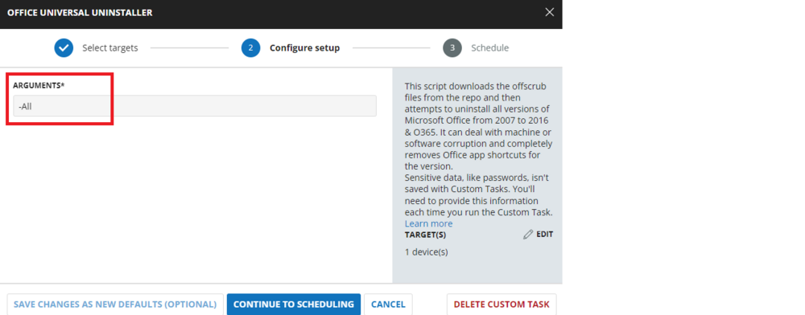

## Dependencies

[Invoke-OfficeScrub](/docs/e9253255-9a1f-4392-8ec6-9f7fb6e401ed)

### User Parameters

| Name       | Example    | Required | Description                                                                                                                                                                                                                                                                                                                                                                                                                                                                                                                                                                                                                     |
|------------|------------|----------|---------------------------------------------------------------------------------------------------------------------------------------------------------------------------------------------------------------------------------------------------------------------------------------------------------------------------------------------------------------------------------------------------------------------------------------------------------------------------------------------------------------------------------------------------------------------------------------------------------------------------------|
| Arguments  | -office16  | True     | The user parameter values are: -office03, -office07, -office10, -office13, -office16, -officec2r, -All. You can use combinations of the -officexx values. For example: -office03 -office13 -officec2r. Alternatively, you can use -All to uninstall any Office applications. By default, the value is set to -All, which means you can directly schedule this script, and it will uninstall any Office applications. |

## Implementation

To implement this script, please create a new "PowerShell" style script in the system.

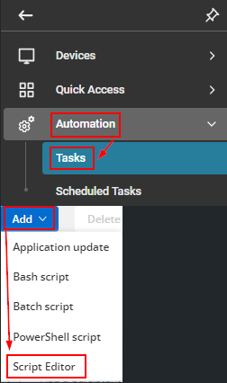

**Name:** Office Universal Uninstaller  
**Description:** This task will download the offscrub files from the repository and then attempt to uninstall all versions of Microsoft Office from 2007 to 2016 & O365. It can handle machine or software corruption and completely removes Office app shortcuts for the version.  
**Category:** Custom  

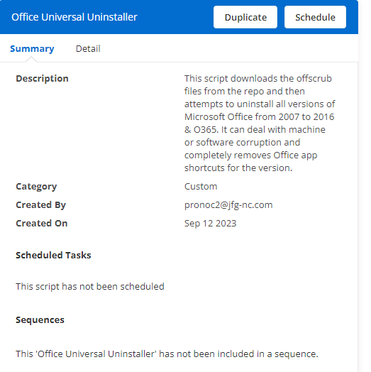

### Parameter

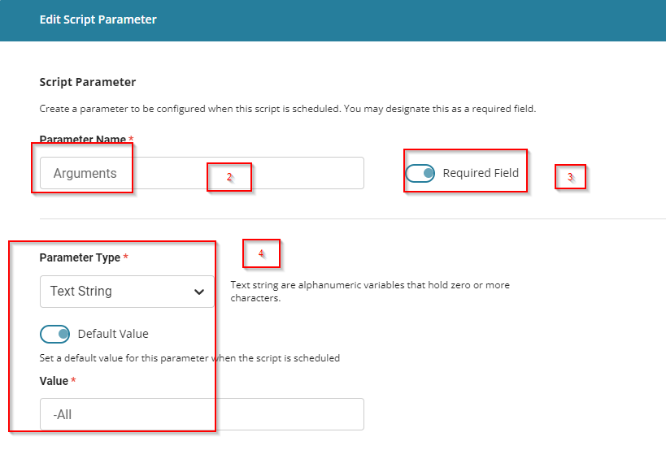

**Parameter Names:** `Arguments`  
**Required Field:** `Selected`  
**Parameter Type:** `Text String`  
**Default Value:** `-All`  

### Script

#### Row 1 Function: Script Log

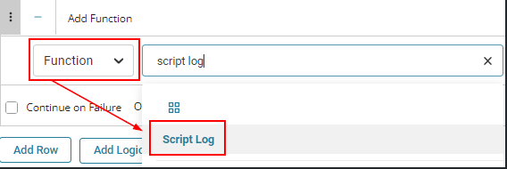

Input the following:

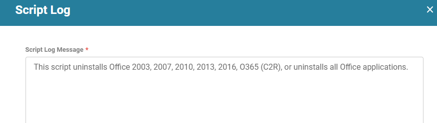

#### Row 2 Function: PowerShell Script

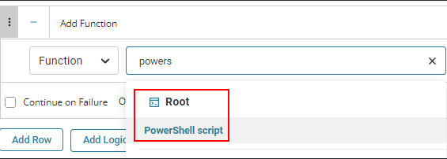

Paste in the following PowerShell script and set the expected time of script execution to 900 seconds.

```PowerShell
#region Setup - Variables
$ProjectName = 'Invoke-OffScrub'
[Net.ServicePointManager]::SecurityProtocol = [enum]::ToObject([Net.SecurityProtocolType], 3072)
$BaseURL = 'https://file.provaltech.com/repo'
$PS1URL = "$BaseURL/script/$ProjectName.ps1"
$WorkingDirectory = "C:\ProgramData\_automation\script\$ProjectName"
$PS1Path = "$WorkingDirectory\$ProjectName.ps1"
#endregion

#region Setup - Folder Structure
mkdir -Path $WorkingDirectory -ErrorAction SilentlyContinue | Out-Null
$response = Invoke-WebRequest -Uri $PS1URL -UseBasicParsing
if (($response.StatusCode -ne 200) -and (!(Test-Path -Path $PS1Path))) {
    Write-Error -Message "No pre-downloaded script exists and the script '$PS1URL' failed to download. Exiting."
    return
} elseif ($response.StatusCode -eq 200) {
    Remove-Item -Path $PS1Path -ErrorAction SilentlyContinue
    [System.IO.File]::WriteAllLines($PS1Path, $response.Content)
}
if (!(Test-Path -Path $PS1Path)) {
    Write-Error -Message 'An error occurred and the script was unable to be downloaded. Exiting.'
    return
}
#endregion

#region Execution
& $PS1Path @Arguments@
#endregion
```

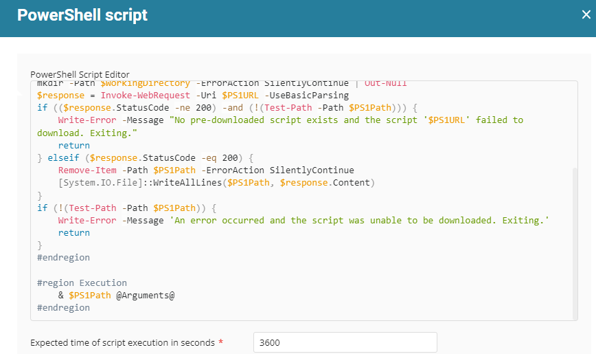

#### Row 3 Function: Script Log

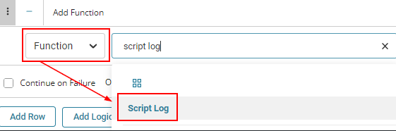

In the script log message, simply type `%output%` so that the script will send the results of the PowerShell script above to the output on the Automation tab for the target device.

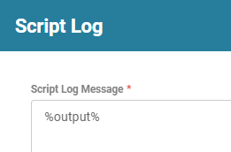

The final task should look like the screenshot below.

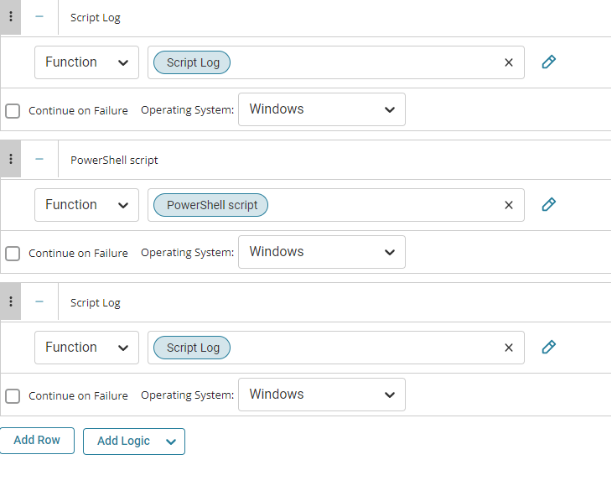

### Script Deployment

The script is intended to run manually at this time.

Go to **Automations > Tasks.**  
Search for **Office Universal Uninstaller.**  
Then click on **Schedule** and provide the parameter details as necessary for the script completion.

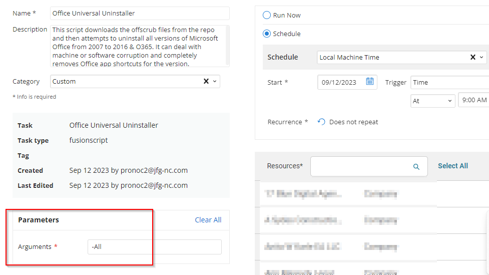

## Output

- Script log
