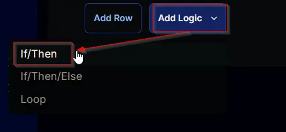
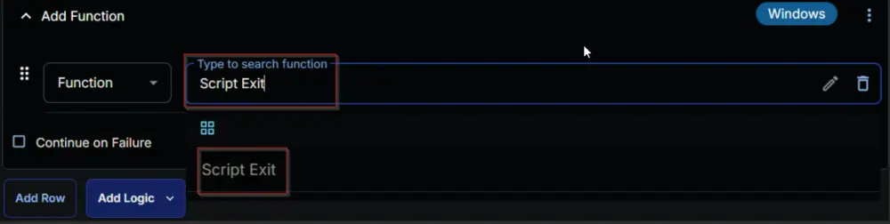
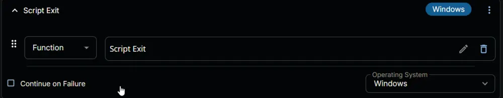
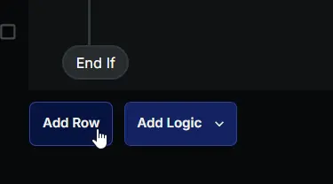
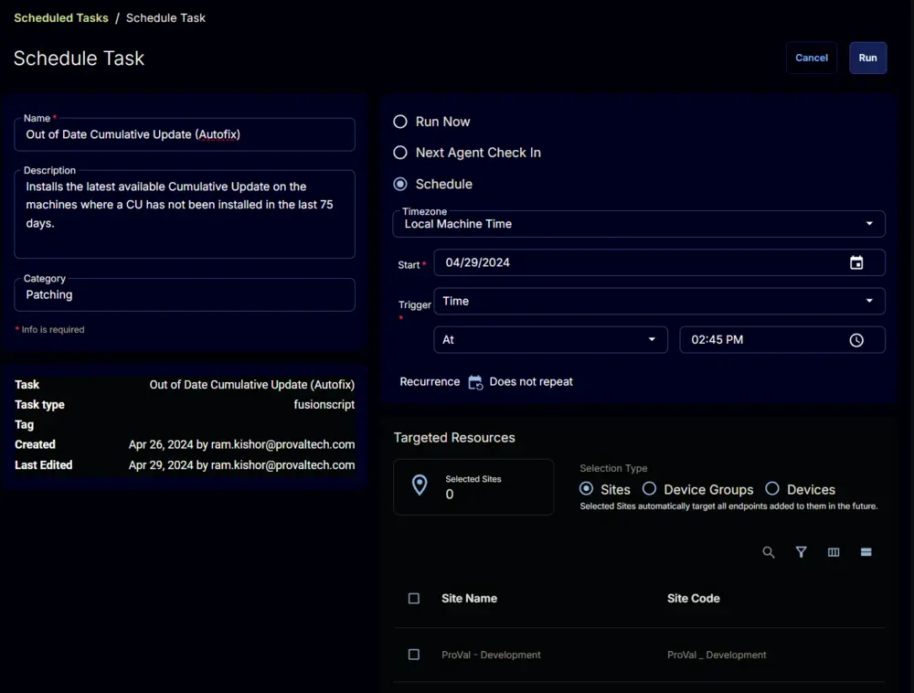

## Summary

Installs the latest available Cumulative Update on the machines where a CU has not been installed in the last 75 days.

## Sample Run

  


## Dependencies

- [CW RMM - Custom Field - Company - Out_of_Date_CU_Autofix](/docs/00c4b9c6-ded8-4cde-ba74-47437724d206)
- [CW RMM Custom Field - Site - Out_of_Date_CU_Autofix](/docs/7eb4d98b-4199-4f59-a28f-bfdf50f3e36a)
- [CW RMM - Custom Field - EndPoint - Out_of_Date_CU_Autofix](/docs/a9e84f5a-0afa-44ef-98b7-c5a70f6a25ea)
- [CW RMM - Custom Field - EndPoint - Out_of_Date_CU_Autofix_Result](/docs/2d24daab-16cb-4b2d-b7e6-0e757b4f2523)
- [CW RMM - Custom Field - EndPoint - Out_of_Date_CU_Autofix_Date](/docs/044210c4-14ae-4996-ab9f-009290bf05e4)
- [CW RMM - Device Group - Out of Date CU _ Autofix Required](/docs/7ef49988-2b75-441e-9373-bda734a03ea1)
- [Custom Fields - Reboot Prompter](/docs/7876f32c-a5ec-4b58-9f7e-b60b710e19d5)

## Variables

| Name                 | Description                                                                                                               |
|----------------------|---------------------------------------------------------------------------------------------------------------------------|
| Company_Selection     | Value stored in the [Company - Out_of_Date_CU_Autofix](/docs/00c4b9c6-ded8-4cde-ba74-47437724d206) Custom Field.   |
| Site_Selection        | Value stored in the [Site - Out_of_Date_CU_Autofix](/docs/7eb4d98b-4199-4f59-a28f-bfdf50f3e36a) Custom Field.     |
| Endpoint_Selection    | Value stored in the [EndPoint - Out_of_Date_CU_Autofix](/docs/a9e84f5a-0afa-44ef-98b7-c5a70f6a25ea) Custom Field. |
| Output                | Output of the previously executed PowerShell script.                                                                     |

## Task Creation

Create a new `Script Editor` style script in the system to implement this Task.

  
  

**Name:** Out of Date Cumulative Update (Autofix)  
**Description:** Installs the latest available Cumulative Update on the machines where a CU has not been installed in the last 75 days.  
**Category:** Patching  

  

## Task

Navigate to the Script Editor Section and start by adding a row. You can do this by clicking the `Add Row` button at the bottom of the script page.  
  

A blank function will appear.  
  

### Row 1 Function: Set Pre-defined Variable

Search and select the `Set Pre-defined Variable` function.  
  
  

The following function will pop up on the screen:  
  

- Type `Company_Selection` in the `Variable Name` field.
- Select the `Custom Field` radio button.
- Search and select the company-level `Out_of_Date_CU_Autofix` Custom Field in the `Search Custom Field` field.
- Click the `Save` button to save the changes.  
  
  

### Row 2 Function: Set Pre-defined Variable

Add a new row by clicking on the `Add Row` button.  
  

A blank function will appear.  
  

Search and select the `Set Pre-defined Variable` function.  
  
  

The following function will pop up on the screen:  
  

- Type `Site_Selection` in the `Variable Name` field.
- Select the `Custom Field` radio button.
- Search and select the site-level `Out_of_Date_CU_Autofix` Custom Field in the `Search Custom Field` field.
- Click the `Save` button to save the changes.  
  
  
  
  

### Row 3 Function: Set Pre-defined Variable

Add a new row by clicking on the `Add Row` button.  
  

A blank function will appear.  
  

Search and select the `Set Pre-defined Variable` function.  
  
  

The following function will pop up on the screen:  
  

- Type `Endpoint_Selection` in the `Variable Name` field.
- Select the `Custom Field` radio button.
- Search and select the Endpoint-level `Out_of_Date_CU_Autofix` Custom Field in the `Search Custom Field` field.
- Click the `Save` button to save the changes.  
  
  
  
  

### Row 4 Function: PowerShell Script

Add a new row by clicking on the `Add Row` button.  
  

A blank function will appear.  
  

Search and select the `PowerShell Script` function.  
  
  

The following function will pop up on the screen:  
  

Paste the following PowerShell script and leave the expected time of script execution to `300` seconds. Click the `Save` button.

```powershell
$os = ( Get-CimInstance -ClassName Win32_OperatingSystem ).Caption
if ( '@EndPoint_Selection@' -eq 'Enable' ) \{
    'Enable'
} elseif ( '@EndPoint_Selection@' -eq 'Disable' ) \{
    'Disable'
} elseif ( $os -match 'Server' ) \{
    if ( '@Site_Selection@' -eq 'Enable for Server' ) \{
        'Enable'
    } elseif ( '@Site_Selection@' -eq 'Disable for Server' ) \{
        'Disable'
    } elseif ( '@Company_Selection@' -eq 'Servers as well' ) \{
        'Enable'
    } else \{
        'Disable'
    }
} elseif ( '@Site_Selection@' -eq 'Enable' ) \{
    'Enable'
} elseif ( '@Site_Selection@' -eq 'Disable' ) \{
    'Disable'
} elseif ( '@Company_Selection@' -eq 'Enable' ) \{
    'Enable'
} elseif ( '@Company_Selection@' -eq 'Disable' ) \{
    'Disable'
} else \{
    'Disable'
}
```

  

### Row 5 Logic: If/Then

  

A blank function will appear.  
  

### Row 5a Condition: Output Contains

Type `Disable` in the `Input Value or Variable` field and press `Enter`.  
  

### Row 5b Function: Script Log

Click the `Add Row` button inside the `If/Then` logic.  
  

Search and select the `Script Log` function in the newly appeared row.  
  
  

The following function will pop up on the screen:  
  

Type `Autofix is disabled.` in the `Script Log Message` field and click the `Save` button.  
  

### Row 5c Function: Script Exit

Click the `Add Row` button inside the `If/Then` logic.  
  

Search and select the `Script Exit` function in the newly appeared row.  
  
  

The following function will pop up on the screen:  
  

Click the `Save` button without typing anything in the `Error Message` field.  
  

### Row 6 Function: PowerShell Script

Add a new row by clicking on the `Add Row` button outside the `If/Then` logic.  
  

A blank function will appear.  
  

Search and select the `PowerShell Script` function.  
  
  

The following function will pop up on the screen:  
  

Paste the following PowerShell script and set the expected time of script execution to `7200` seconds. Click the `Save` button.

```powershell
# Needs update to JSON format
```

  

### Row 7 Logic: If/Then/Else

  
  

### Row 7a Condition: Output Contains

Type `Failed to Install` in the `Input Value or Variable` field and press `Enter`.  
  

### Row 7b Function: Set Custom Field

Add a new row by clicking the `Add Row` button inside the `If` section.  
  

Search and select the `Set Custom Field` function.  
  
  

Search and select `Out_of_Date_CU_Autofix_Result` in the `Search Custom Field` field and set `Failed` in the `Value` field, then click the `Save` button.  
  
  

### Row 7c Function: Script Exit

Click the `Add Row` button inside the `If/Then` logic.  
  

Search and select the `Script Exit` function in the newly appeared row.  
  
  

The following function will pop up on the screen:  
  

Paste the following lines in the `Error Message` field and click the `Save` button.  
```plaintext
Script Failed.  
Output: %Output%
```
  

### Row 7d Logic: If/Then/Else

Add a new `If/Then/Else` logic inside the `Else` section.  
  
  

### Row 7d(i) Condition: Output Contains

Change the comparator to `Does Not Contain`.  
  

Type `Successfully installed the latest available Cumulative Update` in the `Input Value or Variable` field and press `Enter`.  
  

### Row 7d(ii) Function: Script Log

Click the `Add Row` button after the condition.  
  

Search and select the `Script Log` function in the newly appeared row.  
  
  

The following function will pop up on the screen:  
  

Type `Script Result: %Output%` in the `Script Log Message` field and click the `Save` button.  
  

### Row 7d(iii) Function: Script Exit

Click the `Add Row` button inside the `If/Then` logic.  
  

Search and select the `Script Exit` function in the newly appeared row.  
  
  

The following function will pop up on the screen:  
  

Click the `Save` button without typing anything in the `Error Message` field.  
  

### Row 7d(iv) Logic: If/Then/Else

Add a new `If/Then/Else` logic inside the `Else` section.  
  
  

### Row 7d(iv)\<1> Condition: Output Does Not Contain

Change the comparator to `Does Not Contain`.  
  

Type `Successfully installed the latest available Cumulative Update` in the `Input Value or Variable` field and press `Enter`.  
  

### Row 7d(iv)\<2> Function: Set Custom Field

Add a new row by clicking the `Add Row` button inside the `If` section.  
  

Search and select the `Set Custom Field` function.  
  
  

Search and select `Out_of_Date_CU_Autofix_Result` in the `Search Custom Field` field and set `Failed` in the `Value` field, then click the `Save` button.  
  
  

### Row 7d(iv)\<3> Function: Script Exit

Click the `Add Row` button inside the `If` section.  
  

Search and select the `Script Exit` function in the newly appeared row.  
  
  

The following function will pop up on the screen:  
  

Paste the following lines in the `Error Message` field and click the `Save` button.  
```plaintext
Script Failed.  
Output: %Output%
```
  

### Row 7d(iv)\<4> Function: Set Custom Field

Add a new row by clicking the `Add Row` button inside the `Else` section.  
  

A blank function will appear.  
  

Search and select the `Set Custom Field` function.  
  
  

Search and select `Out_of_Date_CU_Autofix_Result` in the `Search Custom Field` field and set `Reboot Pending` in the `Value` field, then click the `Save` button.  
  
  

### Row 7d(iv)\<5> Function: PowerShell Script

Add a new row by clicking the `Add Row` button inside the `Else` section.  
  

A blank function will appear.  
  

Search and select the `PowerShell Script` function.  
  
  

The following function will pop up on the screen:  
  

Paste the following PowerShell script and leave the expected time of script execution to `300` seconds. Click the `Save` button.

```powershell
(Get-Date).ToString('yyyy-MM-dd HH:mm:ss')
```
  

### Row 7d(iv)\<6> Function: Set Custom Field

Add a new row by clicking the `Add Row` button inside the `Else` section.  
  

A blank function will appear.  
  

Search and select the `Set Custom Field` function.  
  
  

Search and select `Out_of_Date_CU_Autofix_Date` in the `Search Custom Field` field and set `%Output%` in the `Value` field, then click the `Save` button.  
  
  

### Row 7d(iv)\<7> Function: PowerShell Script

Add a new row by clicking the `Add Row` button inside the `Else` section.  
  

A blank function will appear.  
  

Search and select the `PowerShell Script` function.  
  
  

The following function will pop up on the screen:  
  

Paste the following PowerShell script and leave the expected time of script execution to `300` seconds. Click the `Save` button.

```powershell
$os = ( Get-CimInstance -ClassName Win32_OperatingSystem ).Caption; 
if ( $os -match 'Server' ) \{ 
    'This is a Server Operating System. It should be restarted manually. Exiting the Script.' 
} else \{ 
    'Initiating the reboot pending prompt solution on the machine.' 
}
```
  

### Row 7d(iv)\<8> Function: Script Log

Add a new row by clicking the `Add Row` button inside the `Else` section.  
  

A blank function will appear.  
  

Search and select the `Script Log` function in the newly appeared row.  
  
  

The following function will pop up on the screen:  
  

Type `%Output%` in the `Script Log Message` field and click the `Save` button.  
  

## Completed Script

  
  
  
  

## Deployment

It is suggested to run the Task once per week against the [Out of Date CU _ Autofix Required](/docs/7ef49988-2b75-441e-9373-bda734a03ea1) device group.

1. Go to `Automation` > `Tasks`.
2. Search for `Out of Date Cumulative Update (Autofix)` Task.
3. Select the concerned task.
4. Click on the `Schedule` button to schedule the task.  
  
5. This screen will appear.  
  
6. Click the `Does not repeat` button.  
  
7. This pop-up box will appear.  
  
8. Change the Repeat interval to `Week(s)`, select an appropriate day; I have selected `Monday` in the attached screenshot. Click the `OK` button to save the changes.  
  
9. Recurrence will be updated to `Every Week on \<Selected Weekday>`.  
  
10. Select the `Device Groups` option in the `Targeted Resources` section.  
  
11. Search and Select the [Out of Date CU _ Autofix Required](/docs/7ef49988-2b75-441e-9373-bda734a03ea1) device group.  
  
12. Now click the `Run` button to initiate the task.  
  
13. The task will start appearing in the Scheduled Tasks.  
  
  

## Output

- Script Log
- Custom Field

