## Summary
Determines if Windows Server Update Services (WSUS) settings are configured in the registry and identifies if they are managed via Group Policy (GPO). You can also write the results to a text custom field.

## Sample Run

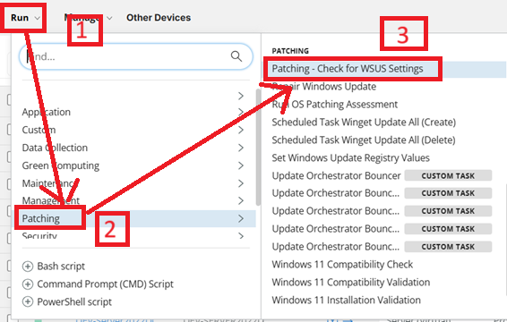
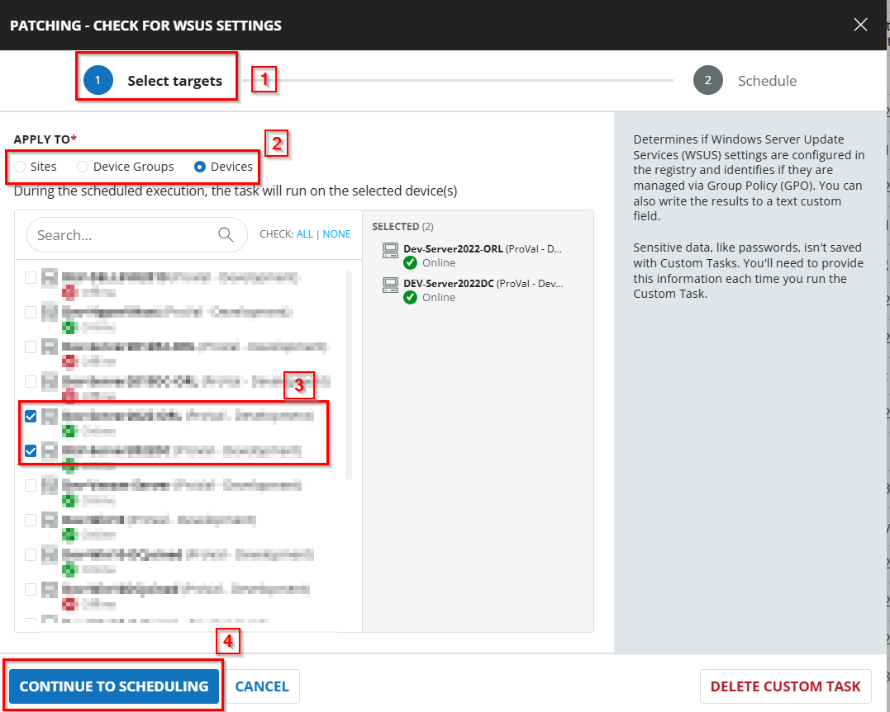
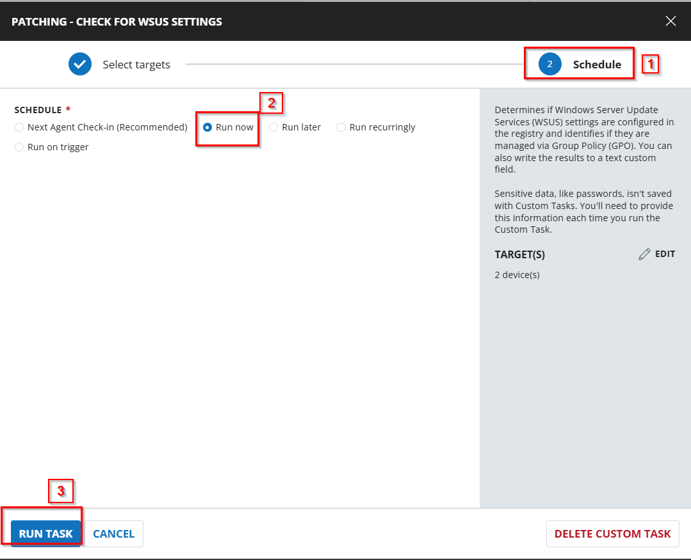

## Dependencies
[CustomField - WSUS_Status](/docs/2ca7feb0-b811-4486-8ff1-fd93d08056c8)

## Task Creation

### Script Details

#### Step 1

Navigate to `Automation` ➞ `Tasks`  


#### Step 2

Create a new `Script Editor` style task by choosing the `Script Editor` option from the `Add` dropdown menu  


The `New Script` page will appear on clicking the `Script Editor` button:  


#### Step 3

Fill in the following details in the `Description` section:  

**Name:** `Patching - Check for WSUS Settings`  
**Description:** `Determines if Windows Server Update Services (WSUS) settings are configured in the registry and identifies if they are managed via Group Policy (GPO). You can also write the results to a text custom field.`  
**Category:** `Patching`

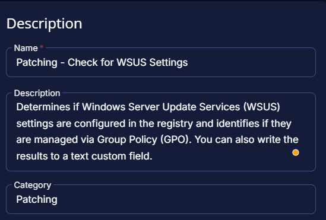

### Script Editor

Click the `Add Row` button in the `Script Editor` section to start creating the script  


A blank function will appear:  


#### Row 1 Function: `PowerShell Script`

Search and select the `PowerShell Script` function.  
  
  

The following function will pop up on the screen:  
  

Paste in the following PowerShell script and set the `Expected time of script execution in seconds` to `600` seconds. Click the `Save` button. 

```powershell
$fileName = 'Audit-WSUSSettings'
$workingDirectory = 'C:\ProgramData\_Automation\Script\{0}' -f $fileName
$primaryTaskScriptPath = '{0}\{1}.ps1' -f $workingDirectory, $fileName

# Define UTF-8 encoding without BOM
$Utf8NoBomEncoding = New-Object System.Text.UTF8Encoding($False)
#region Setup - Folder Structure
if ( !(Test-Path $WorkingDirectory) ) {
    try {
        New-Item -Path $WorkingDirectory -ItemType Directory -Force -ErrorAction Stop | Out-Null
    }
    catch {
        Write-Log "An error occurred: Failed to Create $WorkingDirectory. Reason: $($Error[0].Exception.Message)" -Level Error
    }
} if (-not ( ( ( Get-Acl $WorkingDirectory ).Access | Where-Object { $_.IdentityReference -Match 'EveryOne' } ).FileSystemRights -Match 'FullControl' ) ) {
    $ACl = Get-Acl $WorkingDirectory
    $AccessRule = New-Object System.Security.AccessControl.FileSystemAccessRule('Everyone', 'FullControl', 'ContainerInherit, ObjectInherit', 'none', 'Allow')
    $Acl.AddAccessRule($AccessRule)
    Set-Acl $WorkingDirectory $Acl
}

$primaryTaskScriptContent = @"
### Region Strapper ###
`$ProgressPreference = 'SilentlyContinue'
[Net.ServicePointManager]::SecurityProtocol = [Enum]::ToObject([Net.SecurityProtocolType], 3072)
Get-PackageProvider -Name NuGet -ForceBootstrap | Out-Null
Set-PSRepository -Name PSGallery -InstallationPolicy Trusted
try {
    Update-Module -Name Strapper -ErrorAction Stop
}
catch {
    Install-Module -Name Strapper -Repository PSGallery -SkipPublisherCheck -Force
    Get-Module -Name Strapper -ListAvailable | Where-Object { `$_.Version -ne (Get-InstalledModule -Name Strapper).Version } | ForEach-Object { Uninstall-Module -Name Strapper -MaximumVersion `$_.Version }
}
(Import-Module -Name 'Strapper') 3>&1 2>&1 1>`$null
Set-StrapperEnvironment

# Function to test if a device is domain-joined
function Test-IsDomainJoined {
    try {
        if (`$PSVersionTable.PSVersion.Major -lt 3) {
            return `$(Get-WmiObject -Class Win32_ComputerSystem).PartOfDomain
        }
        else {
            return `$(Get-CimInstance -Class Win32_ComputerSystem).PartOfDomain
        }
    }
    catch {
        Write-Log -Text '[Error] Unable to validate whether or not this device is a part of a domain.' -Level Error
        Write-Log -Text "[Error] `$(`$_.Exception.Message)" -Level Error
        exit 1
    }
}

# Function to test if the current device is a server or domain controller
function Test-IsServer {
    [CmdletBinding()]
    param()

    `$OS = if (`$PSVersionTable.PSVersion.Major -lt 3) {
        Get-WmiObject -Class Win32_OperatingSystem
    }
    else {
        Get-CimInstance -ClassName Win32_OperatingSystem
    }

    if (`$OS.ProductType -eq "2" -or `$OS.ProductType -eq "3") {
        return `$true
    }
}

# Check if the device is domain-joined
`$IsDomainJoined = Test-IsDomainJoined

# If domain-joined, do a group policy update
if (`$IsDomainJoined) {
    Write-Log -Text '[Info] Updating group policies...' -Level Information
    `$StandardOutLog = "`$env:TEMP\`$(Get-Random)_gpupdate_stdout.log"

    try {
        `$gpupdateProcess = Start-Process -FilePath "`$env:SystemRoot\System32\gpupdate.exe" -ArgumentList "/force" -Wait -NoNewWindow -PassThru -RedirectStandardOutput `$StandardOutLog -ErrorAction Stop
    }
    catch {
        Write-Log -Text "[Error] `$(`$_.Exception.Message)" -Level Error
        Write-Log -Text "[Error] Failed to start `$env:SystemRoot\System32\gpupdate.exe." -Level Error
    }

    if (`$gpupdateProcess.ExitCode -ne 0) {
        Write-Log -Text "[Error] Failed to update group policy, exit code: `$(`$gpupdateProcess.ExitCode)" -Level Error

        if (Test-Path -Path `$StandardOutLog -ErrorAction SilentlyContinue) {
            `$errorContent = Get-Content -Path `$StandardOutLog -ErrorAction SilentlyContinue

            if (`$ErrorContent) {
                `$errorContent = `$errorContent | Where-Object { `$_ } | Select-Object -Skip 1 | Out-String
                `$errorContent = `$errorContent.Trim() -replace "^", "[Error] "
                Write-Log -Text "`$errorContent" -Level Error
            }

            try {
                Remove-Item -Path `$StandardOutLog -ErrorAction Stop
            }
            catch {
                Write-Log -Text "[Error] Failed to remove standard output log at `$StandardOutLog" -Level Error
            }
        }
        Write-Log -Text '[Warning] Failed to update group policy. Results may not reflect the latest group policy settings.' -Level Information
    }
    else {
        Write-Log -Text '[Info] Group policy update completed successfully.' -Level Information
    }
}

# Initialize exit code and output object
`$ActiveWSUSSettings = [PSCustomObject]::new()

# Define registry path for WSUS settings
`$wsusRegPath = 'HKLM:\Software\Policies\Microsoft\Windows\WindowsUpdate'

# Check registry for WSUS settings
if ((Test-Path `$wsusRegPath)) {
    Write-Log -Text '[Info] Checking the registry for WSUS settings...' -Level Information

    try {
        `$useWUServer = (Get-ItemProperty -Path "`$wsusRegPath\AU" -ErrorAction Stop).UseWUServer
    }
    catch {
        Write-Log -Text '[Error] Error retrieving WSUS settings from the registry.' -Level Error
        Write-Log -Text "[Error] `$(`$_.Exception.Message)" -Level Error
        exit 1
    }

    # Add registry as the source to the active settings object
    `$ActiveWSUSSettings | Add-Member -MemberType NoteProperty -Name 'WSUS Settings Source' -Value 'Registry'

    # If the GPO setting is configured, the UseWUServer regkey will be present and populated
    switch (`$useWUServer) {
        0 {
            `$checkForGPOs = `$true
            `$WSUSStatus = 'Disabled'
        }
        1 {
            `$checkForGPOs = `$true
            `$WSUSStatus = 'Enabled'
        }
        default {
            # If the UseWUServer regkey is not present or is a different value, it means WSUS is not configured via GPO, so we can skip checking for GPOs
            `$checkForGPOs = `$false
            `$WSUSStatus = 'Not Configured'
            Write-Log -Text '[Info] WSUS is not enabled on this device.' -Level Information
        }
    }

    # Add the WSUS status to the active settings object
    `$ActiveWSUSSettings | Add-Member -MemberType NoteProperty -Name 'WSUS Status' -Value `$WSUSStatus
        
    # Retrieve the WSUS server and statistics server from the registry
    `$wsusServerReg = Get-ItemProperty -Path "`$wsusRegPath" -Name WUServer, WUStatusServer -ErrorAction SilentlyContinue
    `$wsusServerFromRegistry = `$wsusServerReg.WUServer
    `$statisticsServerFromRegistry = `$wsusServerReg.WUStatusServer
        
    # If either server is configured, add the servers to the active settings object and check for GPOs
    if (`$wsusServerFromRegistry -or `$statisticsServerFromRegistry) {
        `$checkForGPOs = `$true
        `$ActiveWSUSSettings.'WSUS Settings Source' = 'Registry'

        if (`$wsusServerFromRegistry) {
            Write-Log -Text "[Info] WSUS Update Server detected in the registry: `$wsusServerFromRegistry" -Level Information
        }
        else {
            `$wsusServerFromRegistry = "Not Configured"
            Write-Log -Text '[Warning] The WSUS Update Server is not configured. The update server is required for WSUS to function correctly.' -Level Information
        }

        if (`$statisticsServerFromRegistry) {
            Write-Log -Text "[Info] WSUS Statistics Server detected in the registry: `$statisticsServerFromRegistry" -Level Information
        }
        else {
            `$statisticsServerFromRegistry = 'Not Configured'
            Write-Log -Text '[Warning] The WSUS Statistics Server is not configured. The statistics server is required for WSUS to function correctly.' -Level Information
        }
    }
    else {
        # If neither server is configured, then WSUS is not configured via GPO and we can skip checking for GPOs
        `$checkForGPOs = `$false
        `$wsusServerFromRegistry = 'Not Configured'
        `$statisticsServerFromRegistry = 'Not Configured'
        Write-Log -Text '[Warning] No WSUS servers were detected in the registry.' -Level Information
    }

    # Add the WSUS server and statistics server to the active settings object
    `$ActiveWSUSSettings | Add-Member -MemberType NoteProperty -Name 'Update Server' -Value `$wsusServerFromRegistry
    `$ActiveWSUSSettings | Add-Member -MemberType NoteProperty -Name 'Statistics Server' -Value `$statisticsServerFromRegistry
}
else {
    `$checkForGPOs = `$false
    Write-Log -Text "[Info] The registry key `$wsusRegPath was not found. WSUS is not configured on this device." -Level Information
}

# Check for GPO setting the WSUS configuration
if (`$IsDomainJoined -and `$checkForGPOs) {
    Write-Log -Text '[Info] Checking for GPOs that configure WSUS settings...' -Level Information

    # Define the WSUS registry path
    `$wsusRegistryPath = 'Software\\Policies\\Microsoft\\Windows\\WindowsUpdate'

    # Get the domain name
    try {
        `$domainName = (Get-CimInstance -Class Win32_ComputerSystem -ErrorAction Stop).Domain
    }
    catch {
        Write-Log -Text '[Error] Failed to retrieve the domain name.' -Level Error
        Write-Log -Text "[Error] `$(`$_.Exception.Message)" -Level Error
        exit 1
    }

    # Define the GPO paths to search for Registry.pol files
    if (Test-IsServer) {
        # If running on a server, the local group policy folders in System32 are not populated, so use the SYSVOL path instead
        `$gpoFolderPaths = @(
            "\\`$domainName\SYSVOL\`$domainName\Policies\"
        )
    }
    else {
        `$gpoFolderPaths = @(
            "`$env:windir\System32\GroupPolicy\"
            "`$env:windir\System32\GroupPolicyUsers\"
        )
    }

    # Search for WSUS settings in group policy Registry.pol files
    `$gposAffectingWSUS = foreach (`$folderPath in `$gpoFolderPaths) {
        `$registryPolFiles = Get-ChildItem -Path `$folderPath -Filter "Registry.pol" -Recurse -File -ErrorAction SilentlyContinue -ErrorVariable registryPolFileErrors

        foreach (`$errorInstance in `$registryPolFileErrors) {
            Write-Log -Text "[Error] Error encountered while retrieving Registry.pol files from `$folderPath." -Level Error
            Write-Log -Text "[Error] `$(`$errorInstance.Exception.Message)" -Level Error
            return
        }

        # For each Registry.pol file found, read its contents and check for WSUS settings
        foreach (`$polFile in `$registryPolFiles) {
            # Read the contents of the Registry.pol file, convert to string, and remove null characters
            `$polContent = (Get-Content -Path `$polFile.FullName -ErrorAction SilentlyContinue | Out-String) -replace "`0"

            # If the content of the Registry.pol file contains the WSUS registry path, extract the settings
            if (`$polContent -match `$wsusRegistryPath) {
                # Extract the GPO ID from the file path
                `$GPOId = `$polFile.FullName -replace ".*\\Policies\\(.*)\\Machine\\Registry.pol", '`$1'

                # Continue to the next file if the GPO ID is not in the expected format
                if (`$GPOId -notmatch "{\w{8}-\w{4}-\w{4}-\w{4}-\w{12}}") {
                    Write-Log -Text "[Error] Invalid GPO ID format found in `$(`$polFile.FullName): `$GPOId" -Level Error
                    `$ExitCode = 1
                    continue
                }

                # Define a regex pattern for capturing the WSUS settings from the Registry.pol file
                `$regexPattern = "(?<disable>\*\*del\.)?WUServer;(.+?;){2}(?<UpdateServer>.+?)].+?WUStatusServer;(.+?;){2}(?<StatisticsServer>.+?)]"

                # Use regex to match the WSUS settings
                `$regexMatches = [regex]::Match(`$polContent, `$regexPattern)

                # Check if GPO is disabling or enabling WSUS
                if (`$regexMatches.Groups['disable'].Value) {
                    `$GPOStatus = 'Disabled'
                }
                else {
                    `$GPOStatus = 'Enabled'
                }
                    
                # Extract the servers
                `$WUServer = `$regexMatches.Groups['UpdateServer'].Value
                `$WUStatisticsServer = `$regexMatches.Groups['StatisticsServer'].Value                            

                # Create a custom object with the GPO ID and WSUS settings
                [PSCustomObject]@{
                    Id               = `$GPOId
                    GPOStatus        = `$GPOStatus
                    UpdateServer     = `$WUServer
                    StatisticsServer = `$WUStatisticsServer
                }
            }
        }
    }
        
    # If GPOs were found that affect WSUS settings, filter them to only include those that are active
    if (`$gposAffectingWSUS) {
        # Define the registry path to currently applied GPOs that use Administrative Templates
        `$gpoHistoryPath = 'HKLM:\Software\Microsoft\Windows\CurrentVersion\Group Policy\History\{35378EAC-683F-11D2-A89A-00C04FBBCFA2}'
            
        # Retrieve active GPOs on this device from the registry path
        try {
            `$activeGPOs = Get-ChildItem -Path `$gpoHistoryPath -ErrorAction Stop | ForEach-Object { Get-ItemProperty -Path `$_.PSPath -Name DisplayName, GPOName -ErrorAction Stop }
        }
        catch {
            Write-Log -Text '[Error] Failed to retrieve active GPOs from the registry.' -Level Error
            Write-Log -Text "[Error] `$(`$_.Exception.Message)" -Level Error
            exit 1
        }

        # Filter the GPOs that affect WSUS settings to only include those that are active
        `$gposAffectingWSUS = `$gposAffectingWSUS | Where-Object { `$_.Id -in `$activeGPOs.GPOName }
    }

    # If any active GPOs are found that affect WSUS settings, find their display names and add them to the objects
    if (`$gposAffectingWSUS) {
        Write-Log -Text '[Info] Found GPOs that affect WSUS settings.' -Level Information
        `$gposAffectingWSUS = `$gposAffectingWSUS | ForEach-Object {
            `$gpoId = `$_.Id
            `$gpoDisplayName = `$activeGPOs | Where-Object { `$_.GPOName -eq `$gpoId } | Select-Object -ExpandProperty DisplayName

            [PSCustomObject]@{
                'WSUS Settings Source' = 'GPO'
                'WSUS Status'          = `$_.GPOStatus
                'GPO Display Name'     = `$gpoDisplayName
                'Update Server'        = `$_.UpdateServer
                'Statistics Server'    = `$_.StatisticsServer
            }
        }

        # Find the active WSUS settings based on the registry and GPOs
        `$ActiveWSUSSettings = `$gposAffectingWSUS | Where-Object { `$_.'WSUS Status' -eq `$WSUSStatus }
        Write-Log -Text "`$ActiveWSUSSettings" -Level Information    
        # If the registry settings are configured, filter the active settings to only include those that match the registry settings
        if (`$wsusServerFromRegistry -ne 'Not Configured') {
            `$ActiveWSUSSettings = `$ActiveWSUSSettings | Where-Object { `$_.'Update Server' -eq `$wsusServerFromRegistry }
            Write-Log -Text "`$ActiveWSUSSettings" -Level Information
        }

        if (`$statisticsServerFromRegistry -ne 'Not Configured') {
            `$ActiveWSUSSettings = `$ActiveWSUSSettings | Where-Object { `$_.'Update Server' -eq `$statisticsServerFromRegistry }
            Write-Log -Text "`$ActiveWSUSSettings" -Level Information
        }
    }
    else {
        Write-Log -Text '[Info] No GPOs that affect WSUS settings were found.' -Level Information
    }

    # Validate the WSUS servers in the GPOs against the registry settings
    `$gposAffectingWSUS | ForEach-Object {
        `$UpdateServer = `$_.'Update Server'
        `$StatisticsServer = `$_.'Statistics Server'

        # If both servers are empty, skip the validation
        if ([string]::IsNullOrWhiteSpace(`$UpdateServer) -and [string]::IsNullOrWhiteSpace(`$StatisticsServer)) {
            return
        }

        `$displayName = `$_.'GPO Display Name'

        if (-not [string]::IsNullOrWhiteSpace(`$UpdateServer) -and `$UpdateServer -ne `$wsusServerFromRegistry) {
            Write-Log -Text "[Warning] The WSUS update server in the GPO `$DisplayName (`$UpdateServer) does not match the server in the registry (`$wsusServerFromRegistry)." -Level Information
        }
            
        if (-not [string]::IsNullOrWhiteSpace(`$StatisticsServer) -and `$StatisticsServer -ne `$statisticsServerFromRegistry) {
            Write-Log -Text "[Warning] The WSUS statistics server in the GPO `$DisplayName (`$StatisticsServer) does not match the server in the registry (`$statisticsServerFromRegistry)." -Level Information
        }
    }
}

# Initialize return string
`$returnstring = ''

# Output all GPOs to the host if there are more than one
if (`$gposAffectingWSUS.Count -gt 1) {
    Write-Log -Text '### All GPOs affecting WSUS settings: ###' -Level Information
    Write-Log -Text ((`$gposAffectingWSUS | Format-List | Out-String).Trim()) -Level Information
}

# Write output object to the activity feed
if (-not [string]::IsNullOrWhiteSpace(`$ActiveWSUSSettings)) {
    Write-Log -Text '### Active WSUS settings: ###' -Level Information
    Write-Log -Text ((`$ActiveWSUSSettings | Format-List | Out-String).Trim()) -Level Information

    # Add the status to the custom field value
    `$returnstring += "WSUS Status: `$WSUSStatus"

    # Add the servers to the custom field value
    if (`$wsusServerFromRegistry -eq `$statisticsServerFromRegistry) {
        `$returnstring += " | Update and Statistics Server: `$wsusServerFromRegistry"
    }
    else {
        `$returnstring += " | Update Server: `$wsusServerFromRegistry | Statistics Server: `$statisticsServerFromRegistry"
    }

    # If there are active WSUS settings from GPOs, add them to the custom field value
    if (`$ActiveWSUSSettings.'WSUS Settings Source' -eq 'GPO') {
        `$gpoName = `$ActiveWSUSSettings.'GPO Display Name'
        `$returnstring += " | GPO Name: `$gpoName"
    }
}
else {
    `$returnstring += 'WSUS Status: Not Configured | Update and Statistics Server: Not Configured'
}

# Output the final return string once
`$returnstring

"@
try {
    [System.IO.File]::WriteAllLines($primaryTaskScriptPath, $primaryTaskScriptContent, $Utf8NoBomEncoding)
}
catch {
    return 'An error occurred: Failed to write the script content. Reason: {0}' -f $Error[0].exception.message
}
```
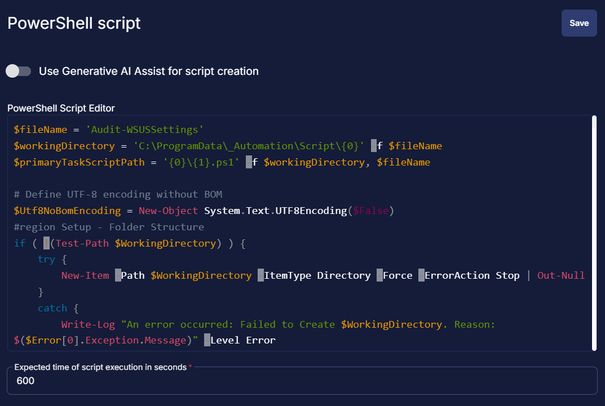

#### Row 2 Logic: If/Then

- Add a new `If/Then` logic from the Add Logic dropdown menu.


#### Row 2a Condition: Output Contains

- Type `An error occurred` in the Value box.  


#### Row 2b Function: Script Exit

- Add a new row in the If Section of the If/Else part by clicking the Add Row button  
- Search and select the `Script Exit` function.  
- Input the following:

```
Failed to run the WSUS Settings audit. Refer to the logs:
%Output%
```


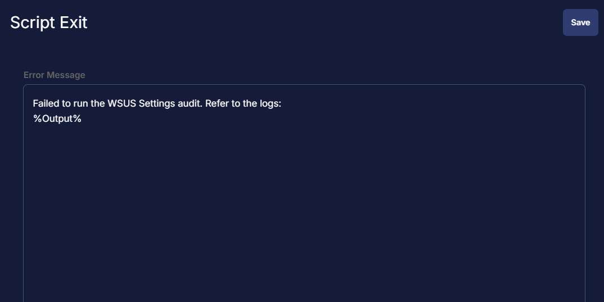

#### Row 3 Function: Command Prompt (CMD) Script

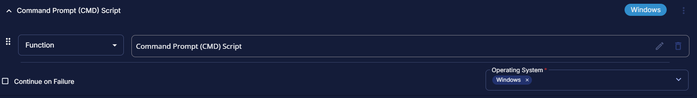

Paste in the following Command Prompt (CMD) script and set the expected script execution time to 600 seconds.

```Shell
C:\Windows\System32\WindowsPowerShell\v1.0\powershell.exe -ExecutionPolicy Bypass -Command "& C:\ProgramData\_Automation\Script\Audit-WSUSSettings\Audit-WSUSSettings.ps1"
```

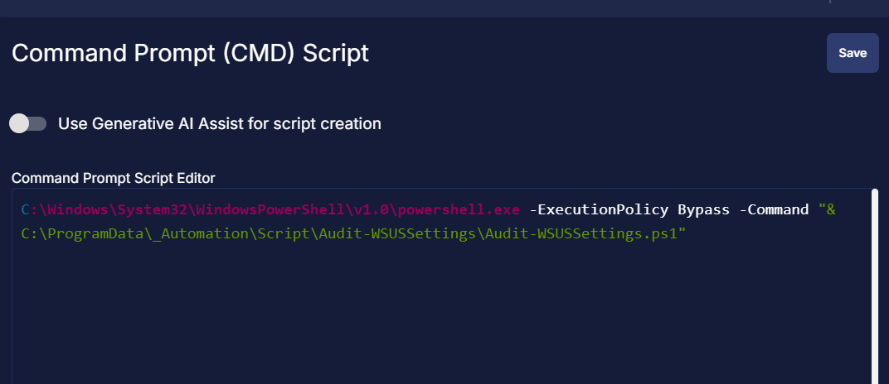

#### Row 4 Function: PowerShell Script

Search and select the `PowerShell Script` function.  
  
  

The following function will pop up on the screen:  
  

Paste in the following PowerShell script and set the `Expected time of script execution in seconds` to `300` seconds. Click the `Save` button. 

```powershell
$fileName = 'Audit-WSUSSettings'
$workingDirectory = "C:\ProgramData\_Automation\Script\$fileName"
$scriptLogPath = "$workingDirectory\$fileName-log.txt"
$scriptErrorLogPath = "$workingDirectory\$fileName-error.txt"

if (Test-Path $scriptErrorLogPath) {
    return "An error occurred: Refer to the log file on the agent for more detail: $scriptErrorLogPath"
}
elseif (Test-Path $scriptLogPath) {
    & C:\ProgramData\_Automation\Script\Audit-WSUSSettings\Audit-WSUSSettings.ps1
    return
}
else {
    return 'Powershell failure'
}
```
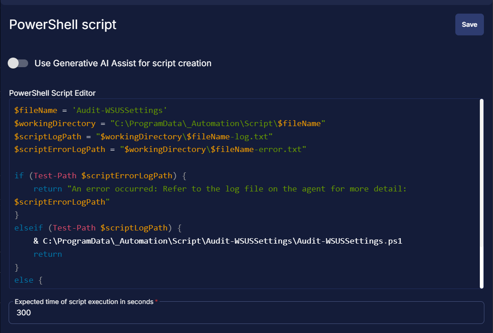

#### Row 5 Logic: If/Then

- Add a new `If/Then` logic from the Add Logic dropdown menu.


#### Row 5a Condition: Output Contains

- Type `An error occurred` in the Value box.  


#### Row 5b Function: Script Exit

- Add a new row in the If Section of the If/Else part by clicking the Add Row button  
- Search and select the `Script Exit` function.  
- Input the following:

```
WSUS Settings audit failed. %output%
```


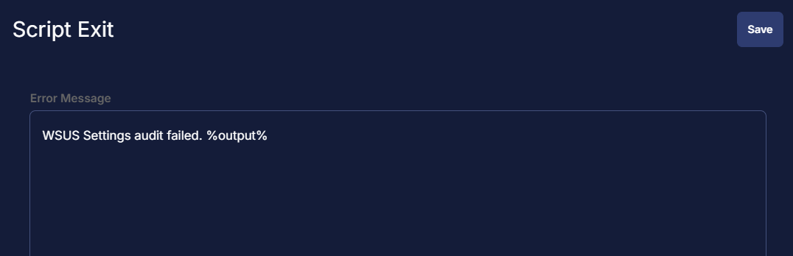

#### Row 6 Function: Script Log

- Add a new row by clicking the Add Row button  
- Search and select the `Script Log` function.  
- Input the following:

```Shell
%output%
```


#### Row 7 Function: Set Custom Field

- Add a new row by clicking the Add Row button  
- Search and select the `Set Custom Field` function.  
- Input the following:

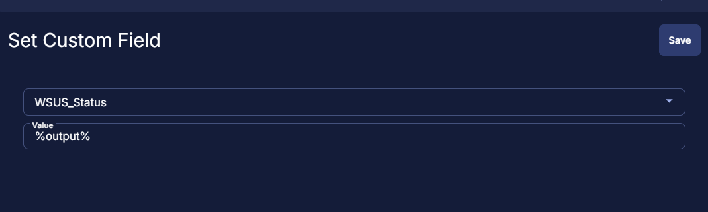

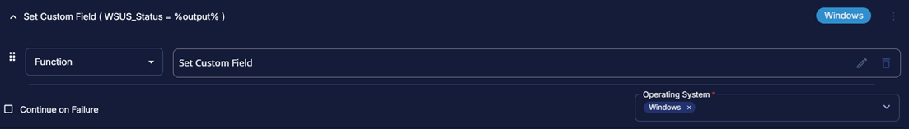

## Save Task

Click the `Save` button at the top-right corner of the screen to save the script.  


## Completed Task


## Output
- Log
- local file

`C:\ProgramData\_Automation\Script\Audit-WSUSSettings\Audit-WSUSSettings-log.txt`

`C:\ProgramData\_Automation\Script\Audit-WSUSSettings\Audit-WSUSSettings-error.txt`