---
id: '93b6b4ac-5923-47c5-a382-26015f6ac0fc'
slug: /93b6b4ac-5923-47c5-a382-26015f6ac0fc
title: 'Patching - Check for WSUS Settings'
title_meta: 'Patching - Check for WSUS Settings'
keywords: ['WSUS','Windows Update','Update']
description: 'Determines if Windows Server Update Services (WSUS) settings are configured in the registry and identifies if they are managed via Group Policy (GPO). The result is stored in the custom field WSUS_Status.'
tags: ['update','windows','auditing']
draft: false
unlisted: false
last_update:
  date: 2025-08-05
---

## Summary
Determines if Windows Server Update Services (WSUS) settings are configured in the registry and identifies if they are managed via Group Policy (GPO). The result is stored in the custom field [WSUS_Status](/docs/2ca7feb0-b811-4486-8ff1-fd93d08056c8).

## Sample Run

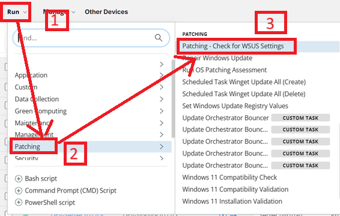  
 
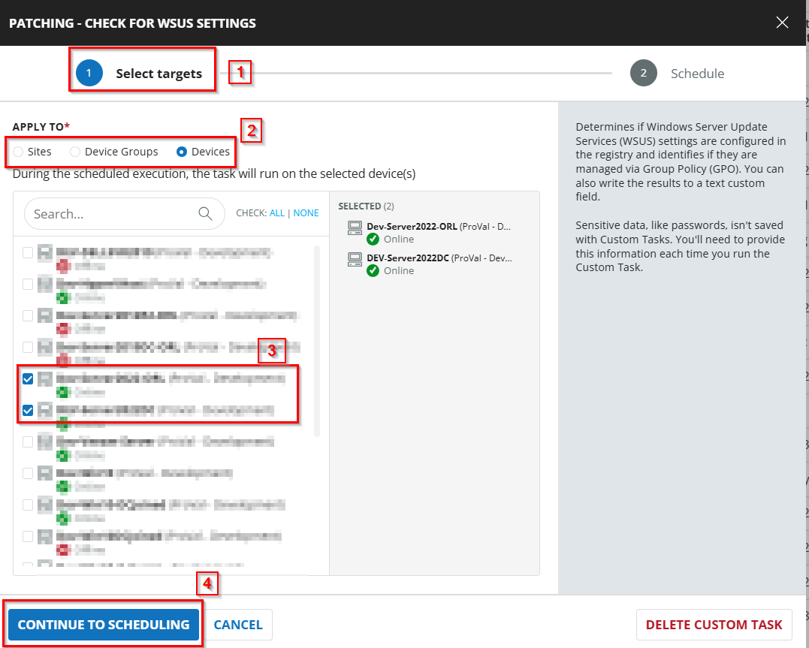  

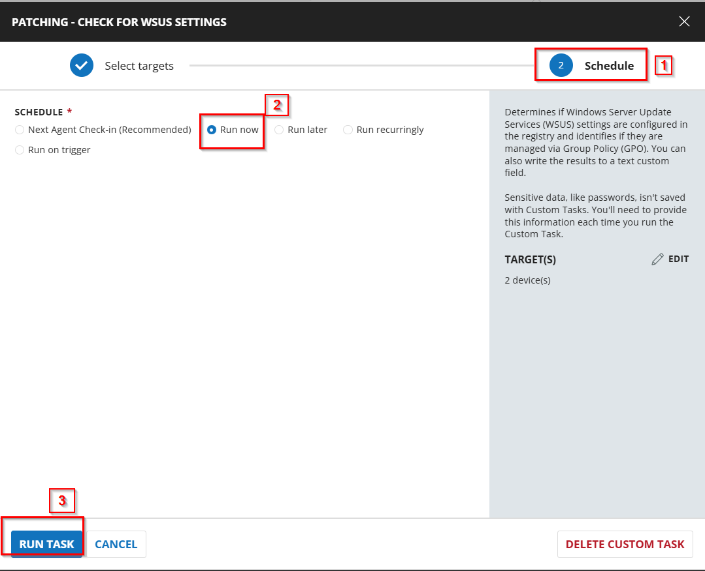

## Dependencies
[CustomField - WSUS_Status](/docs/2ca7feb0-b811-4486-8ff1-fd93d08056c8)
[Solution - Patching - Check for WSUS Settings](/docs/f68df531-09b3-4b82-b183-3769c7183a8d)

## Task Creation


#### Step 1

Navigate to `Automation` ➞ `Tasks`  


#### Step 2

Create a new `Script Editor` style task by choosing the `Script Editor` option from the `Add` dropdown menu  


The `New Script` page will appear on clicking the `Script Editor` button:  


#### Step 3

Fill in the following details in the `Description` section:  

- **Name:** `Patching - Check for WSUS Settings`  
- **Description:** `Determines if Windows Server Update Services (WSUS) settings are configured in the registry and identifies if they are managed via Group Policy (GPO). You can also write the results to a text custom field.`  
- **Category:** `Patching`

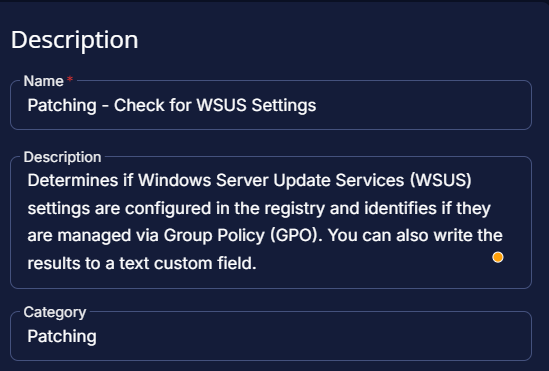

### Script Editor

Click the `Add Row` button in the `Script Editor` section to start creating the script  


A blank function will appear:  


#### Row 1 Function: `PowerShell Script`

Search and select the `PowerShell Script` function.  
  
  

The following function will pop up on the screen:  
  

Paste in the following PowerShell script and set the `Expected time of script execution in seconds` to `600` seconds. Click the `Save` button. 

[PowerShell Script 1](https://github.com/ProVal-Tech/cw-rmm/blob/main/tasks/patching-check-wsus-settings/script1.ps1)


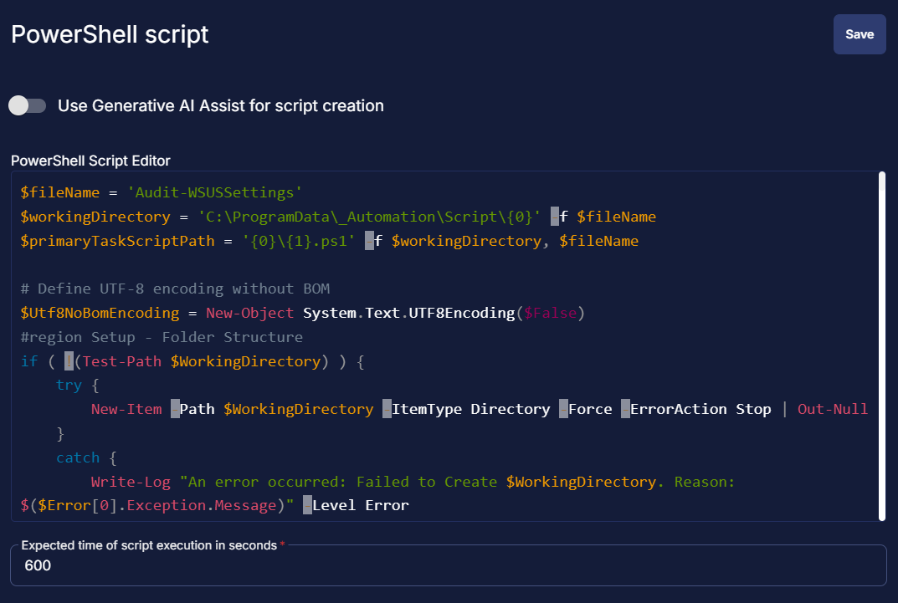

#### Row 2 Logic: If/Then

- Add a new `If/Then` logic from the `Add Logic` dropdown menu.


#### Row 2a Condition: Output Contains

- Type `An error occurred` in the Value box.  

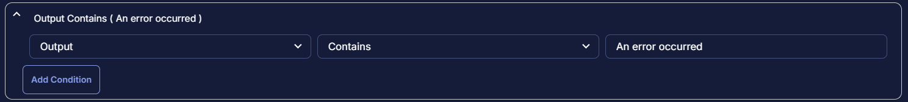

#### Row 2b Function: Script Exit

- Add a new row in the If Section of the If/Then part by clicking the `Add Row` button  
- Search and select the `Script Exit` function.  
- Input the following:

```
Failed to run the WSUS Settings audit. Refer to the logs:
%Output%
```

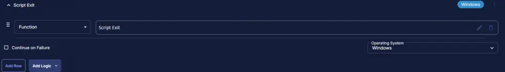

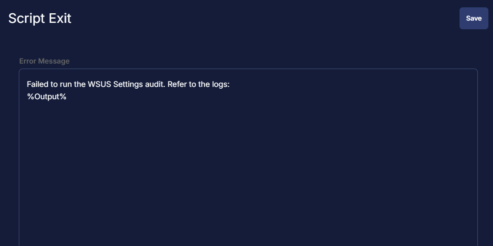

#### Row 3 Function: Command Prompt (CMD) Script
After `End If`, click on `Add Row` and search for `Command Prompt (CMD) Script`
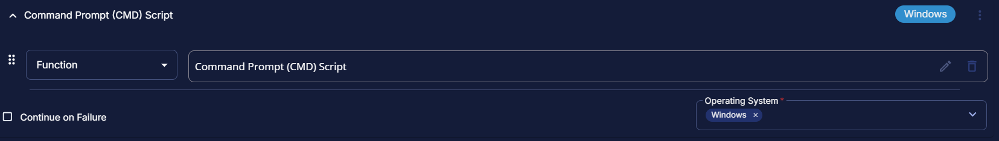

Paste in the following Command Prompt (CMD) script and set the expected script execution time to 600 seconds.

[Bash Script 1](https://github.com/ProVal-Tech/cw-rmm/blob/main/tasks/patching-check-wsus-settings/script1.sh)


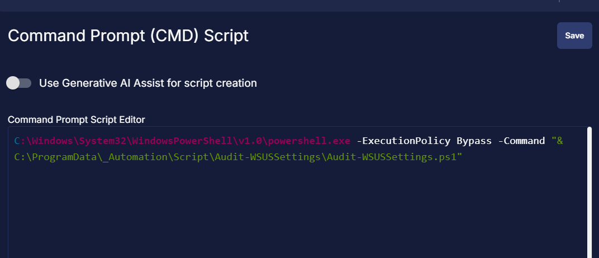

#### Row 4 Function: PowerShell Script

Click on `Add Row`, search and select the `PowerShell Script` function.  
  
  

The following function will pop up on the screen:  
  

Paste in the following PowerShell script and set the `Expected time of script execution in seconds` to `300` seconds. Click the `Save` button. 

[PowerShell Script 2](https://github.com/ProVal-Tech/cw-rmm/blob/main/tasks/patching-check-wsus-settings/script2.ps1)


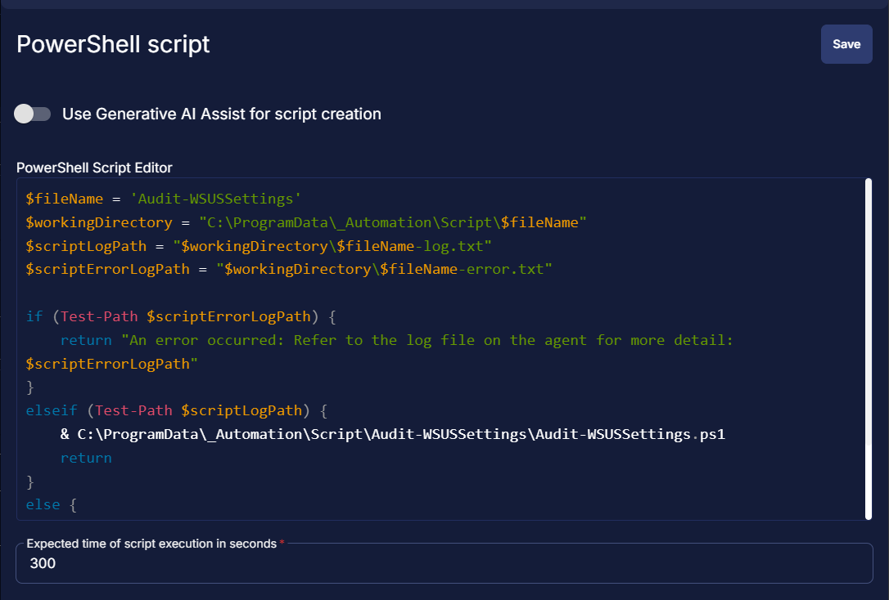

#### Row 5 Logic: If/Then

- Add a new `If/Then` logic from the `Add Logic` dropdown menu.


#### Row 5a Condition: Output Contains

- Type `An error occurred` in the Value box.  


#### Row 5b Function: Script Exit

- Add a new row in the If Section of the If/Then part by clicking the `Add Row` button  
- Search and select the `Script Exit` function.  
- Input the following:

```
WSUS Settings audit failed. %output%
```


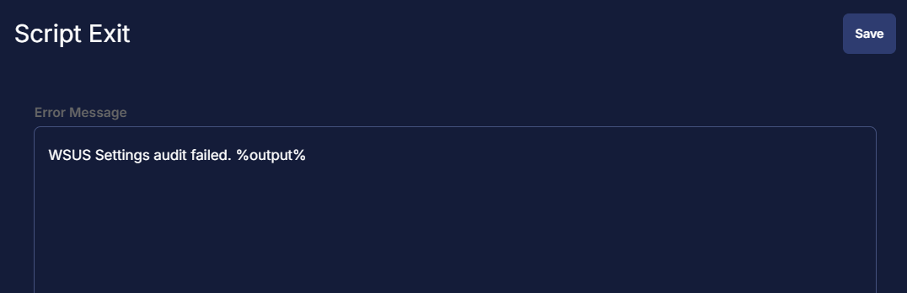

#### Row 6 Function: Script Log

- Add a new row by clicking the `Add Row` button after `End If`   
- Search and select the `Script Log` function.  
- Input the following:

[Bash Script 2](https://github.com/ProVal-Tech/cw-rmm/blob/main/tasks/patching-check-wsus-settings/script2.sh)


#### Row 7 Function: Set Custom Field

- Add a new row by clicking the `Add Row` button  
- Search and select the `Set Custom Field` function.  
- Input the following:

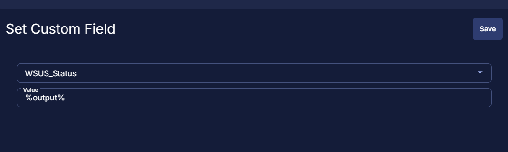

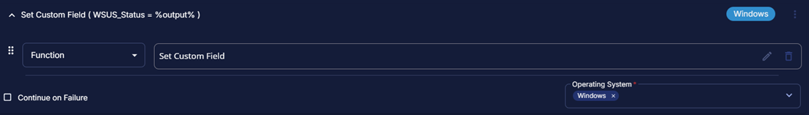

## Save Task

Click the `Save` button at the top-right corner of the screen to save the script.  


## Completed Task

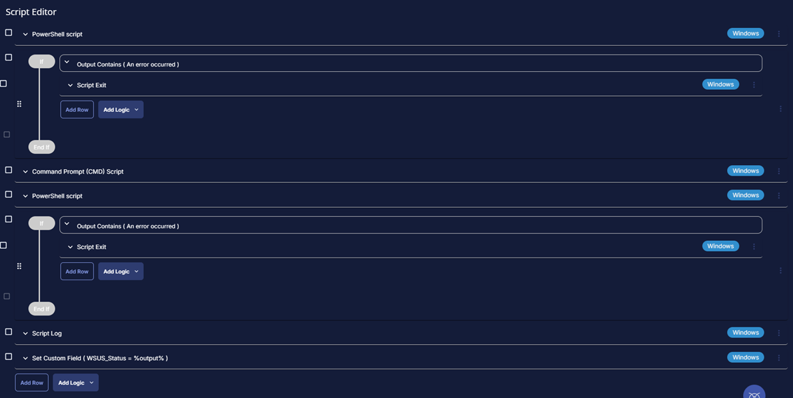

## Output
- Log
- local file

`C:\ProgramData\_Automation\Script\Audit-WSUSSettings\Audit-WSUSSettings-log.txt`

`C:\ProgramData\_Automation\Script\Audit-WSUSSettings\Audit-WSUSSettings-error.txt`

## Changelog

### 2025-08-01

- Initial version of the document

