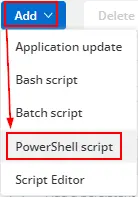
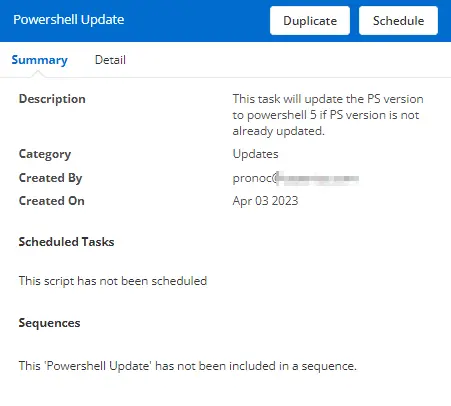
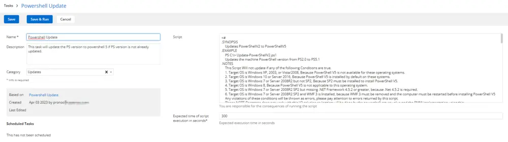

---
id: '2aa9b667-3d41-4fa3-b44b-7d4389e8dd6c'
slug: /2aa9b667-3d41-4fa3-b44b-7d4389e8dd6c
title: 'PowerShell Version Update'
title_meta: 'PowerShell Version Update'
keywords: ['update', 'powershell', 'version', 'windows', 'install']
description: 'This document provides a detailed guide on updating PowerShell to version 5 on Windows devices. The script checks the current version and performs the update if necessary, while also detailing the conditions under which the update can be applied.'
tags: ['software', 'update', 'windows']
draft: false
unlisted: false
last_update:
  date: 2025-05-09
---

## Summary

This task will update the PowerShell version to PowerShell 5 if it is not already updated.

## Manual Run

This script does not have any parameters and can be run against any online Windows device.

## Dependencies

None. This script can be run against any Windows device.

## Create Script

To implement this script, please create a new "PowerShell" style script in the system.

**Name:** PowerShell Update  
**Description:** This task will update the PowerShell version to PowerShell 5 if it is not already updated.  
**Category:** Updates  

### Script

Paste the PowerShell script below directly into the "Script" field.

[PowerShell Script](https://github.com/ProVal-Tech/cw-rmm/blob/main/tasks/powershell-version-update/script.ps1)

## Script Deployment

The script is intended to run from the [PowerShell Version](/docs/8c623742-14b0-4263-8a1a-abd4c61d602d) monitor as the "Run Automated Task."

This script can also run manually against any Windows-based device.

## Output

- Script log

## Changelog

### 2025-04-10

- Initial version of the document

