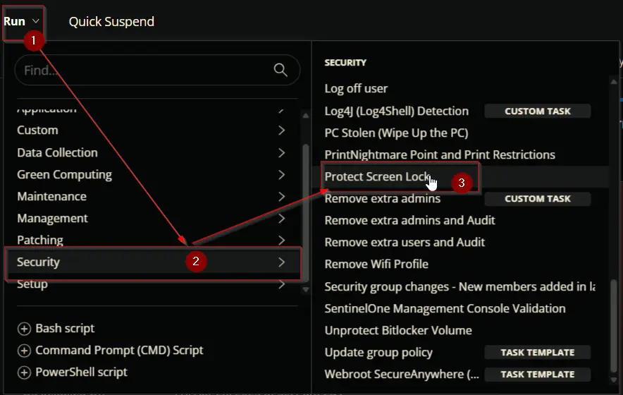
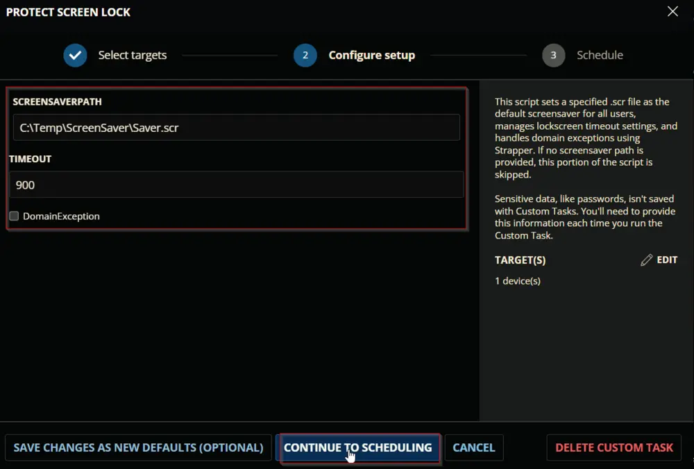
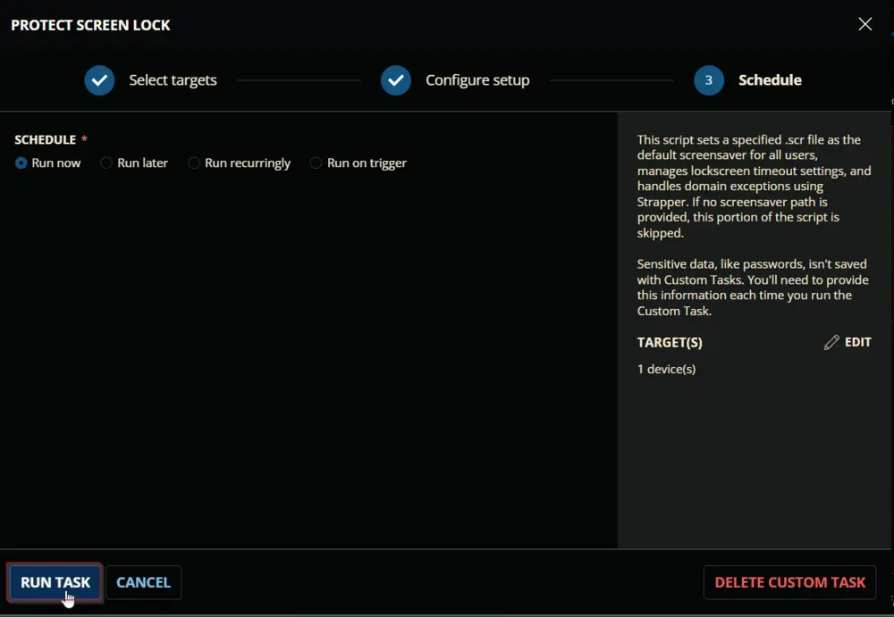
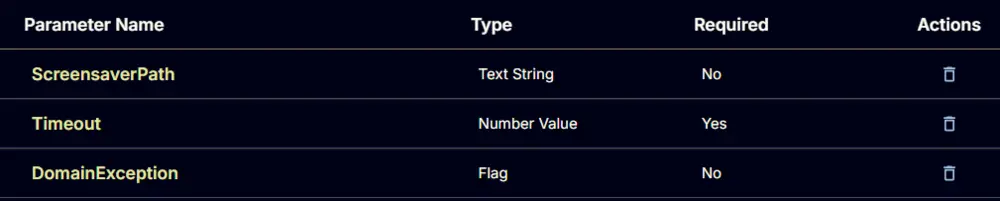
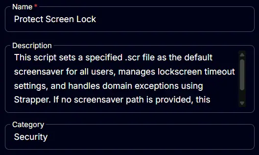
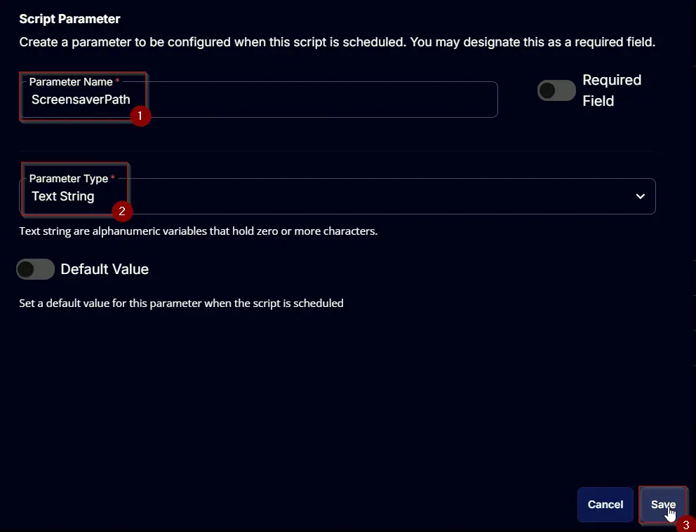
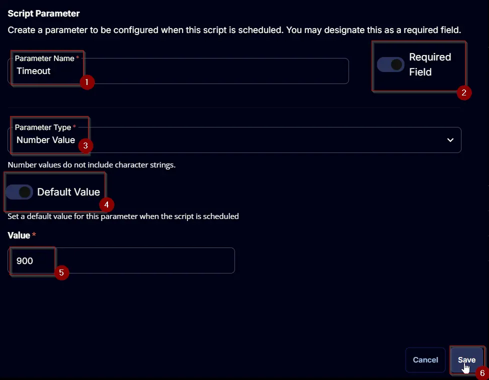
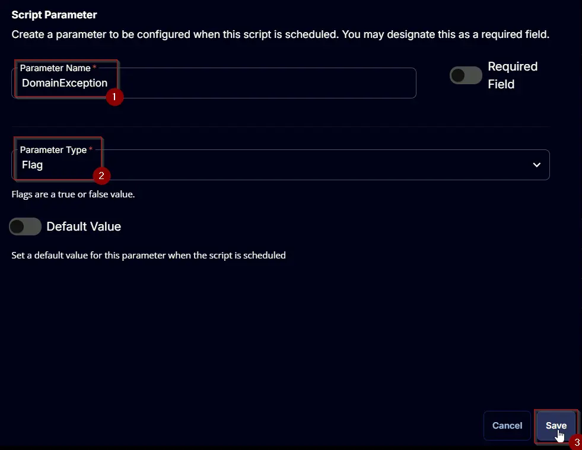
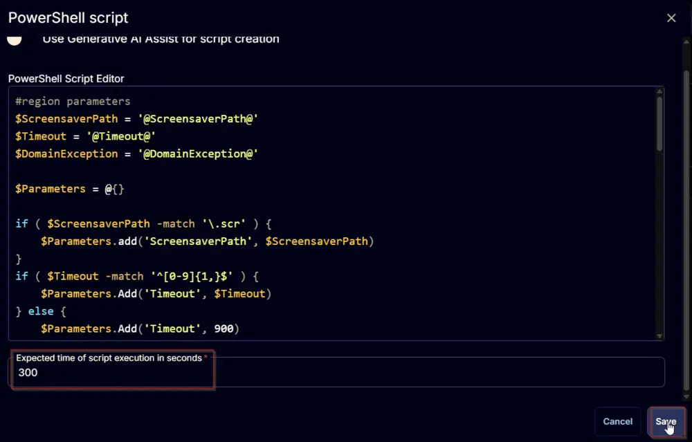
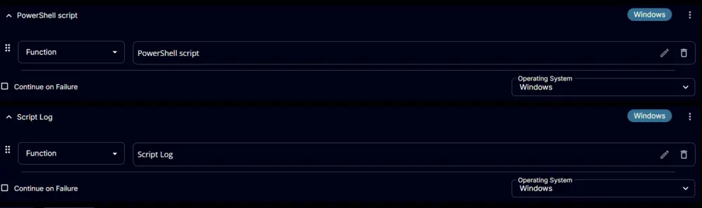

## Summary

This script sets a specified .scr file as the default screensaver for all users, manages lockscreen timeout settings, and handles domain exceptions using Strapper. If no screensaver path is provided, this portion of the script is skipped. CW RMM implementation of the agnostic script [Protect-Screenlock](https://file.provaltech.com/repo/script/Protect-ScreenLock.ps1).

## Sample Run

  
  
  

## Dependencies

[Protect Screen Lock Script](https://file.provaltech.com/repo/script/Protect-ScreenLock.ps1)

## User Parameters

| Name             | Example                        | Required | Default | Type          | Description                                                                                                                                                       |
|------------------|--------------------------------|----------|---------|---------------|-------------------------------------------------------------------------------------------------------------------------------------------------------------------|
| ScreenSaverPath  | C:/Temp/ScreenSaver/Saver.scr  | False    |         | Text String   | Optional parameter to specify the path of the screensaver file. The script will not set a screensaver if this parameter is not provided.                       |
| Timeout          | 900                            | True     | 900     | Number Value  | The maximum timeout value for the screensaver. Defaults to 900 seconds.                                                                                       |
| DomainException   | 0/1                           | False    |         | Flag          | Set to run a GPRESULT instead of making configuration changes when a machine is part of a domain.                                                                |

  

## Task Creation

Create a new `Script Editor` style script in the system to implement this task.  
  
  

**Name:** `Protect Screen Lock`  
**Description:** `This script sets a specified .scr file as the default screensaver for all users, manages lockscreen timeout settings, and handles domain exceptions using Strapper. If no screensaver path is provided, this portion of the script is skipped.`  
**Category:** `Security`  
  

## Parameters

### ScreensaverPath:
Add a new parameter by clicking the `Add Parameter` button present at the top-right corner of the screen.  
  

This screen will appear.  
  

- Set `ScreensaverPath` in the `Parameter Name` field.
- Select `Text String` from the `Parameter Type` dropdown menu.
- Click the `Save` button.  
  

### Timeout:
Add a new parameter by clicking the `Add Parameter` button present at the top-right corner of the screen.  
  

This screen will appear.  
  

- Set `Timeout` in the `Parameter Name` field.
- Enable the `Required Field` button.
- Select `Number Value` from the `Parameter Type` dropdown menu.
- Enable the `Default Value` button.
- Set `900` in the `Value` field.  
- Click the `Save` button.  
  

### Domain Exception:
Add a new parameter by clicking the `Add Parameter` button present at the top-right corner of the screen.  
  

This screen will appear.  
  

- Set `DomainException` in the `Parameter Name` field.
- Select `Flag` from the `Parameter Type` dropdown menu.
- Click the `Save` button.  
  

## Task Creation

Navigate to the Script Editor Section and start by adding a row. You can do this by clicking the `Add Row` button at the bottom of the script page.  
  

A blank function will appear.  
  

### Row 1 Function: PowerShell Script
Search and select the `PowerShell Script` function.  
  
  

The following function will pop up on the screen:  
  

Paste in the following PowerShell script and set the `Expected time of script execution in seconds` to `300` seconds. Click the `Save` button.  
```powershell
#region parameters
$ScreensaverPath = '@ScreensaverPath@'
$Timeout = '@Timeout@'
$DomainException = '@DomainException@'
$Parameters = @{}
if ( $ScreensaverPath -match '/.scr' ) {
    $Parameters.add('ScreensaverPath', $ScreensaverPath)
}
if ( $Timeout -match '^[0-9]{1,}$' ) {
    $Parameters.Add('Timeout', $Timeout)
} else {
    $Parameters.Add('Timeout', 900)
}
if ($DomainException -match '1|Yes|True') {
    $Parameters.Add('DomainException', $true)
}
#endregion
#region Setup - Variables
$ProjectName = 'Protect-Screenlock'
[Net.ServicePointManager]::SecurityProtocol = [enum]::ToObject([Net.SecurityProtocolType], 3072)
$BaseURL = 'https://file.provaltech.com/repo'
$PS1URL = "$BaseURL/script/$ProjectName.ps1"
$WorkingDirectory = "C:/ProgramData/_automation/script/$ProjectName"
$PS1Path = "$WorkingDirectory/$ProjectName.ps1"
$WorkingPath = $WorkingDirectory
$LogPath = "$WorkingDirectory/$ProjectName-log.txt"
$ErrorLogPath = "$WorkingDirectory/$ProjectName-Error.txt"
#endregion
#region Setup - Folder Structure
New-Item -Path $WorkingDirectory -ItemType Directory -ErrorAction SilentlyContinue | Out-Null
$response = Invoke-WebRequest -Uri $PS1URL -UseBasicParsing
if (($response.StatusCode -ne 200) -and (!(Test-Path -Path $PS1Path))) {
    throw "No pre-downloaded script exists and the script '$PS1URL' failed to download. Exiting."
} elseif ($response.StatusCode -eq 200) {
    Remove-Item -Path $PS1Path -ErrorAction SilentlyContinue
    [System.IO.File]::WriteAllLines($PS1Path, $response.Content)
}
if (!(Test-Path -Path $PS1Path)) {
    throw 'An error occurred and the script was unable to be downloaded. Exiting.'
}
#endregion
#region Execution
if ($Parameters) {
    & $PS1Path @Parameters
} else {
    & $PS1Path
}
#endregion
#region log verification
if ( !(Test-Path $LogPath) ) {
    throw 'PowerShell Failure. A Security application seems to have restricted the execution of the PowerShell Script.'
}
if ( Test-Path $ErrorLogPath ) {
    $ErrorContent = ( Get-Content -Path $ErrorLogPath )
    throw $ErrorContent
}
Get-Content -Path $LogPath
#endregion
```
  

### Row 2 Function: Script Log
Add a new row by clicking the `Add Row` button.  
  

A blank function will appear.  
  

Search and select the `Script Log` function.  
  

The following function will pop up on the screen:  
  

In the script log message, simply type `%Output%` and click the `Save` button.  
  

Click the `Save` button at the top-right corner of the screen to save the script.  
  

## Completed Task

  

## Output

- Script log
