## Summary

This task is designed to automatically detect the reboot pending status on endpoints and check the custom field 'Auto_RebootPendingCheck' so that the agent gets added to the dynamic group [CW RMM - Dynamic Group - Reboot Prompter Deployment - Auto](/docs/93faad94-8731-4fd5-afd0-0ae2a669fc05).

## Dependencies

- [CW RMM - Custom Fields - Reboot Prompter](/docs/7876f32c-a5ec-4b58-9f7e-b60b710e19d5) 
- Auto_RebootPendingCheck - Custom field (Endpoint)

## Sample Run

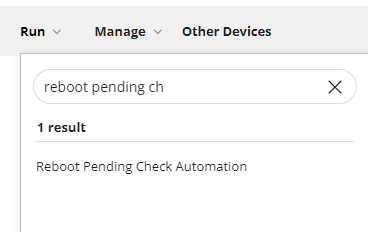

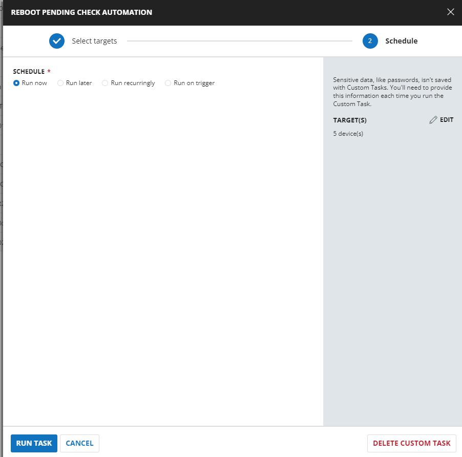

## Implementation

### Create Task

**Reboot Pending Check Automation**  
To implement this script, please create a new "PowerShell" style script in the system.


- **Name:** Reboot Pending Check Automation
- **Description:** This script imports the module 'PendingReboot' to detect the pending status on the endpoints. Based on the output, it sets the custom field 'Auto_RebootPendingCheck'.
- **Category:** Custom

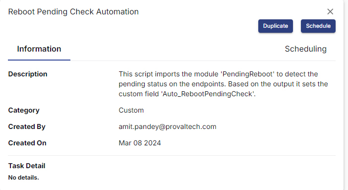

### Script

Start by creating three separate rows. You can do this by clicking the "Add Row" button at the bottom of the script page.


### Row 1: Function: Script Log


Paste the highlighted text:  
```plaintext
Executing a PowerShell to validate the PowerShell version greater than 3.0.
If yes, install below modules:
PowerShellGet
PendingReboot
```

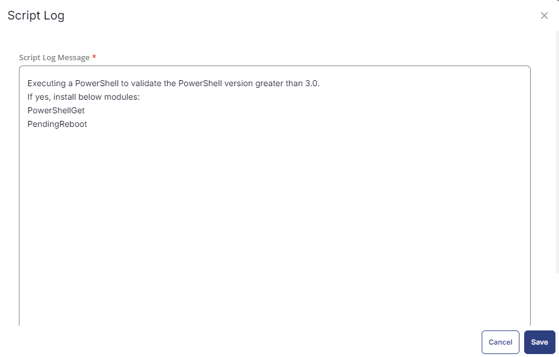

### Row 2: Function: PowerShell Script


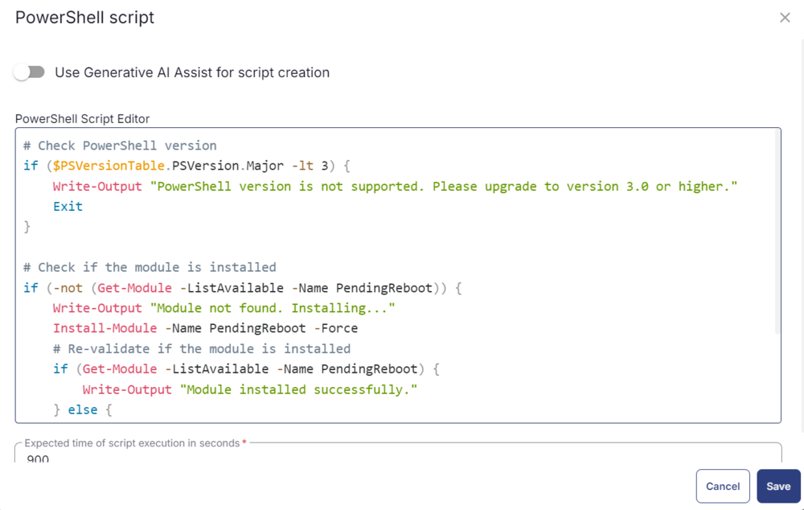

Paste in the following PowerShell script and set the expected time of script execution to `900` seconds.

```powershell
# Check PowerShell version
if ($PSVersionTable.PSVersion.Major -lt 3) {
    Write-Output "PowerShell version is not supported. Please upgrade to version 3.0 or higher."
    Exit
}

# Check if the module is installed
if (-not (Get-Module -ListAvailable -Name PendingReboot)) {
    Write-Output "Module not found. Installing..."
    Install-Module -Name PendingReboot -Force
    # Re-validate if the module is installed
    if (Get-Module -ListAvailable -Name PendingReboot) {
        Write-Output "Module installed successfully."
    } else {
        Write-Output "Module installation failed."
        Exit
    }
} else {
    Write-Output "Module already installed."
}
```

### Row 3: Function: Script Log

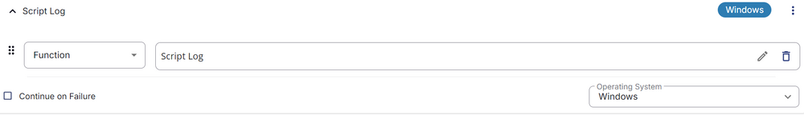

In the script log message, simply type `%output%` so that the script will send the results of the PowerShell script above to the output on the Automation tab for the target device.


### Row 4: Logic: If/Then/Else


### Row 4a: Condition: Output Contains

In the IF part, enter `Module installed successfully` in the right box of the "Output Contains" part.

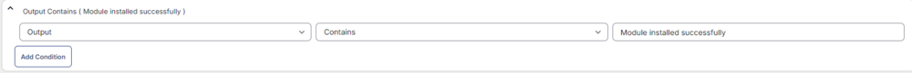

### Row 4b: Function: PowerShell Script

Add a new row by clicking on the Add row button.


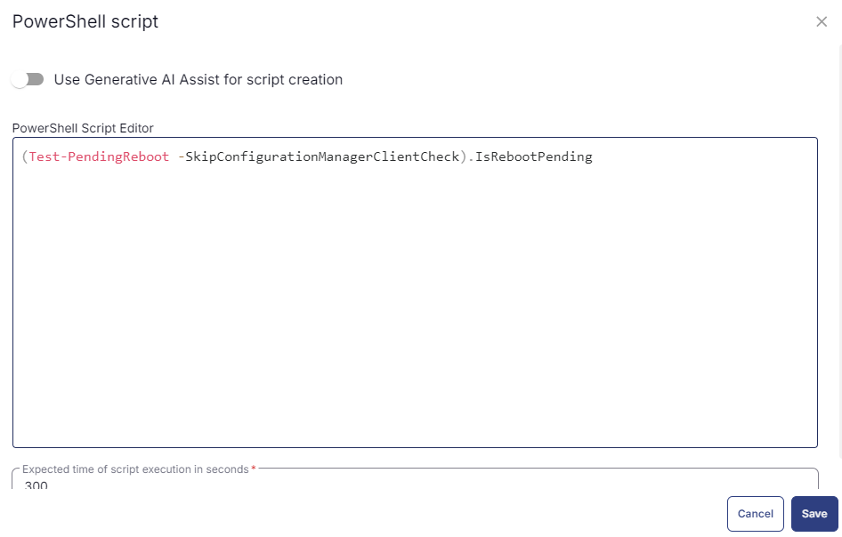

Paste in the following PowerShell script and set the expected time of script execution to `300` seconds.

```powershell
(Test-PendingReboot -SkipConfigurationManagerClientCheck).IsRebootPending
```

### Row 4c: Function: Script Log


In the script log message, simply type `The Pending Reboot Requirement: %output%` so that the script will send the results of the PowerShell script above to the output on the Automation tab for the target device.

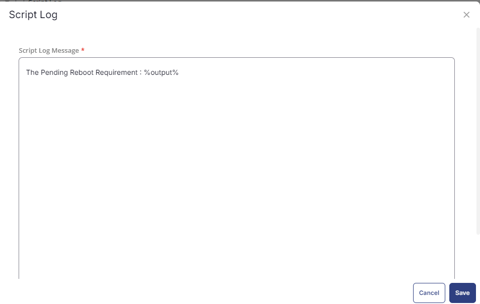

### Row 4c.1: Logic: If/Then


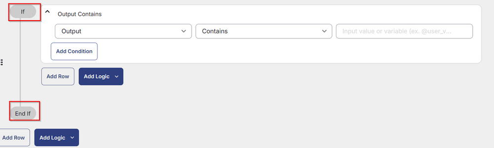

### Row 4c.2: Condition: Output Contains

In the IF part, enter `True` in the right box of the "Output Contains" part.

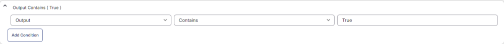

### Row 4c.3: Function: Set Custom Field

Add a new row by clicking on the Add row button.

Select Function 'Set Custom Field'. When you select `set custom field`, it will open up a new window.

In this window, search for the `Auto_RebootPendingCheck` field.

- **Custom Field:** Auto_RebootPendingCheck
- **Value:** `True`

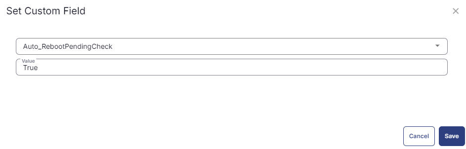

### Row 4d: Function: Script Exit

Add a new row by clicking on the Add row button.


In the script exit message, leave it blank.


### Row 4e: Condition: Script Exit

Add a new row in the Else section and select `Script Exit`.

In the script exit message, simply type `%output%`.

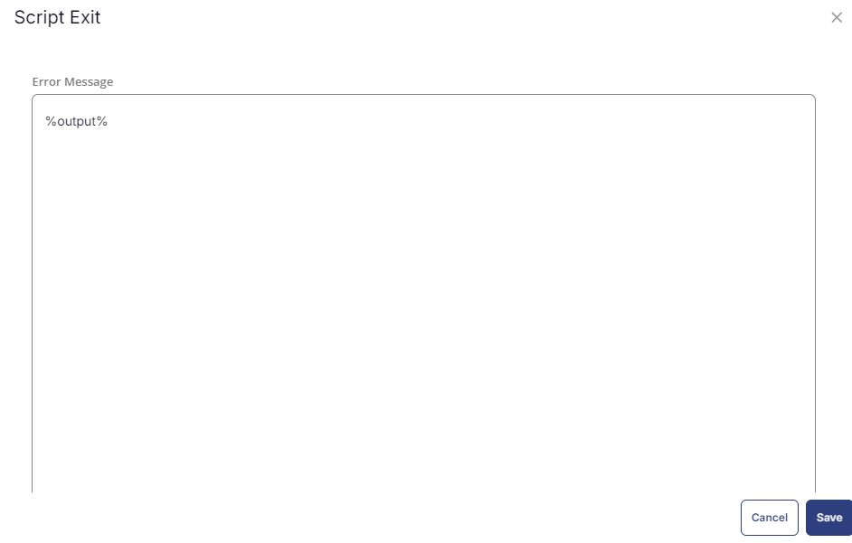

### Row 5: Complete

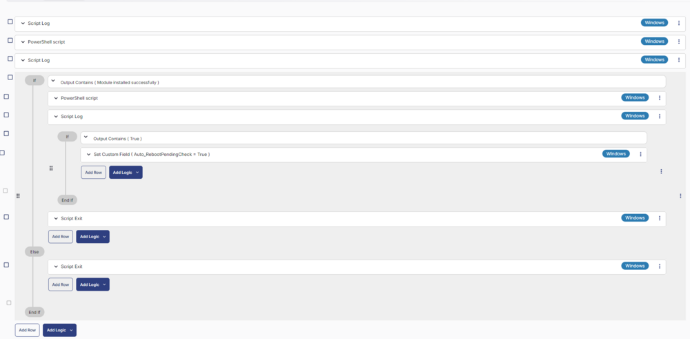

## Deployment

It is suggested to run the Task every 2 hours against the group `Reboot Pending Check Automation`.

- Go to `Automation` > `Tasks.`
- Search for `Force Reboot Server With Reboot Windows Verification` Task.
- Select the concerned task.
- Click on the `Schedule` button to schedule the task/script.


This screen will appear.

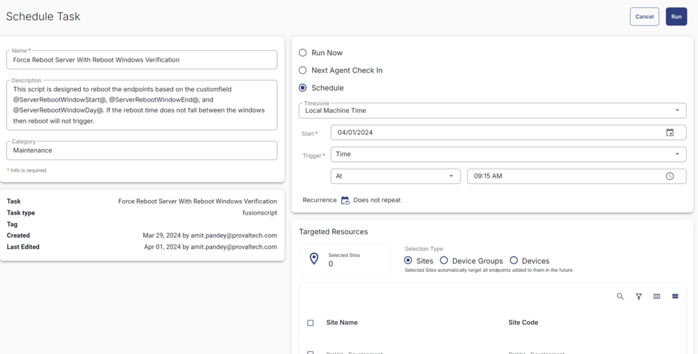

Select the relevant time to run the script and click the Do not repeat button.


A pop-up box will appear.

Change the number of hours to `2` and click `OK`.


Select the target to schedule the 'Force Reboot Server With Reboot Windows Verification'.


Now click the `Run` button once all customization is set to initiate the task.


The task will start appearing in the Scheduled Tasks.

## Output

- Task log


