## Summary

This task is designed to automatically detect the reboot pending status on endpoints and check the custom field `Auto_RebootPendingCheck` so that the agent gets added to the dynamic group [Reboot Prompter Deployment - Auto](/docs/93faad94-8731-4fd5-afd0-0ae2a669fc05).

## Dependencies

- [Custom Fields - Reboot Prompter](/docs/7876f32c-a5ec-4b58-9f7e-b60b710e19d5)
    - Custom field (Endpoint)-  `Auto_RebootPendingCheck` 
- [Dynamic Group - Automatic Reboot Pending Check](/docs/1c798d37-8ff8-4e73-ba39-027e025a3551)
- [Solution - Reboot Prompter](/docs/5b376f62-e977-4feb-b523-b133d2ef5722) 

## Sample Run

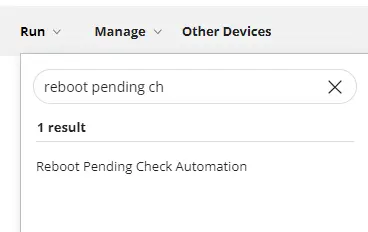

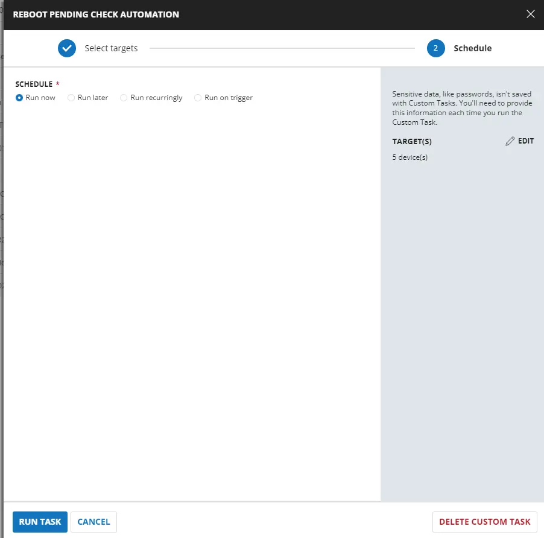

## Implementation

### Create Task

**Reboot Pending Check Automation**  
To implement this script, please create a new "PowerShell" style script in the system.


- **Name:** `Reboot Pending Check Automation`
- **Description:** `This script imports the module 'PendingReboot' to detect the pending status on the endpoints. Based on the output, it sets the custom field 'Auto_RebootPendingCheck'.`
- **Category:** `Custom`


### Script

Start by creating three separate rows. You can do this by clicking the "Add Row" button at the bottom of the script page.


### Row 1: Function: PowerShell Script


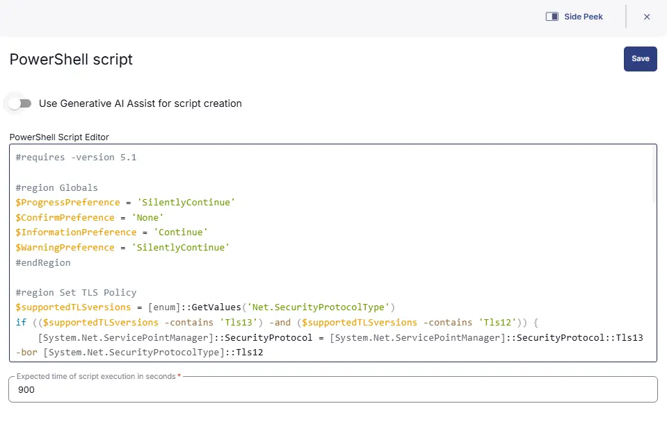

Paste in the following PowerShell script and set the expected time of script execution to `900` seconds.

```powershell
#requires -version 5.1

#region Globals
$ProgressPreference = 'SilentlyContinue'
$ConfirmPreference = 'None'
$InformationPreference = 'Continue'
$WarningPreference = 'SilentlyContinue'
#endRegion

#region Set TLS Policy
$supportedTLSversions = [enum]::GetValues('Net.SecurityProtocolType')
if (($supportedTLSversions -contains 'Tls13') -and ($supportedTLSversions -contains 'Tls12')) {
    [System.Net.ServicePointManager]::SecurityProtocol = [System.Net.ServicePointManager]::SecurityProtocol::Tls13 -bor [System.Net.SecurityProtocolType]::Tls12
} elseif ($supportedTLSversions -contains 'Tls12') {
    [System.Net.ServicePointManager]::SecurityProtocol = [System.Net.SecurityProtocolType]::Tls12
} else {
    Write-Information '[Warn] TLS 1.2 and/or TLS 1.3 are not supported on this system. This download may fail!'
    if ($PSVersionTable.PSVersion.Major -lt 3) {
        Write-Information '[Warn] PowerShell 2 / .NET 2.0 doesn''t support TLS 1.2.'
    }
}
#endRegion

#region PendingReboot Module
if (-not (Get-Module -Name 'PendingReboot' -ListAvailable)) {
    Get-PackageProvider -Name 'NuGet' -ForceBootstrap -ErrorAction SilentlyContinue | Out-Null
    Set-PSRepository -Name 'PSGallery' -InstallationPolicy Trusted -ErrorAction SilentlyContinue | Out-Null
    
    try {
        Update-Module -Name 'PendingReboot' -ErrorAction Stop
    } catch {
        Install-Module -Name 'PendingReboot' -Repository 'PSGallery' -SkipPublisherCheck -Force
        Get-Module -Name 'PendingReboot' -ListAvailable | Where-Object { $_.Version -ne (Get-InstalledModule -Name 'PendingReboot').Version } | ForEach-Object { Uninstall-Module -Name 'PendingReboot' -MaximumVersion $_.Version }
    }
}
(Import-Module -Name 'PendingReboot') 3>&1 2>&1 1>$null
#endRegion

#region Check for Pending Reboot
try {
    $pendingReboot = (Test-PendingReboot -SkipConfigurationManagerClientCheck).IsRebootPending
    if ($pendingReboot) {
        return 'IsRebootPending'
    } else {
        return 'IsNotRebootPending'
    }
} catch {
    throw ('An error occurred when checking for pending reboot: {0}' -f $($Error[0].Exception.Message))
}
#endRegion
```

### Row 2: Function: Script Log


In the script log message, simply type `%output%` so that the script will send the results of the PowerShell script above to the output on the Automation tab for the target device.


### Row 3 : Logic: If/Then/Else


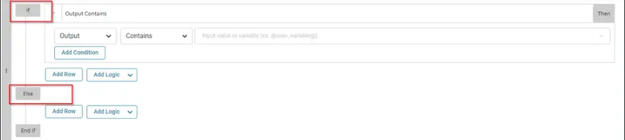

### Row 3a.1: Condition: Output Contains

In the IF part, enter `IsRebootPending` in the right box of the "Output Contains" part.

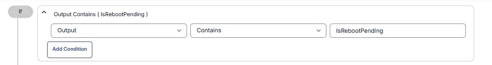

### Row 3a.2: Function: Set Custom Field

Add a new row by clicking on the `Add row` button.

Select Function `Set Custom Field`. When you select `set custom field`, it will open up a new window.

In this window, search for the `Auto_RebootPendingCheck` field.

- **Custom Field:** Auto_RebootPendingCheck
- **Value:** `True`


### Row 3b.1: Function: Set Custom Field

Add a new row by clicking on the `Add row` button in then section.

Select Function `Set Custom Field`. When you select `set custom field`, it will open up a new window.

In this window, search for the `Auto_RebootPendingCheck` field.

- **Custom Field:** Auto_RebootPendingCheck
- **Value:** `False`

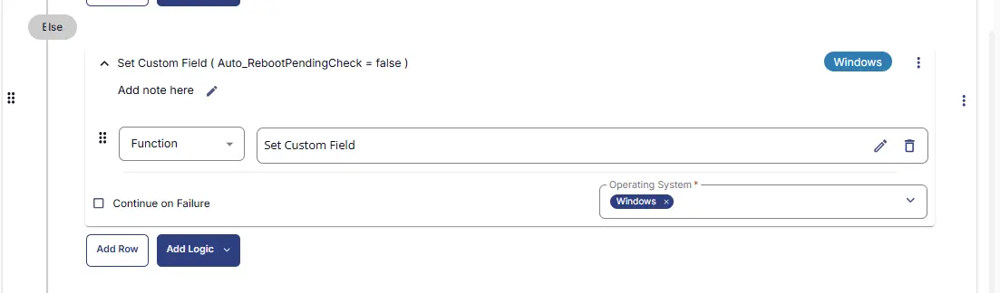

### Row 5: Complete

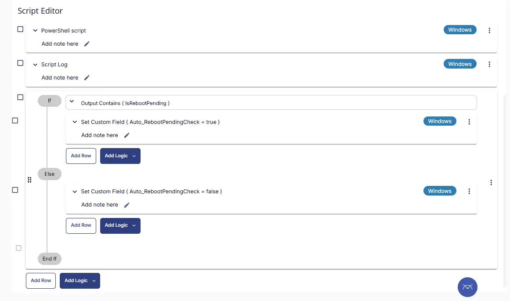

## Deployment

It is suggested to run the Task every 2 hours against the group [Dynamic Group - Automatic Reboot Pending Check](/docs/1c798d37-8ff8-4e73-ba39-027e025a3551).

- Go to `Automation` > `Tasks.`
- Search for `Reboot Pending Check Automation` Task.
- Select the concerned task.
- Click on the `Schedule` button to schedule the task/script.

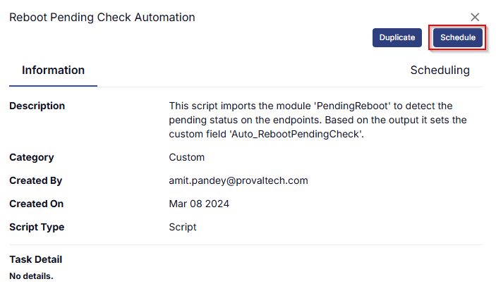

This screen will appear.

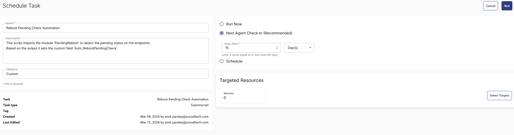

Select the relevant time to run the script and click the Do not repeat button.

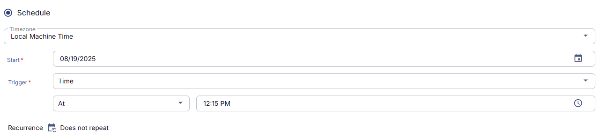

A pop-up box will appear.

Change the number of hours to `2` and click `OK`.

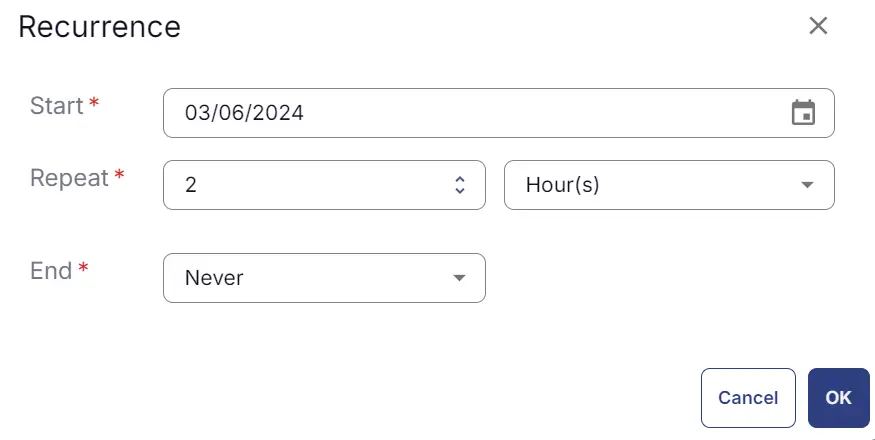

Select the target to schedule the 'Force Reboot Server With Reboot Windows Verification'.

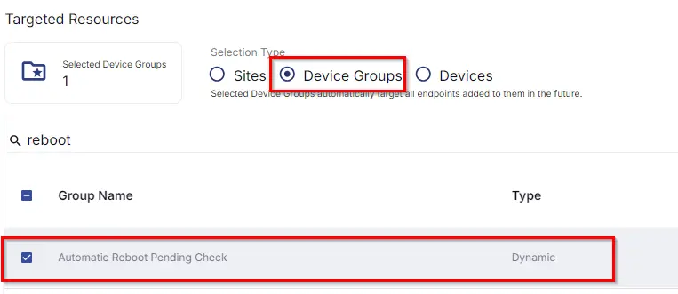

Now click the `Run` button once all customization is set to initiate the task.

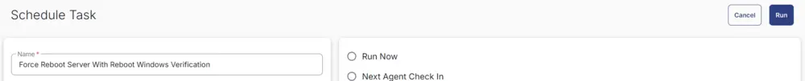

The task will start appearing in the Scheduled Tasks.

## Output

- Task log