## Summary

The script prompts the user to reboot with a simple yes or no prompt. It also forces a reboot after the `PromptRebootCount` is crossed.

## Dependencies

- [Custom Fields - Reboot Prompter](/docs/7876f32c-a5ec-4b58-9f7e-b60b710e19d5)  
- [Dynamic Group - Reboot Pending Deployment](/docs/284c0ff4-381a-45c0-8282-aa6ac4c3da20)
- [Solution - Reboot Prompter](/docs/5b376f62-e977-4feb-b523-b133d2ef5722)

## Sample Run

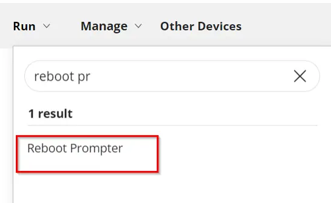  
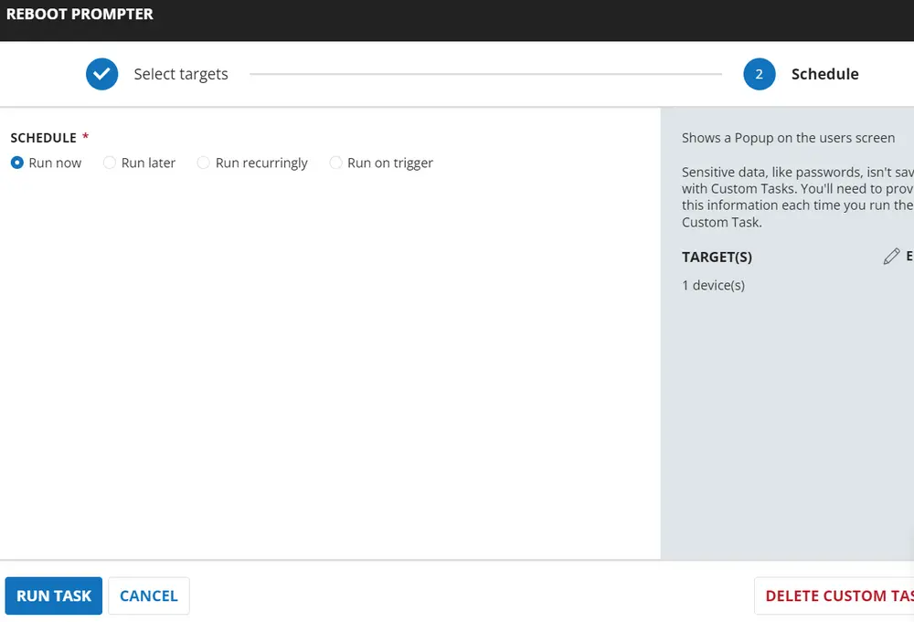  

## Implementation

### Create Task

To implement this script, please create a new "PowerShell" style script in the system.

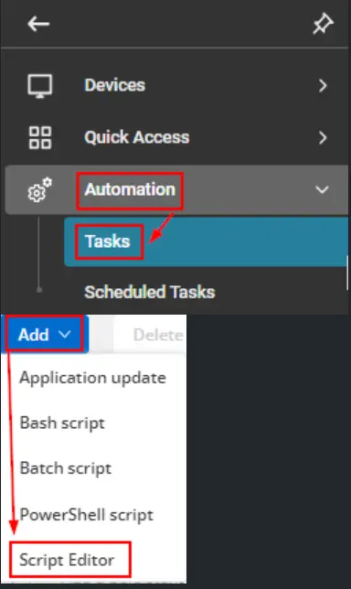  

- **Name:** Reboot Prompter  
- **Description:** Shows a Popup on the user's screen  
- **OS Supported:** Windows  
- **Category:** Custom  

  

### Script

Start by making three separate rows. You can do this by clicking the "Add Row" button at the bottom of the script page.

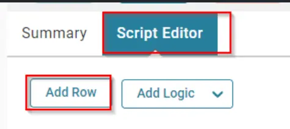  

### Row 1: Function: Script Log

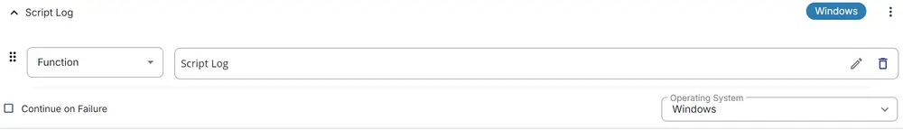  

In the script log message, simply type `Creating the working directory for the prompter script`  

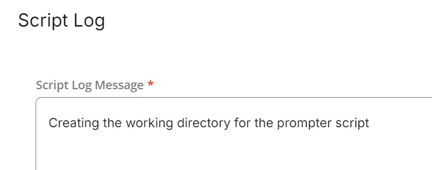  

### Row 2: Function: PowerShell script

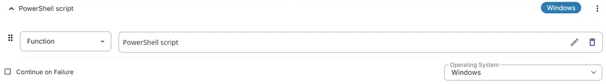  
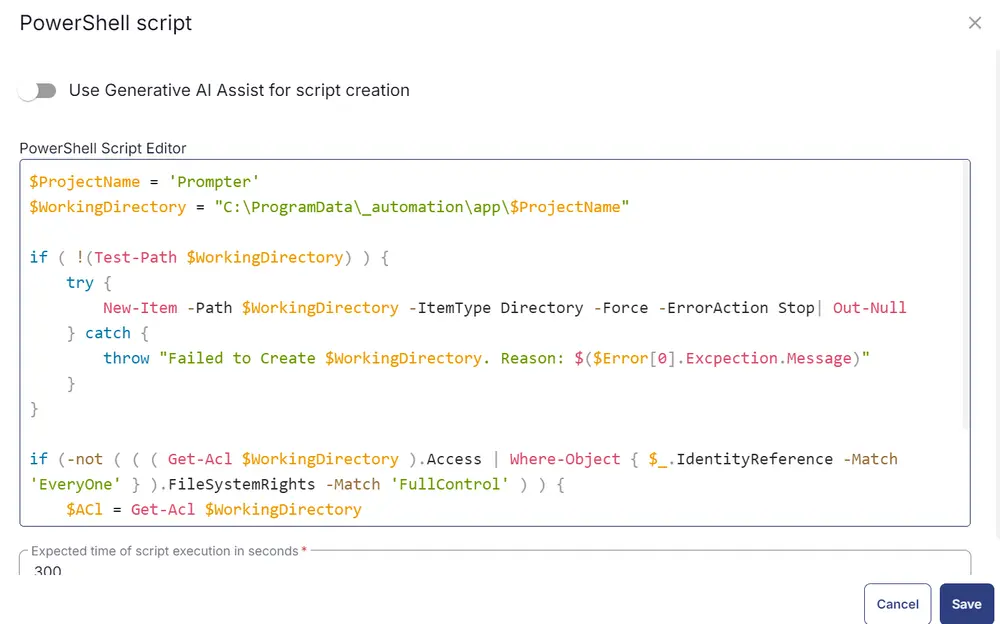  

Paste in the following PowerShell script and set the expected time of script execution to `300` seconds.

```powershell
$ProjectName = 'Prompter'
$WorkingDirectory = "C:\ProgramData\_automation\app\$ProjectName"
 
if ( !(Test-Path $WorkingDirectory) ) {
    try {
        New-Item -Path $WorkingDirectory -ItemType Directory -Force -ErrorAction Stop| Out-Null
    } catch {
        throw "Failed to Create $WorkingDirectory. Reason: $($Error[0].Excpection.Message)"
    }
}
 
if (-not ( ( ( Get-Acl $WorkingDirectory ).Access | Where-Object { $_.IdentityReference -Match 'EveryOne' } ).FileSystemRights -Match 'FullControl' ) ) {
    $ACl = Get-Acl $WorkingDirectory
    $AccessRule = New-Object System.Security.AccessControl.FileSystemAccessRule('Everyone', 'FullControl', 'ContainerInherit, ObjectInherit', 'none', 'Allow')
    $Acl.AddAccessRule($AccessRule)
    Set-Acl  $WorkingDirectory $Acl
}
```

### Row 3: Function: Script Log

  

In the script log message, simply type `Installing the supported .NET version`  

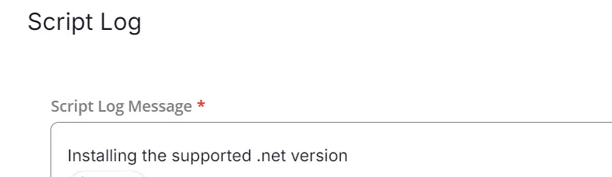  

### Row 4: Function: PowerShell script

  

Paste in the following PowerShell script and set the expected time of script execution to `900` seconds.

```powershell
<#
.SYNOPSIS
    Installs the latest available .NET Desktop Runtime 8 version if it is not already installed.

.DESCRIPTION
    Checks the local endpoint for installed Microsoft Windows Desktop Runtime versions by calling
    Get-InstalledDotNetDesktopRuntime. If major version 8 is already installed, the script exits
    without changes.

    If not installed, the script:
    - Creates a working directory under ProgramData.
    - Ensures required ACL permissions on that directory.
    - Enforces TLS 1.2/1.3 for outbound web requests.
    - Detects OS architecture and maps it to the appropriate RID.
    - Retrieves the latest .NET 8 Windows Desktop Runtime installer URL from Microsoft's
      official release metadata feed.
    - Downloads and silently installs the runtime.
    - Verifies installation and cleans up the installer binary.

    This script is intended for automated execution in RMM/automation workflows.

.EXAMPLE
    .\Install-dotNet8DesktopRuntime.ps1

    Runs the full detection-and-install workflow. If .NET Desktop Runtime 8 is already installed,
    the script returns a no-action message.

.OUTPUTS
    System.String

    Returns:
    - '.NET Desktop Runtime 8 is already installed. No action is required.' when no install is needed.

    Writes informational progress messages during install path execution and throws terminating
    errors when download, install, or verification fails.

.NOTES
    - Requires Windows with PowerShell 5.1+.
    - Requires administrative privileges for install and ProgramData operations.
    - Uses BITS for download and Start-Process for silent installer execution.
    - Release metadata source: https://builds.dotnet.microsoft.com/dotnet/release-metadata/8.0/releases.json
#>

#region globals
$ProgressPreference = 'SilentlyContinue'
$WarningPreference = 'SilentlyContinue'
$InformationPreference = 'Continue'
#endRegion

#region variables
$appName = 'dotNet8DesktopRuntime'
$workingDirectory = '{0}\_Automation\Script\{1}' -f $env:ProgramData, $appName
$appPath = '{0}\{1}.exe' -f $workingDirectory, $appName
$url = 'https://builds.dotnet.microsoft.com/dotnet/release-metadata/8.0/releases.json'
$installerArguments = @(
    '/install',
    '/quiet',
    '/norestart'
)
#endRegion

#region function
function Get-InstalledDotNetDesktopRuntime {
    <#
    .SYNOPSIS
        Gets installed .NET Windows Desktop Runtime versions from the local endpoint.

    .DESCRIPTION
        Resolves the path to `dotnet.exe` and executes `dotnet --list-runtimes`, then parses
        the output and returns only Windows Desktop Runtime entries (Microsoft.WindowsDesktop.App).

        The function returns one object per detected runtime version with friendly name,
        major version, full version, and installed path.

    .PARAMETER None
        This function does not accept parameters.

    .OUTPUTS
        System.Object[]

        Each object contains:
        - Name          : Friendly display name (for example, Microsoft Windows Desktop Runtime - 8.0.25)
        - MajorVersion  : Major version number as Int32
        - Version       : Full semantic version string
        - InstalledPath : Runtime install path reported by dotnet

    .EXAMPLE
        $installedRuntimes = Get-InstalledDotNetDesktopRuntime

        Returns all installed Windows Desktop Runtime versions.

    .EXAMPLE
        Get-InstalledDotNetDesktopRuntime | Where-Object { $_.MajorVersion -eq 8 }

        Returns only .NET 8 Windows Desktop Runtime entries.

    .NOTES
        Used by this script to verify whether .NET Desktop Runtime 8 is already present
        before installation and to confirm installation success afterward.
    #>
    [CmdletBinding()]
    [OutputType([System.Object[]])]
    param()

    #region dotnet path
    $dotnetCommand = Get-Command 'dotnet' -ErrorAction SilentlyContinue
    if ($dotnetCommand) {
        $dotNetExePath = $dotnetCommand.Source
    } else {
        $dotNetExePath = '{0}\dotnet\dotnet.exe' -f $env:ProgramFiles
    }
    #endRegion

    #region variables
    $listRuntimesCommand = '{0}{1}{0} --list-runtimes' -f [char]34, $dotNetExePath
    $installed = @()
    #endRegion

    #region retrieve installed .net info
    $runtimes = cmd.exe /c $listRuntimesCommand
    #endRegion

    #region create installed versions object
    foreach ($line in $runtimes) {
        if ($line -match '^((?<Name>.+?)\s+)?(?<Version>\d+\.\d+\.\d+)\s\[(?<Path>[^\]]+)\]$') {
            $name = $matches['Name']
            $version = $matches['Version']
            $path = $matches['Path']

            if ($path -notmatch 'Microsoft.WindowsDesktop.App') {
                continue
            }
            $name = 'Microsoft Windows Desktop Runtime - {0}' -f $version

            $obj = [PSCustomObject]@{
                Name          = $name
                MajorVersion  = ([Version]$version).Major
                Version       = $version
                InstalledPath = $path
            }
            $installed += $obj
        }
    }
    #endRegion
    return $installed
}
#endRegion

#region check if .net desktop runtime 8 is installed
$installedRuntimes = Get-InstalledDotNetDesktopRuntime
$runtime8Installed = $installedRuntimes | Where-Object { $_.MajorVersion -eq 8 }
if ($runtime8Installed) {
    return '.NET Desktop Runtime 8 is already installed. No action is required.'
} else {
    Write-Information -MessageData '.NET Desktop Runtime 8 is not installed. Proceeding with installation.'
}

#region working directory
if (-not (Test-Path -Path $workingDirectory)) {
    try {
        New-Item -Path $workingDirectory -ItemType Directory -Force -ErrorAction Stop | Out-Null
    } catch {
        throw ('Failed to Create working directory {0}. Reason: {1}' -f $workingDirectory, $Error[0].Exception.Message)
    }
}

$acl = Get-Acl -Path $workingDirectory
$hasFullControl = $acl.Access | Where-Object {
    $_.IdentityReference -match 'Everyone' -and $_.FileSystemRights -match 'FullControl'
}
if (-not $hasFullControl) {
    $accessRule = New-Object -TypeName System.Security.AccessControl.FileSystemAccessRule(
        'Everyone', 'FullControl', 'ContainerInherit, ObjectInherit', 'None', 'Allow'
    )
    $acl.AddAccessRule($accessRule)
    Set-Acl -Path $workingDirectory -AclObject $acl -ErrorAction SilentlyContinue
}
#endRegion

#region set tls policy
$supportedTLSversions = [enum]::GetValues('Net.SecurityProtocolType')
if (($supportedTLSversions -contains 'Tls13') -and ($supportedTLSversions -contains 'Tls12')) {
    [System.Net.ServicePointManager]::SecurityProtocol = [System.Net.ServicePointManager]::SecurityProtocol::Tls13 -bor [System.Net.SecurityProtocolType]::Tls12
} elseif ($supportedTLSversions -contains 'Tls12') {
    [System.Net.ServicePointManager]::SecurityProtocol = [System.Net.SecurityProtocolType]::Tls12
} else {
    Write-Information -MessageData 'TLS 1.2 and/or TLS 1.3 are not supported on this system. This download may fail!'
    if ($PSVersionTable.PSVersion.Major -lt 3) {
        Write-Information -MessageData 'PowerShell 2 / .NET 2.0 doesn''t support TLS 1.2.'
    }
}
#endRegion

#region get os architecture
try {
    $osArchitecture = (Get-CimInstance -ClassName 'Win32_OperatingSystem' -ErrorAction Stop).OSArchitecture
} catch {
    Write-Information -MessageData 'Failed to determine OS architecture. Defaulting to win-x64.'
    $osArchitecture = '64-bit'
}
$rid = if ($osArchitecture -eq '64-bit') {
    'win-x64'
} elseif ($osArchitecture -eq '32-bit') {
    'win-x86'
} else {
    'win-arm64'
}
#endRegion

#region fetch latest download url for .net desktop runtime 8
try {
    $downloadUrl = (Invoke-RestMethod -Uri $url -UseBasicParsing -ErrorAction Stop).releases |
        Sort-Object -Property 'release-date' -Descending |
        Select-Object -First 1 |
        Select-Object -ExpandProperty 'windowsdesktop' |
        Select-Object -ExpandProperty 'files' |
        Where-Object { $_.rid -eq $rid -and $_.url -match '\.exe$' } |
        Select-Object -ExpandProperty 'url'
} catch {
    throw ('Failed to retrieve .NET release information from {0}. Reason: {1}' -f $url, $Error[0].Exception.Message)
}
if (-not $downloadUrl) {
    throw ('Failed to find a suitable .NET Desktop Runtime 8 download for RID {0} from {1}' -f $rid, $url)
} else {
    Write-Information -MessageData ('Latest .NET Desktop Runtime 8 installer URL: {0}' -f $downloadUrl)
}
#endRegion

#region download installer
try {
    Write-Information -MessageData ('Downloading .NET Desktop Runtime 8 installer from {0}' -f $downloadUrl)
    Start-BitsTransfer -Source $downloadUrl -Destination $appPath -ErrorAction Stop
} catch {
    throw ('Failed to download .NET Desktop Runtime 8 installer from {0}. Reason: {1}' -f $downloadUrl, $Error[0].Exception.Message)
}
Unblock-File -Path $appPath -ErrorAction SilentlyContinue
#endRegion

#region install .net desktop runtime 8
try {
    $installCommand = '{0} {1}' -f $appPath, ($installerArguments -join ' ')
    Write-Information -MessageData ('Executing installer command: {0}' -f $installCommand)
    Start-Process -FilePath $appPath -ArgumentList $installerArguments -Wait -NoNewWindow
} catch {
    throw ('Failed to execute .NET Desktop Runtime 8 installer. Reason: {0}' -f $Error[0].Exception.Message)
}
#endRegion

#region verify installation
$installedRuntimes = Get-InstalledDotNetDesktopRuntime
$runtime8Installed = $installedRuntimes | Where-Object { $_.MajorVersion -eq 8 }
if ($runtime8Installed) {
    Write-Information -MessageData '.NET Desktop Runtime 8 installation verified successfully.'
} else {
    throw 'Error: .NET Desktop Runtime 8 installation failed or could not be verified.'
}
#endRegion

#region cleanup installer
Remove-Item -Path $appPath -Force -ErrorAction SilentlyContinue
#endRegion
```

### Row 5: Function: Script Log

  

In the script log message, simply type `%Output%`  

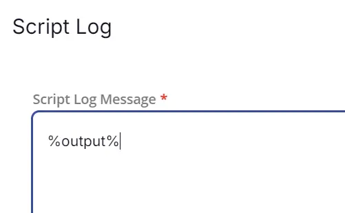  

### Row 6: Logic: If/Then

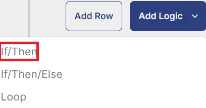  
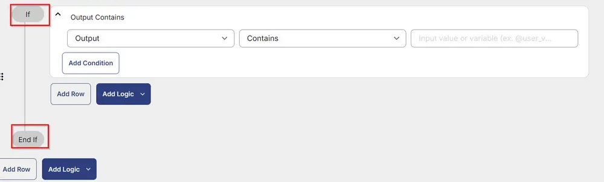  

### Row 6a: Condition: Output Contains

In the `IF` part, enter `Installation failed` in the right box of the `Output Contains` part.  

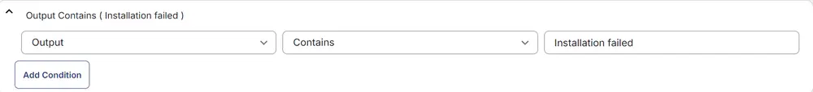  

### Row 6b: Function: Script Exit

Add a new row by clicking on the `Add Row` button.  

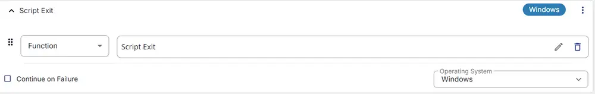  

In the script exit message, simply type `The supported .NET version has failed to install.`  

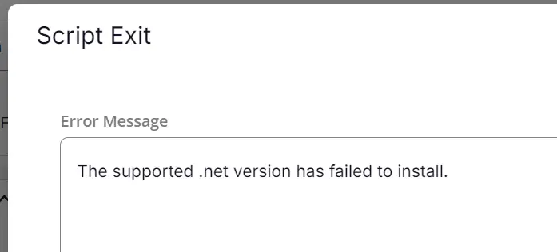  

### Row 7: Function: PowerShell Script

  
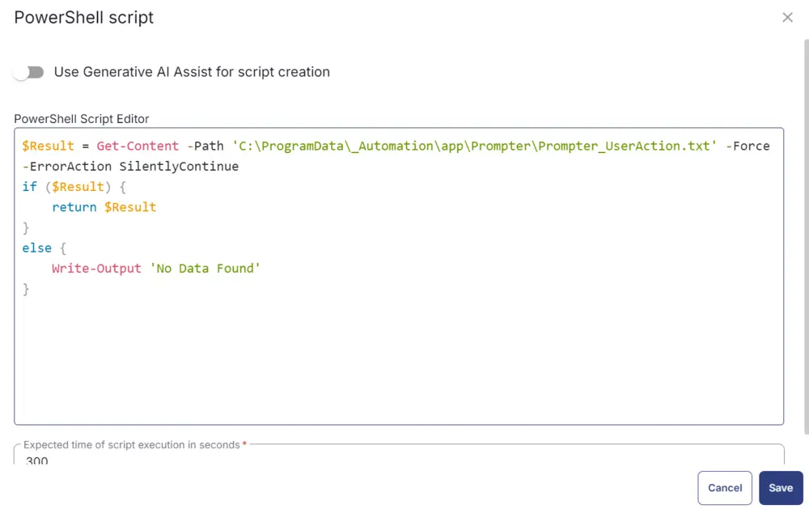  

Paste in the following PowerShell script and set the expected time of script execution to `300` seconds.

```powershell
$Result = Get-Content -Path 'C:\ProgramData\_Automation\app\Prompter\Prompter_UserAction.txt' -Force -ErrorAction SilentlyContinue
if ($Result) {
    return $Result
}
else {
    Write-Output 'No Data Found'
}
```

### Row 8: Function: Set Custom Field

Select Function `Set Custom Field`. When you select `set custom field`, it will open up a new window.

In this window, search for the `Prompter_UserAction` field.  

- **Custom Field:** `Prompter_UserAction`  
- **Value:** `%output%`  

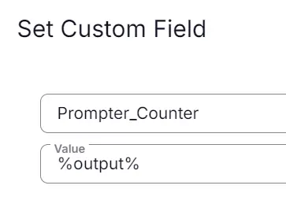  

### Row 9: Function: PowerShell Script

  
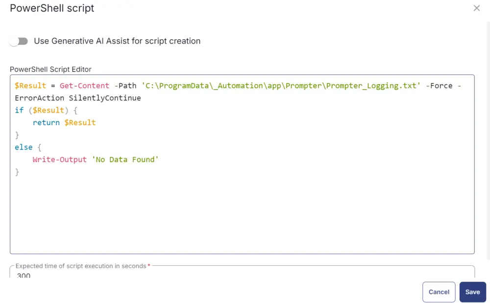  

Paste in the following PowerShell script and set the expected time of script execution to `300` seconds.

```powershell
$Result = Get-Content -Path 'C:\ProgramData\_Automation\app\Prompter\Prompter_Logging.txt' -Force -ErrorAction SilentlyContinue
if ($Result) {
    return $Result
}
else {
    Write-Output 'No Data Found'
}
```

Select Function `Set Custom Field`. When you select `set custom field`, it will open up a new window.

In this window, search for the `Prompter_Logging` field.  

- **Custom Field:** `Prompter_Logging`  
- **Value:** `%output%`  

  

### Row 10: Function: PowerShell Script

  
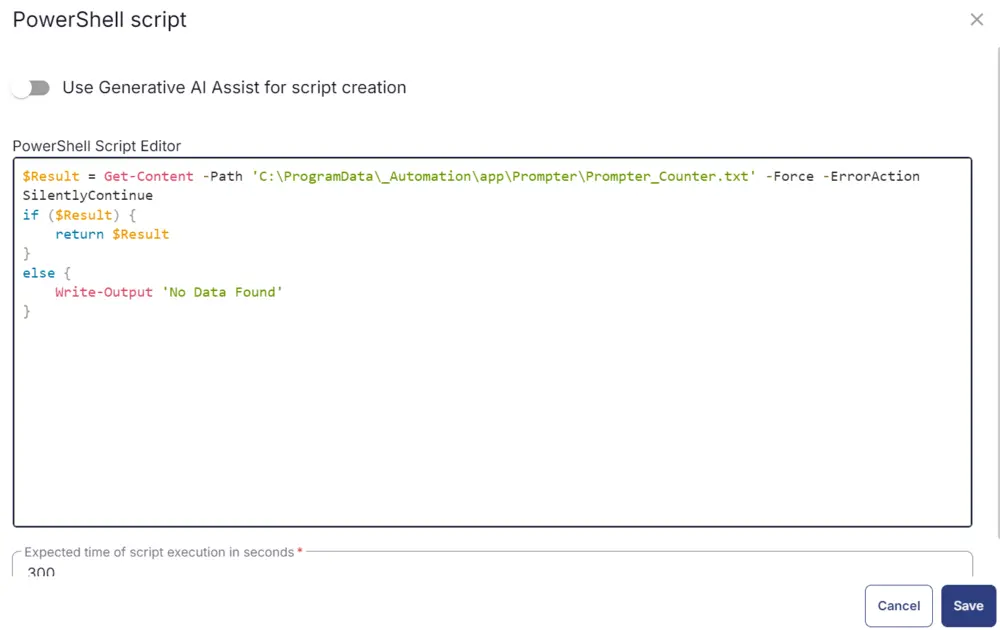  

Paste in the following PowerShell script and set the expected time of script execution to `300` seconds.

```powershell
$Result = Get-Content -Path 'C:\ProgramData\_Automation\app\Prompter\Prompter_Counter.txt' -Force -ErrorAction SilentlyContinue
if ($Result) {
    return $Result
}
else {
    Write-Output 'No Data Found'
}
```

Select Function `Set Custom Field`. When you select `set custom field`, it will open up a new window.

In this window, search for the `Prompter_Counter` field.  

- **Custom Field:** `Prompter_Counter`  
- **Value:** `%output%`  

  

### Row 11: Logic: If/Then

  
  

### Row 11a: Condition: Custom Field

In the `IF` part, enter `0` in the right box of the "Custom Field" part where the custom field is `Prompter_Counter`.  

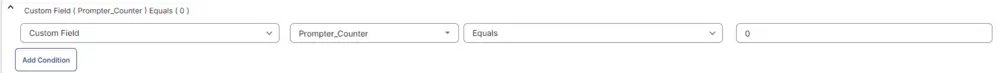  

### Row 11b: Function: Set Custom Field

Select Function `Set Custom Field`. When you select `set custom field`, it will open up a new window.

In this window, search for the `Prompter_RebootPending` field.  

- **Custom Field:** `Prompter_RebootPending`  
- **Value:** `False`  

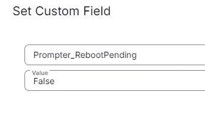  

### Row 11c: Function: Set Custom Field

Select Function `Set Custom Field`. When you select `set custom field`, it will open up a new window.

In this window, search for the `Auto_RebootPendingCheck` field.  

- **Custom Field:** `Auto_RebootPendingCheck`  
- **Value:** `False`  

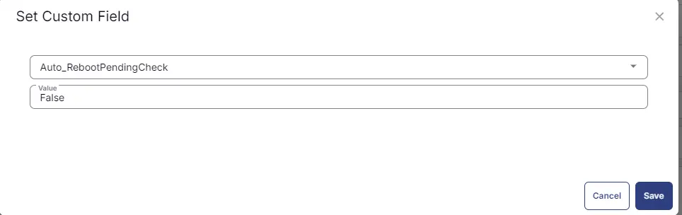  

### Row 11d: Function: Set Custom Field

Select Function `Set Custom Field`. When you select `set custom field`, it will open up a new window.

In this window, search for the `Prompter_Logging` field.  

- **Custom Field:** `Prompter_Logging`  
- **Value:** ` `  

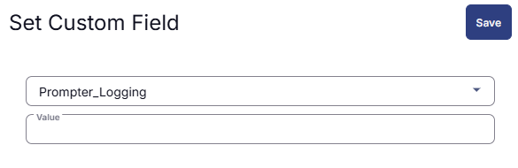

### Row 11e: Function: Set Custom Field

Select Function `Set Custom Field`. When you select `set custom field`, it will open up a new window.

In this window, search for the `Prompter_UserAction` field.  

- **Custom Field:** `Prompter_UserAction`  
- **Value:** ` `  

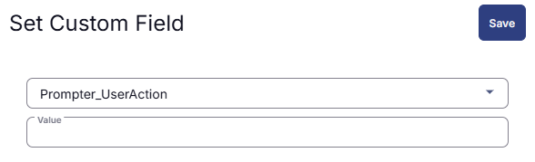

### Row 11f: Function: PowerShell Script

  
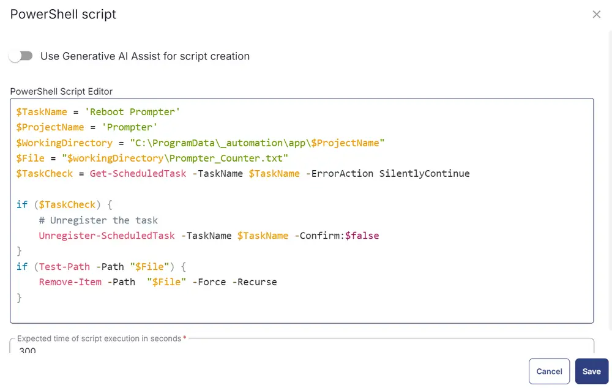  

Paste in the following PowerShell script and set the expected time of script execution to `300` seconds.

```powershell
$TaskName = 'Reboot Prompter'
$ProjectName = 'Prompter'
$WorkingDirectory = "C:\ProgramData\_automation\app\$ProjectName"
$File = "$workingDirectory\Prompter_Counter.txt"
$TaskCheck = Get-ScheduledTask -TaskName $TaskName -ErrorAction SilentlyContinue
if ($TaskCheck) {
    # Unregister the task
    Unregister-ScheduledTask -TaskName $TaskName -Confirm:$false
}
if (Test-Path -Path "$File") {
    Remove-Item -Path  "$File" -Force -Recurse
}
```

### Row 11g: Function: Script Log

  

In the script log message, paste `Removed the Task, Counter checker and the machine from the Dynamic group because the agent was restarted during the last attempt. Refer to the custom fields Prompter_UserAction and Prompter_Logging on the endpoint for more details.`  

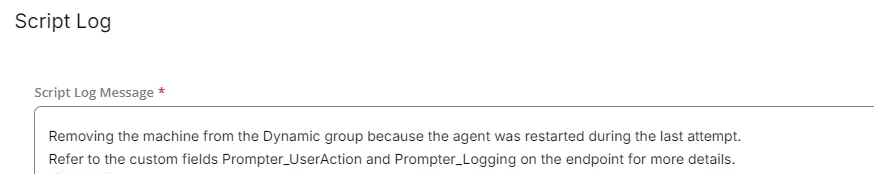  

### Row 11h: Function: Script Exit

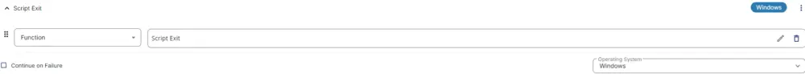  
  

Leave it blank so that the script exits normally.

### Row 12: Function: Set Pre Defined Variable

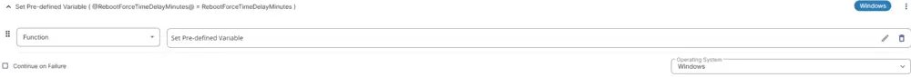  

Click on `Custom Field` > Choose `RebootForceTimeDelayMinutes`. Then set the variable name as `RebootForceTimeDelayMinutes`.

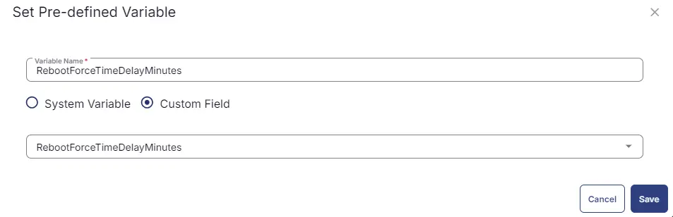  

### Row 13: Function: Set Pre-Defined Variable

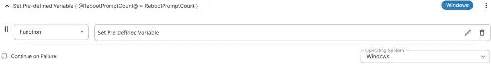  

Click on `Custom Field` > Choose `RebootPromptCount`. Then set the variable name as `RebootPromptCount`.

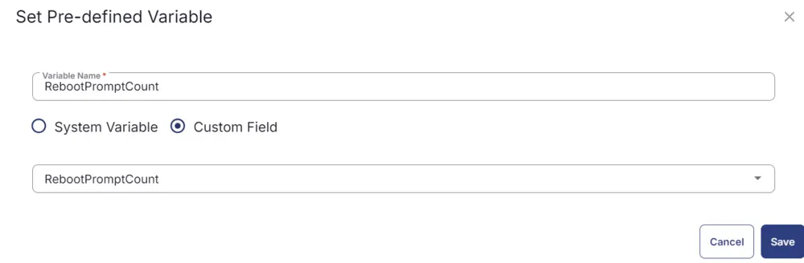  

### Row 14: Function: Set Pre-Defined Variable

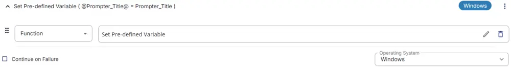  

Click on `Custom Field` > Choose `Prompter_Title`. Then set the variable name as `Prompter_Title`.

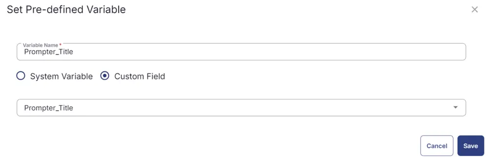  

### Row 15: Function: Set Pre-Defined Variable

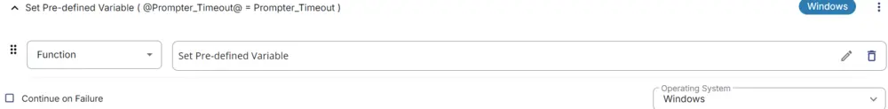  

Click on `Custom Field` > Choose `Prompter_Timeout`. Then set the variable name as `Prompter_Timeout`.

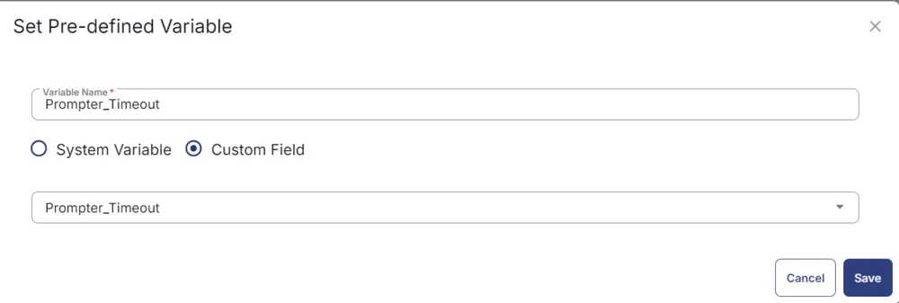  

### Row 16: Function: Set Pre-Defined Variable

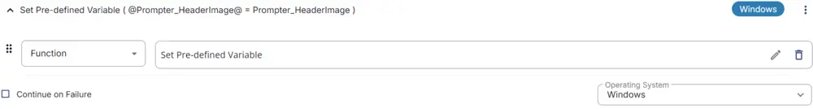  

Click on `Custom Field` > Choose `Prompter_HeaderImage`. Then set the variable name as `Prompter_HeaderImage`.

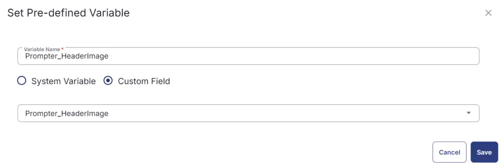  

### Row 17: Function: Set Pre-Defined Variable

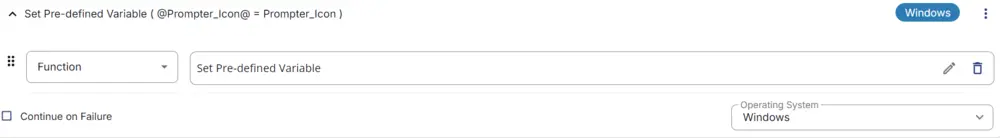  

Click on `Custom Field` > Choose `Prompter_Icon`. Then set the variable name as `Prompter_Icon`.

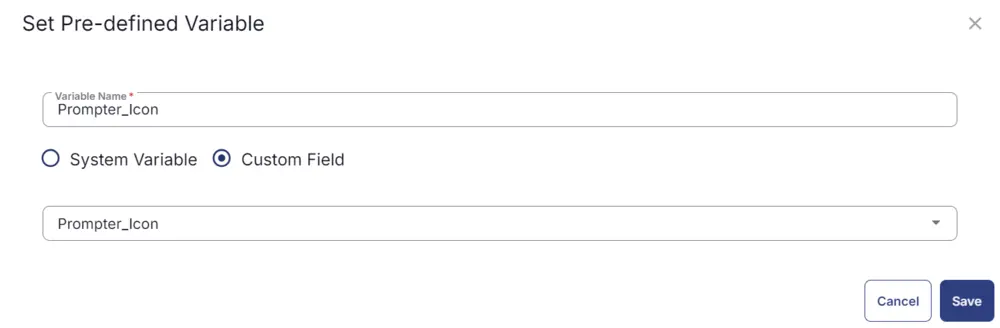  

### Row 18: Function: Script Log

  

In the script log message, simply type: `Creating the Prompter.ps1 file in the working directory for the Prompter exe execution using Task Scheduler and checking the status of Prompter file creation in the working directory`  

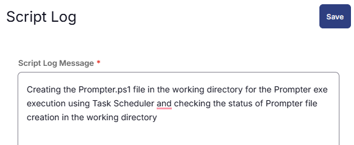

### Row 19: Function: PowerShell Script

  
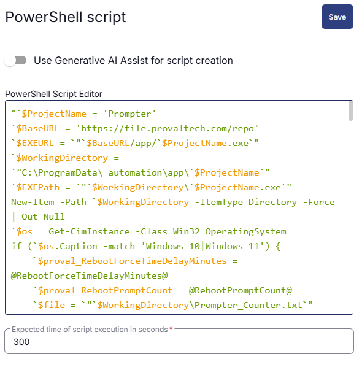  

Paste in the following PowerShell script and set the expected time of script execution to `300` seconds.

```powershell
"`$ProjectName = 'Prompter'
`$BaseURL = 'https://file.provaltech.com/repo'
`$EXEURL = `"`$BaseURL/app/`$ProjectName.exe`"
`$WorkingDirectory = `"C:\ProgramData\_automation\app\`$ProjectName`"
`$EXEPath = `"`$WorkingDirectory\`$ProjectName.exe`"
New-Item -Path `$WorkingDirectory -ItemType Directory -Force | Out-Null
`$os = Get-CimInstance -Class Win32_OperatingSystem
if (`$os.Caption -match 'Windows 10|Windows 11') {
    `$proval_RebootForceTimeDelayMinutes = @RebootForceTimeDelayMinutes@
    `$proval_RebootPromptCount = @RebootPromptCount@
    `$file = `"`$WorkingDirectory\Prompter_Counter.txt`"
    `$TimesPrompted = Get-Content -Path `"`$file`" -ErrorAction SilentlyContinue
    if ([string]::IsNullOrEmpty(`$TimesPrompted)) { `$TimesPrompted = 0 } else { `$TimesPrompted = [int]`$TimesPrompted }
    if (`$TimesPrompted -eq 0) {
        `$files = @(
            `"C:\ProgramData\_Automation\app\Prompter\Prompter_Counter.txt`",
            `"C:\ProgramData\_Automation\app\Prompter\Prompter_Logging.txt`",
            `"C:\ProgramData\_Automation\app\Prompter\Prompter_UserAction.txt`"
        )

        foreach (`$file in `$files) {
            if (Test-Path `$file) {
                Remove-Item `$file -ErrorAction SilentlyContinue -Force
            }
        }
    }
 `$PromptMessage = `"Would you like to restart now? If you choose not to reboot now, you have already been prompted `$TimesPrompted time(s). The number of times you can delay the reboot is `$proval_RebootPromptCount before being forced to reboot.`"
    `$loggedUsers = Get-CimInstance -Class Win32_ComputerSystem | Select-Object -ExpandProperty UserName
    if (`$null -eq `$loggedUsers) {
        Write-Output `"No user logged in`"
        Exit
    }
    Invoke-WebRequest -Uri `$EXEURL -UseBasicParsing -OutFile `$EXEPath
    if (!(Test-Path -Path `$EXEPath)) {
        Write-Output `"No pre-downloaded app exists and the script `$EXEURL failed to download. Exiting.`"
        return 1
    }
    if (`$LASTEXITCODE -eq 1) {
        Write-Output `"`$ExePath is missing`"
        Exit
    }
    `$HeaderImage = `"@Prompter_HeaderImage@`"
    `$Icon = `"@Prompter_Icon@`"
    `$Timeout = @Prompter_Timeout@
    `$Title = `"@Prompter_Title@`"
    `$Theme = 'dark'
    `$ButtonType = 'Yes No'
    `$Param = `"-m `"`"`$PromptMessage`"`" -i `"`"`$Icon`"`" -h `"`"`$HeaderImage`"`" -t `"`"`$Title`"`" -b `$ButtonType -e `$Theme -o `$Timeout`"
    `$Result = cmd.exe /c `"`$EXEPath `$Param`"
    `$CurrentDate = Get-Date -Format `"yyyy-MM-dd hh:mm:ss`"
    `$Output = `"User Action: `" + `$Result + `"`r`n`" + `"Date Time: `" + `$CurrentDate
    `$Output | Out-File `"C:\ProgramData\_Automation\app\Prompter\Prompter_UserAction.txt`" -Append

    if (`$Result -contains 'Yes') {
        Write-Output `" The end user has authorized Restarting computer`" | Out-File 'C:\ProgramData\_Automation\app\Prompter\Prompter_Logging.txt' -Append
        `$PromptForReboot = 'Thank you for approving. Your computer will restart in 5 minutes, please save your work.'
        `$ButtonType = 'OK'
        `$Param = `"-m `"`"`$PromptForReboot`"`" -i `"`"`$Icon`"`" -h `"`"`$HeaderImage`"`" -t `"`"`$Title`"`" -b `$ButtonType -e `$Theme -o `$Timeout`"
        `$Result = cmd.exe /c `"`$EXEPath `$Param`"
        `$TimesPrompted = 0
        `$TimesPrompted | Out-File 'C:\ProgramData\_Automation\app\Prompter\Prompter_Counter.txt'
        Start-Sleep -Seconds 300
        Restart-Computer -Force
    }
    if (`$Result -notcontains 'Yes') {
        if (`$TimesPrompted -eq `$proval_RebootPromptCount) {
            Write-Output `" The threshold met. Sending force reboot prompt`" | Out-File 'C:\ProgramData\_Automation\app\Prompter\Prompter_Logging.txt' -Append
            `$Message = `"Your system has reached its reboot prompt deadline and will now reboot in `$proval_RebootForceTimeDelayMinutes Minutes. A reboot is necessary to keep things running smoothly and to fix potential vulnerabilities. Please save all your work to ensure nothing is lost during the reboot.  Thank you!`"
            `$ButtonType = 'OK'
            `$Param = `"-m `"`"`$Message`"`" -i `"`"`$Icon`"`" -h `"`"`$HeaderImage`"`" -t `"`"`$Title`"`" -b `$ButtonType -e `$Theme -o `$Timeout`"
            `$Result = cmd.exe /c `"`$EXEPath `$Param`"
            `$TimesPrompted = 0
            `$TimesPrompted | Out-File 'C:\ProgramData\_Automation\app\Prompter\Prompter_Counter.txt'
            Start-Sleep -Seconds (`$proval_RebootForceTimeDelayMinutes * 60)
            Restart-Computer -Force
        }
        else {
            `$TimesPrompted++
            Write-Output `" Denial count: `$TimesPrompted. Threshold: `$proval_RebootPromptCount`" | Out-File 'C:\ProgramData\_Automation\app\Prompter\Prompter_Logging.txt' -Append
            `$TimesPrompted | Out-File 'C:\ProgramData\_Automation\app\Prompter\Prompter_Counter.txt'
        }
    }
}
else {
    Write-Output `" The operating system is not Windows 10 or 11.`" | Out-File 'C:\ProgramData\_Automation\app\Prompter\Prompter_Logging.txt' -Append
}" | Out-File -FilePath "C:\ProgramData\_Automation\app\Prompter\Prompter.ps1" -force
$ProjectName = 'Prompter'
$file = "C:\ProgramData\_automation\app\$ProjectName\Prompter.ps1"
if ((Test-Path -Path $file) -eq 'True') {
    Write-Output "$file file created successfully"
}
else {
    Write-Output "$file file failed to create"
}
```

### Row 20: Function: Script Log

  

In the script log message, simply type `%output%`  

  

### Row 21: Logic: If/Then

  
  

### Row 21a: Condition: Output Contains

In the `IF` part, enter `file failed to create` in the right box of the "Output Contains" part.

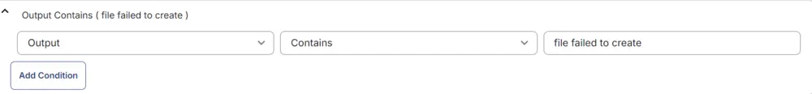  

### Row 21b: Function: Script Exit

Add a new row by clicking on the `Add row` button.

  

In the script exit message, simply type `%output%`  

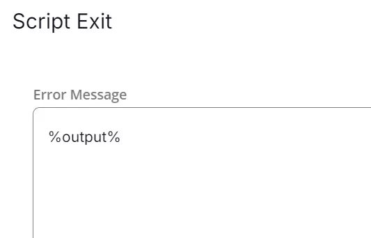  

### Row 22: Function: PowerShell Script

  
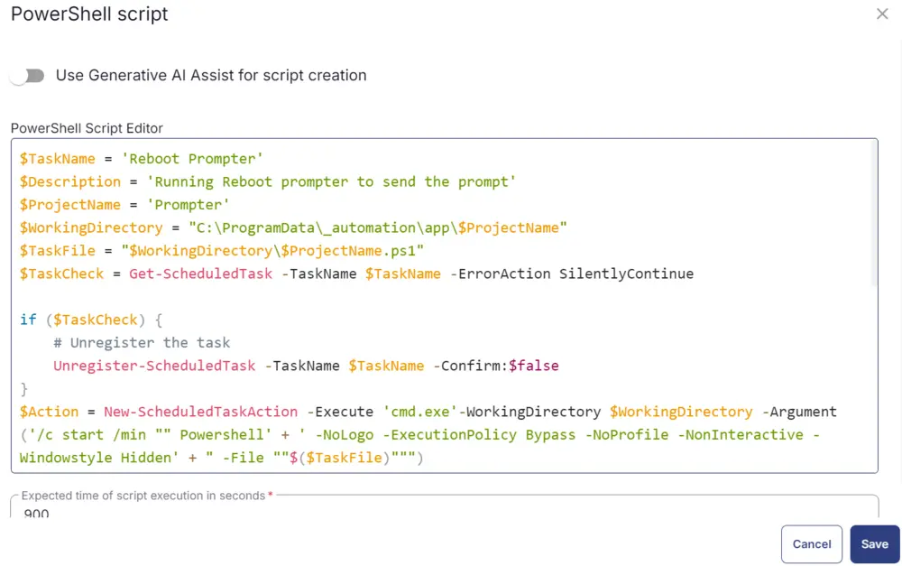  

Paste in the following PowerShell script and set the expected time of script execution to `900` seconds.

```powershell
TaskName = 'Reboot Prompter'
$Description = 'Running Reboot prompter to send the prompt'
$ProjectName = 'Prompter'
$WorkingDirectory = "C:\ProgramData\_automation\app\$ProjectName"
$TaskFile = "$WorkingDirectory\$ProjectName.ps1" 
$TaskCheck = Get-ScheduledTask -TaskName $TaskName -ErrorAction SilentlyContinue
if ($TaskCheck) {
    # Unregister the task
    Unregister-ScheduledTask -TaskName $TaskName -Confirm:$false
}
$Action = New-ScheduledTaskAction -Execute 'cmd.exe'-WorkingDirectory $WorkingDirectory -Argument  ('/c start /min "" Powershell' + ' -NoLogo -ExecutionPolicy Bypass -NoProfile -NonInteractive -Windowstyle Hidden' + " -File ""$($TaskFile)""")
$TriggerTime = (Get-Date).AddMinutes(1)
$Trigger = New-ScheduledTaskTrigger -Once -At $TriggerTime
$Settings = New-ScheduledTaskSettingsSet
$Principal = New-ScheduledTaskPrincipal -GroupId ( ( New-Object System.Security.Principal.SecurityIdentifier('S-1-5-32-545') ).Translate( [System.Security.Principal.NTAccount] ).Value )
try {
    Register-ScheduledTask -Action $Action -Trigger $Trigger -TaskName $TaskName -Description $Description -Settings $Settings -Principal $Principal
    Write-Output "Task created successfully"
}
catch {
    Write-Output "Failed to create task"
}
```

### Row 23: Function: Script Log

In the script log message, simply type `%output%`  

  

### Row 24: Logic: If/Then/Else

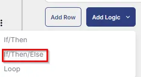  
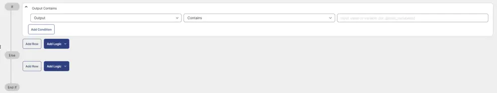  

### Row 24a: Condition: Output Contains

In the `IF` part, enter `Task created successfully` in the right box of the "Output Contains" part.  

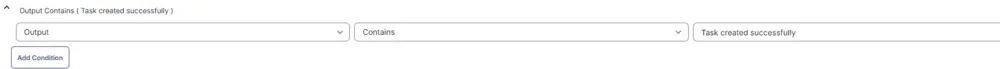  

### Row 24b: Function: Script Log

- Add a new row by clicking on the `Add row` button.
- In the script log message, simply type `%output%`.  

### Row 24c: Function: Script Exit

- Add a new row in the else section.  
- In the script exit message, simply type `%output%`.  

### Row 25: Complete

Once all items are added, please save the task. The final task should look like the below screenshot.

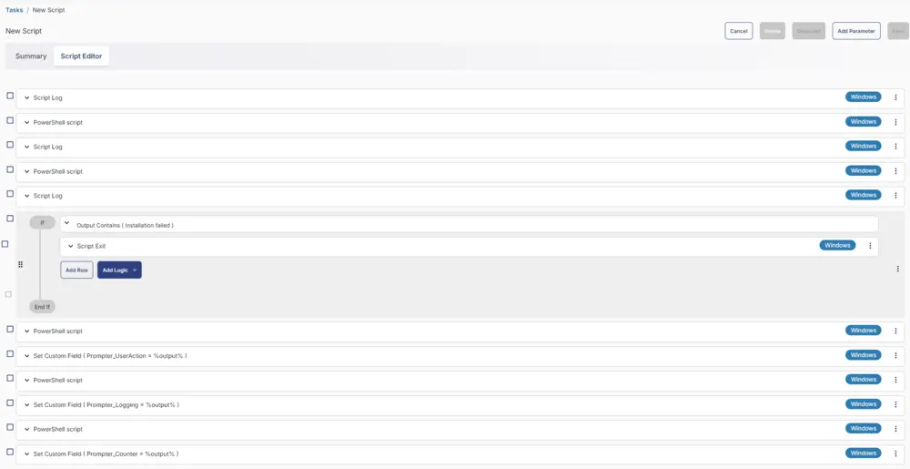  
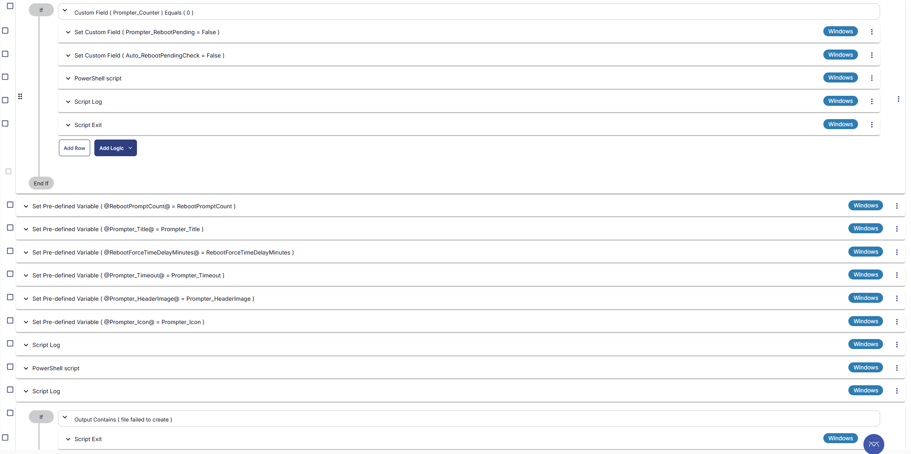  
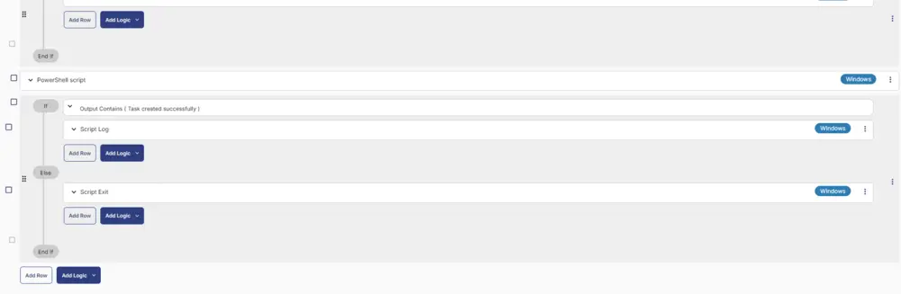  

## Deployment

It is suggested to schedule the Task to the groups [CW RMM - Dynamic Group - Reboot Prompter Deployment - Manual](/docs/284c0ff4-381a-45c0-8282-aa6ac4c3da20) and [CW RMM - Dynamic Group - Reboot Prompter Deployment - Auto](/docs/93faad94-8731-4fd5-afd0-0ae2a669fc05) at certain intervals as per client requirements to send prompts at regular intervals.

1. Go to `Automation` > `Tasks`.
2. Search for `Reboot Prompter` Task.
3. Select the concerned task.
4. Click on the `Schedule` button to schedule the task/script.  
    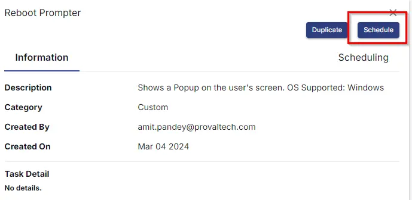  
5. This screen will appear.  
    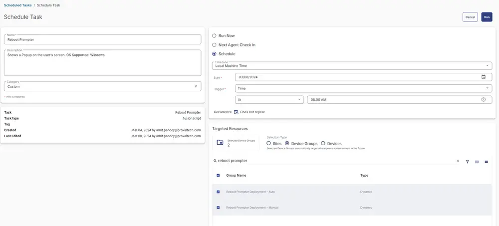  
6. Select the relevant time to run the script and click the `Do not repeat` button.  
    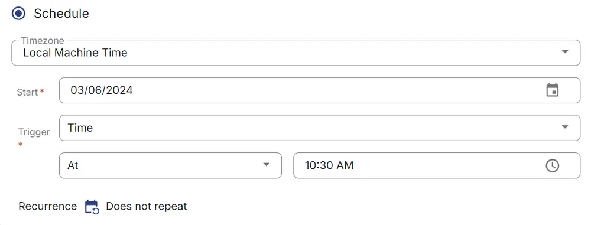  
7. A pop-up box will appear.
8. Suppose the client asked to set the reboot prompt for every 2 hours.
9. Change the number of hours to `2` and click `OK`.  
    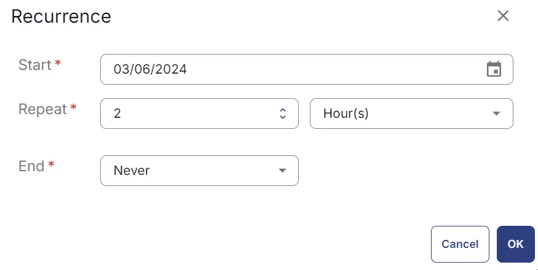  
    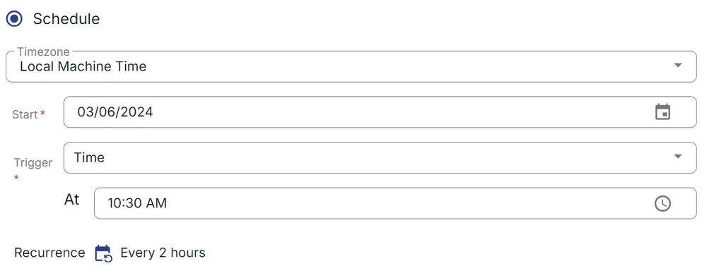  
10. Search for `Reboot Prompter` in the `Resources` and select it. You can search and select any relevant group you would like to schedule the task against. If the site doesn't have a device group that includes all Windows agents, then create one and schedule the task on it.  
    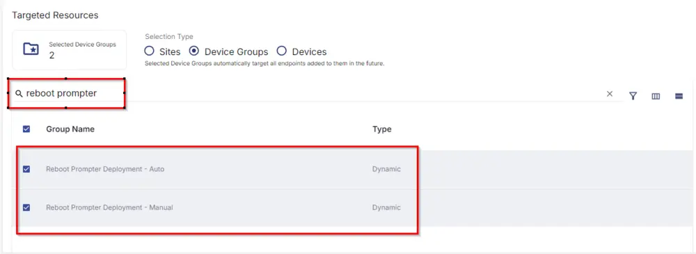  
11. Now click the `Run` button to initiate the task.  
    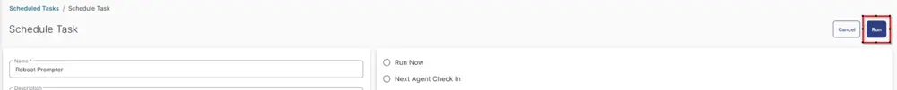  
12. The task will start appearing in the Scheduled Tasks.

## Output

- Script Log  
- Custom Field

## Changelog

### 2026-03-23

- Updated .Net8 Desktop Runtime installation logic to install the latest available version.

### 2025-08-22

- Fixed the deployment section in the document
Fixed a bug where the file write was not working. So, optimized the PowerShell.
Updated the script to reset all the prompter custom fields after a successful reboot.

### 2025-04-10

- Initial version of the document
