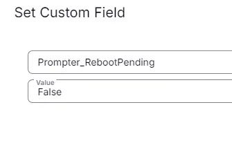
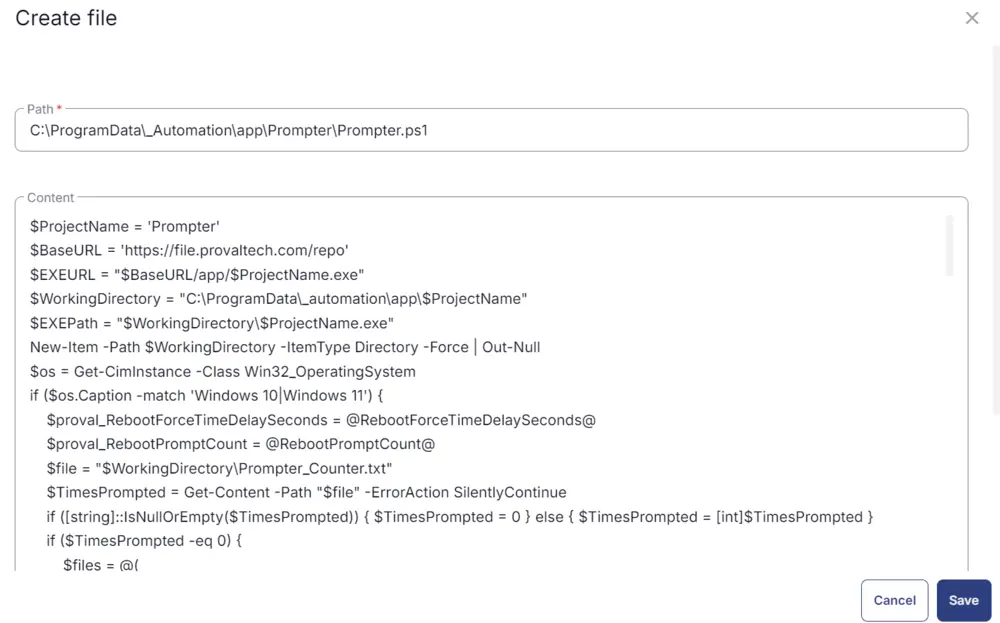
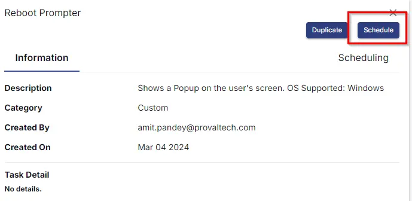

## Summary

The script prompts the user to reboot with a simple yes or no prompt. It also forces a reboot after the `PromptRebootCount` is crossed.

## Dependencies

- [Custom Fields - Reboot Prompter](/docs/7876f32c-a5ec-4b58-9f7e-b60b710e19d5)  
- [Dynamic Group - Reboot Pending Deployment](/docs/284c0ff4-381a-45c0-8282-aa6ac4c3da20)  

## Sample Run

  
  

## Implementation

### Create Task

To implement this script, please create a new "PowerShell" style script in the system.

  

- **Name:** Reboot Prompter  
- **Description:** Shows a Popup on the user's screen  
- **OS Supported:** Windows  
- **Category:** Custom  

  

### Script

Start by making three separate rows. You can do this by clicking the "Add Row" button at the bottom of the script page.

  

### Row 1: Function: Script Log

  

In the script log message, simply type `Creating the working directory for the prompter script`  

  

### Row 2: Function: PowerShell script

  
  

Paste in the following PowerShell script and set the expected time of script execution to `300` seconds.

```powershell
$ProjectName = 'Prompter'
$WorkingDirectory = "C:\ProgramData\_automation\app\$ProjectName"
 
if ( !(Test-Path $WorkingDirectory) ) {
    try {
        New-Item -Path $WorkingDirectory -ItemType Directory -Force -ErrorAction Stop| Out-Null
    } catch {
        throw "Failed to Create $WorkingDirectory. Reason: $($Error[0].Excpection.Message)"
    }
}
 
if (-not ( ( ( Get-Acl $WorkingDirectory ).Access | Where-Object { $_.IdentityReference -Match 'EveryOne' } ).FileSystemRights -Match 'FullControl' ) ) {
    $ACl = Get-Acl $WorkingDirectory
    $AccessRule = New-Object System.Security.AccessControl.FileSystemAccessRule('Everyone', 'FullControl', 'ContainerInherit, ObjectInherit', 'none', 'Allow')
    $Acl.AddAccessRule($AccessRule)
    Set-Acl  $WorkingDirectory $Acl
}
```

### Row 3: Function: Script Log

  

In the script log message, simply type `Installing the supported .NET version`  

  

### Row 4: Function: PowerShell script

  
  

Paste in the following PowerShell script and set the expected time of script execution to `900` seconds.

```powershell
$ProgressPreference = 'SilentlyContinue'
$appName = 'dotNet8DesktopRuntime'
$workingDirectory = 'C:\ProgramData\_automation\app\Prompter'
$dotnet8path = "$workingDirectory\$appName.exe"

Function Install-Check {
    try {
        $dotNetVersions = (. "$env:ProgramFiles\dotnet\dotnet.exe" --list-runtimes) -join ' '
    } catch {}
    if (!($dotNetVersions -match 'WindowsDesktop\.App 8')) {
        return $true
    } else {
        return $false
    }
}

$dotnet8url = if ([Environment]::Is64BitOperatingSystem) {
    'https://download.visualstudio.microsoft.com/download/pr/27bcdd70-ce64-4049-ba24-2b14f9267729/d4a435e55182ce5424a7204c2cf2b3ea/windowsdesktop-runtime-8.0.11-win-x64.exe'
} else {
    'https://download.visualstudio.microsoft.com/download/pr/6e1f5faf-ee7d-4db0-9111-9e270a458342/4cdcd1af2d6914134308630f048fbdfc/windowsdesktop-runtime-8.0.11-win-x86.exe'
}

if (!(Test-Path -Path $workingDirectory)) {
    New-Item -ItemType Directory -Path $workingDirectory -Force -ErrorAction SilentlyContinue | Out-Null
}

if (Install-Check) {
    [Net.ServicePointManager]::SecurityProtocol = [Enum]::ToObject([Net.SecurityProtocolType], 3072)
    Start-BitsTransfer -Source $dotnet8url -Destination $dotnet8path
    cmd.exe /c $dotnet8path /install /quiet /norestart
    Start-Sleep -Seconds 5
    if (Install-Check) {
        return 'Error: .Net Desktop Runtime 8.0 installation failed.'
    } else {
        return 'Success: .Net Desktop Runtime 8.0 installed'
    }
} else {
    return 'Success: .Net Desktop Runtime 8.0 is already installed.'
}
```

### Row 5: Function: Script Log

  

In the script log message, simply type `%Output%`  

  

### Row 6: Logic: If/Then

  
  

### Row 6a: Condition: Output Contains

In the IF part, enter `Installation failed` in the right box of the "Output Contains" part.  

  

### Row 6b: Function: Script Exit

Add a new row by clicking on the Add row button.  

  

In the script exit message, simply type `The supported .NET version has failed to install.`  

  

### Row 7: Function: PowerShell Script

  
  

Paste in the following PowerShell script and set the expected time of script execution to `300` seconds.

```powershell
$Result = Get-Content -Path 'C:\ProgramData\_Automation\app\Prompter\Prompter_UserAction.txt' -Force -ErrorAction SilentlyContinue
if ($Result) {
    return $Result
}
else {
    Write-Output 'No Data Found'
}
```

### Row 8: Function: Set Custom Field

Select Function 'Set Custom Field'. When you select `set custom field`, it will open up a new window.

In this window, search for the `Prompter_UserAction` field.  

**Custom Field:** `Prompter_UserAction`  
**Value:** `%output%`  

  

### Row 9: Function: PowerShell Script

  
  

Paste in the following PowerShell script and set the expected time of script execution to `300` seconds.

```powershell
$Result = Get-Content -Path 'C:\ProgramData\_Automation\app\Prompter\Prompter_Logging.txt' -Force -ErrorAction SilentlyContinue
if ($Result) {
    return $Result
}
else {
    Write-Output 'No Data Found'
}
```

Select Function 'Set Custom Field'. When you select `set custom field`, it will open up a new window.

In this window, search for the `Prompter_Logging` field.  

**Custom Field:** `Prompter_Logging`  
**Value:** `%output%`  

  

### Row 10: Function: PowerShell Script

  
  

Paste in the following PowerShell script and set the expected time of script execution to `300` seconds.

```powershell
$Result = Get-Content -Path 'C:\ProgramData\_Automation\app\Prompter\Prompter_Counter.txt' -Force -ErrorAction SilentlyContinue
if ($Result) {
    return $Result
}
else {
    Write-Output 'No Data Found'
}
```

Select Function 'Set Custom Field'. When you select `set custom field`, it will open up a new window.

In this window, search for the `Prompter_Counter` field.  

**Custom Field:** `Prompter_Counter`  
**Value:** `%output%`  

  

### Row 11: Logic: If/Then

  
  

### Row 11a: Condition: Custom Field

In the IF part, enter `0` in the right box of the "Custom Field" part where the custom field is 'Prompter_Counter'.  

  

### Row 11b: Function: Set Custom Field

Select Function 'Set Custom Field'. When you select `set custom field`, it will open up a new window.

In this window, search for the `Prompter_RebootPending` field.  

**Custom Field:** `Prompter_RebootPending`  
**Value:** `False`  

  

### Row 11c: Function: Set Custom Field

Select Function 'Set Custom Field'. When you select `set custom field`, it will open up a new window.

In this window, search for the `Auto_RebootPendingCheck` field.  

**Custom Field:** `Auto_RebootPendingCheck`  
**Value:** `False`  

  

### Row 11d: Function: PowerShell Script

  
  

Paste in the following PowerShell script and set the expected time of script execution to `300` seconds.

```powershell
$TaskName = 'Reboot Prompter'
$ProjectName = 'Prompter'
$WorkingDirectory = "C:\ProgramData\_automation\app\$ProjectName"
$File = "$workingDirectory\Prompter_Counter.txt"
$TaskCheck = Get-ScheduledTask -TaskName $TaskName -ErrorAction SilentlyContinue
if ($TaskCheck) {
    # Unregister the task
    Unregister-ScheduledTask -TaskName $TaskName -Confirm:$false
}
if (Test-Path -Path "$File") {
    Remove-Item -Path  "$File" -Force -Recurse
}
```

### Row 11e: Function: Script Log

  

In the script log message, paste `Removed the Task, Counter checker and the machine from the Dynamic group because the agent was restarted during the last attempt. Refer to the custom fields Prompter_UserAction and Prompter_Logging on the endpoint for more details.`  

  

### Row 11f: Function: Script Exit

  
  

Leave it blank so that the script exits normally.

### Row 12: Function: Set Pre Defined Variable

  

Click on Custom Field > Choose `RebootForceTimeDelayMinutes`. Then set the variable name as 'RebootForceTimeDelayMinutes'.

  

### Row 13: Function: Set Pre-Defined Variable

  

Click on Custom Field > Choose `RebootPromptCount`. Then set the variable name as 'RebootPromptCount'.

  

### Row 14: Function: Set Pre-Defined Variable

  

Click on Custom Field > Choose `Prompter_Title`. Then set the variable name as 'Prompter_Title'.

  

### Row 15: Function: Set Pre-Defined Variable

  

Click on Custom Field > Choose `Prompter_Timeout`. Then set the variable name as 'Prompter_Timeout'.

  

### Row 16: Function: Set Pre-Defined Variable

  

Click on Custom Field > Choose `Prompter_HeaderImage`. Then set the variable name as 'Prompter_HeaderImage'.

  

### Row 17: Function: Set Pre-Defined Variable

  

Click on Custom Field > Choose `Prompter_Icon`. Then set the variable name as 'Prompter_Icon'.

  

### Row 18: Function: Script Log

  

In the script log message, simply type `Creating the Prompter.ps1 file in the working directory for the Prompter exe execution using Task Scheduler.`  

  

### Row 19: Function: Create File

  

Create a file.  
**Path:** `C:/ProgramData/_Automation/app/Prompter/Prompter.ps1`  

  

```powershell
$ProjectName = 'Prompter'
$BaseURL = 'https://file.provaltech.com/repo'
$EXEURL = "$BaseURL/app/$ProjectName.exe"
$WorkingDirectory = "C:\ProgramData\_automation\app\$ProjectName"
$EXEPath = "$WorkingDirectory\$ProjectName.exe"
New-Item -Path $WorkingDirectory -ItemType Directory -Force | Out-Null
$os = Get-CimInstance -Class Win32_OperatingSystem
if ($os.Caption -match 'Windows 10|Windows 11') {
    $proval_RebootForceTimeDelaySeconds = @RebootForceTimeDelaySeconds@
    $proval_RebootPromptCount = @RebootPromptCount@
    $file = "$WorkingDirectory\Prompter_Counter.txt"
    $TimesPrompted = Get-Content -Path "$file" -ErrorAction SilentlyContinue
    if ([string]::IsNullOrEmpty($TimesPrompted)) { $TimesPrompted = 0 } else { $TimesPrompted = [int]$TimesPrompted }
    if ($TimesPrompted -eq 0) {
        $files = @(
            "C:\ProgramData\_Automation\app\Prompter\Prompter_Counter.txt",
            "C:\ProgramData\_Automation\app\Prompter\Prompter_Logging.txt",
            "C:\ProgramData\_Automation\app\Prompter\Prompter_UserAction.txt"
        )
        foreach ($file in $files) {
            if (Test-Path $file) {
                Remove-Item $file -ErrorAction SilentlyContinue -Force
            }
        }
    }
    $PromptMessage = "Would you like to restart now? If you choose to not reboot at this time you will be prompted $TimePrompted more times before being forced to reboot."
    $loggedUsers = Get-CimInstance -Class Win32_ComputerSystem | Select-Object -ExpandProperty UserName
    if ($null -eq $loggedUsers) {
        Write-Output "No user logged in"
        Exit
    }
    Invoke-WebRequest -Uri $EXEURL -UseBasicParsing -OutFile $EXEPath
    if (!(Test-Path -Path $EXEPath)) {
        Write-Output "No pre-downloaded app exists and the script $EXEURL failed to download. Exiting." 
        return 1
    }
    if ($LASTEXITCODE -eq 1) {
        Write-Output "$ExePath is missing"
        Exit
    }
    $HeaderImage = "@Prompter_HeaderImage@"
    $Icon = "@Prompter_Icon@"
    $Timeout = @Prompter_Timeout@
    $Title = "@Prompter_Title@"
    $Theme = 'dark'
    $ButtonType = 'Yes No'
    $Message = "Your system has reached its reboot prompt deadline and will now reboot in $proval_RebootForceTimeDelaySeconds Seconds. A reboot is necessary to keep things running smoothly and to fix potential vulnerabilities. Please save all your work to ensure nothing is lost during the reboot.  Thank you!"
    $Param = "-m `"$PromptMessage`" -i `"$Icon`" -h `"$HeaderImage`" -t `"$Title`" -b $ButtonType -e $Theme -o $Timeout"
    $Result = cmd.exe /c "$EXEPath $Param"
    $CurrentDate = Get-Date -Format "yyyy-MM-dd hh:mm:ss"
    $Output = "User Action: " + $Result + "`r`n" + "User Action Date Time: " + $CurrentDate
    $Output | Out-File "C:\ProgramData\_Automation\app\Prompter\Prompter_UserAction.txt" -Append
    if ($Result -contains 'Yes') {
        Write-Output " The end user has authorized Restarting computer" | Out-File 'C:\ProgramData\_Automation\app\Prompter\Prompter_Logging.txt' -Append
    }
    if ($Result -notcontains 'Yes') {
        if ($TimesPrompted -eq $proval_RebootPromptCount) {
            Write-Output " The threshold met. Sending force reboot prompt" | Out-File 'C:\ProgramData\_Automation\app\Prompter\Prompter_Logging.txt' -Append
            $ButtonType = 'OK'
            $Param = "-m `"$Message`" -i `"$Icon`" -h `"$HeaderImage`" -t `"$Title`" -b $ButtonType -e $Theme -o $Timeout"
            $Result = cmd.exe /c "$EXEPath $Param"
            $TimesPrompted = 0 
            $TimesPrompted | Out-File 'C:\ProgramData\_Automation\app\Prompter\Prompter_Counter.txt'
        }
        else {
            $TimesPrompted++
            Write-Output " Denial count: $TimesPrompted. Threshold: $proval_RebootPromptCount" | Out-File 'C:\ProgramData\_Automation\app\Prompter\Prompter_Logging.txt' -Append
            $TimesPrompted | Out-File 'C:\ProgramData\_Automation\app\Prompter\Prompter_Counter.txt'
        }
    }
}
else {
    Write-Output " The operating system is not Windows 10 or 11." | Out-File 'C:\ProgramData\_Automation\app\Prompter\Prompter_Logging.txt' -Append
}
```

### Row 20: Function: Script Log

  

In the script log message, simply type `Checking the status of Prompter file creation in the working directory`

  

### Row 21: Function: PowerShell Script

  
  

Paste in the following PowerShell script and set the expected time of script execution to `300` seconds.

```powershell
$ProjectName = 'Prompter'
$file = "C:\ProgramData\_automation\app\$ProjectName\Prompter.ps1"
if ((Test-Path -Path $file) -eq 'True') {
    Write-Output "$file file created successfully"
}
else {
    Write-Output "$file file failed to create"
}
```

### Row 22: Function: Script Log

  

In the script log message, simply type `%output%`  

  

### Row 23: Logic: If/Then

  
  

### Row 23a: Condition: Output Contains

In the IF part, enter `file failed to create` in the right box of the "Output Contains" part.

  

### Row 23b: Function: Script Exit

Add a new row by clicking on the Add row button.

  

In the script exit message, simply type `%output%`  

  

### Row 24: Function: PowerShell Script

  
  

Paste in the following PowerShell script and set the expected time of script execution to `900` seconds.

```powershell
TaskName = 'Reboot Prompter'
$Description = 'Running Reboot prompter to send the prompt'
$ProjectName = 'Prompter'
$WorkingDirectory = "C:\ProgramData\_automation\app\$ProjectName"
$TaskFile = "$WorkingDirectory\$ProjectName.ps1" 
$TaskCheck = Get-ScheduledTask -TaskName $TaskName -ErrorAction SilentlyContinue
if ($TaskCheck) {
    # Unregister the task
    Unregister-ScheduledTask -TaskName $TaskName -Confirm:$false
}
$Action = New-ScheduledTaskAction -Execute 'cmd.exe'-WorkingDirectory $WorkingDirectory -Argument  ('/c start /min "" Powershell' + ' -NoLogo -ExecutionPolicy Bypass -NoProfile -NonInteractive -Windowstyle Hidden' + " -File ""$($TaskFile)""")
$TriggerTime = (Get-Date).AddMinutes(1)
$Trigger = New-ScheduledTaskTrigger -Once -At $TriggerTime
$Settings = New-ScheduledTaskSettingsSet
$Principal = New-ScheduledTaskPrincipal -GroupId ( ( New-Object System.Security.Principal.SecurityIdentifier('S-1-5-32-545') ).Translate( [System.Security.Principal.NTAccount] ).Value )
try {
    Register-ScheduledTask -Action $Action -Trigger $Trigger -TaskName $TaskName -Description $Description -Settings $Settings -Principal $Principal
    Write-Output "Task created successfully"
}
catch {
    Write-Output "Failed to create task"
}
```

### Row 25: Function: Script Log

In the script log message, simply type `%output%`  

  

### Row 26: Logic: If/Then/Else

  
  

### Row 26a: Condition: Output Contains

In the IF part, enter `Task created successfully` in the right box of the "Output Contains" part.  

  

### Row 26b: Function: Script Log

Add a new row by clicking on the Add row button.

In the script log message, simply type `%output%`.  

### Row 26c: Function: Script Exit

Add a new row in the else section.  

In the script exit message, simply type `%output%`.  

### Row 27: Complete

Once all items are added, please save the task. The final task should look like the below screenshot.

  
  
  

## Deployment

It is suggested to schedule the Task to the groups [CW RMM - Dynamic Group - Reboot Prompter Deployment - Manual](/docs/284c0ff4-381a-45c0-8282-aa6ac4c3da20) and [CW RMM - Dynamic Group - Reboot Prompter Deployment - Auto](/docs/93faad94-8731-4fd5-afd0-0ae2a669fc05) at certain intervals as per client requirements to send prompts at regular intervals.

1. Go to `Automation` > `Tasks`.
2. Search for `Reboot Prompter` Task.
3. Select the concerned task.
4. Click on the `Schedule` button to schedule the task/script.

  

5. This screen will appear.

  

6. Select the relevant time to run the script and click the `Do not repeat` button.

  

7. A pop-up box will appear.
8. Suppose the client asked to set the reboot prompt for every 2 hours.
9. Change the number of hours to `2` and click `OK`.

  
  

10. Search for `Reboot Prompter` in the `Resources*` and select it. You can search and select any relevant group you would like to schedule the task against. If the site doesn't have a device group that includes all Windows agents, then create one and schedule the task on it.

  

11. Now click the `Run` button to initiate the task.

  

12. The task will start appearing in the Scheduled Tasks.

## Output

Task Log  
Custom Field  