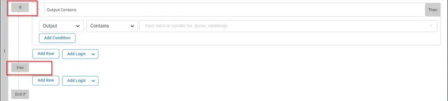
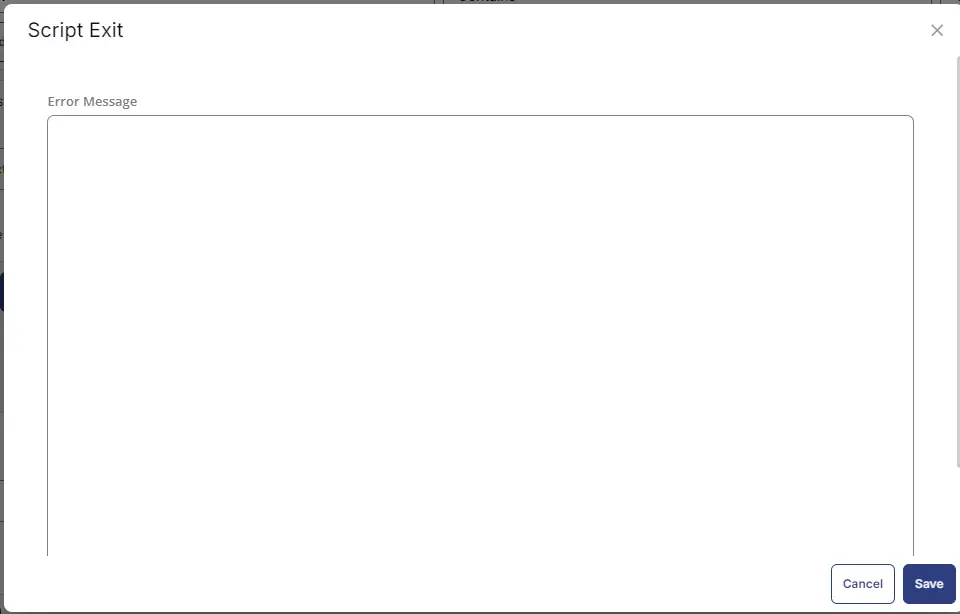
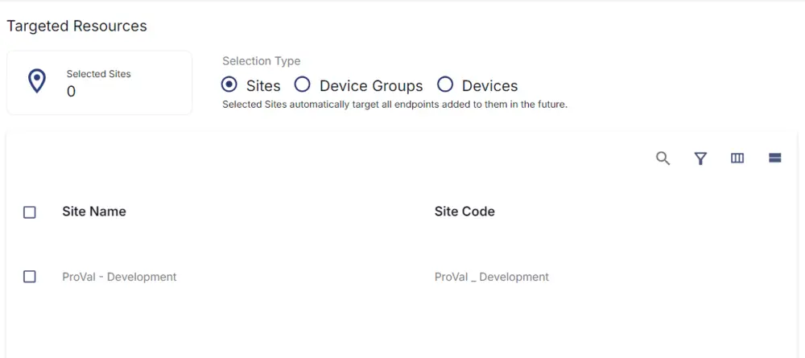

## Summary

This script is designed to perform the uninstallation of the application provided in the parameter. The script requires the application name(s) to precisely match those listed under the `Applications` tile in the device available in CW RMM.

## Sample Run

  
  
  

## Dependencies

[Custom Field - Remove Application Result](/docs/c893b839-b951-4b0c-b1d0-879361818839)  

## User Parameters

| Name             | Example                                                                                           | Required | Description                                                                                                                                                                                                                                                                                                                                 |
|------------------|---------------------------------------------------------------------------------------------------|----------|---------------------------------------------------------------------------------------------------------------------------------------------------------------------------------------------------------------------------------------------------------------------------------------------------------------------------------------------|
| ApplicationName  | 'Google Chrome', 'Microsoft OneDrive', 'VMware Tools'                                          | True     | The name of the application(s) to remove is encoded in single quotation marks. When specifying multiple application names, ensure they are separated by a comma (,) without any spaces, with each application encoded in single quotation marks, as depicted in the example.                                                               |

## Implementation

### Create Task

Remove Application: To implement this script, please create a new "PowerShell" style script in the system.  
  

Name: Remove Application  
Description: This script is designed to perform the uninstallation of the application provided in the parameter. The script requires the application name(s) to precisely match those listed under the `Applications` tile in the device available in CW RMM.  
Category: Custom  

  

## Script

Start by making three separate rows. You can do this by clicking the "Add Row" button at the bottom of the script page.  
  

### Row 1: Function: Script Log

  

Paste the highlighted text:  
`Validating the application name(s) to precisely match in the list of installed applications and bloatware programs detected on the computer.`  
  

### Row 2: Function: PowerShell Script

  
  

Paste in the following PowerShell script and set the expected time of script execution to **300** seconds.

```powershell
$ErrorActionPreference = 'SilentlyContinue'
$to_Remove = @ApplicationName@
if ($to_Remove) {
    $Applications = @()
    $for_removal = @()
    $Applications = [string[]]($(Get-AppxPackage).Name) + [string[]]((Get-AppxProvisionedPackage -online).DisplayName) + [string[]]((Get-ChildItem 'HKLM:\Software\Microsoft\Windows\CurrentVersion\Uninstall\*', 'HKLM:\Software\Wow6432Node\Microsoft\Windows\CurrentVersion\Uninstall\*' | Get-ItemProperty).DisplayName); $for_removal = foreach ($application in $applications) { if ( $to_remove -contains $application) { $application } }; 
    if ($for_removal) { return " '$($for_removal -join ''',''')' " } else { return 'Not Installed' }
}
else {
    return 'Parameter missing'
}
```

### Row 3: Function: Script Log

  

In the script log message, simply type `%output%` so that the script will send the results of the PowerShell script above to the output on the Automation tab for the target device.  
  

### Row 4: Logic: If/Then/Else

  
  

#### Row 4a: Condition: Output Contains

In the IF part, enter **Not Installed** in the right box of the "Output Contains" part.  
Add Condition OR  
Enter **Parameter Missing** in the right box of the "Output Contains" part.  
  

#### Row 4b: Function: Script Log

  

Paste the highlighted text:  
`Application Name does not exist. Exiting script.`  
  

#### Row 4c: Function: Script Exit

Add a new row by clicking on the Add Row button.  
  

In the script exit message, leave it blank.  
  

### Row 5: Function: Script Log

  

Paste the highlighted text:  
`Executing the PowerShell script to perform the uninstallation of the @ApplicationName@.`  

  

### Row 6: Function: PowerShell Script

  

Paste in the following PowerShell script and set the expected time of script execution to **3600** seconds.

```powershell
#region Setup - Variables
$ProjectName = 'Remove-Application'
[Net.ServicePointManager]::SecurityProtocol = [enum]::ToObject([Net.SecurityProtocolType], 3072)
# # Parameters and Globals
# # Be sure that the name of the hashtable property matches the name of the parameter of the script that you are calling.
$Parameters = @{
     Name = @ApplicationName@
 }
$BaseURL = 'https://file.provaltech.com/repo'
$PS1URL = "$BaseURL/script/$ProjectName.ps1"
$WorkingDirectory = "C:\ProgramData\_automation\script\$ProjectName"
$PS1Path = "$WorkingDirectory\$ProjectName.ps1"
$WorkingPath = $WorkingDirectory
#endregion
#region Setup - Folder Structure
mkdir -Path $WorkingDirectory -ErrorAction SilentlyContinue | Out-Null
try {
    Invoke-WebRequest -Uri $PS1URL -OutFile $PS1path -UseBasicParsing -ErrorAction Stop
} catch {
    if (!(Test-Path -Path $PS1Path )) {
        throw ('Failed to download the script from ''{0}'', and no local copy of the script exists on the machine. Reason: {1}' -f $PS1URL, $($Error[0].Exception.Message))
    }
}
#endregion
#region Execution
& $PS1Path @Parameters
#endregion
```

### Row 7: Function: Script Log

  

In the script log message, simply type `%output%` so that the script will send the results of the PowerShell script above to the output on the Automation tab for the target device.  
  

### Row 8: Function: PowerShell Script

  
  

Paste in the following PowerShell script and set the expected time of script execution to `300` seconds.

```powershell
$ErrorActionPreference = 'SilentlyContinue'
$to_Remove = @ApplicationName@
if ($to_Remove) {
    $Applications = @()
    $for_removal = @()
    $Applications = [string[]]($(Get-AppxPackage).Name) + [string[]]((Get-AppxProvisionedPackage -online).DisplayName) + [string[]]((Get-ChildItem 'HKLM:\Software\Microsoft\Windows\CurrentVersion\Uninstall\*', 'HKLM:\Software\Wow6432Node\Microsoft\Windows\CurrentVersion\Uninstall\*' | Get-ItemProperty).DisplayName); $for_removal = foreach ($application in $applications) { if ( $to_remove -contains $application) { $application } }; 
    if ($for_removal) { return " '$($for_removal -join ''',''')' " } else { return 'Not Installed' }
}
else {
    return 'Parameter missing'
}
```

### Row 9: Function: Script Log

  

In the script log message, simply type `%output%` so that the script will send the results of the PowerShell script above to the output on the Automation tab for the target device.  
  

### Row 10: Logic: If/Then/Else

#### Row 10a: Condition: Output Contains

In the IF part, enter **Not Installed** in the right box of the "Output Contains" part.  
  

#### Row 10b: Function: Script Log

  

Paste the highlighted text:  
`@ApplicationName@ successfully uninstalled. Exiting script.`  
  

#### Row 10c: Function: Set Custom Field

Add a new row by clicking on the Add Row button.  
Select Function 'Set Custom Field'. When you select `set custom field`, it will open up a new window.  

In this window, search for the **Remove Application Result** field.  
**Custom Field:** Remove Application Result  
**Value:** `Success`  

  

#### Row 10d: Function: Script Exit

Add a new row by clicking on the Add Row button.  
  

In the script exit message, leave it blank.  
  

### Row 11: Function: Script Exit

Add a new row by clicking on the Add Row button.  
  
  
In the script exit message, write `@ApplicationName@ failed to uninstall. Exiting script with error.`  
  

### Row 12: Function: Set Custom Field

Add a new row by clicking on the Add Row button.  
Select Function 'Set Custom Field'. When you select `set custom field`, it will open up a new window.  

In this window, search for the **Remove Application Result** field.  
**Custom Field:** Remove Application Result  
**Value:** `Failed`  
  

### Row 13: Complete

  
  

## Deployment

It is suggested to run the Task every 2 hours against the group `Remove Application`.

- Go to `Automation` > `Tasks.`
- Search for `Remove Application` Task.
- Select the concerned task.
- Click on the `Schedule` button to schedule the task/script.  
  

This screen will appear.  
  

Select the relevant time to run the script and click the Do not repeat button.  
  

A pop-up box will appear.  
Change the number of hours to `2` and click `OK`.  
  
  

Select the target to schedule at site 'ProVal - Development'.  
For example:  
  

Now click the `Run` button once all customization is set to initiate the task.  
  

The task will start appearing in the Scheduled Tasks.

## Output

- Task log
- Custom field 'Remove Application Result'