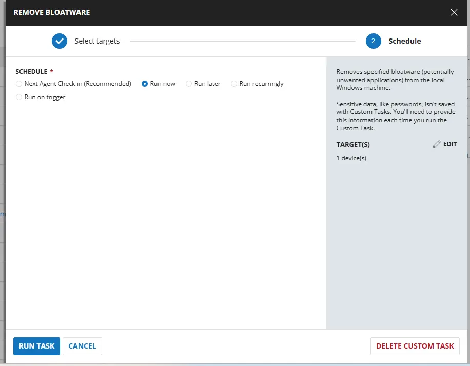
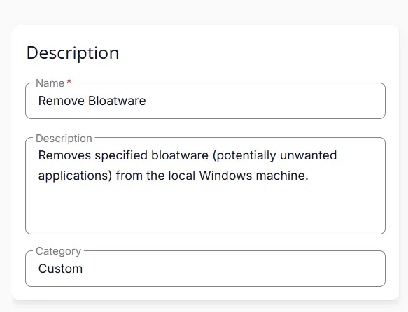
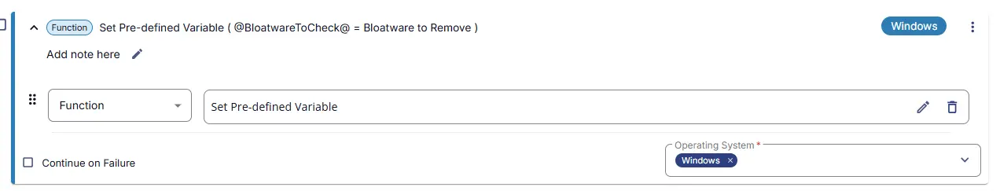
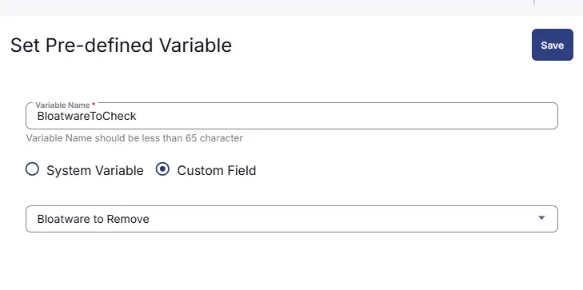
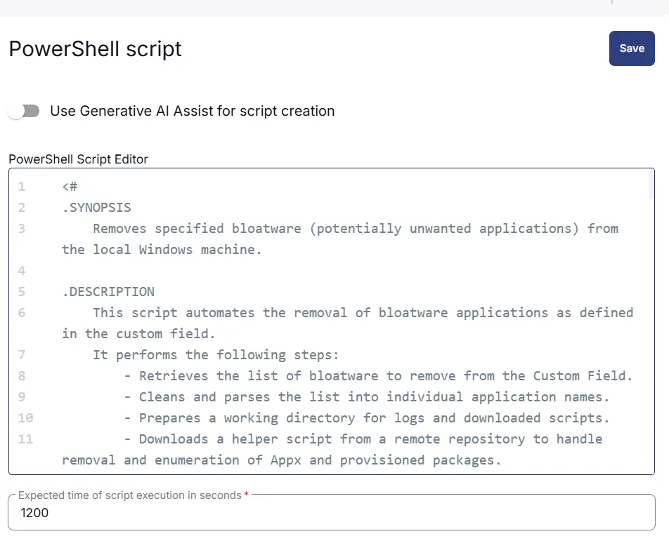
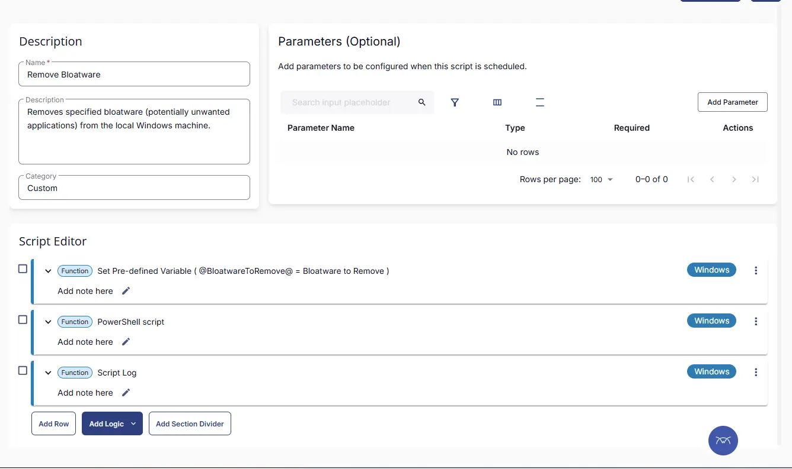
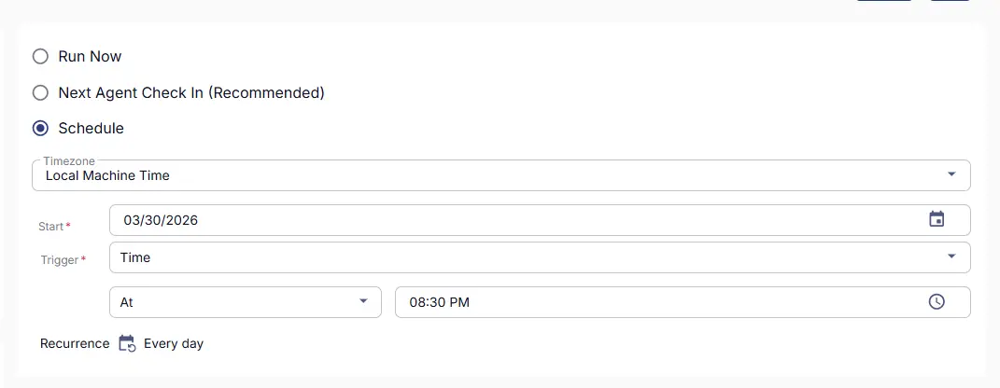
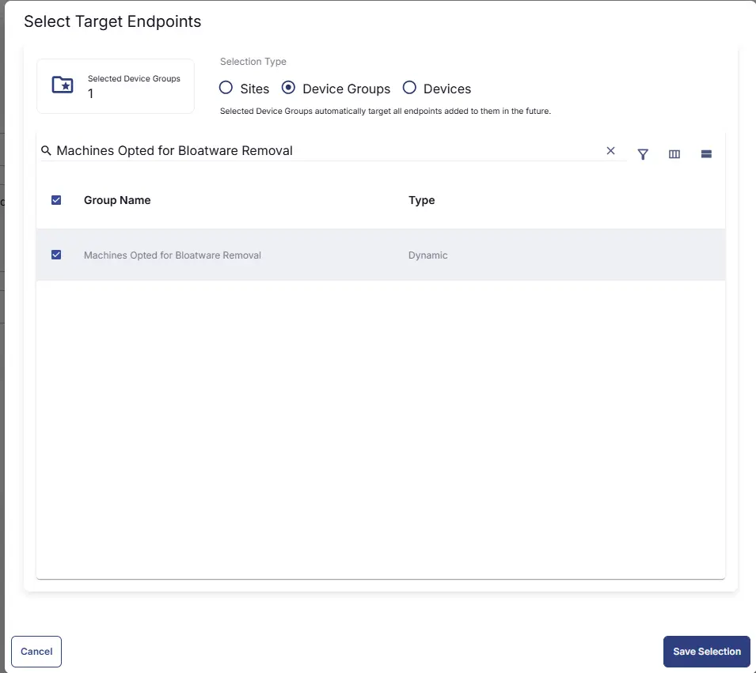
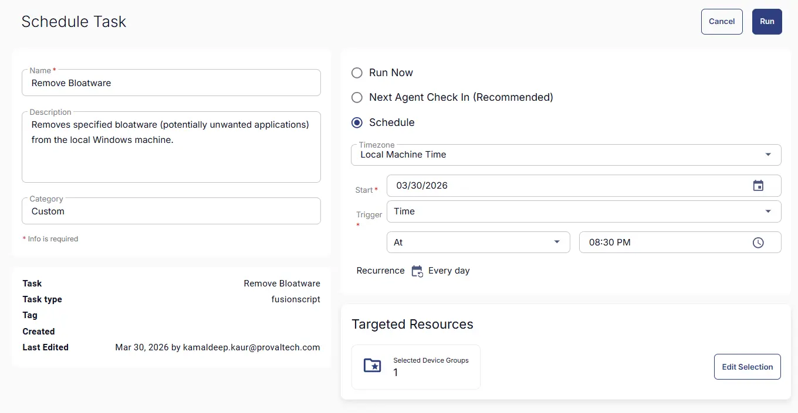

## Summary
Detects specified bloatware (potentially unwanted applications) installed on the local Windows machine.

## Sample Run


## Dependencies

- [Solution - Remove Bloatware](/docs/0b1f4077-1cf3-43ea-9c9d-93e2db94e24f)


## Task Creation

### Script Details

#### Step 1

Navigate to `Automation` ➞ `Tasks`  


#### Step 2

Create a new `Script Editor` style task by choosing the `Script Editor` option from the `Add` dropdown menu  


The `New Script` page will appear on clicking the `Script Editor` button:  


#### Step 3

Fill in the following details in the `Description` section:  

**Name:** `Remove Bloatware`  
**Description:** `Removes specified bloatware (potentially unwanted applications) from the local Windows machine.`  
**Category:** `Custom`




### Script Editor

Click the `Add Row` button in the `Script Editor` section to start creating the script  


A blank function will appear:  


### Row 1: Function: Set Pre-defined Variable





This sets the variable ` BloatwareToCheck` with the value of a custom field `Bloatware to Remove`


#### Row 2 Function: `PowerShell Script`

Search and select the `PowerShell Script` function.  
 
  

The following function will pop up on the screen:  
  

Paste in the following PowerShell script and set the `Expected time of script execution in seconds` to `1200` seconds. Click the `Save` button.

```powershell
<#
.SYNOPSIS
    Removes specified bloatware (potentially unwanted applications) from the local Windows machine.

.DESCRIPTION
    This script automates the removal of bloatware applications as defined in the custom field.
    It performs the following steps:
        - Retrieves the list of bloatware to remove from the Custom Field.
        - Cleans and parses the list into individual application names.
        - Prepares a working directory for logs and downloaded scripts.
        - Downloads a helper script from a remote repository to handle removal and enumeration of Appx and provisioned packages.
        - Executes the helper script to remove the specified bloatware.
        - Executes the helper script again to list any remaining installed bloatware.
        - Validates the existence of log and error files to ensure the helper script executed successfully.
        - Compares the installed applications against the specified bloatware list to determine if any failed to uninstall.
        - Outputs the names of any remaining bloatware and exits with code 1 if any are found, or code 0 if all were successfully removed.
        - Logs all actions and errors for troubleshooting.


.EXAMPLE
    .\Remove-Bloatware.ps1
    Removes specified bloatware applications and reports the result.

.NOTES
    [script]
    name = "Remove Bloatware"
    description = "Removes specified bloatware (potentially unwanted applications) from the local Windows machine."
    categories = ["ProVal"]
    language = "PowerShell"
    operating_system = "Windows"
    architecture = "All"
    run_as = "System"
#>

#region Global Variables
$ProgressPreference = 'SilentlyContinue'
$ConfirmPreference = 'None'
$InformationPreference = 'Continue'
#endRegion

#region Variables
$projectName = 'Remove-PUA'
$workingDirectory = '{0}\_Automation\Script\{1}' -f $env:ProgramData, $projectName
$scriptPath = '{0}\{1}.ps1' -f $workingDirectory, $projectName
$ps1Log = '{0}\{1}-log.txt' -f $workingDirectory, $projectName
$errorLog = '{0}\{1}-error.txt' -f $workingDirectory, $projectName
$baseUrl = 'https://contentrepo.net'
$scriptUrl = '{0}/repo/script/{1}.ps1' -f $baseUrl, $projectName
#endRegion

#region Custom Field
$bloatwareToRemove = '@BloatwareToRemove@'
if (!($bloatwareToRemove)) {
    Write-Information 'No Specified Bloatware mentioned to remove. Exiting script.'
    exit 0
}

$bloatwareList = $bloatwareToRemove -join "`n"
$bloatwareList = $bloatwareList -replace '\s+', ''
$bloatwareList = $bloatwareList -split ','
#endRegion

#region Working Directory
if (!(Test-Path -Path $workingDirectory)) {
    try {
        New-Item -Path $workingDirectory -ItemType Directory -Force -ErrorAction Stop | Out-Null
    } catch {
        Write-Information ('Failed to Create working directory {0}. Reason: {1}' -f $workingDirectory, $($Error[0].Exception.Message))
        exit 0
    }
}
#endRegion

#region Download Script
try {
    Invoke-WebRequest -Uri $scriptUrl -OutFile $scriptPath -ErrorAction Stop -UseBasicParsing
} catch {
    if (!(Test-Path -Path $scriptPath)) {
        Write-Information ('Failed to download script from {0}. Reason: {1}' -f $scriptUrl, $($Error[0].Exception.Message))
        exit 0
    }
}
#endRegion

#region Execute Script
& $scriptPath -Remove $bloatwareList
#endRegion

#region Get Installed Bloatware
$installedBloatware = & $scriptPath -ListBloatware
#endRegion

#region Log Validation
if (!(Test-Path -Path $ps1Log)) {
    Write-Information ('Log file {0} not found. A Security application might have blocked the script''s execution.' -f $ps1Log)
    exit 0
}
if (Test-Path -Path $errorLog) {
    $errorContent = Get-Content -Path $errorLog -ErrorAction SilentlyContinue
    if ($errorContent) {
        Write-Information ('Error log {0} contains errors: {1}' -f $errorLog, ($errorContent | Out-String))
        exit 0
    }
}
#endRegion

#region Compare and return installed bloatware
$remainingBloatware = @()
foreach ($bloatware in $bloatwareList) {
    if (($installedBloatware.AppxPackages -contains $bloatware) -or ($installedBloatware.ProvisionedPackages -contains $bloatware)) {
        $remainingBloatware += $bloatware
    }
}

if ($remainingBloatware) {
    $remainingBloatware = $remainingBloatware -join ', '
    Write-Information ('Following bloatware failed to uninstall: {0}' -f $remainingBloatware)
    exit 1
} else {
    Write-Information 'All specified bloatware uninstalled successfully.'
    exit 0
}
#endRegion
```



### Row 3 Function: Script Log

Add a new row by clicking the `Add Row` button.  
  

A blank function will appear.  
  

Search and select the `Script Log` function.  
  
 

In the script log message, simply type `%output%` and click the `Save` button.  


## Save Task

Click the `Save` button at the top-right corner of the screen to save the script.  


## Completed Task



## Output

- Script Logs

## Schedule Task

### Task Details

**Name:** `Remove Bloatware`  
**Description:** `Removes specified bloatware (potentially unwanted applications) from the local Windows machine.`  
**Category:** `Custom`


### Schedule

- **Schedule Type:**  `Schedule`  
- **Timezone:** `Local Machine Time`  
- **Start:** `<Current Date>`  
- **Trigger:** `Time` `At` `<Current Time>`  
- **Recurrence:** `Every Day`



#### Targeted Resource

**Device Group:** [Machines Opted for Bloatware Removal](/docs/9ab7b938-24e3-47dc-b884-487ca0a8188f)




### Completed Scheduled Task



## Changelog

### 2026-03-30

- Initial version of the document