## Summary

This document describes how to remove homepage settings from popular Chromium-based browsers (Edge, Chrome, and Brave). It includes the CW RMM implementation of [Remove-ChromiumHomepage](/docs/38674bcd-8b19-4072-a58f-314efad2e856  ).

## Sample Run

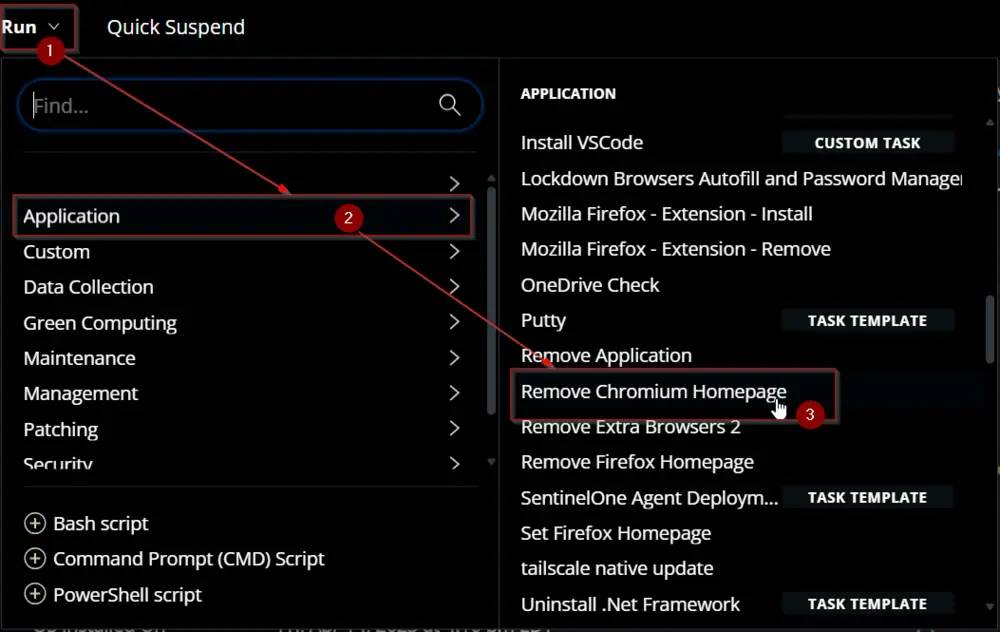  
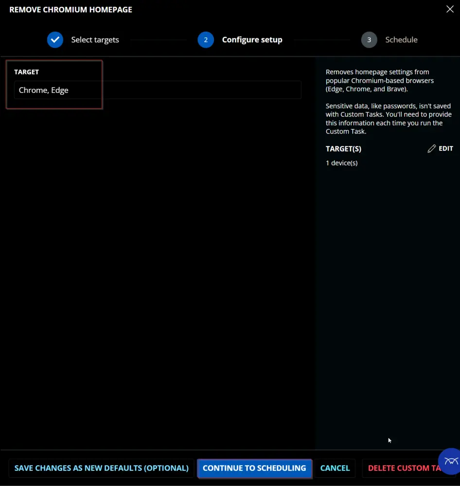  
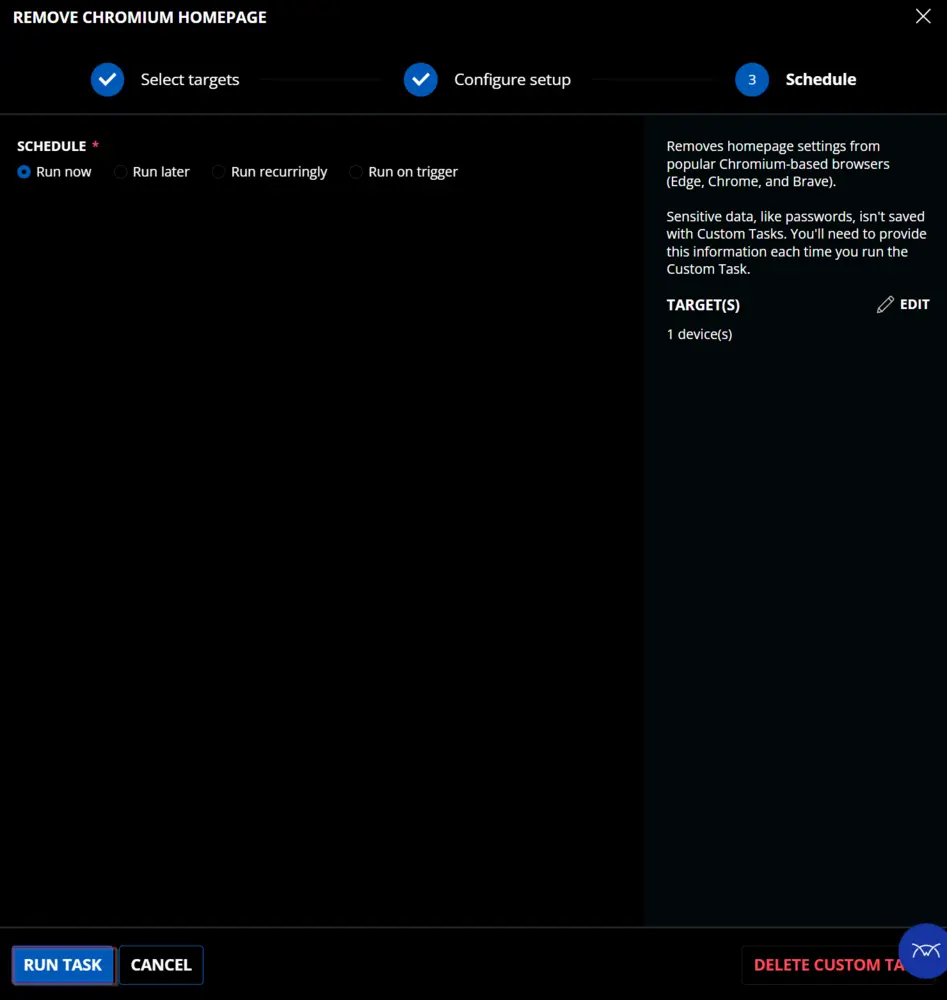  

## Dependencies

[SWM - Software Configuration - Remove-ChromiumHomepage](/docs/38674bcd-8b19-4072-a58f-314efad2e856  )

## User Parameters

| Name      | Example                                                                                       | Required | Type        | Description                                                                                                                                                                                                 |
|-----------|-----------------------------------------------------------------------------------------------|----------|-------------|-------------------------------------------------------------------------------------------------------------------------------------------------------------------------------------------------------------|
| `Target`  | - Chrome - Edge - Brave - Chrome, Edge - Edge, Brave - Chrome, Edge, Brave | False    | Text String | Name of the browser(s) to remove the homepage from. The script will clear/remove the homepage of all three browsers (Chrome, Edge, and Brave) if the parameter is left blank.                             |

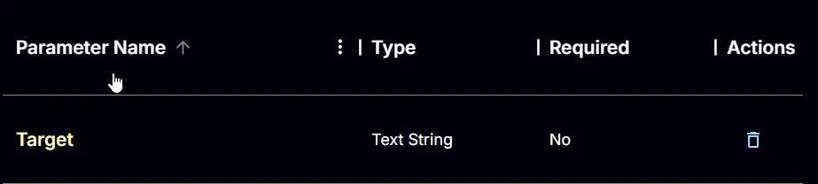

## Task Creation

Create a new `Script Editor` style script in the system to implement this task.

  
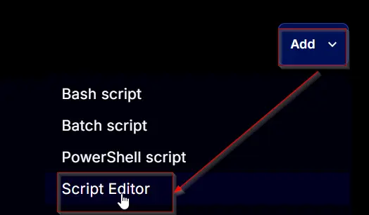  

**Name:** `Remove Chromium Homepage`  
**Description:** `Removes homepage settings from popular Chromium-based browsers (Edge, Chrome, and Brave).`  
**Category:** `Application`  

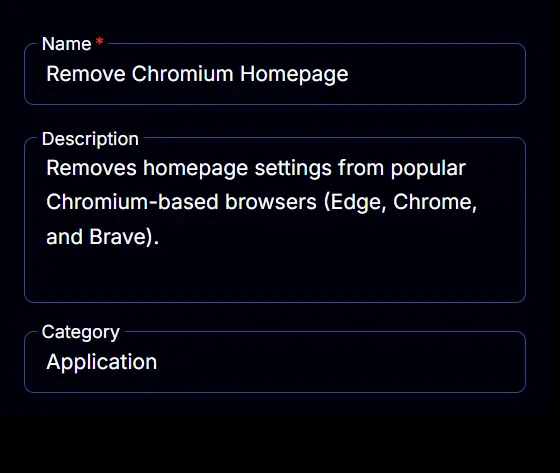

## Parameters

### Target:

Add a new parameter by clicking the `Add Parameter` button present at the top-right corner of the screen.

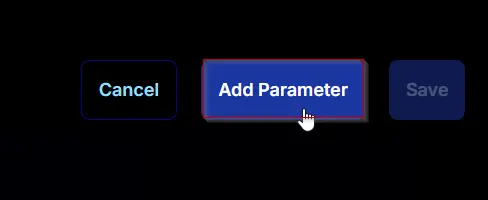  

This screen will appear.

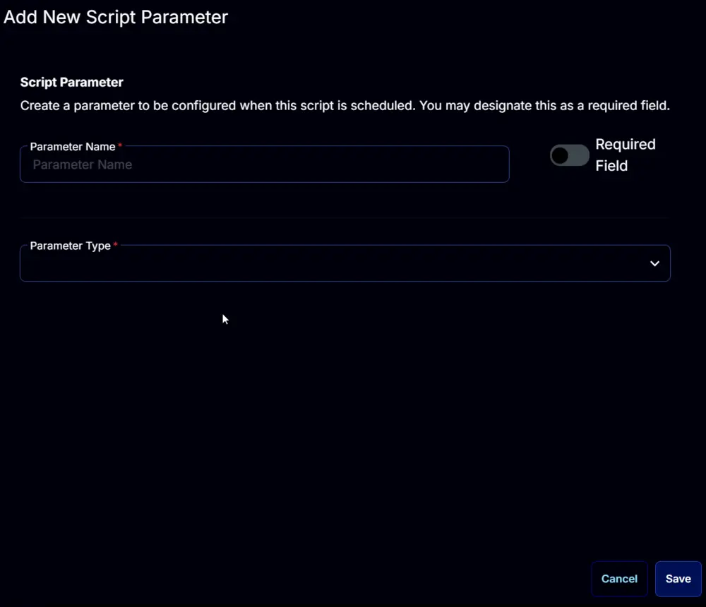  

- Set `Target` in the `Parameter Name` field.
- Select `Text String` from the `Parameter Type` dropdown menu.
- Click the `Save` button.

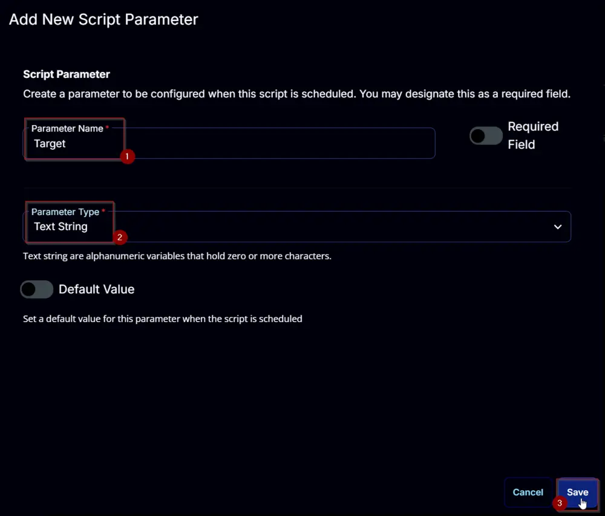  

## Task

Navigate to the Script Editor section and start by adding a row. You can do this by clicking the `Add Row` button at the bottom of the script page.

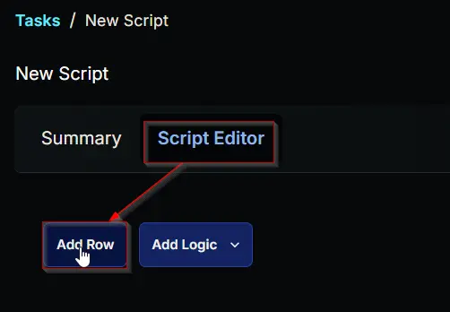  

A blank function will appear.

  

### Row 1 Function: PowerShell Script

Search and select the `PowerShell Script` function.  

  
  

The following function will pop up on the screen:  

  

Paste in the following PowerShell script and set the `Expected time of script execution in seconds` to `300` seconds. Click the `Save` button.

```
#region parameters
$Target = '@Target@'
$Browser = @()
if ( $Target -match '/STarget/S' -or ($null -eq $Target) ) {
    $Browser += 'Brave', 'Chrome', 'Edge'
} elseif ( $target.Length -lt 2  ) {
    $Browser += 'Brave', 'Chrome', 'Edge'
} else {
    if ( $Target -match 'Brave' ) {
        $Browser += 'Brave'
    }
    if ( $Target -match 'Chrome' ) {
        $Browser += 'Chrome'
    }
    if ( $Target -match 'Edge' ) {
        $Browser += 'Edge'
    }
}
$parameters = @{
    Target = $Browser
}
```

```
#region Setup - Variables
$ProjectName = 'Remove-ChromiumHomepage'
[Net.ServicePointManager]::SecurityProtocol = [enum]::ToObject([Net.SecurityProtocolType], 3072)
$BaseURL = 'https://file.provaltech.com/repo'
$PS1URL = "$BaseURL/script/$ProjectName.ps1"
$WorkingDirectory = "C:/ProgramData/_automation/script/$ProjectName"
$PS1Path = "$WorkingDirectory/$ProjectName.ps1"
$Workingpath = $WorkingDirectory
$LogPath = "$WorkingDirectory/$ProjectName-log.txt"
$ErrorLogPath = "$WorkingDirectory/$ProjectName-Error.txt"
#endregion
#region Setup - Folder Structure
New-Item -Path $WorkingDirectory -ItemType Directory -ErrorAction SilentlyContinue | Out-Null
$response = Invoke-WebRequest -Uri $PS1URL -UseBasicParsing
if (($response.StatusCode -ne 200) -and (!(Test-Path -Path $PS1Path))) {
    throw "No pre-downloaded script exists and the script '$PS1URL' failed to download. Exiting."
} elseif ($response.StatusCode -eq 200) {
    Remove-Item -Path $PS1Path -ErrorAction SilentlyContinue
    [System.IO.File]::WriteAllLines($PS1Path, $response.Content)
}
if (!(Test-Path -Path $PS1Path)) {
    throw 'An error occurred and the script was unable to be downloaded. Exiting.'
}
#endregion
#region Execution
if ($Parameters) {
    & $PS1Path @Parameters
} else {
    & $PS1Path
}
#endregion
```

```
if ( !(Test-Path $LogPath) ) {
    throw 'PowerShell Failure. A Security application seems to have restricted the execution of the PowerShell Script.'
}
if ( Test-Path $ErrorLogPath ) {
    $ErrorContent = ( Get-Content -Path $ErrorLogPath )
    throw $ErrorContent
}
Get-Content -Path $LogPath
```

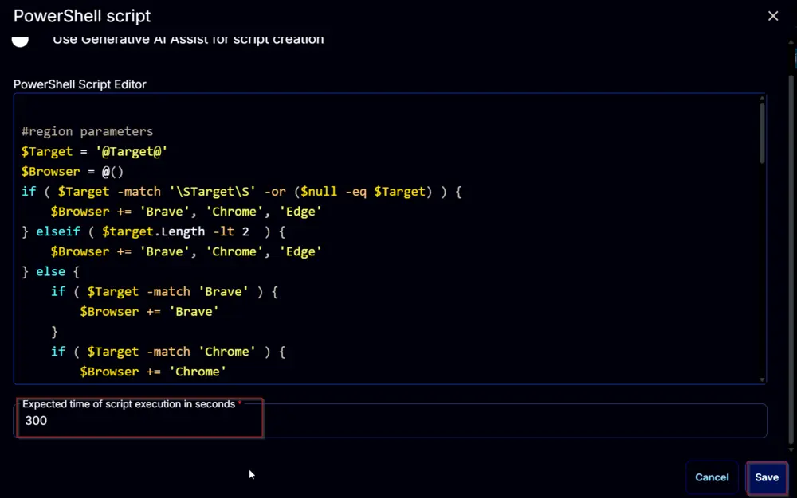  

### Row 2 Function: Script Log

Add a new row by clicking the `Add Row` button.

  

A blank function will appear.

  

Search and select the `Script Log` function.

  
  

The following function will pop up on the screen:  

  

In the script log message, simply type `%output%` and click the `Save` button.

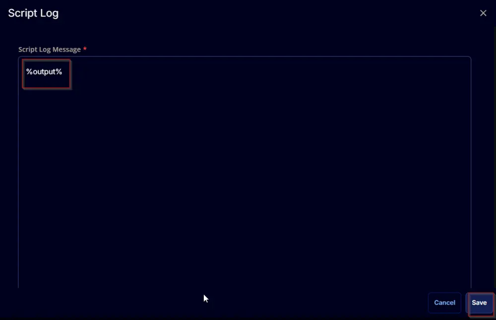  

Click the `Save` button at the top-right corner of the screen to save the script.

  

## Completed Script

  

## Output

- Script log  
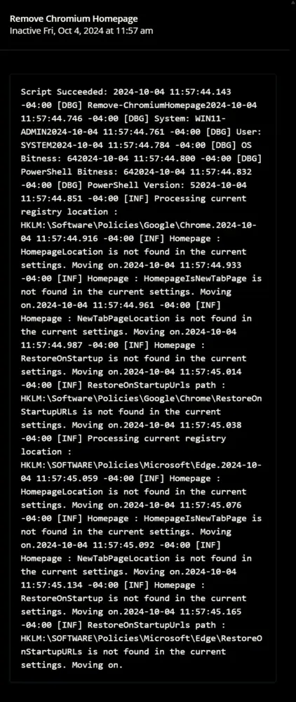  
