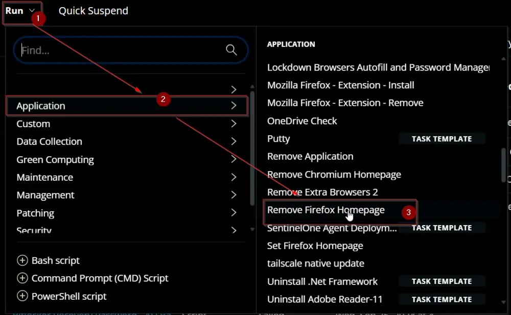
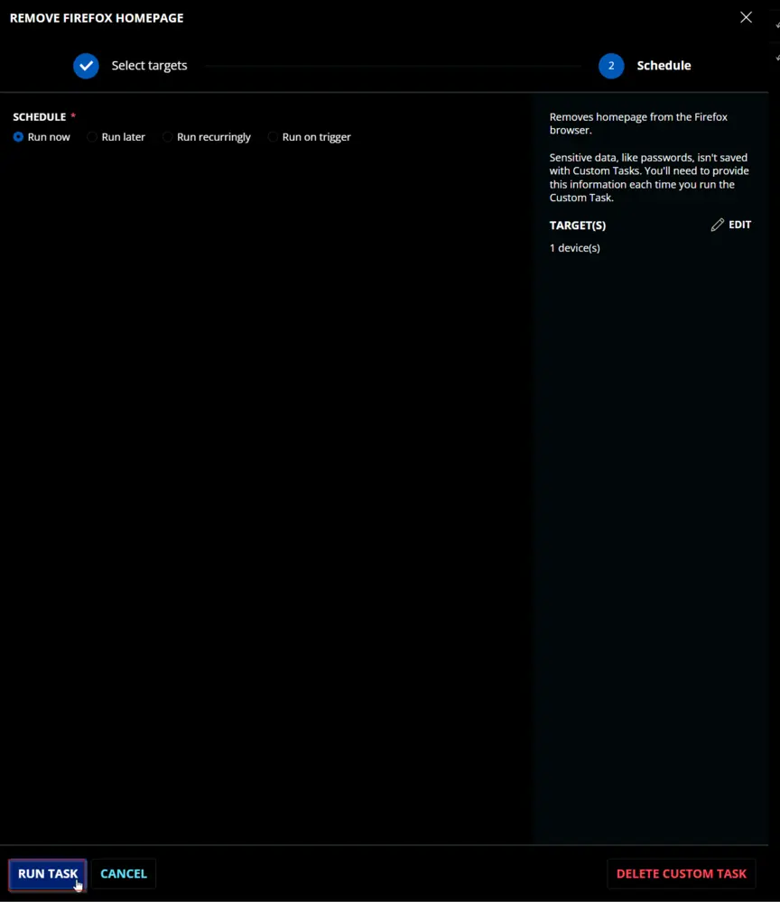
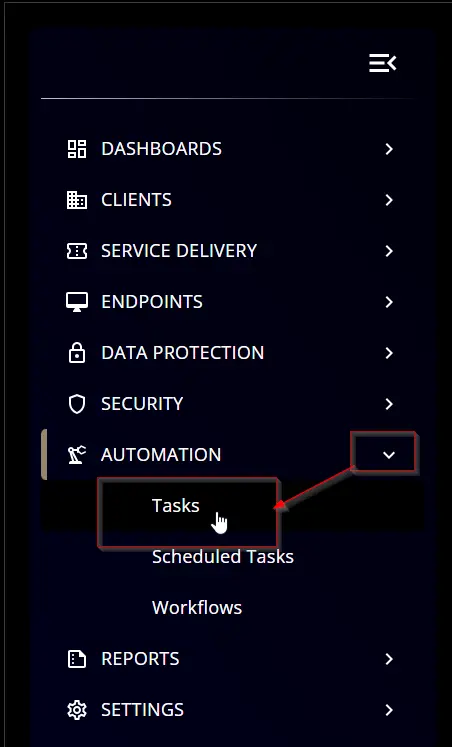
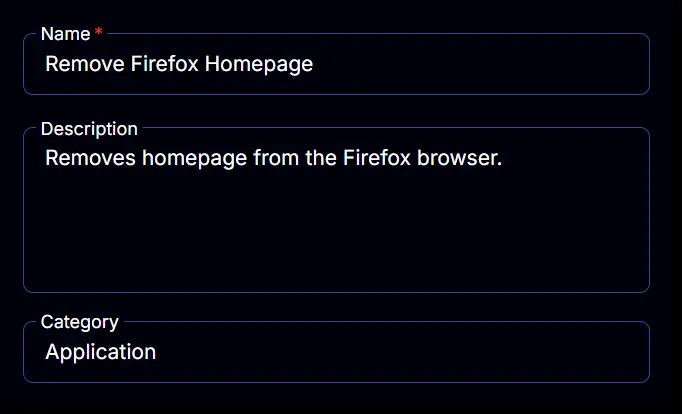
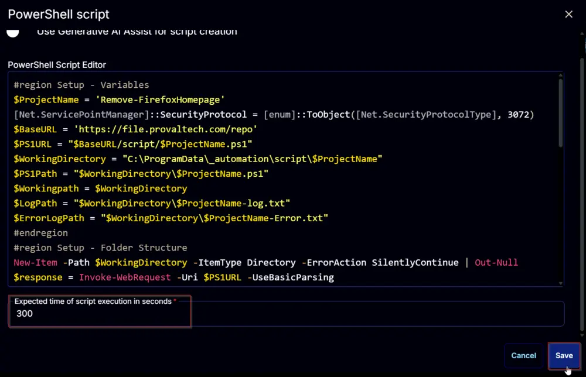
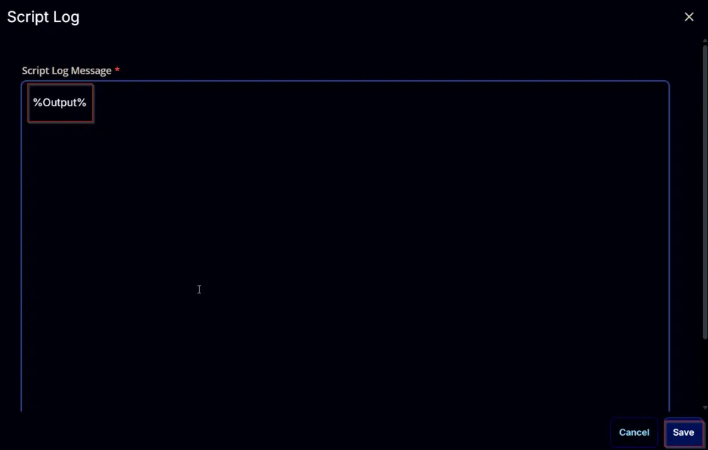
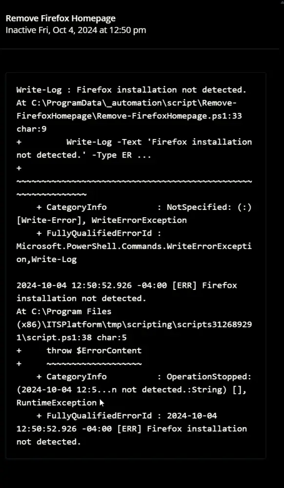

---
id: '321f9e4b-75f6-4951-9848-03d5940cc257'
slug: /321f9e4b-75f6-4951-9848-03d5940cc257
title: 'Remove Firefox Homepage'  
title_meta: 'Remove Firefox Homepage'  
keywords: ['powershell', 'configuration', 'system', 'scripting', 'automation']  
description: 'This document provides an example of a PowerShell script designed to streamline system configuration tasks. It covers various settings and configurations that can be automated to improve efficiency and consistency across systems.'  
tags: ['software', 'windows']  
draft: false  
unlisted: false  
last_update:
  date: 2025-11-27
---

## Summary

Removes homepage from the Firefox browser. CW RMM implementation of [Remove-FirefoxHomepage](/docs/615b14aa-fee1-4eeb-9e5f-02ad695317d9).

## Sample Run

  

## Dependencies

[Remove-FirefoxHomepage](/docs/615b14aa-fee1-4eeb-9e5f-02ad695317d9)

## Task Creation

Create a new `Script Editor` style script in the system to implement this Task.  
  

**Name:** `Remove Firefox Homepage`  
**Description:** `Removes homepage from the Firefox browser.`  
**Category:** `Application`

## Task

Navigate to the Script Editor Section and start by adding a row. You can do this by clicking the `Add Row` button at the bottom of the script page.  

A blank function will appear.  

### Row 1 Function: PowerShell Script

Search and select the `PowerShell Script` function.  
  

The following function will pop up on the screen:  

Paste in the following PowerShell script and set the `Expected time of script execution in seconds` to 300 seconds. Click the `Save` button.

[PowerShell Script](https://github.com/ProVal-Tech/cw-rmm/blob/main/tasks/remove-firefox-homepage/script.ps1)

### Row 2 Function: Script Log

Add a new row by clicking the `Add Row` button.  

A blank function will appear.  

Search and select the `Script Log` function.  

The following function will pop up on the screen:  

In the script log message, simply type %Output% and click the `Save` button  

Click the `Save` button at the top-right corner of the screen to save the script.  

## Completed Task

## Output

- Script Log  
    

## Changelog

### 2025-04-10

- Initial version of the document

