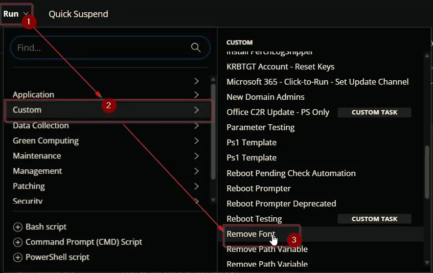
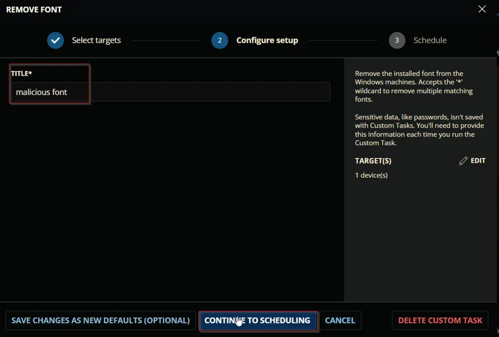
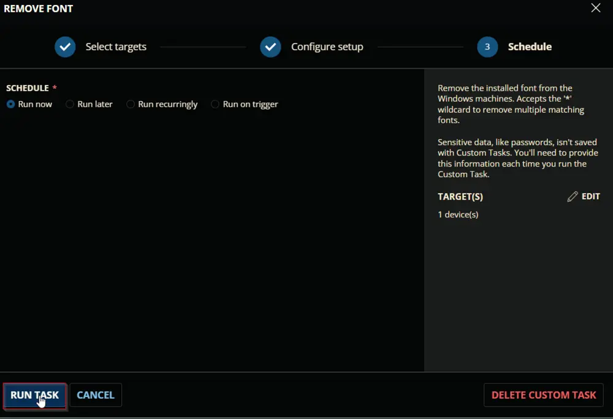
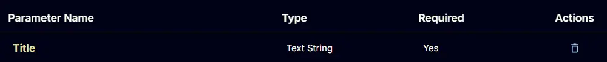
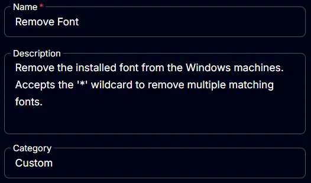
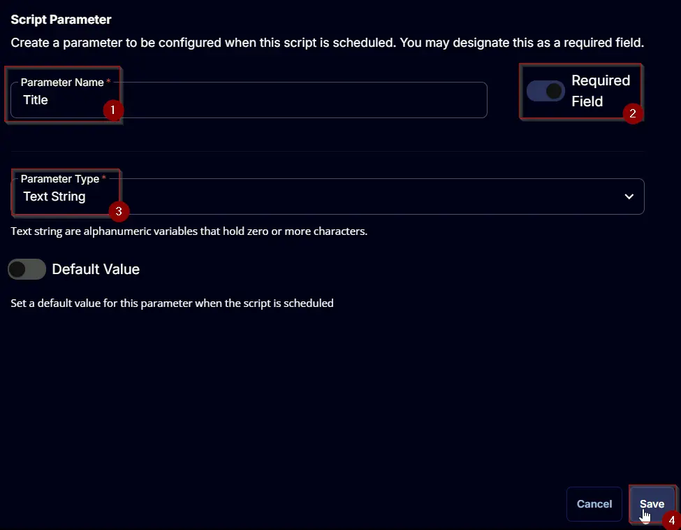
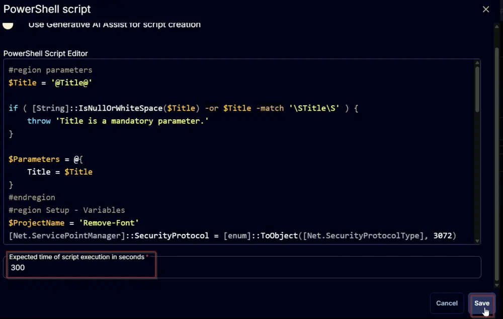
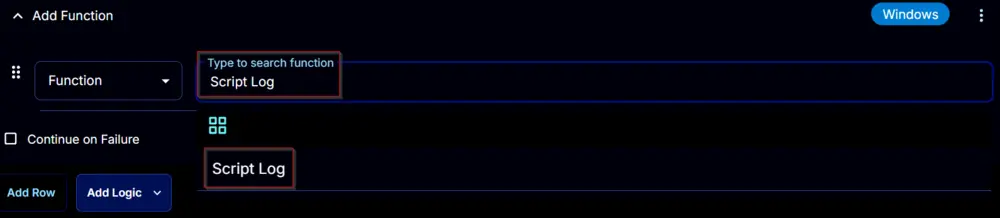

---
id: 'c563d6fc-13b1-4cc5-9461-745e2a25b49d'
slug: /c563d6fc-13b1-4cc5-9461-745e2a25b49d
title: 'Remove Font'
title_meta: 'Remove Font'
keywords: ['remove', 'font', 'windows', 'script', 'uninstall']
description: 'This document provides a comprehensive guide on removing installed fonts from Windows machines using a script. It includes sample runs, user parameters, task creation steps, and detailed instructions for implementing the script in ConnectWise RMM.'
tags: ['uninstallation', 'windows']
draft: false
unlisted: false
last_update:
  date: 2025-11-27
---

## Summary

This document outlines how to remove installed fonts from Windows machines. It accepts the '*' wildcard to remove multiple matching fonts. The CW RMM implementation of the agnostic script can be found in [Remove-Font](/docs/a88b469b-0384-49f8-b959-16e701c538ad  ).

## Sample Run

  
  
  

## Dependencies

[Remove-Font](/docs/a88b469b-0384-49f8-b959-16e701c538ad  )

## User Parameters

| Name   | Example         | Required | Type         | Description                                         |
|--------|------------------|----------|--------------|-----------------------------------------------------|
| Title  | Malicious Font    | True     | Text String  | Title of the font to remove from the system.       |

## Task Creation

Create a new `Script Editor` style script in the system to implement this task.

  
  

**Name:** `Remove Font`  
**Description:** `Remove the installed font from the Windows machines. Accepts the '*' wildcard to remove multiple matching fonts.`  
**Category:** `Custom`  

## Parameters

### Title

Add a new parameter by clicking the `Add Parameter` button located at the top-right corner of the screen.

  

This screen will appear.  

  

- Set `Title` in the `Parameter Name` field.
- Enable the `Required Field` option.
- Select `Text String` from the `Parameter Type` dropdown menu.
- Click the `Save` button.

## Task

Navigate to the Script Editor section and start by adding a row. You can do this by clicking the `Add Row` button at the bottom of the script page.

  

A blank function will appear.

  

### Row 1 Function: PowerShell Script

Search and select the `PowerShell Script` function.

  
  

The following function will pop up on the screen:

  

Paste the following PowerShell script and set the `Expected time of script execution in seconds` to `300`. Click the `Save` button.

[PowerShell Script](https://github.com/ProVal-Tech/cw-rmm/blob/main/tasks/remove-font/script.ps1)

### Row 2 Function: Script Log

Add a new row by clicking the `Add Row` button.

  

A blank function will appear.

  

Search and select the `Script Log` function.

  

The following function will pop up on the screen:

  

In the script log message, simply type `%Output%` and click the `Save` button.

  

Click the `Save` button at the top-right corner of the screen to save the script.

  

## Completed Task

  

## Output

- Script log

## Changelog

### 2025-04-10

- Initial version of the document

