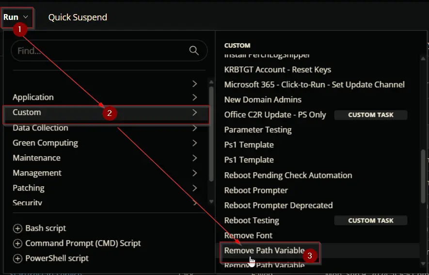
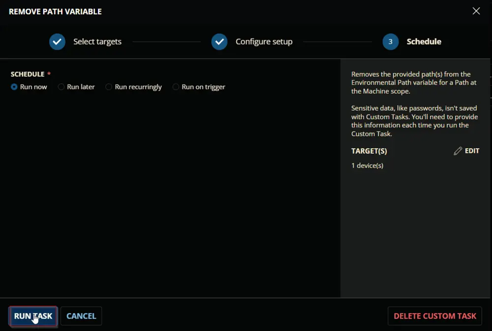
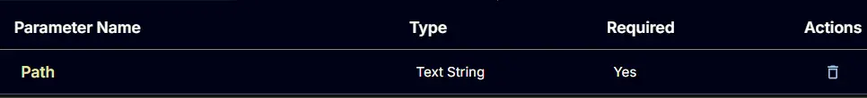
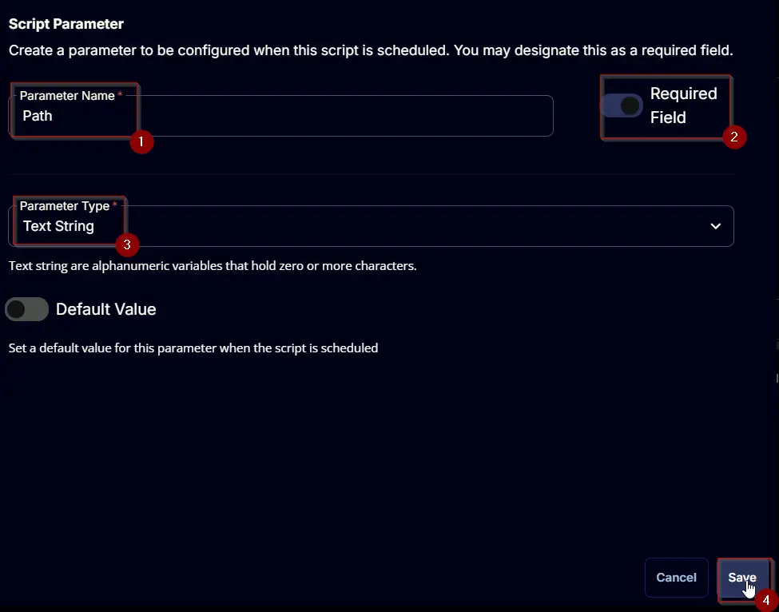
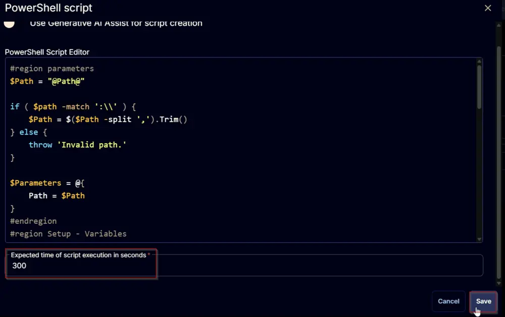
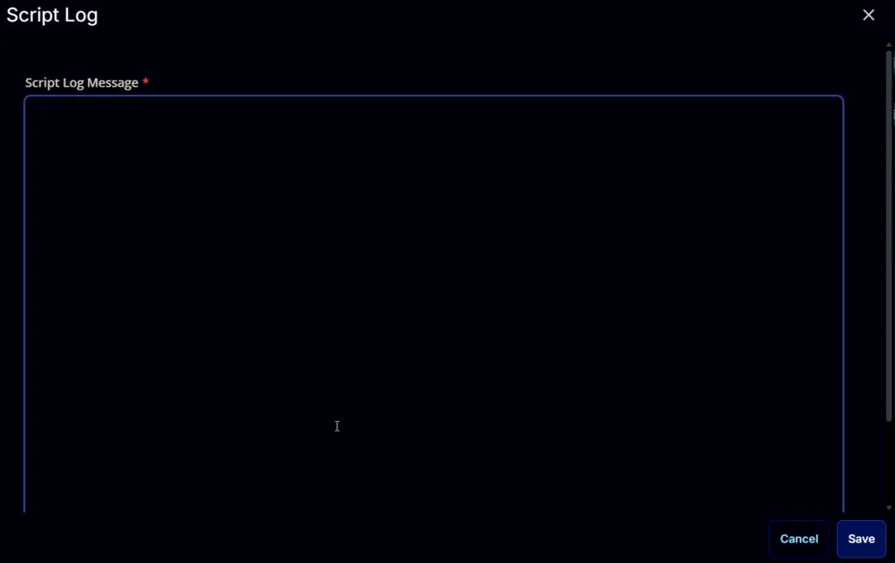

## Summary

This document describes how to remove the provided path(s) from the Environmental Path variable for a Path at the Machine scope. It covers the ConnectWise RMM implementation of the agnostic script [Remove-PathVariable](/docs/5eccc080-da21-4b13-b21d-df5c985a056a).

## Sample Run

  
  
  

## Dependencies

[Remove-PathVariable](/docs/5eccc080-da21-4b13-b21d-df5c985a056a)

## User Parameters

| Name  | Example                                                                 | Required | Type        | Description                                                                                                      |
|-------|-------------------------------------------------------------------------|----------|-------------|------------------------------------------------------------------------------------------------------------------|
| Path  | - 'C://Temp' - 'C://Temp', 'C://Temp//ProgramData', 'D://Text Files' | True     | Text String | Comma-separated list of the path(s) to remove from the path variable. **Requirement:** Each path should be enclosed in single quotes. The path should exist on the end machine. |



## Task Creation

Create a new `Script Editor` style script in the system to implement this task.

  
  

**Name:** `Remove Path Variable`  
**Description:** `Removes the provided path(s) from the Environmental Path variable for a Path at the Machine scope.`  
**Category:** `Custom`  

  

## Parameters

### Path:

Add a new parameter by clicking the `Add Parameter` button present at the top-right corner of the screen.

  

This screen will appear.  
  

- Set `Path` in the `Parameter Name` field.
- Enable the `Required Field` button.
- Select `Text String` from the `Parameter Type` dropdown menu.
- Click the `Save` button.

  

## Task

Navigate to the Script Editor Section and start by adding a row. You can do this by clicking the `Add Row` button at the bottom of the script page.

  

A blank function will appear.  
  

### Row 1 Function: PowerShell Script

Search and select the `PowerShell Script` function.  

  
  

The following function will pop up on the screen:  
  

Paste in the following PowerShell script and set the `Expected time of script execution in seconds` to `300` seconds. Click the `Save` button.

```powershell
#region parameters
$Path = "@Path@"
if ( $path -match ':\\' ) {
    $Path = $($Path -split ',').Trim()
} else {
    throw 'Invalid path.'
}
$Parameters = @{
    Path = $Path
}
#endregion
#region Setup - Variables
$ProjectName = 'Remove-PathVariable'
[Net.ServicePointManager]::SecurityProtocol = [enum]::ToObject([Net.SecurityProtocolType], 3072)
$BaseURL = 'https://file.provaltech.com/repo'
$PS1URL = "$BaseURL/script/$ProjectName.ps1"
$WorkingDirectory = "C:\ProgramData\_automation\script\$ProjectName"
$PS1Path = "$WorkingDirectory\$ProjectName.ps1"
$WorkingPath = $WorkingDirectory
$LogPath = "$WorkingDirectory\$ProjectName-log.txt"
$ErrorLogPath = "$WorkingDirectory\$ProjectName-Error.txt"
#endregion
#region Setup - Folder Structure
New-Item -Path $WorkingDirectory -ItemType Directory -ErrorAction SilentlyContinue | Out-Null
try {
    Invoke-WebRequest -Uri $PS1URL -OutFile $PS1path -UseBasicParsing -ErrorAction Stop
} catch {
    if (!(Test-Path -Path $PS1Path )) {
        throw ('Failed to download the script from ''{0}'', and no local copy of the script exists on the machine. Reason: {1}' -f $PS1URL, $($Error[0].Exception.Message))
    }
}
#endregion
#region Execution
if ($Parameters) {
    & $PS1Path @Parameters
} else {
    & $PS1Path
}
#endregion
#region log verification
if ( !(Test-Path $LogPath) ) {
    throw 'PowerShell Failure. A Security application seems to have restricted the execution of the PowerShell Script.'
}
if ( Test-Path $ErrorLogPath ) {
    $ErrorContent = ( Get-Content -Path $ErrorLogPath )
    throw $ErrorContent
}
Get-Content -Path $LogPath
#endregion
```

  

### Row 2 Function: Script Log

Add a new row by clicking the `Add Row` button.  
  

A blank function will appear.  
  

Search and select the `Script Log` function.  
  

The following function will pop up on the screen:  
  

In the script log message, simply type `%Output%` and click the `Save` button.  
  

Click the `Save` button at the top-right corner of the screen to save the script.  
  

## Completed Task

  

## Output

- Script log