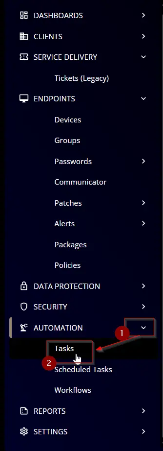
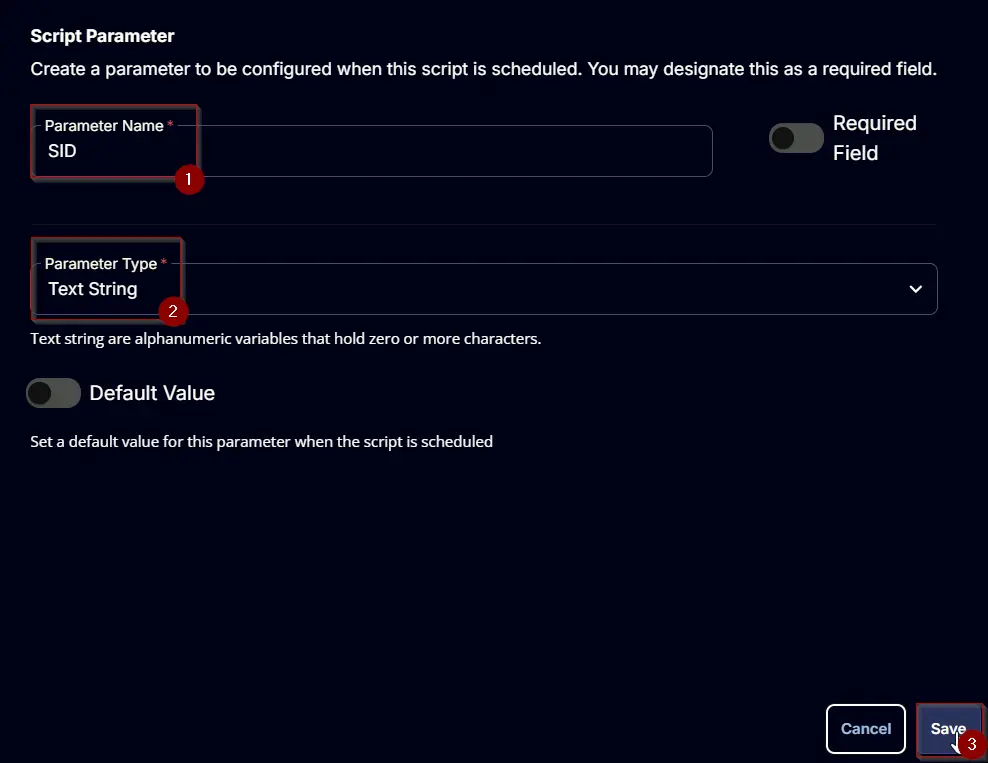
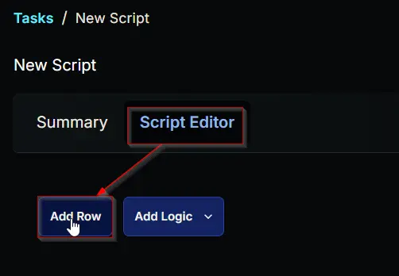

## Summary

### <span style={{color: 'red'}}>***This script is destructive and should only be used after fully understanding the implications.***</span>

This script is designed to delete a user profile and remove the user account if it is local. Note that the `SID` and `Username` parameters cannot be used simultaneously.

The `SID` parameter is specifically intended for removing cached or unknown user profiles.
Running the [Unknown User Profiles](/docs/93f21631-9100-46fc-864b-3af17bc91699) script will return the `SID` of the inferred profiles.

<span style={{color: 'Orange'}}> **User Agreement: *"I acknowledge that I am using a destructive script. I understand that any typographical errors could result in the removal of production profiles, and I accept full responsibility for any consequences."*** </span>

It it a ConnectWise RMM implementation of the agnostic script [Remove-UserProfile](/docs/af494143-56df-448c-8f30-44cf93a441ac).

### Notes

- The user must accept the `I_have_read_the_description_and_agree_to_the_user_agreement` parameter while running the script.
- `SID` and `Username` parameters cannot be used simultaneously.
- `PreserveUser` parameter can only be used with the `Username` parameter.
- One user account or profile can be removed using the `Username` parameter at a time. 
- `SID` parameter accepts comma separated list of Security Identifies to remove and can be used to remove multiple user profiles at once.

## Sample Run

  

**Example 1:** Removing a local user account and profile

 

**Example 2:** Removing an user profile and preserving the user

 

**Example 3:** Removing the user profile of a domain user

 

**Example 4:** Removing multiple unknown/cached user profiles using `SID`

 

 

## Dependencies

[Remove-UserProfile](/docs/af494143-56df-448c-8f30-44cf93a441ac)

## User Parameters

| Name          | Example    | Required | Type        | Description  |
|---------------|------------|----------|-------------|-------------------------------------------------------------------------------------------------------------------------------------------------------------------------------------------------------------------------------|
| UserName      | TestAdmin  | Partially | Text String | The username of the user whose profile is to be removed. Valid entries for this parameter are: <ul><li>username</li><li>./username</li><li>domain/username</li></ul> |
| PreserveUser  | 0/1        | False    | Flag        | Use this switch to preserve the user account after profile deletion. |
| SID | <ul><li>S-1-5-21-3623811015-3361044348-30300820-1013</li><li>S-1-5-21-1173666872-732068812-3818650923-1004, S-1-5-21-1173666872-732068812-3818650923-1008</li></ul> | Partially | Text String | The SID of the user profile to remove. The PreserveUser parameter cannot be used with SID. This parameter can be used when the UserName is not available.<br /><br />**Both UserName and SID cannot be used together** |
| I_have_read_the_description_and_agree_to_the_user_agreement  | 0/1  | True    | Flag        | The script will not run without flagging this checkbox. Marking this checkbox indicates that the user has read the warning and is running the script with caution. |


## Task Creation

Create a new `Script Editor` style script in the system to implement this task.  
  
  

**Name:** `Remove User Profile`  
**Description:** `Deletes a user profile and removes the user account if local`  
**Category:** `Custom`  
  

## Parameters

### Username

Add a new parameter by clicking the `Add Parameter` button present at the top-right corner of the screen.  
  

This screen will appear.  
  
- Set `Username` in the `Parameter Name` field.
- Select `Text String` from the `Parameter Type` dropdown menu.
- Click the `Save` button.

  

### PreserveUser

Add a new parameter by clicking the `Add Parameter` button present at the top-right corner of the screen.  
  

This screen will appear.  
  
- Set `PreserveUser` in the `Parameter Name` field.
- Select `Flag` from the `Parameter Type` dropdown menu.
- Click the `Save` button.

  

### SID

Add a new parameter by clicking the `Add Parameter` button present at the top-right corner of the screen.  
  

This screen will appear.  
  
- Set `SID` in the `Parameter Name` field.
- Select `Text String` from the `Parameter Type` dropdown menu.
- Click the `Save` button.

  

### I_have_read_the_description_and_agree_to_the_user_agreement:

Add a new parameter by clicking the `Add Parameter` button present at the top-right corner of the screen.  
  

This screen will appear.  
  
- Set `I_have_read_the_description_and_agree_to_the_user_agreement` in the `Parameter Name` field.
- Enable the `Required Field` button.
- Select `Flag` from the `Parameter Type` dropdown menu.
- Click the `Save` button.

  

## Task

Navigate to the Script Editor section and start by adding a row. You can do this by clicking the `Add Row` button at the bottom of the script page.  
  

A blank function will appear.  
  

### Row 1 Function: PowerShell Script

Search and select the `PowerShell Script` function.  
  
  

The following function will pop up on the screen:  
  

Paste in the following PowerShell script and set the `Expected time of script execution in seconds` to `300` seconds. Click the `Save` button.

```powershell
#region parameters
$username = '@Username@'
$preserveUser = '@PreserveUser@'
$sid = '@SID@'

if ($null -ne $sid -and $sid -notmatch 'sid' -and $sid -match 'S-\d-\d+-(\d+-){1,14}\d+') {
    if ($sid -match ',' ) {
        $sid = $sid -replace '\s', ''
        $sid = $sid -split ','
    } else {
        $sid = $sid -replace '\s', ''
        $Parameters = @{
            'SID' = $sid
        }
    }
} else {
    $parameters = @{
        'Username' = $username
    }
    if ( $preserveUser -match '1|Yes|True' ) {
        $parameters.Add('PreserveUser', $true)
    }
}

#endregion parameters
#region Setup - Variables
$ProjectName = 'Remove-UserProfile'
[Net.ServicePointManager]::SecurityProtocol = [enum]::ToObject([Net.SecurityProtocolType], 3072)
$BaseURL = 'https://file.provaltech.com/repo'
$PS1URL = "$BaseURL/script/$ProjectName.ps1"
$WorkingDirectory = "C:\ProgramData\_automation\script\$ProjectName"
$PS1Path = "$WorkingDirectory\$ProjectName.ps1"
$WorkingPath = $WorkingDirectory
$LogPath = "$WorkingDirectory\$ProjectName-log.txt"
$ErrorLogPath = "$WorkingDirectory\$ProjectName-Error.txt"
#endregion
#region Setup - Folder Structure
New-Item -Path $WorkingDirectory -ItemType Directory -ErrorAction SilentlyContinue | Out-Null
$response = Invoke-WebRequest -Uri $PS1URL -UseBasicParsing
if (($response.StatusCode -ne 200) -and (!(Test-Path -Path $PS1Path))) {
    throw "No pre-downloaded script exists and the script '$PS1URL' failed to download. Exiting."
} elseif ($response.StatusCode -eq 200) {
    Remove-Item -Path $PS1Path -ErrorAction SilentlyContinue
    [System.IO.File]::WriteAllLines($PS1Path, $response.Content)
}
if (!(Test-Path -Path $PS1Path)) {
    throw 'An error occurred and the script was unable to be downloaded. Exiting.'
}
#endregion
#region Execution
if ($Parameters) {
    & $PS1Path @Parameters
} else {
    foreach ($id in $sid) {
        & $PS1Path -SID $id
    }
}
#endregion
#region log verification
if ( !(Test-Path $LogPath) ) {
    throw 'PowerShell Failure. A Security application seems to have restricted the execution of the PowerShell Script.'
}
if ( Test-Path $ErrorLogPath ) {
    $ErrorContent = ( Get-Content -Path $ErrorLogPath )
    throw $ErrorContent
}
Get-Content -Path $LogPath
#endregion
```

  

### Row 2 Function: Script Log

Add a new row by clicking the `Add Row` button.  
  

A blank function will appear.  
  

Search and select the `Script Log` function.  
  

The following function will pop up on the screen:  
  

In the script log message, simply type `%Output%` and click the `Save` button.  
  

Click the `Save` button at the top-right corner of the screen to save the script.  
  

## Completed Task

  

## Output

- Script log