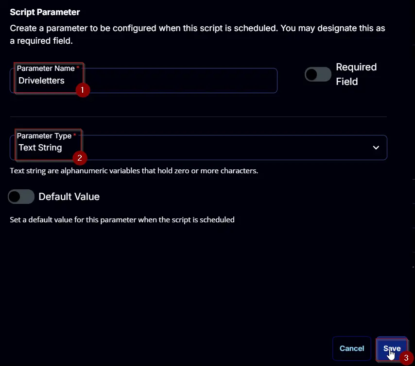
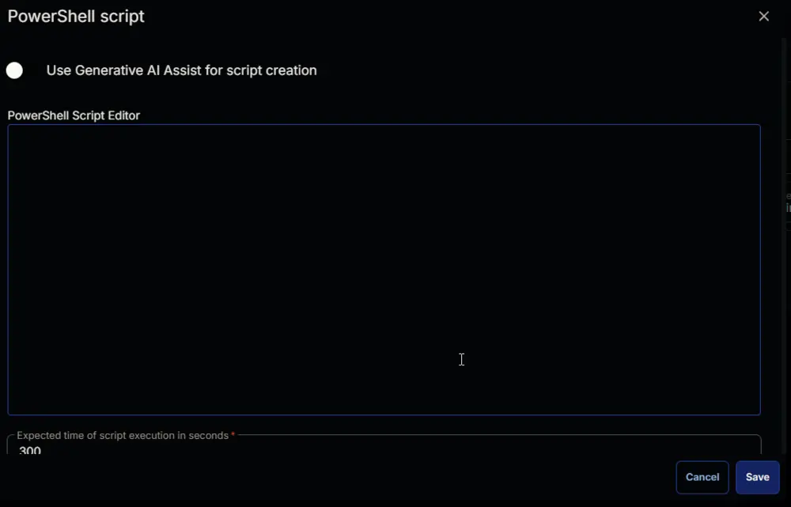

## Summary

This document outlines how to run a PowerShell equivalent of chkdsk on any or all drives, with the option to repair if desired. It provides a ConnectWise RMM implementation of the [Invoke-RepairVolume](/docs/5fc50641-00ec-41c0-b4c8-472d93cd8cfe) agnostic script.

## Sample Run


## Dependencies

[Invoke-RepairVolume](/docs/5fc50641-00ec-41c0-b4c8-472d93cd8cfe)

## User Parameters

| Name        | Example  | Required | Type        | Description                                                                                      |
|-------------|----------|----------|-------------|--------------------------------------------------------------------------------------------------|
| Driveletters| C, D, E | False    | Text String | The letters of the target drives. The script will fall back to all internal drives if left blank. |
| Repair      | 0/1      | False    | Flag        | Toggles the repair option.                                                                       |
| Full        | 0/1      | False    | Flag        | Toggles the full offline repair option when using repair.                                        |


## Task Creation

Create a new `Script Editor` style script in the system to implement this task.


**Name:** `Repair Volume`  
**Description:** `Runs a PowerShell equivalent of chkdsk on any or all drives, with the option to repair if desired.`  
**Category:** `Maintenance`  


## Parameters

### Driveletters

Add a new parameter by clicking the `Add Parameter` button present at the top-right corner of the screen.


This screen will appear.


- Set `Driveletters` in the `Parameter Name` field.
- Select `Text String` from the `Parameter Type` dropdown menu.
- Click the `Save` button.



### Repair

Add a new parameter by clicking the `Add Parameter` button present at the top-right corner of the screen.


This screen will appear.


- Set `Repair` in the `Parameter Name` field.
- Select `Flag` from the `Parameter Type` dropdown menu.
- Click the `Save` button.


### Full

Add a new parameter by clicking the `Add Parameter` button present at the top-right corner of the screen.


This screen will appear.


- Set `Full` in the `Parameter Name` field.
- Select `Flag` from the `Parameter Type` dropdown menu.
- Click the `Save` button.


## Task

Navigate to the Script Editor section and start by adding a row. You can do this by clicking the `Add Row` button at the bottom of the script page.


A blank function will appear.


### Row 1 Function: PowerShell Script

Search and select the `PowerShell Script` function.


The following function will pop up on the screen:



Paste in the following PowerShell script and set the `Expected time of script execution in seconds` to `300` seconds. Click the `Save` button.

```Powershell
#region parameters
$Driveletters = '@Driveletters@'
if ( !([String]::IsNullOrWhiteSpace($Driveletters)) ) {
    $Driveletters = $($Driveletters -replace '\s', '').trimend(',')
}
$Repair = '@Repair@'
$Full = '@Full@'
$Parameters = @{}
if ( $Driveletters -match '^[A-z](,(\s{0,})[A-z]){0,25}$' ) {
    $Driveletters = $Driveletters -split ','
    $parameters.Add('Driveletters', $Driveletters)
}
if ($Repair -match '1|Yes|True') {
    $Parameters.Add('Repair', $true)
}
if ($Full -match '1|Yes|True') {
    $Parameters.Add('Full', $true)
}
#endregion
#region Setup - Variables
$ProjectName = 'Invoke-RepairVolume'
[Net.ServicePointManager]::SecurityProtocol = [enum]::ToObject([Net.SecurityProtocolType], 3072)
$BaseURL = 'https://file.provaltech.com/repo'
$PS1URL = "$BaseURL/script/$ProjectName.ps1"
$WorkingDirectory = "C:\ProgramData\_automation\script\$ProjectName"
$PS1Path = "$WorkingDirectory\$ProjectName.ps1"
$WorkingPath = $WorkingDirectory
$LogPath = "$WorkingDirectory\$ProjectName-log.txt"
$ErrorLogPath = "$WorkingDirectory\$ProjectName-Error.txt"
#endregion
#region Setup - Folder Structure
New-Item -Path $WorkingDirectory -ItemType Directory -ErrorAction SilentlyContinue | Out-Null
$response = Invoke-WebRequest -Uri $PS1URL -UseBasicParsing
if (($response.StatusCode -ne 200) -and (!(Test-Path -Path $PS1Path))) {
    throw "No pre-downloaded script exists and the script '$PS1URL' failed to download. Exiting."
} elseif ($response.StatusCode -eq 200) {
    Remove-Item -Path $PS1Path -ErrorAction SilentlyContinue
    [System.IO.File]::WriteAllLines($PS1Path, $response.Content)
}
if (!(Test-Path -Path $PS1Path)) {
    throw 'An error occurred and the script was unable to be downloaded. Exiting.'
}
#endregion
#region Execution
if ($Parameters) {
    & $PS1Path @Parameters
} else {
    & $PS1Path
}
#endregion
#region log verification
if ( !(Test-Path $LogPath) ) {
    throw 'PowerShell Failure. A Security application seems to have restricted the execution of the PowerShell Script.'
}
if ( Test-Path $ErrorLogPath ) {
    $ErrorContent = ( Get-Content -Path $ErrorLogPath )
    throw $ErrorContent
}
Get-Content -Path $LogPath
#endregion
```


### Row 2 Function: Script Log

Add a new row by clicking the `Add Row` button.


A blank function will appear.


Search and select the `Script Log` function.


The following function will pop up on the screen:


In the script log message, simply type `%Output%` and click the `Save` button.


Click the `Save` button at the top-right corner of the screen to save the script.


## Output

- Script log
