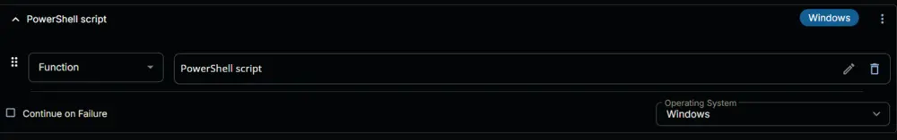

## Summary

This script is used to reset Windows update settings. Running the script does not guarantee resolution of any issues with Windows updates; it simply attempts to reset the settings. This is a ConnectWise RMM implementation of the [Repair-WindowsUpdate](/docs/39345bfd-d9e2-4e68-9d7a-3e8b443140cc) agnostic script.

## Sample Run


## Dependencies

[Repair-WindowsUpdate](/docs/39345bfd-d9e2-4e68-9d7a-3e8b443140cc)

## User Parameters

| Name     | Example | Required | Type  | Description                                                                 |
|----------|---------|----------|-------|-----------------------------------------------------------------------------|
| SfcScan  | 0/1     | False    | Flag  | This flag toggles an optional SFC scan.                                    |
| DISMRepair  | 0/1     | False    | Flag  | This flag toggles an optional DISM Repair.                                    |


## Task Creation

Create a new `Script Editor` style script in the system to implement this task.


**Name:** `Repair Windows Update`  \
**Description:** `Script used to reset Windows update settings. It is not necessary that running the script will resolve any issue with the Windows updates. It will simply attempt to reset Windows update settings.`  \
**Category:** `Patching`  


## Parameters

### SfcScan:

Add a new parameter by clicking the `Add Parameter` button present at the top-right corner of the screen.


This screen will appear.


- Set `SfcScan` in the `Parameter Name` field.
- Select `Flag` from the `Parameter Type` dropdown menu.
- Click the `Save` button.


Add another parameter by clicking the Add Parameter button


- Set `DismRepair` in the `Parameter Name` field.
- Select `Flag` from the `Parameter Type` dropdown menu.
- Click the `Save` button.


## Task

Navigate to the Script Editor section and start by adding a row. You can do this by clicking the `Add Row` button at the bottom of the script page.


A blank function will appear.


### Row 1 Function: PowerShell Script

Search and select the `PowerShell Script` function.




The following function will pop up on the screen:


Paste in the following PowerShell script and set the `Expected time of script execution in seconds` to `3600` seconds. Click the `Save` button.

```
#region parameters
$SfcScan = '@SfcScan@'
$DISMRepair = '@DISMRepair@'
 
$Parameters = @{}
 
if ( $SfcScan -match '1|Yes|True' ) {
    $Parameters.Add('SfcScan', $true)
}
if ( $DISMRepair -match '1|Yes|True' ) {
	$Parameters.Add('DISMRepair', $true)
}
#endregion
#region Setup - Variables
$ProjectName = 'Repair-WindowsUpdate'
[Net.ServicePointManager]::SecurityProtocol = [enum]::ToObject([Net.SecurityProtocolType], 3072)
$BaseURL = 'https://file.provaltech.com/repo'
$PS1URL = "$BaseURL/script/$ProjectName.ps1"
$WorkingDirectory = "C:\ProgramData\_automation\script\$ProjectName"
$PS1Path = "$WorkingDirectory\$ProjectName.ps1"
$WorkingPath = $WorkingDirectory
$LogPath = "$WorkingDirectory\$ProjectName-log.txt"
$ErrorLogPath = "$WorkingDirectory\$ProjectName-Error.txt"
#endregion
#region Setup - Folder Structure
New-Item -Path $WorkingDirectory -ItemType Directory -ErrorAction SilentlyContinue | Out-Null
$response = Invoke-WebRequest -Uri $PS1URL -UseBasicParsing
if (($response.StatusCode -ne 200) -and (!(Test-Path -Path $PS1Path))) {
    throw "No pre-downloaded script exists and the script '$PS1URL' failed to download. Exiting."
} elseif ($response.StatusCode -eq 200) {
    Remove-Item -Path $PS1Path -ErrorAction SilentlyContinue
    [System.IO.File]::WriteAllLines($PS1Path, $response.Content)
}
if (!(Test-Path -Path $PS1Path)) {
    throw 'An error occurred and the script was unable to be downloaded. Exiting.'
}
#endregion
#region Execution
if ($Parameters) {
    & $PS1Path @Parameters
} else {
    & $PS1Path
}
#endregion
#region log verification
if ( !(Test-Path $LogPath) ) {
    throw 'PowerShell Failure. A Security application seems to have restricted the execution of the PowerShell Script.'
}
if ( Test-Path $ErrorLogPath ) {
    $ErrorContent = ( Get-Content -Path $ErrorLogPath )
    throw $ErrorContent
}
Get-Content -Path $LogPath
#endregion
```


### Row 2 Function: Script Log

Add a new row by clicking the `Add Row` button.


A blank function will appear.


Search and select the `Script Log` function.


The following function will pop up on the screen:


In the script log message, simply type `%Output%` and click the `Save` button.


Click the `Save` button at the top-right corner of the screen to save the script.


## Completed Script


## Output

- Script log
