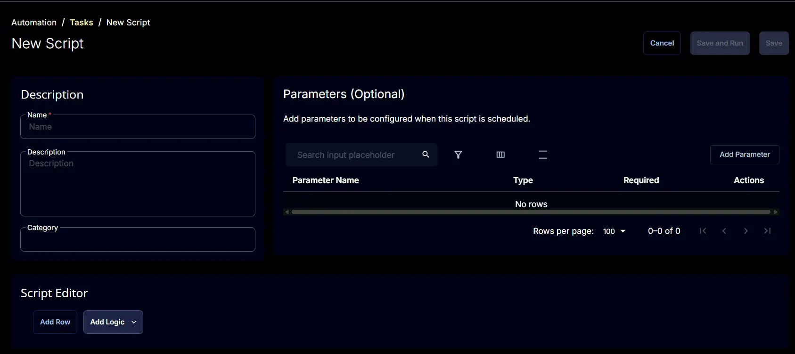
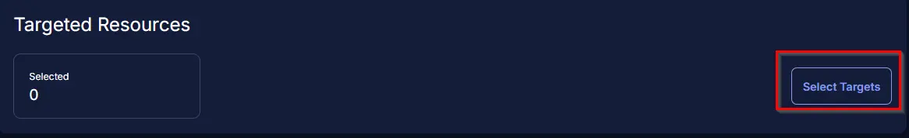
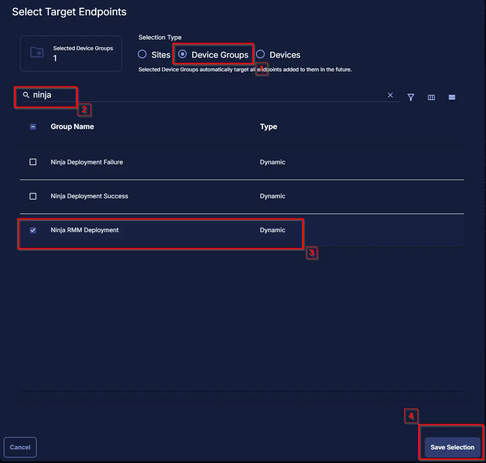

## Summary
This script deploys the NinjaRMMAgent to MAC OS, based on the article provided below:
[Agent Installation Tokenization](https://ninjarmm.zendesk.com/hc/en-us/articles/27524794230669-NinjaOne-Agent-Installation-Agent-Tokenization).
It depends on the Authorization token, which will be kept in the company or site custom fields.

## Sample Run


## Dependencies
[CW RMM - Ninja Migration Custom fields](/docs/1b41da88-5b9a-436f-997b-39c8f72615ae)

[Group - Ninja RMM Deployment](/docs/b2d8d0e7-2310-43ae-b623-4e9fc8d295b0)

[Solution - CW RMM to Ninja Migration](/docs/b388aa6a-3e60-482c-9a13-ce6425c55dd3)

## Task Creation

### Script Details

#### Step 1

Navigate to `Automation` ➞ `Tasks`  


#### Step 2

Create a new `Script Editor` style task by choosing the `Script Editor` option from the `Add` dropdown menu  


The `New Script` page will appear on clicking the `Script Editor` button:  


#### Step 3 

**Name:** `NinjaRMM Deployment - [MAC]`  
**Description:** `This script deploys the NinjaRMMAgent to MAC OS, based on the article provided below:
https://ninjarmm.zendesk.com/hc/en-us/articles/27524794230669-NinjaOne-Agent-Installation-Agent-Tokenization.
It depends on the Authorization token, which will be kept in the company or site custom fields.`  
**Category:** `Application`


### Script Editor

Click the `Add Row` button in the `Script Editor` section to start creating the script  


A blank function will appear:  


`Note: Limit all the function to MacOs machines.`


#### Row 1 Function: `Pre-defined Variable`

Select the Pre-defined Variable and provide the details and click on Save.

Variable: `Deployment`

Custom Field: `Ninja Deployment Enable`


After clicking on Save the Pre-defined will show data as:


#### Row 2 Function: `Pre-defined Variable`

Select the Pre-defined Variable and provide the details and click on Save.
Make sure to select the `Ninja Deployment Exclude` site level custom field.

Variable: `DeploymentExL`

Custom Field: `Ninja Deployment Exclude`


After clicking on Save the Pre-defined will show data as:


#### Row 3 Function: `Pre-defined Variable`

Select the Pre-defined Variable and provide the details and click on Save.
Make sure to select the `Ninja Deployment Exclude` endpoint level custom field.

Variable: `DeploymentExC`

Custom Field: `Ninja Deployment Exclude`


After clicking on Save the Pre-defined will show data as:


#### Row 4 Function: `Pre-defined Variable`

Select the Pre-defined Variable and provide the details and click on Save.

Variable: `OrgID`

Custom Field: `Ninja_Org_ID`


After clicking on Save the Pre-defined will show data as:


#### Row 5 Function: `Pre-defined Variable`

Select the Pre-defined Variable and provide the details and click on Save.

Variable: `LocID`

Custom Field: `Ninja_Site_ID`


After clicking on Save the Pre-defined will show data as:


#### Row 6 Logic: If/Then/Else

Add a logic If/Else/Then by clicking the Add Logic button:


#### Row 6a Condition: Custom Field Contains

In the IF part, enter `-` in the right box for the Custom Field "Ninja_Org_ID" contains part.  


#### Row 6b Function: Bash Script

Add another row and select the `Bash Script` function.


The following function will pop up on the screen:


Paste in the following Bash script and leave the expected time of script execution to `900` seconds. Click the `Save` button.

```
sudo curl https://app.ninjarmm.com/ws/api/v2/generic-installer/NinjaOneAgent-x64.pkg -L --output /tmp/NinjaOneAgent-x64.pkg && sudo sh -c 'echo "@OrgID@" > /tmp/.~' && sudo installer -pkg /tmp/NinjaOneAgent-x64.pkg -target / && echo "Installation successful." || { echo "Failed to install Ninja RMM agent."; exit 1; }
```


Limit the bash file to run on `Mac` machines only.


#### Row 6c Logic: If/Then


#### Row 6c(i) Condition: Output Contains

In the IF part, enter `Failed to install Ninja` in the right box of the "Output Contains" part.  


#### Row 6c(ii) Function: Set Custom Field

Add a new row by clicking the `Add Row` button.


Search and select the `Set Custom Field` function.


Search and select `Ninja Deployment Result` in the `Search Custom Field` field, set `Failed` in the `Value` field, and click the `Save` button.


#### Row 6c(iii) Function: Script Exit

Add a new row in the `IF` part by clicking on the Add row button.  


In the script exit message, simply type `The Ninja Deployment failed on the Mac Agent. Refer to the logs: %output%`  


#### Row 6d Function: Script Log

Add a new row by clicking the `Add Row` button.


Search and select the `Script Log` function.


The following function will pop up on the screen:


In the script log message, simply type `%Output%` and click the `Save` button.


#### Row 6e Function: Set Custom Field

Add a new row by clicking the `Add Row` button after `END IF`.


Search and select the `Set Custom Field` function.


Search and select `Ninja Deployment Result` in the `Search Custom Field` field, set `Success` in the `Value` field, and click the `Save` button.


#### Row 6f Function: Script Exit

Add a new row by clicking on the Add row button.  


In the script exit message, leave blank


#### Row 6g - Else Section

#### Row 6g Logic: If/Then

Add a logic If/Then by clicking the Add Logic button:


#### Row 6g (i) Condition: Custom Field Contains

In the IF part, enter **-** in the right box for the Custom Field "Ninja_Site_ID" contains part.  


#### Row 6g (ii) Function: Bash Script

Add another row and select the `Bash Script` function.


The following function will pop up on the screen:


Paste in the following Bash script and leave the expected time of script execution to `900` seconds. Click the `Save` button.

```
sudo curl https://app.ninjarmm.com/ws/api/v2/generic-installer/NinjaOneAgent-x64.pkg -L --output /tmp/NinjaOneAgent-x64.pkg && sudo sh -c 'echo "@LocID@" > /tmp/.~' && sudo installer -pkg /tmp/NinjaOneAgent-x64.pkg -target / && echo "Installation successful." || { echo "Failed to install Ninja RMM agent."; exit 1; }
```


Limit the bash file to run on `Mac` machines only.


#### Row 6h Logic: If/Then

Add a logic If/Then by clicking the Add Logic button


#### Row 6h(i) Condition: Output Contains

In the IF part, enter `Failed to install Ninja` in the right box of the "Output Contains" part.  


#### Row 6h(ii) Function: Set Custom Field

Add a new row by clicking the `Add Row` button.


Search and select the `Set Custom Field` function.


Search and select `Ninja Deployment Result` in the `Search Custom Field` field, set `Failed` in the `Value` field, and click the `Save` button.


#### Row 6h(iii) Function: Script Exit

Add a new row by clicking on the Add row button.  


In the script exit message, simply type `The Ninja Deployment failed on the Mac Agent. Refer to the logs: %output%`  


#### Row 6i Function: Script Log

After `END IF` add a new row by clicking the `Add Row` button.


Search and select the `Script Log` function.


The following function will pop up on the screen:


In the script log message, simply type `%Output%` and click the `Save` button.


#### Row 6j Function: Set Custom Field

Add a new row by clicking the `Add Row` button.


Search and select the `Set Custom Field` function.


Search and select `Ninja Deployment Result` in the `Search Custom Field` field, set `Success` in the `Value` field, and click the `Save` button.


#### Row 6k Function: Script Exit

Add a new row by clicking on the Add row button.  


In the script exit message, leave blank


#### Row 7 Function: Script Exit

Add a new row by clicking on the `Add row` after `END IF` button.  


In the script exit message write, `The Ninja_Org_ID and Ninja_Site_ID both are empty. The script needs the authorization token for its working.`


## Save Task

Click the `Save` button at the top-right corner of the screen to save the script.  


## Completed Task


## Deployment

This task is required to be deployed using a dynamic group.

It can be scheduled to run every 1 hour. Follow the below deployment step to schedule it.

- Go to Automation > Tasks.

- Search for `NinjaRMM Deployment - [MAC]`

- Then click on Schedule


- Select the Target group



- Click Device Group -> Search for Ninja -> Select `Ninja RMM Deployment` group and click save selection



- Click on Schedule option, and set the time and click on Repeat to set it to run every hour


## Output

- Custom field
- Script Log