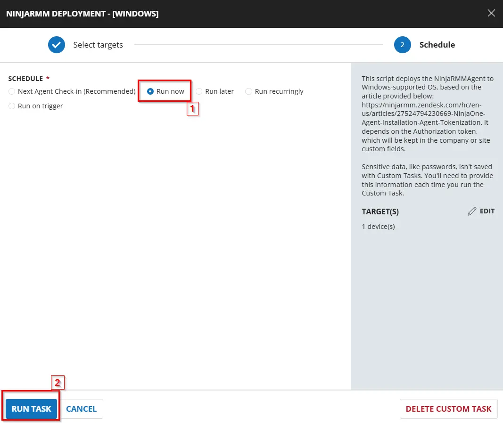
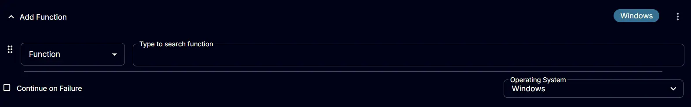
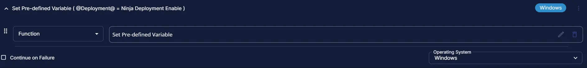
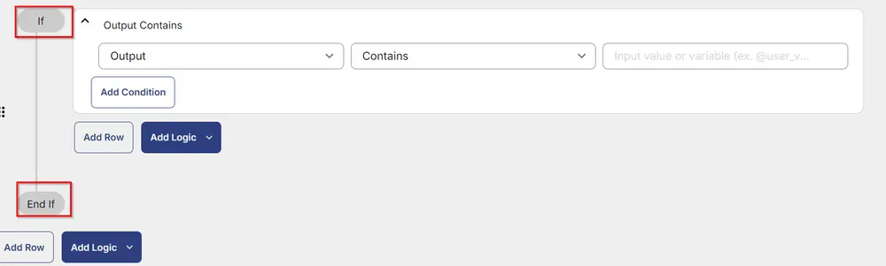
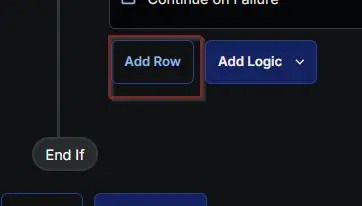
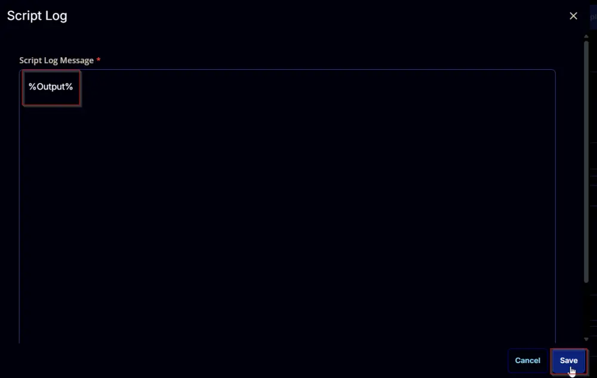
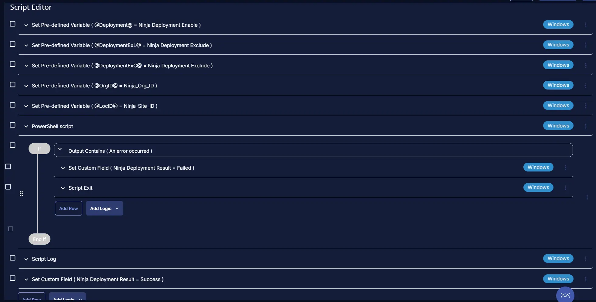

## Summary

This script deploys the NinjaRMMAgent to Windows-supported OS, based on the article provided below:
[Agent Installation Tokenization](https://ninjarmm.zendesk.com/hc/en-us/articles/27524794230669-NinjaOne-Agent-Installation-Agent-Tokenization).
It depends on the Authorization token, which will be kept in the company or site custom fields.

## Sample Run




## Dependencies

[CW RMM - Ninja Migration Custom fields](/docs/1b41da88-5b9a-436f-997b-39c8f72615ae)

[Group - Ninja RMM Deployment](/docs/b2d8d0e7-2310-43ae-b623-4e9fc8d295b0)

[Solution - CW RMM to Ninja Migration](/docs/b388aa6a-3e60-482c-9a13-ce6425c55dd3)

## Task Creation

### Script Details

#### Step 1

Navigate to `Automation` ➞ `Tasks`  


#### Step 2

Create a new `Script Editor` style task by choosing the `Script Editor` option from the `Add` dropdown menu  


The `New Script` page will appear on clicking the `Script Editor` button:  


#### Step 3

**Name:** `NinjaRMM Deployment - [Windows]`  
**Description:** `This script deploys the NinjaRMMAgent to Windows-supported OS, based on the article provided below:
https://ninjarmm.zendesk.com/hc/en-us/articles/27524794230669-NinjaOne-Agent-Installation-Agent-Tokenization.
It depends on the Authorization token, which will be kept in the company or site custom fields.`  
**Category:** `Application`


### Script Editor

Click the `Add Row` button in the `Script Editor` section to start creating the script  


A blank function will appear:  


`Note: Limit all the function to Windows machines.`


#### Row 1 Function: `Pre-defined Variable`

Select the Pre-defined Variable and provide the details and click on Save.

Variable: `Deployment`

Custom Field: `Ninja Deployment Enable`


After clicking on Save the Pre-defined will show data as:



#### Row 2 Function: `Pre-defined Variable`

Select the Pre-defined Variable and provide the details and click on Save.
Make sure to select the `Ninja Deployment Exclude` site level custom field.

Variable: `DeploymentExL`

Custom Field: `Ninja Deployment Exclude`


After clicking on Save the Pre-defined will show data as:


#### Row 3 Function: `Pre-defined Variable`

Select the Pre-defined Variable and provide the details and click on Save.
Make sure to select the `Ninja Deployment Exclude` endpoint level custom field.

Variable: `DeploymentExC`

Custom Field: `Ninja Deployment Exclude`


After clicking on Save the Pre-defined will show data as:


#### Row 4 Function: `Pre-defined Variable`

Select the Pre-defined Variable and provide the details and click on Save.

Variable: `OrgID`

Custom Field: `Ninja_Org_ID`


After clicking on Save the Pre-defined will show data as:


#### Row 5 Function: `Pre-defined Variable`

Select the Pre-defined Variable and provide the details and click on Save.

Variable: `LocID`

Custom Field: `Ninja_Site_ID`


After clicking on Save the Pre-defined will show data as:


#### Row 6 Function: PowerShell Script

Search and select the `PowerShell Script` function.


The following function will pop up on the screen:


Paste in the following PowerShell script and set the `Expected time of script execution in seconds` to `900` seconds. Click the `Save` button.

```PowerShell
[Net.ServicePointManager]::SecurityProtocol = [enum]::ToObject([Net.SecurityProtocolType], 3072)
$PreValidation = Get-ChildItem -Path HKLM:\SOFTWARE\Microsoft\Windows\CurrentVersion\Uninstall, HKLM:\SOFTWARE\Wow6432Node\Microsoft\Windows\CurrentVersion\Uninstall | Get-ItemProperty | Where-Object { $_.DisplayName -match 'NinjaRMMAgent' } | Select-Object -ExpandProperty DisplayName
if ($PreValidation -match 'NinjaRMMAgent') {
    return 'The Ninja RMM agent already installed'
}
else {
    #region Setup - Variables
    $URL = 'https://app.ninjarmm.com/ws/api/v2/generic-installer/NinjaOneAgent-x86.msi'
    $WorkingDirectory = 'C:\ProgramData\_automation\script\NinjaRMM'
    $Path = "$WorkingDirectory\NinjaOneAgent-x86.msi"
    $NinjaDeploy = '@Deployment@'
    $NinjaDeployExL = '@DeploymentExL@'
    $NinjaDeployExC = '@DeploymentExc@'
    $LocID = '@LocID@'
    $OrgID = '@OrgID@'
    if ($NinjaDeploy -notmatch '@Deployment' -and $NinjaDeploy -eq 'True') {
        if ($NinjaDeployExL -notmatch '@DeploymentExL' -and $NinjaDeployExL -eq 'True') {
            return 'An error occurred: The Site level exclusion is applied for the computer'
        } 
        if ($NinjaDeployExC -notmatch '@DeploymentExC' -and $NinjaDeployExC -eq 'True') {
            return 'An error occurred: The computer level exclusion is applied for the endpoint'
        }
        if ($LocID -notmatch '@LocID' -and $LocID -match '[A-z0-9]') {
            $AuthToken = $LocID
        }
        elseif ($OrgID -notmatch '@OrgID' -and $OrgID -match '[A-z0-9]') {
            $AuthToken = $OrgID
        }
        else {
            return 'An error occurred: The authentication token is missing at the company and site level. Please provide token at least to one custom field'
        }
    }
    else {
        return 'An error occurred: The deployment is not enabled at the company level'
    }
    #endregion
    #region Setup - Folder Structure
    if (!(Test-Path $WorkingDirectory)) {
        try {
            New-Item -Path $WorkingDirectory -ItemType Directory -Force -ErrorAction Stop | Out-Null
        }
        catch {
            return "An error occurred: Failed to Create $WorkingDirectory. Reason: $($Error[0].Exception.Message)"
        }
    }
    if (-not ((Get-Acl $WorkingDirectory).Access | Where-Object { $_.IdentityReference -Match 'Everyone' }).FileSystemRights -Match 'FullControl') {
        $Acl = Get-Acl $WorkingDirectory
        $AccessRule = New-Object System.Security.AccessControl.FileSystemAccessRule('Everyone', 'FullControl', 'ContainerInherit, ObjectInherit', 'none', 'Allow')
        $Acl.AddAccessRule($AccessRule)
        Set-Acl $WorkingDirectory $Acl
    }
    #endregion

    #region Download Installer
    $response = Invoke-WebRequest -Uri $URL -OutFile $Path -UseBasicParsing
    if (!(Test-Path -Path $Path)) {
        return 'An error occurred: The installer was unable to be downloaded. Exiting.'
    }
    #endregion

    #region Install Ninja RMM Agent
    $Arguments = "-i `"$Path`" /qn REBOOT=ReallySuppress TOKENID=`"$AuthToken`""
    Start-Process -FilePath "msiexec.exe" -ArgumentList $Arguments -Wait -NoNewWindow
    Start-Sleep -Seconds 120
    $Validation = Get-ChildItem -Path HKLM:\SOFTWARE\Microsoft\Windows\CurrentVersion\Uninstall, HKLM:\SOFTWARE\Wow6432Node\Microsoft\Windows\CurrentVersion\Uninstall | Get-ItemProperty | Where-Object { $_.DisplayName -match 'NinjaRMMAgent' } | Select-Object -ExpandProperty DisplayName
    if ($Validation -match 'NinjaRMMAgent') {
        return 'The installation succeeded for the Ninja RMM agent'
    }
    else {
        return 'An error occurred: The Ninja RMM agent deployment failed.'
    }
}
#endregion
```


#### Row 7 Logic: If/Then

 
 

#### Row 7a Condition: Output Contains

In the IF part, enter `An error occurred` in the right box of the "Output Contains" part.  


#### Row 7b Function: Set Custom Field

Add a new row in the IF part by clicking the `Add Row` button.



Search and select the `Set Custom Field` function.


Search and select `Ninja Deployment Result` in the `Search Custom Field` field, set `Failed` in the `Value` field, and click the `Save` button.


#### Row 7c Function: Script Exit

In the IF part, add a new row by clicking on the Add row button.  


In the script exit message, simply type `The Ninja deployment failed. Refer to the logs: %Output%`  


#### Row 8 Function: Script Log

Add a new row by clicking the `Add Row` button after `END IF`


Search and select the `Script Log` function.


The following function will pop up on the screen:


In the script log message, simply type `%Output%` and click the `Save` button.



#### Row 9 Function: Set Custom Field

Add a new row by clicking the `Add Row` button.


Search and select the `Set Custom Field` function.


Search and select `Ninja Deployment Result` in the `Search Custom Field` field, set `Success` in the `Value` field, and click the `Save` button.


## Save Task

Click the `Save` button at the top-right corner of the screen to save the script.  


## Completed Task



## Deployment

This task is required to be deployed using a dynamic group.

It can be scheduled to run every 1 hour. Follow the below deployment step to schedule it.

- Go to Automation > Tasks.

- Search for `NinjaRMM Deployment - [Windows]`

- Then click on Schedule


- Select the Target group [Ninja RMM Deployment](/docs/b2d8d0e7-2310-43ae-b623-4e9fc8d295b0)


- Click Device Group -> Search for Ninja -> Select `Ninja RMM Deployment` group and click save selection


- Click on Schedule option, and set the time and click on Repeat to set it to run every hour


## Output

- Custom field
- Script Log
