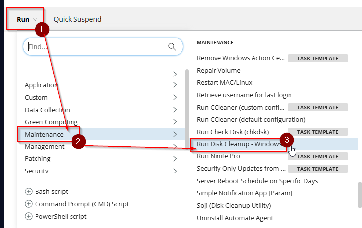
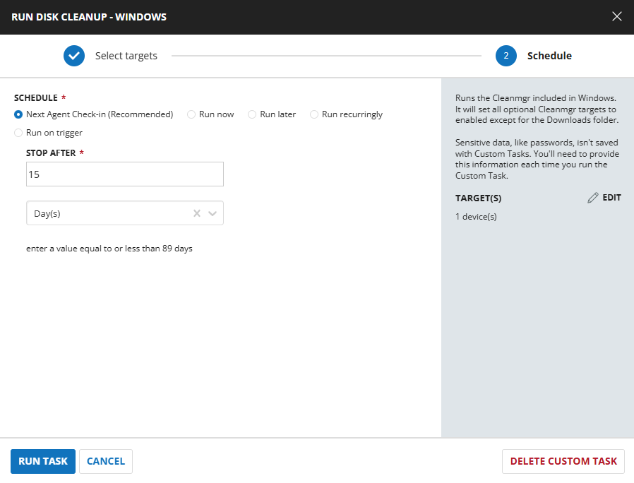
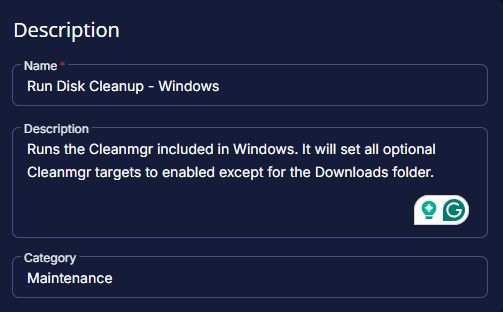
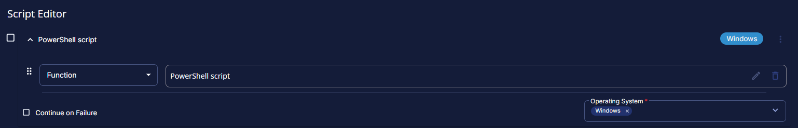
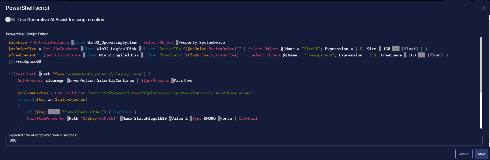
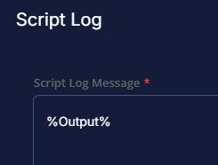
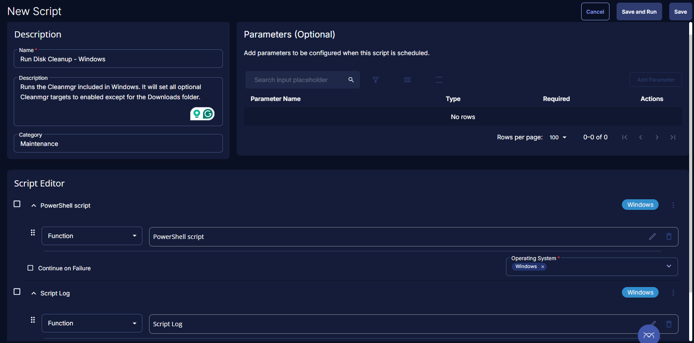

## Summary

This is a CW RMM task that will run the Cleanmgr included in Windows. It will set all optional Cleanmgr targets to enabled, except for the Downloads folder. The script will output the disk space free from before and after the tool was run.

## Sample Run




## Task Creation

### Script Details

#### Step 1

Navigate to `Automation` ➞ `Tasks`  


#### Step 2

Create a new `Script Editor` style task by choosing the `Script Editor` option from the `Add` dropdown menu  


The `New Script` page will appear on clicking the `Script Editor` button:  


#### Step 3

Fill in the following details in the `Description` section:  

**Name:** `Run Disk Cleanup - Windows`  
**Description:** `Runs the Cleanmgr included in Windows. It will set all optional Cleanmgr targets to enabled except for the Downloads folder.`  
**Category:** `Maintenance`



### Script Editor

Click the `Add Row` button in the `Script Editor` section to start creating the script  


A blank function will appear:  


#### Row 1 Function: `PowerShell script`



Paste in the following PowerShell script and set the expected time of script execution to 300 seconds.
```PowerShell
$osDrive = Get-CimInstance -Class Win32_OperatingSystem | Select-Object -Property SystemDrive
$osDriveSize = Get-CimInstance -Class Win32_LogicalDisk -filter "DeviceID='$($osDrive.SystemDrive)'" | Select-Object @{Name = "SizeGB"; Expression = { $_.Size / 1GB -as [float] } }
$freeSpaceGB = (Get-CimInstance -Class Win32_LogicalDisk -Filter "DeviceID='$($osDrive.SystemDrive)'" | Select-Object @{Name = "FreeSpaceGB"; Expression = { $_.FreeSpace / 1GB -as [float] } }).FreeSpaceGB

if(Test-Path -Path "$env:SystemRoot\System32\cleanmgr.exe") {
    Get-Process cleanmgr -ErrorAction SilentlyContinue | Stop-Process -PassThru
    
    $volumeCaches = Get-ChildItem "HKLM:\Software\Microsoft\Windows\CurrentVersion\Explorer\VolumeCaches"
    foreach($key in $volumeCaches)
    {
        if ($key -like "*DownloadsFolder") { continue }
        New-ItemProperty -Path "$($key.PSPath)" -Name StateFlags1619 -Value 2 -Type DWORD -Force | Out-Null
    }

    Start-Process -Wait "$env:SystemRoot\System32\cleanmgr.exe" -ArgumentList "/sagerun:1619"
 }
 
 $newFreeSpaceGB = (Get-CimInstance -Class Win32_LogicalDisk -Filter "DeviceID='$($osDrive.SystemDrive)'" | Select-Object @{Name = "FreeSpaceGB"; Expression = { $_.FreeSpace / 1GB -as [float] } }).FreeSpaceGB
 
 return "Previous Drive Space Available = $freeSpaceGB GB`nCurrent Drive Space Available = $newFreeSpaceGB GB"
 ```



Save and move to the next row

#### Row 1 Function: `Script Log`


In the script log message, simply type `%output%` so that the script will send the results of the PowerShell script above to the output on the Automation tab for the target device.



## Save Task

Click the `Save` button at the top-right corner of the screen to save the script.  


## Completed Task



## Output

- Script Log