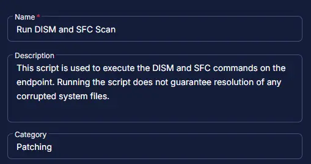
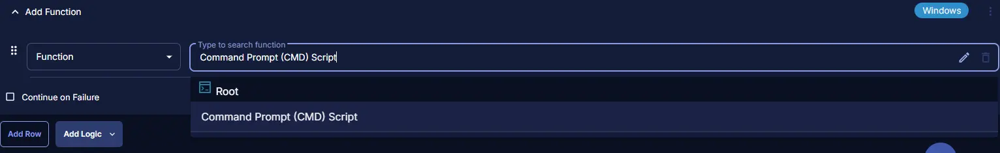
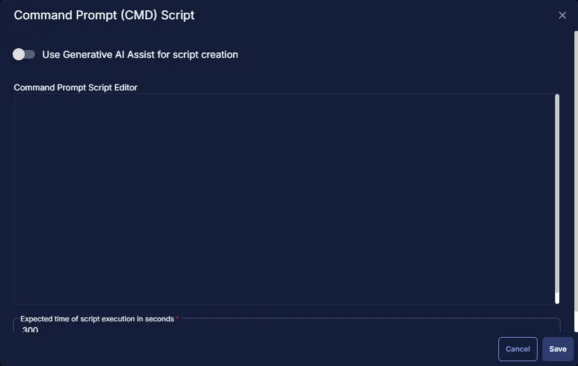
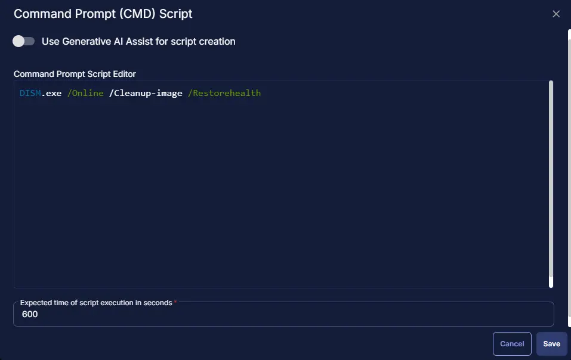
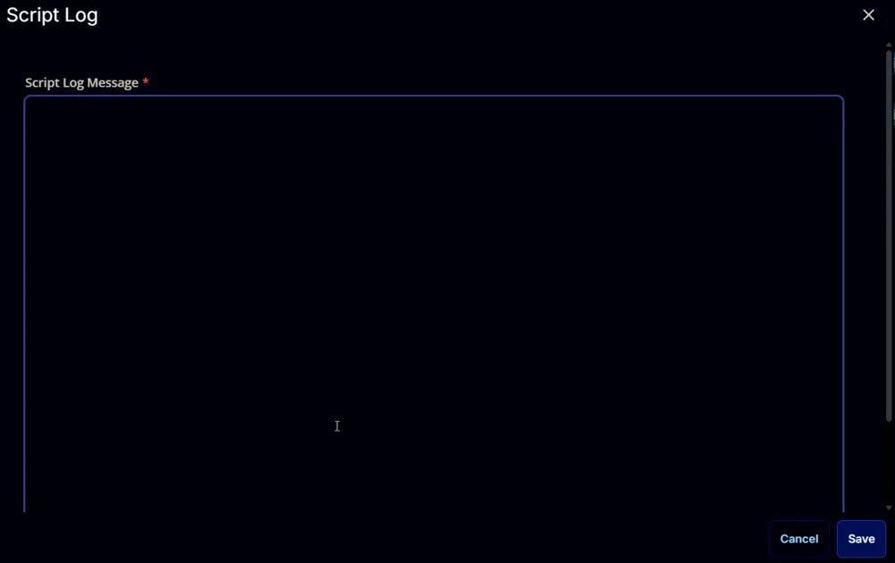
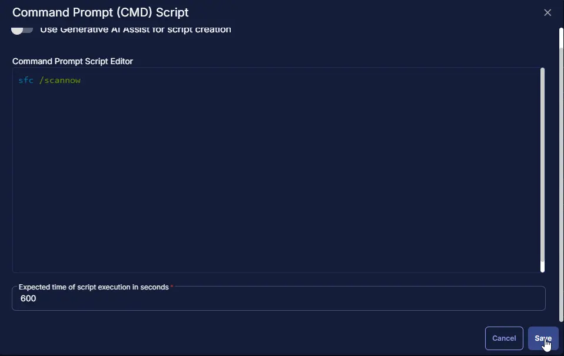
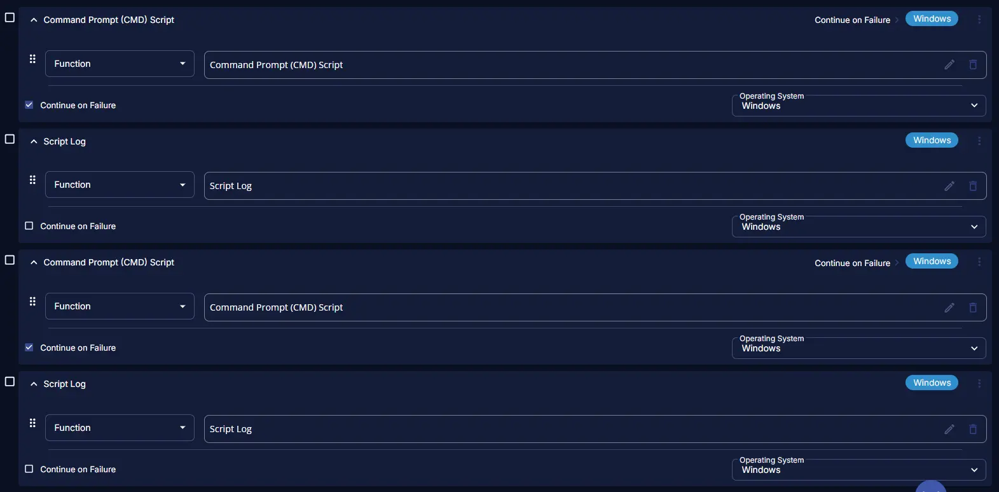

## Summary

This script is used to execute the DISM and SFC commands on the endpoint. Running the script does not guarantee resolution of any corrupted system files.

## Task Creation

Create a new `Script Editor` style script in the system to implement this task.


**Name:** `Run DISM and SFC Scan`  \
**Description:** `This script is used to execute the DISM and SFC commands on the endpoint. Running the script does not guarantee resolution of any corrupted system files.`  \
**Category:** `Patching`  



## Task

Navigate to the Script Editor section and start by adding a row. You can do this by clicking the `Add Row` button at the bottom of the script page.


A blank function will appear.


### Row 1 Function: Command Prompt Script

Search and select the `Command Prompt (CMD) Script` function.



The following function will pop up on the screen:



Paste in the following Command Prompt script and set the `Expected time of script execution in seconds` to `600` seconds. Click the `Save` button.

```
DISM.exe /Online /Cleanup-image /Restorehealth
```



### Row 2 Function: Script Log

Add a new row by clicking the `Add Row` button.


A blank function will appear.


Search and select the `Script Log` function.


The following function will pop up on the screen:



In the script log message, simply type `%Output%` and click the `Save` button.


### Row 3 Function: Command Prompt Script

Search and select the `Command Prompt (CMD) Script` function.


The following function will pop up on the screen:


Paste in the following Command Prompt script and set the `Expected time of script execution in seconds` to `600` seconds. Click the `Save` button.

```
sfc /scannow
```



### Row 4 Function: Script Log

Add a new row by clicking the `Add Row` button.


A blank function will appear.


Search and select the `Script Log` function.


The following function will pop up on the screen:


In the script log message, simply type `%Output%` and click the `Save` button.


Click the `Save` button at the top-right corner of the screen to save the script.


## Completed Task



## Output

- Script log