## Summary

The ultimate objective of the task is to establish and oversee two scheduled tasks (Winget Update All [System] and Winget Update All [Logged on User]) designed to update installed applications utilizing Winget on Windows 10 and 11.

The task can only be executed against the companies where the company-level custom field [WingetUpdateAll_Task_Create](/docs/40e64c1d-ca29-4c85-9a72-a48b1082b8e1) is marked.

## Sample Run

/image_1.png)

/image_2.png)

## Dependencies

- [Custom Field - Company - WingetUpdateAll_Task_Create](/docs/40e64c1d-ca29-4c85-9a72-a48b1082b8e1)
- [Custom Field - Company - WingetUpdateAll_Task_Delete](/docs/a398be5b-5709-4ab5-ac33-7feca8fbc00a)
- [Custom Field - Company - WingetUpdateAll_UserTask_Disable](/docs/8c8bc8b0-817e-4903-bd09-90df4c25ab9e)
- [Custom Field - Site - WingetUpdateAll_Task_Exclude](/docs/0c299d28-5fcb-4a1e-a341-1c5e78f74cfb)
- [Custom Field - Site - WingetUpdateAll_UserTask_Disable](/docs/280aafc8-9ab0-4cca-b499-d107b47de432)
- [Custom Field - EndPoint - WingetUpdateAll_Task_Exclude](/docs/91965ea0-f912-4f5d-8e42-c9ee546293a9)
- [Custom Field - EndPoint - WingetUpdateAll_Task_Result](/docs/a6ff85ad-b8e9-4e0f-9e2f-db964d483e5f)
- [Custom Field - EndPoint - WingetUpdateAll_UserTask_Disable](/docs/8022b663-4923-47d5-b8c7-7ba24aae305d)
- [Device Group - Winget Update All (Task Create)](/docs/22ee8d54-e19d-4b47-9ccd-c45c259f8fb7)

## Variables

| Name      | Description                                |
|-----------|--------------------------------------------|
| UserTask  | Whether the user task is disabled or not.  |
| Output    | Output of the PowerShell script.           |

## Task Creation

Create a new `Script Editor` style script in the system to implement this task.

/image_3.png)

/image_4.png)

**Name:** Scheduled Task Winget Update All (Create)

**Description:** The ultimate objective of the task is to establish and oversee two scheduled tasks (Winget Update All [System] and Winget Update All [Logged on User]) designed to update installed applications utilizing Winget on Windows 10 and 11.

**Category:** Patching

/image_5.png)

## Task

Start by adding a row. You can do this by clicking the `Add Row` button at the bottom of the script page.

/image_6.png)

This function will appear.

/image_7.png)

### Row 1 Function: PowerShell Script

Search and select the `PowerShell Script` function.

/image_8.png)

/image_9.png)

Paste in the following PowerShell script and set the expected time of script execution to `300` seconds. Click the `Save` button.

```powershell
if ( (get-ciminstance -classname Win32_OperatingSystem).caption -match 'Windows 1[01]' ) { 'Supported' } else { 'Unsupported' }
```

/image_10.png)

### Row 2 Logic: If Then

/image_11.png)

/image_12.png)

### Row 2a Condition: Output Contains

Type `Unsupported` in the `Input Value or Variable` field and press `Enter`.

/image_13.png)

### Row 2b Function: Script Log

Add a new row by clicking on the `Add Row` button.

/image_14.png)

Search and select the `Script Log` function.

/image_15.png)

/image_16.png)

Add the following log in the `Script Log Message` field and click the `Save` button:

```plaintext
Unsupported Operating System.

Supported OS are Windows 10 and Windows 11
```

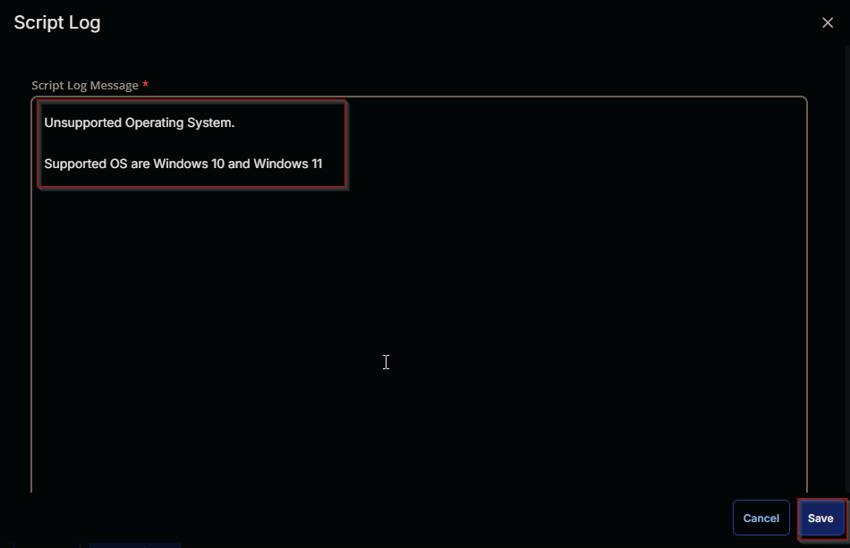

### Row 2c Function: Script Exit

Add a new row by clicking on the `Add Row` button.

/image_14.png)

Search and select the `Script Exit` function.

/image_17.png)

**Note:** Do not add any message or words in the `Error Message` field. Leave it blank and click the `Save` button.

### Row 3 Logic: If Then

/image_11.png)

/image_12.png)

### Row 3a Condition: Custom Field Equals

Select the `Custom Field` option from the dropdown.

/image_18.png)

/image_19.png)

Search and select the `WingetUpdateAll_Task_Result` custom field in the `Search` field.

/image_20.png)

/image_21.png)

Change the operator to `Equals` from `Contains`.

/image_22.png)

Type `Task Created` in the comparator field and press `Enter`.

/image_23.png)

### Row 3b Function: Script Log

Add a new row by clicking on the `Add Row` button.

/image_14.png)

Search and select the `Script Log` function.

/image_15.png)

/image_16.png)

Add the following log in the `Script Log Message` field and click the `Save` button:

```plaintext
Task is already created on the computer.
```

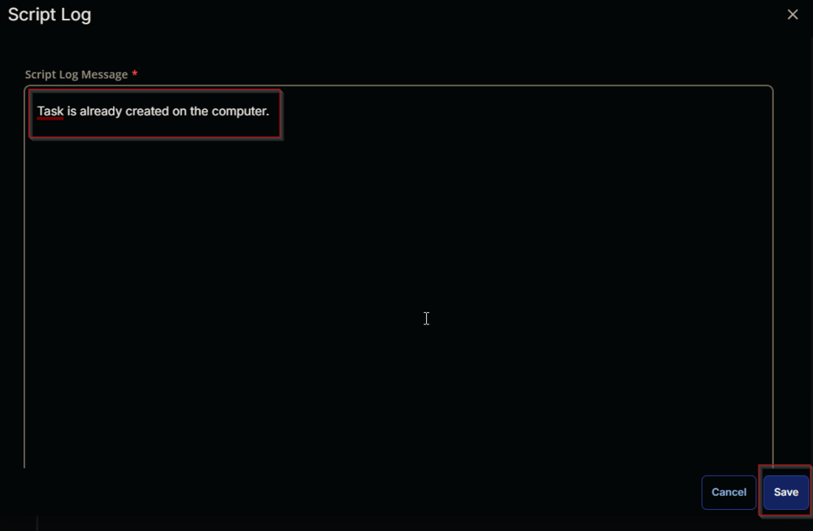

### Row 3c Function: Script Exit

Add a new row by clicking on the `Add Row` button.

/image_14.png)

Search and select the `Script Exit` function.

/image_17.png)

**Note:** Do not add any message or words in the `Error Message` field. Leave it blank and click the `Save` button.

### Row 4 Logic: If Then

/image_11.png)

/image_12.png)

### Row 4a Condition: Custom Field Equals

Select the `Custom Field` option from the dropdown.

/image_18.png)

/image_19.png)

Search and select the `WingetUpdateAll_Task_Create` custom field in the `Search` field.

/image_24.png)

/image_25.png)

Change the operator to `Equals` from `Contains`.

/image_26.png)

Keep the comparator to `False`.

/image_27.png)

### Row 4b Function: Script Log

Add a new row by clicking on the `Add Row` button.

/image_14.png)

Search and select the `Script Log` function.

/image_15.png)

/image_16.png)

Add the following log in the `Script Log Message` field and click the `Save` button:

```plaintext
Winget Update All scheduled task creation is not enabled for the Company.
```

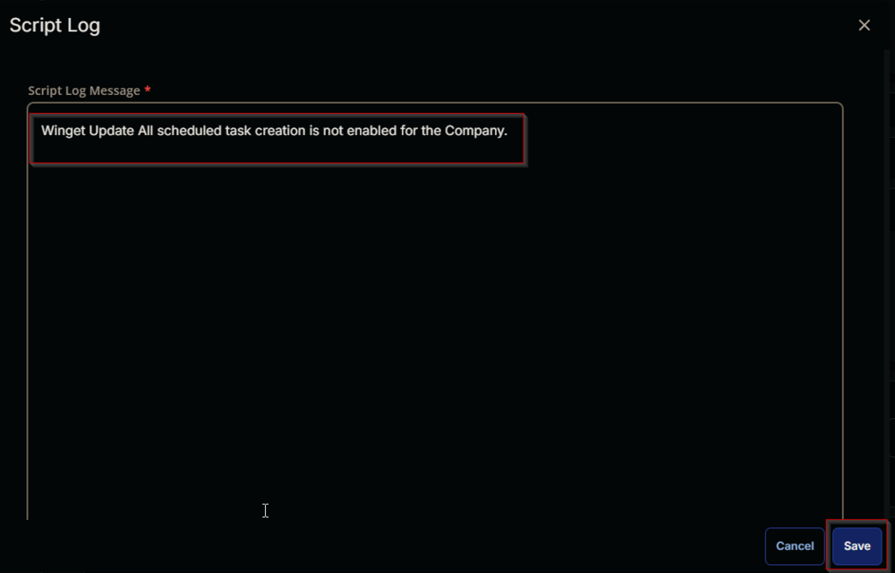

### Row 4c Function: Script Exit

Add a new row by clicking on the `Add Row` button.

/image_14.png)

Search and select the `Script Exit` function.

/image_17.png)

**Note:** Do not add any message or words in the `Error Message` field. Leave it blank and click the `Save` button.

### Row 5 Logic: If Then

/image_11.png)

/image_12.png)

### Row 5a Condition: Custom Field Equals

Select the `Custom Field` option from the dropdown.

/image_18.png)

/image_19.png)

Search and select the `wingetupdateall_task_Exclude` custom field in the `Search` field.

/image_28.png)

Change the operator to `Equals` from `Contains`.

/image_29.png)

Change the comparator to `True` from `False`.

/image_30.png)

### Row 5b Function: Script Log

Add a new row by clicking on the `Add Row` button.

/image_14.png)

Search and select the `Script Log` function.

/image_15.png)

/image_16.png)

Add the following log in the `Script Log Message` field and click the `Save` button:

```plaintext
Computer is excluded from Winget Update All Scheduled Task Creation.
```

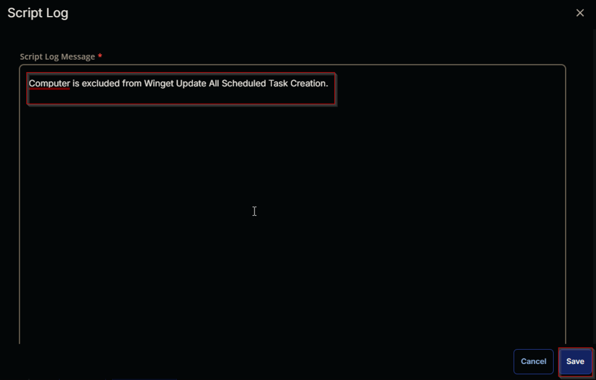

### Row 5c Function: Script Exit

Add a new row by clicking on the `Add Row` button.

/image_14.png)

Search and select the `Script Exit` function.

/image_17.png)

**Note:** Do not add any message or words in the `Error Message` field. Leave it blank and click the `Save` button.

### Row 6 Logic: If Then

/image_11.png)

/image_12.png)

### Row 6a Condition: Custom Field Equals

Select the `Custom Field` option from the dropdown.

/image_18.png)

/image_19.png)

Search and select the `wingetupdateall_task_Exclude` custom field in the `Search` field. In this step, select the Site-Level custom field.

Change the operator to `Equals` from `Contains`.

/image_31.png)

Change the comparator to `True` from `False`.

/image_30.png)

### Row 6b Function: Script Log

Add a new row by clicking on the `Add Row` button.

/image_14.png)

Search and select the `Script Log` function.

/image_15.png)

/image_16.png)

Add the following log in the `Script Log Message` field and click the `Save` button:

```plaintext
Site is excluded from Winget Update All Scheduled Task Creation.
```

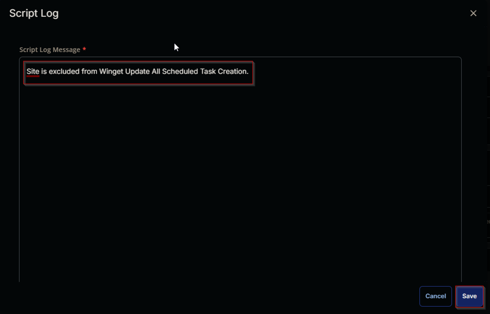

### Row 6c Function: Script Exit

Add a new row by clicking on the `Add Row` button.

/image_14.png)

Search and select the `Script Exit` function.

/image_17.png)

**Note:** Do not add any message or words in the `Error Message` field. Leave it blank and click the `Save` button.

### Row 7 Logic: If Then Else

/image_32.png)

/image_33.png)

### Row 7a Condition: Custom Field Equals

Select the `Custom Field` option from the dropdown.

/image_18.png)

/image_19.png)

Search and select the `WingetUpdateAll_UserTask_Disable` custom field in the `Search` field. Select the `Company-Level Boolean` field.

/image_34.png)

Change the operator to `Equals` from `Contains`.

/image_35.png)

Change the comparator to `True` from `False`.

/image_36.png)

Add another condition by clicking the `Add Condition` button.

/image_37.png)

Change the logical operator to `Or` from `And`.

/image_38.png)

Select the `Custom Field` option from the dropdown.

/image_39.png)

Search and select the `WingetUpdateAll_UserTask_Disable` custom field in the `Search` field. Select the `Site-Level Boolean` field.

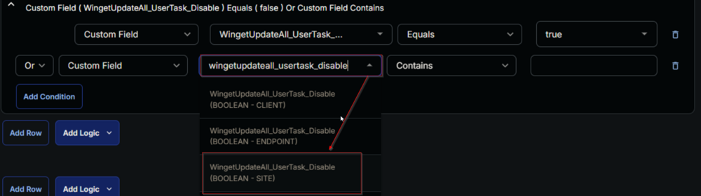

Change the operator to `Equals` from `Contains` and the comparator to `True` from `False`.

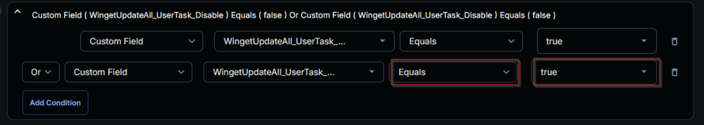

Add another condition by clicking the `Add Condition` button.

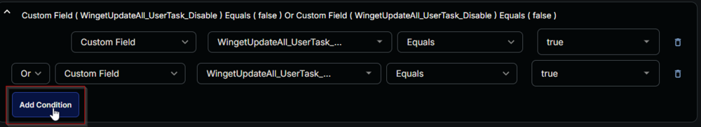

Change the logical operator to `Or` from `And`.

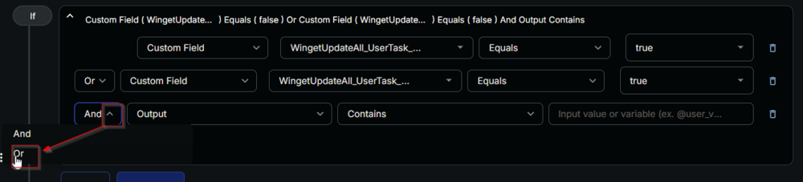

Select the `Custom Field` option from the dropdown.

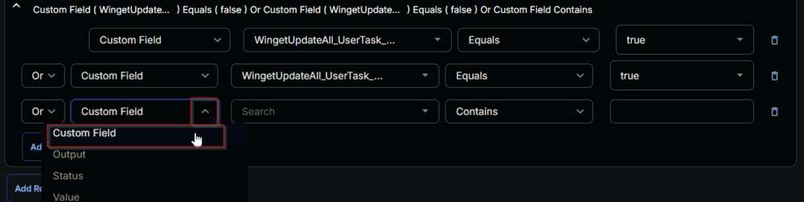

Search and select the `WingetUpdateAll_UserTask_Disable` custom field in the `Search` field. Select the `Computer-Level Boolean` field.


Change the operator to `Equals` from `Contains` and the comparator to `True` from `False`.

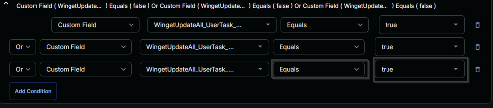

### Row 7b Function: Set User Variable

Add a new row by clicking on the `Add Row` button.

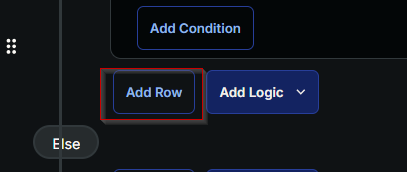

Search and select the `Set User Variable` function.

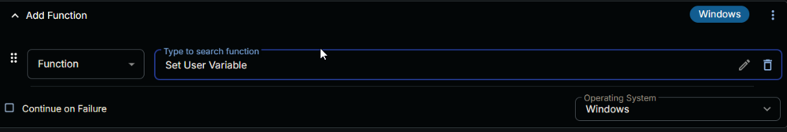

Add `UserTask` in the `Variable Name` field and `0` in the `Value` field, then click the `Save` button.

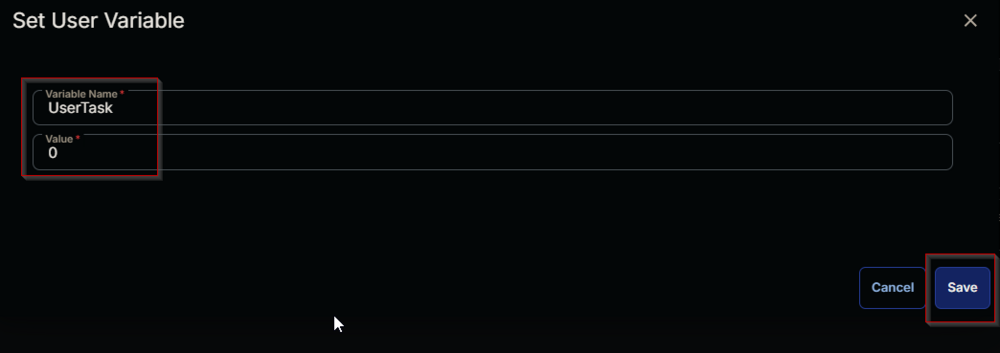

### Row 7c Function: Set User Variable

Add a new row by clicking on the `Add Row` button in the `Else` section.

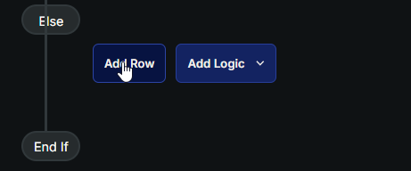

Search and select the `Set User Variable` function.


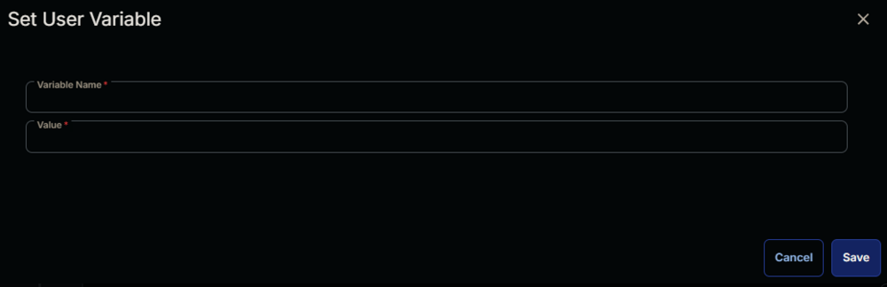

Add `UserTask` in the `Variable Name` field and `1` in the `Value` field, then click the `Save` button.

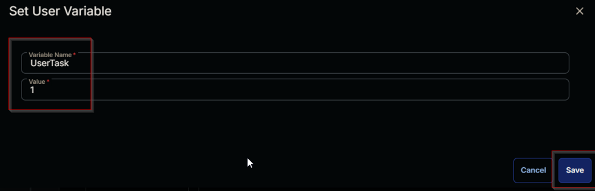  
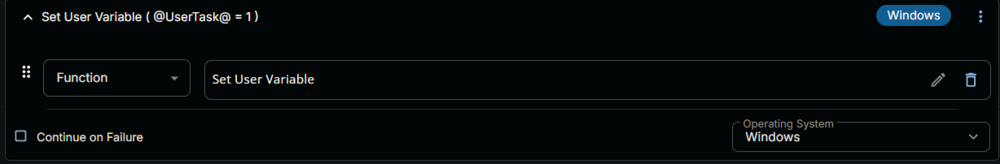

### Row 8 Function: PowerShell Script

Add a new row by clicking on the `Add Row` button outside the If/Then/Else logic.

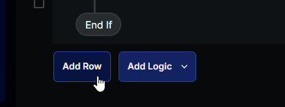  
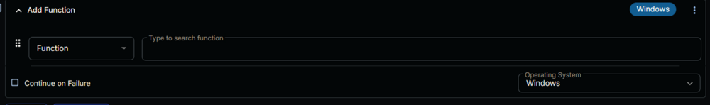

Search and select the `PowerShell Script` function.

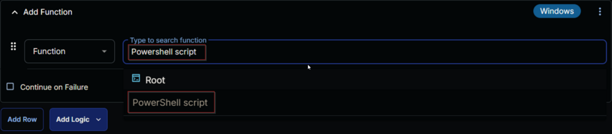  
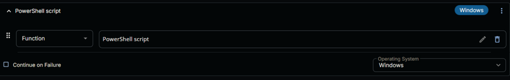  
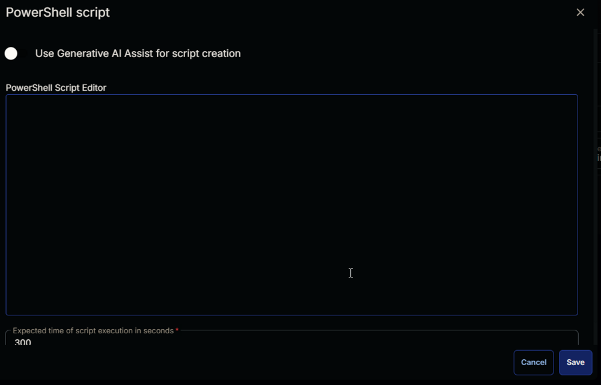

Paste in the following PowerShell script and set the expected time of script execution to `600` seconds. Click the `Save` button.

```powershell
$DisableUserTask = if ( '@UserTask@' -eq 0 ) { $True } else { $False }
$Force = 1
$ProjectName = 'Invoke-WingetProcessor'
$WorkingDirectory = "C:\ProgramData\_automation\script\$ProjectName"
$FilePath = "$WorkingDirectory\Winget-UpdateAll.ps1"
#region Setup - Folder Structure
if ( $Force ) {
    Remove-Item -Path $WorkingDirectory -Force -Recurse -ErrorAction SilentlyContinue -Confirm:$false | Out-Null
}
if ( !( Test-Path $WorkingDirectory ) ) {
    try {
        New-Item -Path $WorkingDirectory -ItemType Directory -ErrorAction Stop -Force | Out-Null
    } catch {
        throw "Failed to create the working directory. Reason: $($Error[0].Exception.Message)"
    }
}
if (-not ( ( ( Get-Acl $WorkingDirectory ).Access | Where-Object { $_.IdentityReference -Match 'EveryOne' } ).FileSystemRights -Match 'FullControl' ) ) {
    $ACl = Get-Acl $WorkingDirectory -ErrorAction SilentlyContinue
    $AccessRule = New-Object System.Security.AccessControl.FileSystemAccessRule('Everyone', 'FullControl', 'ContainerInherit, ObjectInherit', 'none', 'Allow')
    $Acl.AddAccessRule($AccessRule)
    Set-Acl  $WorkingDirectory $Acl -ErrorAction SilentlyContinue
}
$FileContent = @"
#region Setup - Variables
`$ProjectName = 'Invoke-WingetProcessor'
`$BaseURL = 'https://file.provaltech.com/repo'
`$PS1URL = "`$BaseURL/script/`$ProjectName.ps1"
`$WorkingDirectory = "C:\ProgramData\_automation\script\`$ProjectName"
`$PS1Path = "`$WorkingDirectory\`$ProjectName.ps1"
`$LogPath = "`$WorkingDirectory\`$ProjectName-log.txt"
`$OldLogPath = "`$WorkingDirectory\`$ProjectName-log-old.txt"
#endregion
if ( Test-Path `$OldLogPath ) {
    if ( (Get-ItemProperty -Path `$OldLogPath).CreationDate -le (Get-Date).AddDays(-29) ) {
        Remove-Item -Path `$OldLogPath -ErrorAction SilentlyContinue -Force -Confirm:`$false
    }
}
if ( Test-Path `$LogPath ) {
    if ( (Get-ItemProperty -Path `$LogPath).CreationDate -le (Get-Date).AddDays(-30) ) {
        Rename-Item -Path `$LogPath -NewName "`$(`$ProjectName)-log-old.txt" -ErrorAction SilentlyContinue -Force -Confirm:`$false
    }
}
`$Timeout = 1
do {
    try { `$connection = test-connection 8.8.8.8 -Erroraction Stop } catch { `$connection = 'down' }
    Start-Sleep -Seconds 1
    `$Timeout++
} until ( `$connection -ne 'Down' -or `$Timeout -lt 120 )
if ( `$Timeout -ge 120 ) {
    return
}
`$response = Invoke-WebRequest -Uri `$PS1URL -UseBasicParsing
if ( ( `$response.StatusCode -ne 200 ) -and ( !( Test-Path -Path `$PS1Path ) ) ) {
    throw "No pre-downloaded script exists and the script '`$PS1URL' failed to download. Exiting."
} elseif ( `$response.StatusCode -eq 200 ) {
    Remove-Item -Path `$PS1Path -ErrorAction SilentlyContinue
    `$Utf8NoBomEncoding = New-Object System.Text.UTF8Encoding `$False
    [System.IO.File]::WriteAllLines(`$PS1Path, `$response.Content, `$Utf8NoBomEncoding)
}
if ( !( Test-Path -Path `$PS1Path ) ) {
    throw 'An error occurred and the script was unable to be downloaded. Exiting.'
}
#endregion
`$op = & `$PS1Path -UpdateAll
Write-Log -Text "Output: `$op"
"@
try {
    $Utf8NoBomEncoding = New-Object System.Text.UTF8Encoding $False
    [System.IO.File]::WriteAllLines($FilePath, $FileContent, $Utf8NoBomEncoding)
} catch {
    if ( $Error.Exception.Message -match 'Cannot create a file when that file already exists' ) {
    } else {
        throw "Failed to write the powershell script. Reason: $($Error[0].Exception.Message)"
    }
}

Function New-WingetTask {
    [CmdletBinding()]
    param (
        [Parameter()][String]$TaskName,
        [Parameter(Mandatory = $False)][Switch]$Force
    )
    if ( $Force ) {
        ( Get-ScheduledTask | Where-Object { $_.TaskName -eq $Taskname } ) | Unregister-ScheduledTask -Confirm:$False -ErrorAction SilentlyContinue | Out-Null
    }
    if ( ( Get-ScheduledTask | Where-Object { $_.TaskName -eq $TaskName } ).State -match 'Ready|Running' ) {
        Write-Output "Scheduled Task $TaskName already exists"
    } else {
        $Action = New-ScheduledTaskAction -Execute 'cmd.exe'-WorkingDirectory $WorkingDirectory -Argument  ('/c start /min "" Powershell' + ' -NoLogo -ExecutionPolicy Bypass -NoProfile -NonInteractive -Windowstyle Hidden' + " -File ""$($FilePath)""")
        $Trigger = if ( $TaskName -match 'System' ) {
            New-ScheduledTaskTrigger -AtStartup
        } else {
            New-ScheduledTaskTrigger -AtLogOn
        }
        $setting = New-ScheduledTaskSettingsSet -AllowStartIfOnBatteries
        $principal = if ( $TaskName -match 'System' ) {
            New-ScheduledTaskPrincipal -UserId 'NT AUTHORITY\SYSTEM' -RunLevel Highest
        } else {
            New-ScheduledTaskPrincipal -GroupId ( ( New-Object System.Security.Principal.SecurityIdentifier('S-1-5-32-545') ).Translate( [System.Security.Principal.NTAccount] ).Value ) -RunLevel Highest
        }
        $ScheduledTask = New-ScheduledTask -Action $Action -Trigger $Trigger -Settings $setting -Principal $principal
        try {
            Register-ScheduledTask -TaskName $TaskName -InputObject $ScheduledTask -ErrorAction Stop | Out-Null
            Write-Output "Successfully created the scheduled task, $TaskName"
        } catch {
            throw "Failed to Schedule the task. Reason: $($Error[0].Exception.Message)"
        }
    }
}
New-WingetTask -TaskName 'Winget Update All [Logged on User]' -Force:$($Force.IsPresent)
New-WingetTask -TaskName 'Winget Update All [System]' -Force:$($Force.IsPresent)
if ( $DisableUserTask -and ( ( Get-ScheduledTask -TaskName 'Winget Update All [Logged on User]' ).State -ne 'Disabled' ) ) {
    try {
        Disable-ScheduledTask -TaskName 'Winget Update All [Logged on User]' -ErrorAction Stop | Out-Null
        Write-Output 'Successfully disabled the scheduled task, Winget Update All [Logged on User].'
    } catch {
        throw "Failed to disable the user level task. Reason: $($Error[0].Exception.Message)"
    }
} elseif ( ( -not $DisableUserTask ) -and ( ( Get-ScheduledTask -TaskName 'Winget Update All [Logged on User]' ).State -eq 'Disabled' )  ) {
    try {
        Enable-ScheduledTask -TaskName 'Winget Update All [Logged on User]' -ErrorAction Stop | Out-Null
        Write-Output 'Successfully enabled the scheduled task, Winget Update All [Logged on User].'
    } catch {
        throw "Failed to enable the user level task. Reason: $($Error[0].Exception.Message)"
    }
}
return Get-ScheduledTask -TaskName 'Winget Update All*' | Format-List -Property TaskName, State
```

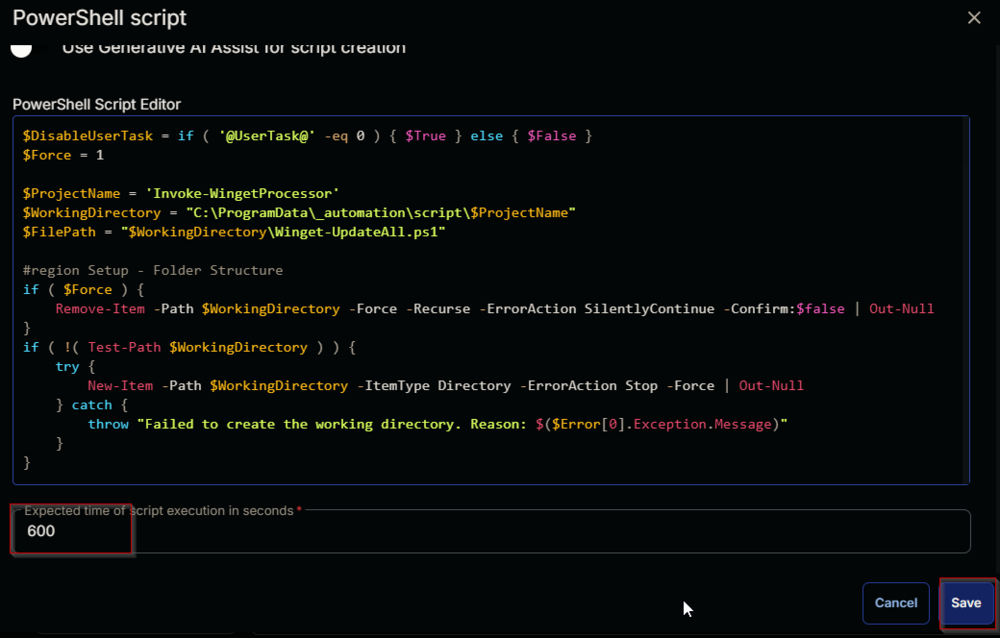  

Mark the `Continue on Failure` flag for the function.  

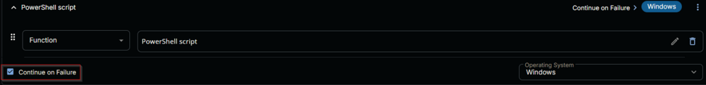

### Row 9 Function: Script Log

Add a new row by clicking on the `Add Row` button.

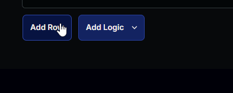

Search and select the `Script Log` function.

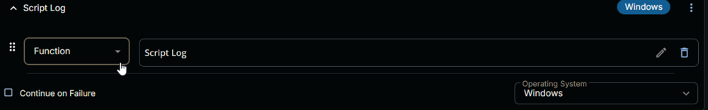
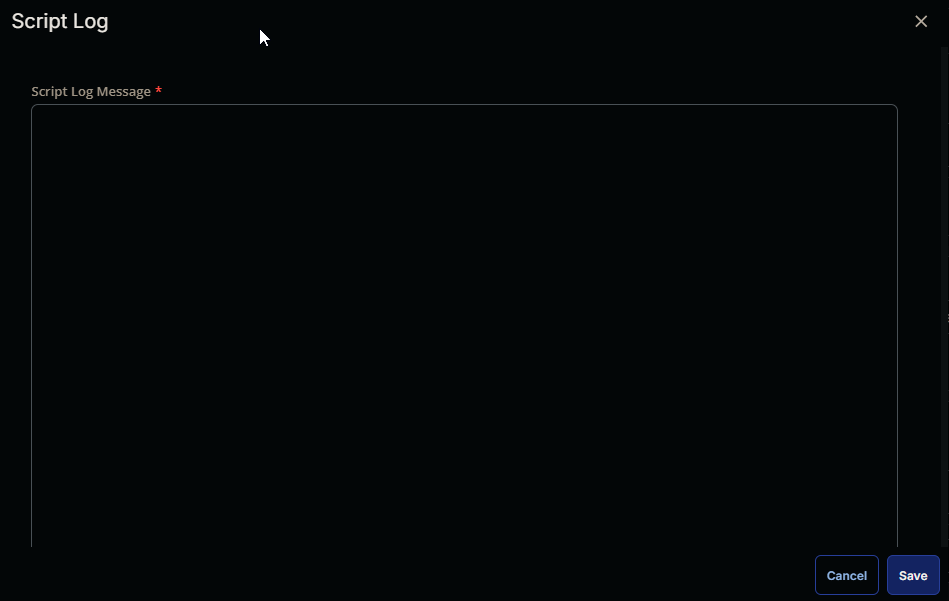

Add the following log in the `Script Log Message` field and click the `Save` button:

```plaintext
Script Result:
%Output%
```

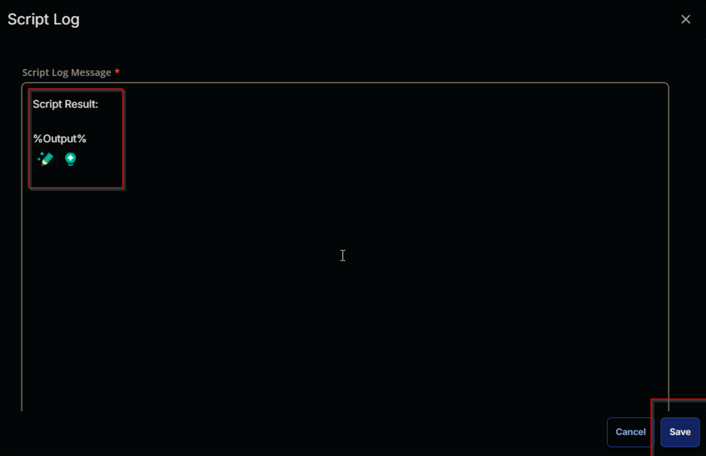

### Row 10 Logic: If Then Else

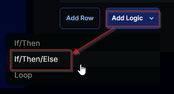  
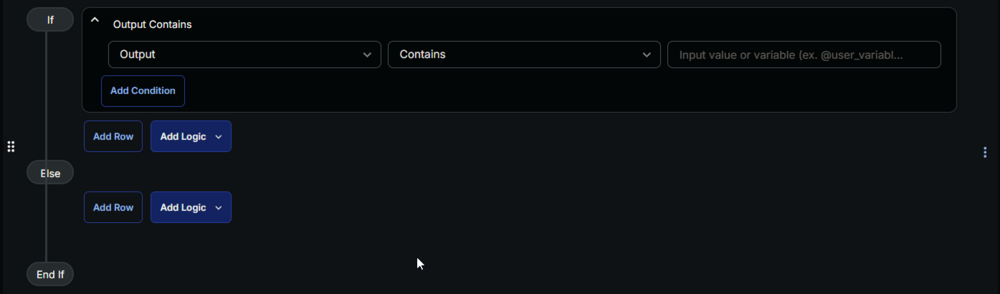  

### Row 10a Condition: Output Contains

Type `Failed to` in the `Input Value or Variable` field and press `Enter`.  
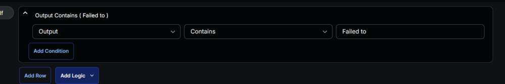

### Row 10b Function: Set Custom Field

Add a new row by clicking on `Add row` button.  


Search and select `Set Custom Field` Function.  
  


Search and select `WingetUpdateAll_Task_Result` in the `Search Custom Field` field and set `Task Creation Failed` in the `Value` field and click the `Save` button.  
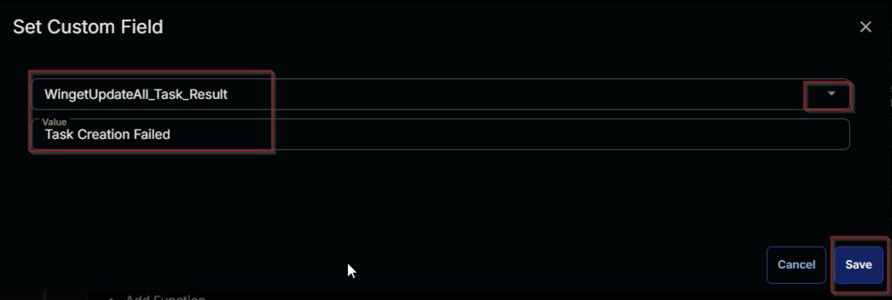  
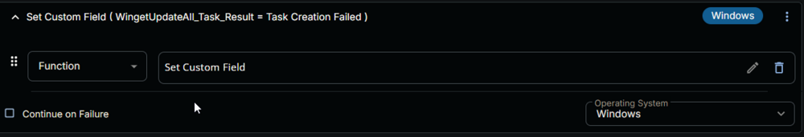

### Row 10c Function: Set Custom Field

Add a new row by clicking on `Add row` button in the `Else` section.  


Search and select `Set Custom Field` Function.  
  


Search and select `WingetUpdateAll_Task_Result` in the `Search Custom Field` field and set `Task Created` in the `Value` field and click the `Save` button.  
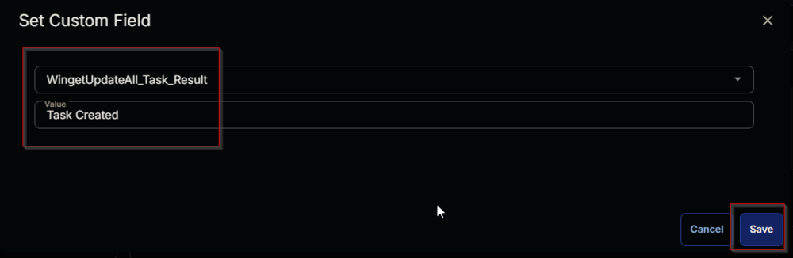  
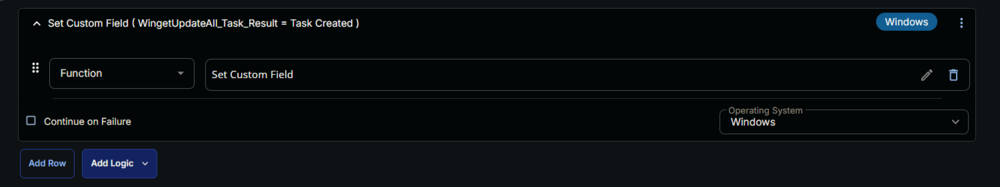

## Completed Script

/image_40.png)

/image_41.png)

/image_42.png)

Click the `Save` button at the top right corner of the screen to save the script.

/image_43.png)

## Deployment

It is suggested to run the task once per day against the [Winget Update All (Task Create)](/docs/22ee8d54-e19d-4b47-9ccd-c45c259f8fb7) device group.

- Go to `Automation` > `Tasks`.
- Search for `Scheduled Task Winget Update All (Create) Task`.
- Select the concerned task.
- Click on the `Schedule button` to schedule the task.

/image_44.png)

This screen will appear.

/image_45.png)

Click the `Does not repeat` button.

/image_46.png)

This pop-up box will appear.

Click the `OK` button to save the schedule. Recurrence will be changed to `Every day`.

/image_47.png)

Select the `Device Groups` option in the `Targeted Resources` section.

/image_48.png)

Search and select the [Winget Update All (Task Create)](/docs/22ee8d54-e19d-4b47-9ccd-c45c259f8fb7) device group.

/image_49.png)

Now click the `Run button` to initiate the task.

/image_50.png)

The task will start appearing in the Scheduled Tasks.

/image_51.png)

/image_52.png)

## Output

- Custom Field
- Script Log
