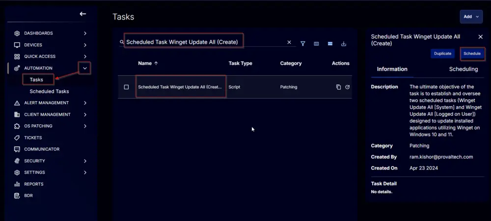

## Summary

The ultimate objective of the task is to establish and oversee two scheduled tasks (Winget Update All [System] and Winget Update All [Logged on User]) designed to update installed applications utilizing Winget on Windows 10 and 11.

The task can only be executed against the companies where the company-level custom field [WingetUpdateAll_Task_Create](/docs/40e64c1d-ca29-4c85-9a72-a48b1082b8e1) is marked.

## Sample Run


## Dependencies

- [CW RMM - Custom Field - Company - WingetUpdateAll_Task_Create](/docs/40e64c1d-ca29-4c85-9a72-a48b1082b8e1)
- [CW RMM - Custom Field - Company - WingetUpdateAll_Task_Delete](/docs/a398be5b-5709-4ab5-ac33-7feca8fbc00a)
- [CW RMM - Custom Field - Company - WingetUpdateAll_UserTask_Disable](/docs/8c8bc8b0-817e-4903-bd09-90df4c25ab9e)
- [CW RMM - Custom Field - Site - WingetUpdateAll_Task_Exclude](/docs/0c299d28-5fcb-4a1e-a341-1c5e78f74cfb)
- [CW RMM - Custom Field - Site - WingetUpdateAll_UserTask_Disable](/docs/280aafc8-9ab0-4cca-b499-d107b47de432)
- [CW RMM - Custom Field - EndPoint - WingetUpdateAll_Task_Exclude](/docs/91965ea0-f912-4f5d-8e42-c9ee546293a9)
- [CW RMM - Custom Field - EndPoint - WingetUpdateAll_Task_Result](/docs/a6ff85ad-b8e9-4e0f-9e2f-db964d483e5f)
- [CW RMM - Custom Field - EndPoint - WingetUpdateAll_UserTask_Disable](/docs/8022b663-4923-47d5-b8c7-7ba24aae305d)
- [CW RMM - Device Group - Winget Update All (Task Create)](/docs/22ee8d54-e19d-4b47-9ccd-c45c259f8fb7)

## Variables

| Name      | Description                                |
|-----------|--------------------------------------------|
| UserTask  | Whether the user task is disabled or not.  |
| Output    | Output of the PowerShell script.           |

## Task Creation

Create a new `Script Editor` style script in the system to implement this task.


**Name:** Scheduled Task Winget Update All (Create)

**Description:** The ultimate objective of the task is to establish and oversee two scheduled tasks (Winget Update All [System] and Winget Update All [Logged on User]) designed to update installed applications utilizing Winget on Windows 10 and 11.

**Category:** Patching


## Task

Start by adding a row. You can do this by clicking the `Add Row` button at the bottom of the script page.


This function will appear.


### Row 1 Function: PowerShell Script

Search and select the `PowerShell Script` function.


Paste in the following PowerShell script and set the expected time of script execution to `300` seconds. Click the `Save` button.

```powershell
if ( (get-ciminstance -classname Win32_OperatingSystem).caption -match 'Windows 1[01]' ) { 'Supported' } else { 'Unsupported' }
```


### Row 2 Logic: If Then


### Row 2a Condition: Output Contains

Type `Unsupported` in the `Input Value or Variable` field and press `Enter`.


### Row 2b Function: Script Log

Add a new row by clicking on the `Add Row` button.


Search and select the `Script Log` function.


Add the following log in the `Script Log Message` field and click the `Save` button:

```plaintext
Unsupported Operating System.
```

```plaintext
Supported OS are Windows 10 and Windows 11
```

### Row 2c Function: Script Exit

Add a new row by clicking on the `Add Row` button.


Search and select the `Script Exit` function.


**Note:** Do not add any message or words in the `Error Message` field. Leave it blank and click the `Save` button.

### Row 3 Logic: If Then


### Row 3a Condition: Custom Field Equals

Select the `Custom Field` option from the dropdown.


Search and select the `WingetUpdateAll_Task_Result` custom field in the `Search` field.


Change the operator to `Equals` from `Contains`.


Type `Task Created` in the comparator field and press `Enter`.


### Row 3b Function: Script Log

Add a new row by clicking on the `Add Row` button.


Search and select the `Script Log` function.


Add the following log in the `Script Log Message` field and click the `Save` button:

```plaintext
Task is already created on the computer.
```

### Row 3c Function: Script Exit

Add a new row by clicking on the `Add Row` button.


Search and select the `Script Exit` function.


**Note:** Do not add any message or words in the `Error Message` field. Leave it blank and click the `Save` button.

### Row 4 Logic: If Then


### Row 4a Condition: Custom Field Equals

Select the `Custom Field` option from the dropdown.


Search and select the `WingetUpdateAll_Task_Create` custom field in the `Search` field.


Change the operator to `Equals` from `Contains`.


Keep the comparator to `False`.


### Row 4b Function: Script Log

Add a new row by clicking on the `Add Row` button.


Search and select the `Script Log` function.


Add the following log in the `Script Log Message` field and click the `Save` button:

```plaintext
Winget Update All scheduled task creation is not enabled for the Company.
```

### Row 4c Function: Script Exit

Add a new row by clicking on the `Add Row` button.


Search and select the `Script Exit` function.


**Note:** Do not add any message or words in the `Error Message` field. Leave it blank and click the `Save` button.

### Row 5 Logic: If Then


### Row 5a Condition: Custom Field Equals

Select the `Custom Field` option from the dropdown.


Search and select the `wingetupdateall_task_Exclude` custom field in the `Search` field.


Change the operator to `Equals` from `Contains`.


Change the comparator to `True` from `False`.


### Row 5b Function: Script Log

Add a new row by clicking on the `Add Row` button.


Search and select the `Script Log` function.


Add the following log in the `Script Log Message` field and click the `Save` button:

```plaintext
Computer is excluded from Winget Update All Scheduled Task Creation.
```

### Row 5c Function: Script Exit

Add a new row by clicking on the `Add Row` button.


Search and select the `Script Exit` function.


**Note:** Do not add any message or words in the `Error Message` field. Leave it blank and click the `Save` button.

### Row 6 Logic: If Then


### Row 6a Condition: Custom Field Equals

Select the `Custom Field` option from the dropdown.


Search and select the `wingetupdateall_task_Exclude` custom field in the `Search` field. In this step, select the Site-Level custom field.

Change the operator to `Equals` from `Contains`.


Change the comparator to `True` from `False`.


### Row 6b Function: Script Log

Add a new row by clicking on the `Add Row` button.


Search and select the `Script Log` function.


Add the following log in the `Script Log Message` field and click the `Save` button:

```plaintext
Site is excluded from Winget Update All Scheduled Task Creation.
```

### Row 6c Function: Script Exit

Add a new row by clicking on the `Add Row` button.


Search and select the `Script Exit` function.


**Note:** Do not add any message or words in the `Error Message` field. Leave it blank and click the `Save` button.

### Row 7 Logic: If Then Else


### Row 7a Condition: Custom Field Equals

Select the `Custom Field` option from the dropdown.


Search and select the `WingetUpdateAll_UserTask_Disable` custom field in the `Search` field. Select the `Company-Level Boolean` field.


Change the operator to `Equals` from `Contains`.


Change the comparator to `True` from `False`.


Add another condition by clicking the `Add Condition` button.


Change the logical operator to `Or` from `And`.


Select the `Custom Field` option from the dropdown.


Search and select the `WingetUpdateAll_UserTask_Disable` custom field in the `Search` field. Select the `Site-Level Boolean` field.

Change the operator to `Equals` from `Contains` and the comparator to `True` from `False`.

Add another condition by clicking the `Add Condition` button.

Change the logical operator to `Or` from `And`.

Select the `Custom Field` option from the dropdown.

Search and select the `WingetUpdateAll_UserTask_Disable` custom field in the `Search` field. Select the `Computer-Level Boolean` field.

Change the operator to `Equals` from `Contains` and the comparator to `True` from `False`.

### Row 7b Function: Set User Variable

Add a new row by clicking on the `Add Row` button.

Search and select the `Set User Variable` function.

Add `UserTask` in the `Variable Name` field and `0` in the `Value` field, then click the `Save` button.

### Row 7c Function: Set User Variable

Add a new row by clicking on the `Add Row` button in the `Else` section.

Search and select the `Set User Variable` function.

Add `UserTask` in the `Variable Name` field and `1` in the `Value` field, then click the `Save` button.

### Row 8 Function: PowerShell Script

Add a new row by clicking on the `Add Row` button outside the If/Then/Else logic.

Search and select the `PowerShell Script` function.

Paste in the following PowerShell script and set the expected time of script execution to `600` seconds. Click the `Save` button.

```powershell
$DisableUserTask = if ( '@UserTask@' -eq 0 ) { $True } else { $False }
$Force = 1
$ProjectName = 'Invoke-WingetProcessor'
$WorkingDirectory = "C:\\ProgramData\\_automation\\script\\$ProjectName"
$FilePath = "$WorkingDirectory\\Winget-UpdateAll.ps1"

#region Setup - Folder Structure
if ( $Force ) {
    Remove-Item -Path $WorkingDirectory -Force -Recurse -ErrorAction SilentlyContinue -Confirm:$false | Out-Null
}
if ( !( Test-Path $WorkingDirectory ) ) {
    try {
        New-Item -Path $WorkingDirectory -ItemType Directory -ErrorAction Stop -Force | Out-Null
    } catch {
        throw "Failed to create the working directory. Reason: $($Error[0].Exception.Message)"
    }
}

if (-not ( ( ( Get-Acl $WorkingDirectory ).Access | Where-Object { $_.IdentityReference -Match 'EveryOne' } ).FileSystemRights -Match 'FullControl' ) ) {
    $ACl = Get-Acl $WorkingDirectory -ErrorAction SilentlyContinue
    $AccessRule = New-Object System.Security.AccessControl.FileSystemAccessRule('Everyone', 'FullControl', 'ContainerInherit, ObjectInherit', 'none', 'Allow')
    $Acl.AddAccessRule($AccessRule)
    Set-Acl  $WorkingDirectory $Acl -ErrorAction SilentlyContinue
}

$FileContent = @"
#region Setup - Variables
`$ProjectName = 'Invoke-WingetProcessor'
`$BaseURL = 'https://file.provaltech.com/repo'
`$PS1URL = "`$BaseURL/script/`$ProjectName.ps1"
`$WorkingDirectory = "C:\\ProgramData\\_automation\\script\\`$ProjectName"
`$PS1Path = "`$WorkingDirectory\\`$ProjectName.ps1"
`$LogPath = "`$WorkingDirectory\\`$ProjectName-log.txt"
`$OldLogPath = "`$WorkingDirectory\\`$ProjectName-log-old.txt"
#endregion
"@

if ( Test-Path `$OldLogPath ) {
    if ( (Get-ItemProperty -Path `$OldLogPath).CreationDate -le (Get-Date).AddDays(-29) ) {
        Remove-Item -Path `$OldLogPath -ErrorAction SilentlyContinue -Force -Confirm:`$false
    }
}

if ( Test-Path `$LogPath ) {
    if ( (Get-ItemProperty -Path `$LogPath).CreationDate -le (Get-Date).AddDays(-30) ) {
        Rename-Item -Path `$LogPath -NewName "`$(`$ProjectName)-log-old.txt" -ErrorAction SilentlyContinue -Force -Confirm:`$false
    }
}

`$Timeout = 1
do {
    try { `$connection = test-connection 8.8.8.8 -Erroraction Stop } catch { `$connection = 'down' }
    Start-Sleep -Seconds 1
    `$Timeout++
} until ( `$connection -ne 'Down' -or `$Timeout -lt 120 )

if ( `$Timeout -ge 120 ) {
    return
}

`$response = Invoke-WebRequest -Uri `$PS1URL -UseBasicParsing
if ( ( `$response.StatusCode -ne 200 ) -and ( !( Test-Path -Path `$PS1Path ) ) ) {
    throw "No pre-downloaded script exists and the script '`$PS1URL' failed to download. Exiting."
} elseif ( `$response.StatusCode -eq 200 ) {
    Remove-Item -Path `$PS1Path -ErrorAction SilentlyContinue
    `$Utf8NoBomEncoding = New-Object System.Text.UTF8Encoding `$False
    [System.IO.File]::WriteAllLines(`$PS1Path, `$response.Content, `$Utf8NoBomEncoding)
}
if ( !( Test-Path -Path `$PS1Path ) ) {
    throw 'An error occurred and the script was unable to be downloaded. Exiting.'
}
#region
`$op = & `$PS1Path -UpdateAll
Write-Log -Text "Output: `$op"
```

Mark the `Continue on Failure` flag for the function.

### Row 9 Function: Script Log

Add a new row by clicking on the `Add Row` button.

Search and select the `Script Log` function.

Add the following log in the `Script Log Message` field and click the `Save` button:

```plaintext
Script Result:
%Output%
```

## Completed Script


Click the `Save` button at the top right corner of the screen to save the script.


## Deployment

It is suggested to run the task once per day against the [Winget Update All (Task Create)](/docs/22ee8d54-e19d-4b47-9ccd-c45c259f8fb7) device group.

- Go to `Automation` > `Tasks`.
- Search for `Scheduled Task Winget Update All (Create) Task`.
- Select the concerned task.
- Click on the `Schedule button` to schedule the task.



This screen will appear.


Click the `Does not repeat` button.


This pop-up box will appear.

Click the `OK` button to save the schedule. Recurrence will be changed to `Every day`.


Select the `Device Groups` option in the `Targeted Resources` section.


Search and select the [Winget Update All (Task Create)](/docs/22ee8d54-e19d-4b47-9ccd-c45c259f8fb7) device group.


Now click the `Run button` to initiate the task.


The task will start appearing in the Scheduled Tasks.


## Output

- Custom Field
- Script Log