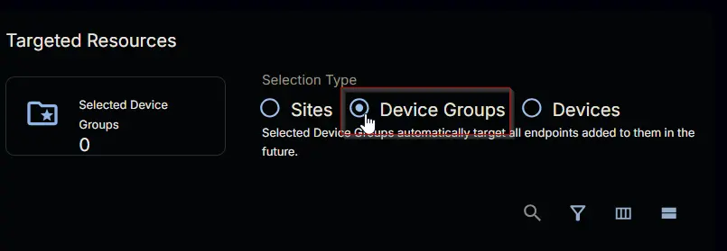
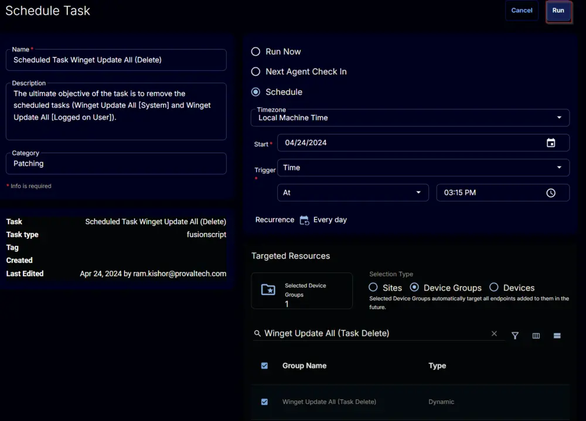
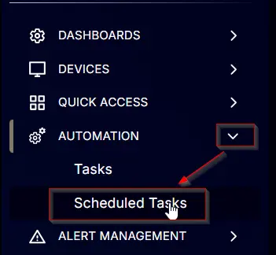

## Summary

The ultimate objective of the task is to remove the scheduled tasks (Winget Update All [System] and Winget Update All [Logged on User]) created by the [Scheduled Task Winget Update All (Create)](/docs/a898b5ac-23d0-4e0d-89e5-79bca2277a6e) task.

## Sample Run


## Dependencies

- [Custom Field - Company - WingetUpdateAll_Task_Delete](/docs/a398be5b-5709-4ab5-ac33-7feca8fbc00a)
- [Custom Field - EndPoint - WingetUpdateAll_Task_Result](/docs/a6ff85ad-b8e9-4e0f-9e2f-db964d483e5f)
- [Device Group - Winget Update All (Task Delete)](/docs/a8ce29e2-502c-4bb8-a959-c7eb59e38808)

## Variables

| Name   | Description                                               |
|--------|-----------------------------------------------------------|
| Output | Output of the command removing the scheduled tasks       |

### Task Creation

Create a new `Script Editor` style script in the system to implement this task.


**Name:** Scheduled Task Winget Update All (Delete)

**Description:** The ultimate objective of the task is to remove the scheduled tasks (Winget Update All [System] and Winget Update All [Logged on User]).

**Category:** Patching


## Task

Start by adding a row. You can do this by clicking the `Add Row` button at the bottom of the script page.


This function will appear.


### Row 1 Function: PowerShell Script

Search and select the `PowerShell Script` function.


Paste in the following PowerShell script and set the expected time of script execution to `300` seconds. Click the `Save` button.

```powershell
if ( (get-ciminstance -classname Win32_OperatingSystem).caption -match 'Windows 1[01]' ) { 'Supported' } else { 'Unsupported' }
```


### Row 2 Logic: If Then


### Row 2a Condition: Output Contains

Type `Unsupported` in the `Input Value or Variable` field and press `Enter`.


### Row 2b Function: Script Log

Add a new row by clicking on the `Add row` button.


Search and select the `Script Log` function.


Add the following log in the `Script Log Message` field and click the `Save` button:

```plaintext
Unsupported Operating System.

Supported OS are Windows 10 and Windows 11
```


### Row 2c Function: Script Exit

Add a new row by clicking on the `Add row` button.  


Search and select the `Script Exit` function.  


**Note:** Do not add any message or words in the `Error Message` field. Leave it blank and click the `Save` button.

### Row 3 Function: Command Prompt Script

Add a new row by clicking on `Add row` button outside the If/Then logic.  
  


Search and select the `Command Prompt (CMD) Script` function.  
  


Copy and paste the following command in the `Command Prompt Script Editor` and leave the `Expected time of script execution in seconds` to `300`. Click the `Save` button.

```shell
C:\Windows\System32\WindowsPowerShell\v1.0\powershell.exe -ExecutionPolicy Bypass -Command "foreach ( $task in ( 'Winget Update All [Logged on User]','Winget Update All [System]' ) ) { try { Get-ScheduledTask | Where-Object { $_.TaskName -eq $task } | Unregister-ScheduledTask -Confirm:$False -ErrorAction Stop } catch { return \"Failed to remove the task '$($task)'. Reason: $($Error[0].Exception.Message)\" } }"
```


Enable the `Continue on Failure` flag.  


### Row 4 Function: Script Log

Add a new row by clicking on `Add row` button.


Search and select `Script Log` Function.

  


Add the following log in the `Script Log Message` field and click the `Save` button:
Output of command to remove scheduled tasks: %Output%


### Row 5 Logic: If Then Else

  


### Row 5a Condition: Output Contains

Type `Failed to` in the `Input Value or Variable` field and press `Enter`.  


### Row 5b Function: Set Custom Field

Add a new row by clicking on `Add row` button.  


Search and select `Set Custom Field` Function.  
  


Search and select `WingetUpdateAll_Task_Result` in the `Search Custom Field` field and set `Task Deletion Failed` in the `Value` field and click the `Save` button.  
  


### Row 5c Function: Set Custom Field

Add a new row by clicking on `Add row` button in the `Else` section.


Search and select `Set Custom Field` Function.

  


Search and select `WingetUpdateAll_Task_Result` in the `Search Custom Field` field and set `Task deleted` in the `Value` field and click the `Save` button.

  


## Completed Script


Click the `Save` button at the top right corner of the screen to save the script.


## Deployment

It is suggested to run the task once per day against the [Winget Update All (Task Delete)](/docs/a8ce29e2-502c-4bb8-a959-c7eb59e38808) device group.

- Go to `Automation` > `Tasks.`
- Search for `Scheduled Task Winget Update All (Delete) Task.`
- Select the concerned task.
- Click on the `Schedule` button to schedule the task.


This screen will appear.


Click the `Does not repeat` button.


This pop-up box will appear.


Click the `OK` button to save the schedule. Recurrence will be changed to `Every day`.


Select the `Device Groups` option in the `Targeted Resources` section.



Search and select the [Winget Update All (Task Delete)](/docs/a8ce29e2-502c-4bb8-a959-c7eb59e38808) device group.


Now click the `Run` button to initiate the task.



The task will start appearing in the Scheduled Tasks.



## Output

- Custom Field
- Script Log
