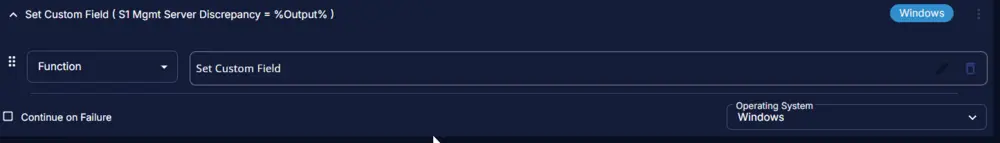
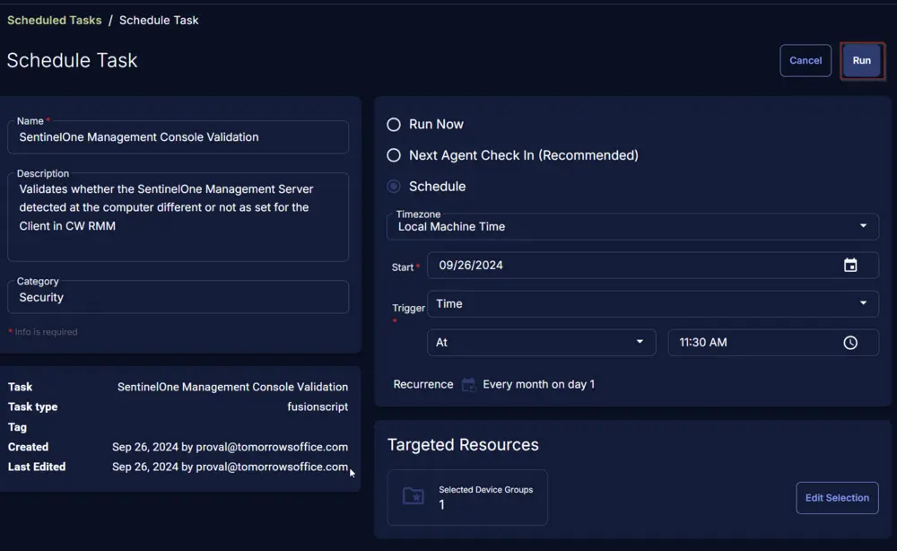

## Summary

The task validates whether the SentinelOne Management Server detected on the computer is different from what is set for the Client in CW RMM. Information gathered by this task is stored in the following custom fields:

- [Client Level S1 Mgmt Server](/docs/c92218fb-8d9d-45a7-a15b-107ada8141b8)
- [Computer Level S1 Mgmt Server](/docs/cd0a8207-62e5-41ea-9df9-f9d475ee8866)
- [S1 Mgmt Server Discrepancy](/docs/c600a6e2-bd09-4172-8784-d969838eea23)

## Sample Run

  
  

## Dependencies

- [Custom Field - Endpoint - S1 Mgmt Server Discrepancy](/docs/c600a6e2-bd09-4172-8784-d969838eea23)
- [Custom Field - Endpoint - Computer Level S1 Mgmt Server](/docs/cd0a8207-62e5-41ea-9df9-f9d475ee8866)
- [Custom Field - Endpoint - Client Level S1 Mgmt Server](/docs/c92218fb-8d9d-45a7-a15b-107ada8141b8)
- [Custom Field - Site - SentinelOne Site Key](/docs/0c2128f8-2f99-47e7-a0ff-82b854ff2701)
- [Dynamic Group - SentinelOne Installed](/docs/9bed886f-fa13-4389-932e-47c62482db0d)

## Task Creation

Create a new `Script Editor` style script in the system to implement this Task.

  
  

**Name:** `SentinelOne Management Console Validation`  
**Description:** `The task validates whether the SentinelOne Management Server detected on the computer is different from what is set for the Client in CW RMM`  
**Category:** `Security`  
  

## Task

Navigate to the Script Editor Section and start by adding a row. You can do this by clicking the `Add Row` button at the bottom of the script page.  
  

A blank function will appear.  
  

### Row 1 Function: Set Pre-defined Variable

Search and select the `Set Pre-defined Variable` function.  
  

The following function will pop up on the screen:  
  

- Select the `Custom Field` radio button.
- Set `clientSiteKey` in the `Variable Name` field.
- Search and select the Client-Level Custom Field `SentinelOne Site Key` from the Custom Field dropdown menu.
  - **If the partner uses a different custom field to store the SentinelOne Site Key, then use that one instead.**
- Click the `Save` button.  
  

  

### Row 2 Function: PowerShell Script

Add a new row by clicking the `Add Row` button.  
  

Search and select the `PowerShell Script` function.  
  

The following function will pop up on the screen:  
  

Paste in the following PowerShell script and set the `Expected time of script execution in seconds` to `300` seconds. Click the `Save` button.

```powershell
$clientLevelKey = '@clientSiteKey@'
if ( ($clientLevelKey -match [Regex]::Escape('clientSiteKey@')) -or ($null -eq $clientLevelKey) ) {
    throw 'SentinelOne Site Key Not Found in Client Level Custom Field ''SentinelOne Site Key''.'
} elseif ( $clientLevelKey.Length -lt 10 ) {
    throw 'Invalid Key string in Client Level Custom Field ''SentinelOne Site Key''.'
}
$json = [System.Text.Encoding]::UTF8.GetString($([System.Convert]::FromBase64String($clientLevelKey)))
$obj = $json | ConvertFrom-Json
$url = $obj.url -replace '"', ''
return $url
```

  

### Row 3 Function: Set Custom Field

Add a new row by clicking the `Add Row` button.  
  

Search and select the `Set Custom Field` function.  
  

The following function will pop up on the screen:  
  

- Search and select the Computer-Level Custom Field `Client Level S1 Mgmt Server` from the Custom Field dropdown menu.
- Set `%Output%` in the `Value` field.  
- Click the `Save` button.  
  

  

### Row 4 Function: Set User Variable

Add a new row by clicking the `Add Row` button.  
  

Search and select the `Set User Variable` function.  
  

The following function will pop up on the screen:  
  

- Set `ClientMgmtSvr` in the `Variable Name` field.  
- Set `%Output%` in the `Value` field.  
- Click the `Save` button.  
  

  

### Row 5 Function: PowerShell Script

Add a new row by clicking the `Add Row` button.  
  

Search and select the `PowerShell Script` function.  
  

The following function will pop up on the screen:  
  

Paste in the following PowerShell script and set the `Expected time of script execution in seconds` to `300` seconds. Click the `Save` button.

```powershell
$regPath = 'HKLM:\SYSTEM\CurrentControlSet\Services\SentinelAgent'
if ( Test-Path -Path $regPath ) {
    $ctlPath = "$((Get-ItemProperty -Path $regPath).ImagePath -Replace 'Sentinel((Agent)|(ServiceHost))\.exe', 'SentinelCtl.exe' -Replace '"','')"
    if ( !(Test-Path -Path $ctlPath) ) {
        throw 'SentinelCtl.exe not found.'
    }
} else {
    throw 'Sentinel Agent not found.'
}
$mgmtServer = cmd.exe /c "$ctlPath" config server.mgmtServer
$mgmtServer = $mgmtServer -replace '"', ''
return $mgmtServer
```

  

### Row 6 Function: Set Custom Field

Add a new row by clicking the `Add Row` button.  
  

Search and select the `Set Custom Field` function.  
  

The following function will pop up on the screen:  
  

- Search and select the Computer-Level Custom Field `Computer Level S1 Mgmt Server` from the Custom Field dropdown menu.
- Set `%Output%` in the `Value` field.  
- Click the `Save` button.  
  

  

### Row 7 Function: Set User Variable

Add a new row by clicking the `Add Row` button.  
  

Search and select the `Set User Variable` function.  
  

The following function will pop up on the screen:  
  

- Set `ComputerMgmtSvr` in the `Variable Name` field.  
- Set `%Output%` in the `Value` field.  
- Click the `Save` button.  
  

  

### Row 8 Function: PowerShell Script

Add a new row by clicking the `Add Row` button.  
  

Search and select the `PowerShell Script` function.  
  

The following function will pop up on the screen:  
  

Paste in the following PowerShell script and set the `Expected time of script execution in seconds` to `300` seconds. Click the `Save` button.

```powershell
$clientMgmtSvr = '@clientMgmtSvr@'
$computerMgmtSvr = '@computerMgmtSvr@'
if ( ($clientMgmtSvr -match [Regex]::Escape('clientMgmtSvr@')) -or ($null -eq $clientMgmtSvr) ) {
    throw 'Invlaid Client Level Management Server.'
} elseif ( ($computerMgmtSvr -match [Regex]::Escape('computerMgmtSvr@')) -or ($null -eq $computerMgmtSvr) ) {
    throw 'Invlaid Client Level Management Server.'
} elseif ( $clientMgmtSvr -eq $computerMgmtSvr ) {
    return 'No'
} elseif ( $clientMgmtSvr -ne $computerMgmtSvr ) {
    return 'Yes'
} else {
    throw 'Failed to compare Management Servers.'
}
```

  

### Row 9 Function: Set Custom Field

Add a new row by clicking the `Add Row` button.  
  

Search and select the `Set Custom Field` function.  
  

The following function will pop up on the screen:  
  

- Search and select the Computer-Level Custom Field `S1 Mgmt Server Discrepancy` from the Custom Field dropdown menu.
- Set `%Output%` in the `Value` field.  
- Click the `Save` button.  
  

  

**Click the `Save` button at the top-right corner of the screen to save the script.**  
  

## Completed Task

  

## Implementation

It is suggested to run the Task once per month against the computers with the `Sentinel Agent` installed.

- Go to `Automation` > `Tasks.`
- Search for `SentinelOne Management Console Validation Task.`
- Select the concerned task.
- Click on the `Schedule` button to schedule the task/script.  
  

This screen will appear.  
  

Select the `Schedule` button and click the calendar button present in front of the `Recurrence` option.  
  

Select the `Month(s)` for the `Repeat`, `1` for `Dates`, and click the `OK` button to save the schedule.  
  

Click the `Select Targets` button to select the concerned target.  
  

Search and select the [`SentinelOne Installed`](/docs/9bed886f-fa13-4389-932e-47c62482db0d) Device Group for the target.
- **If the partner uses a different group for the computers with the `Sentinel Agent` application installed, then use that one.**  
  

Click the `Run` button to initiate the schedule.  
  

## Output

- Custom Fields  
  