## Summary

This document outlines how to set an enforced homepage in popular browsers like Brave, Chrome, and Edge.

## Sample Run

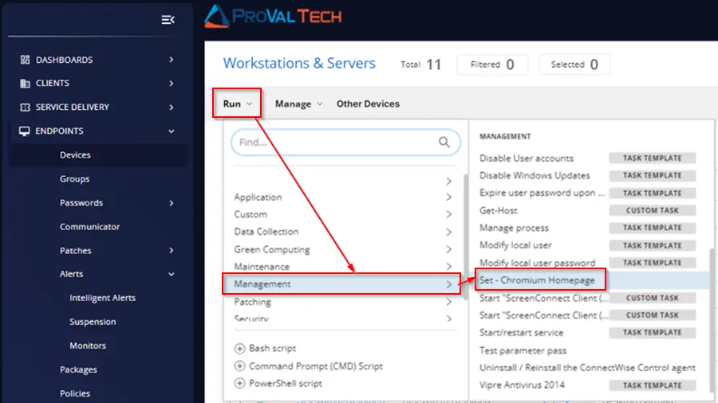

To add [https://www.google.com/](https://www.google.com/) to the homepage for Edge:

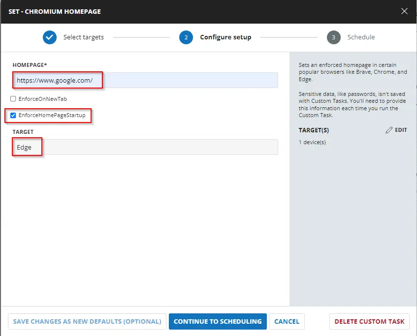

Select `Run Now` and click on `Run Task`:

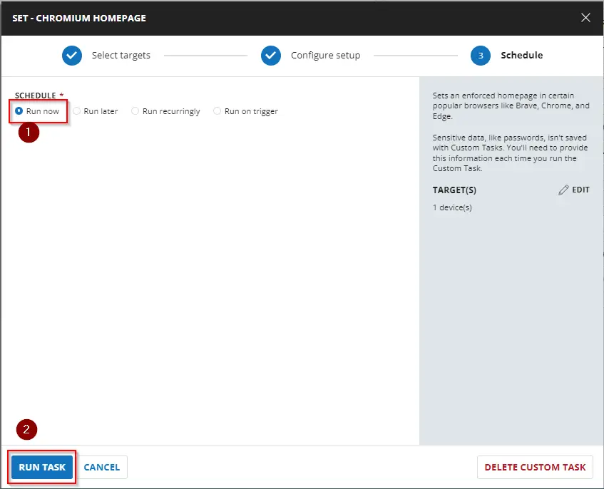

## Dependencies

[Set-ChromeHomepage](/docs/f07dd124-b64e-4906-8f33-5a2109ac73ab)

## User Parameters

| Name                     | Example                          | Required | Description                                                                                               |
|--------------------------|----------------------------------|----------|-----------------------------------------------------------------------------------------------------------|
| Homepage                 | [https://www.google.com/](https://www.google.com/) | True     | String value of the homepage to set in the browser.                                                      |
| EnforceOnNewTab         | --                               | False    | Include this switch to force the homepage on each new tab instead of the new tab page.                  |
| EnforceHomepageStartup    | --                               | False    | Include this switch to force the homepage to be the only open tab at startup of the browser.             |
| Target                   | Brave, Chrome, Edge              | False    | This designates the targeted Chromium-based browser to apply the setting to. You can leave the field blank if you want to set the same homepage for all the Chromium browsers available. |

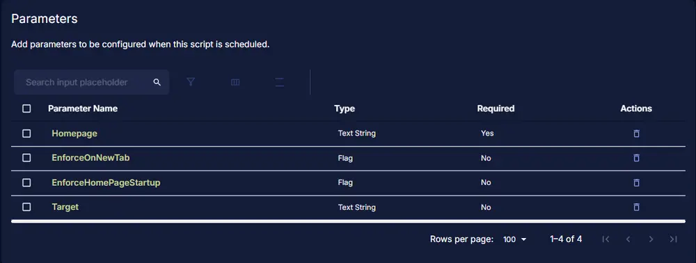

## Implementation

Create a new `Script Editor` style script in the system to implement this task.

**Name:** Set - Chromium Homepage  
**Description:** Sets an enforced homepage in certain popular browsers like Brave, Chrome, and Edge.  
**Category:** Management

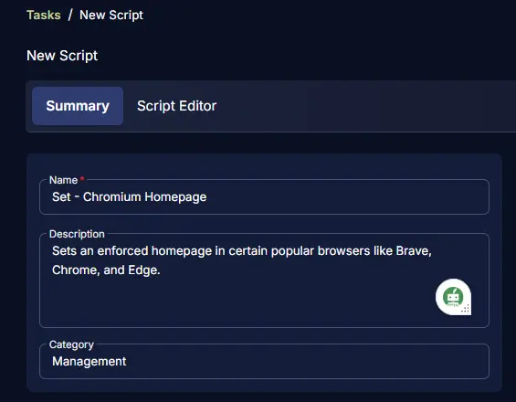

## Parameters

Add a new parameter by clicking the `Add Parameter` button present at the top-right corner of the screen.

This screen will appear.

### Homepage

- Set `Homepage` in the `Parameter Name` field.
- Select `Text String` from the `Parameter Type` dropdown menu.
- Toggle ON the `Required Field` button.
- Click the `Save` button.

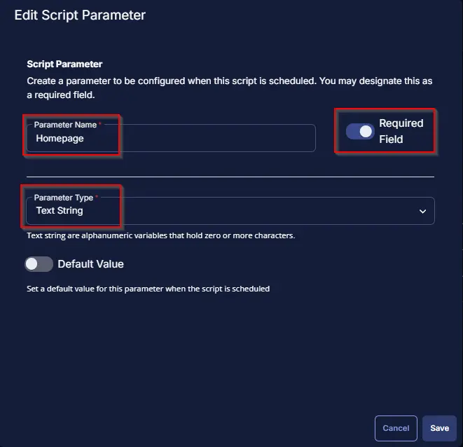

Click the `Confirm` button to save the parameter.

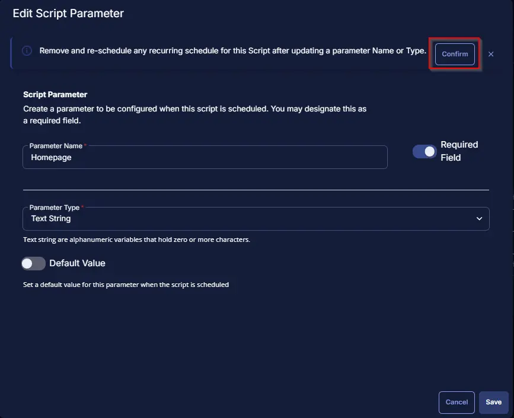

### EnforceOnNewTab

- Set `EnforceOnNewTab` in the `Parameter Name` field.
- Select `Flag` from the `Parameter Type` dropdown menu.
- Click the `Save` button.

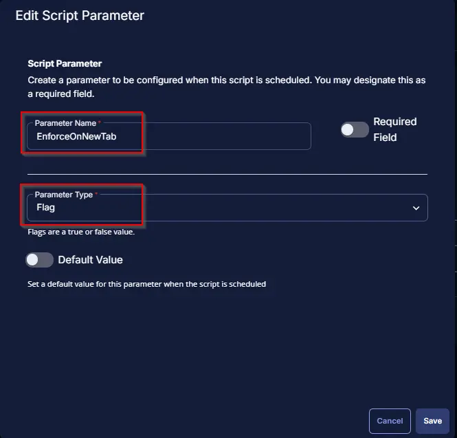

Click the `Confirm` button to save the parameter.

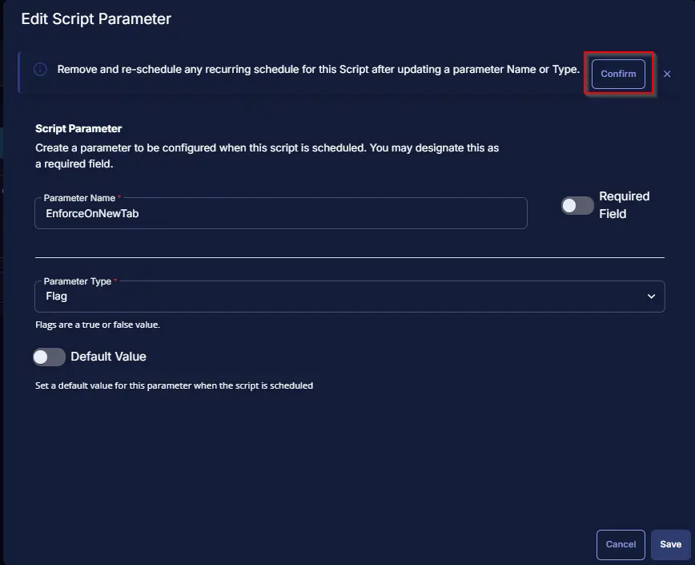

### EnforceHomepageStartup

- Set `EnforceHomepageStartup` in the `Parameter Name` field.
- Select `Flag` from the `Parameter Type` dropdown menu.
- Click the `Save` button.

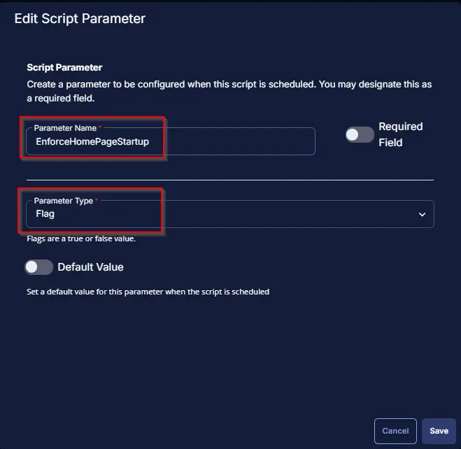

Click the `Confirm` button to save the parameter.

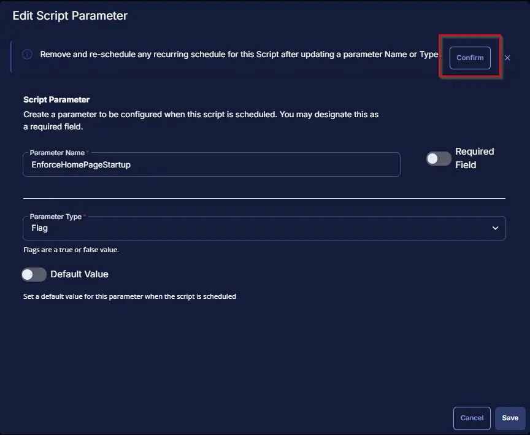

### Target

- Set `Target` in the `Parameter Name` field.
- Select `Text String` from the `Parameter Type` dropdown menu.
- Click the `Save` button.

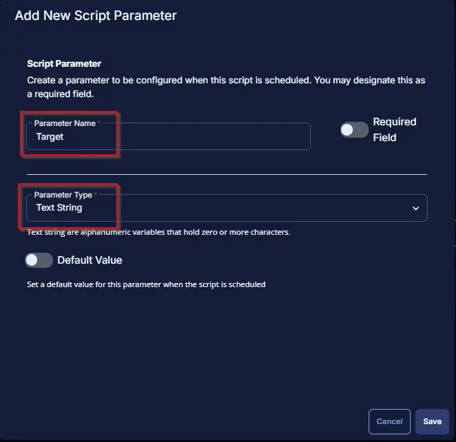

Click the `Confirm` button to save the parameter.

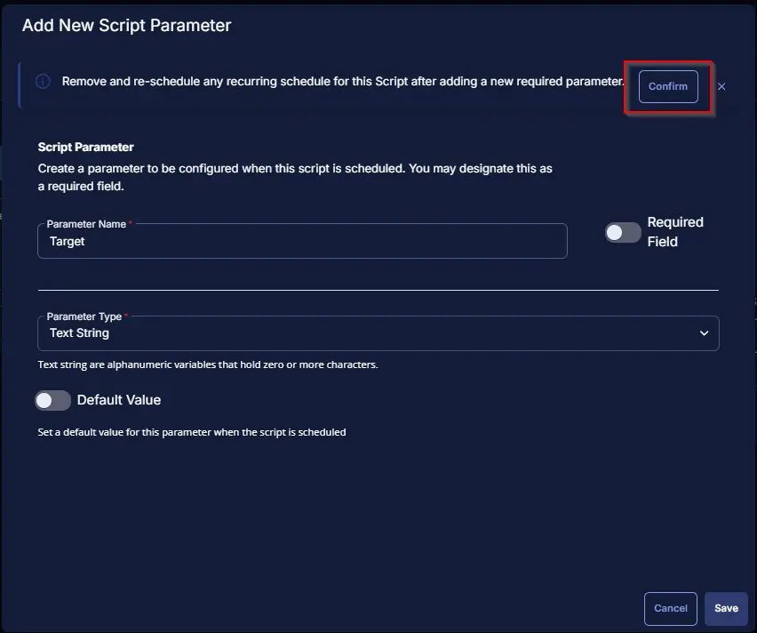

Once all the parameters are created, it should look like this:

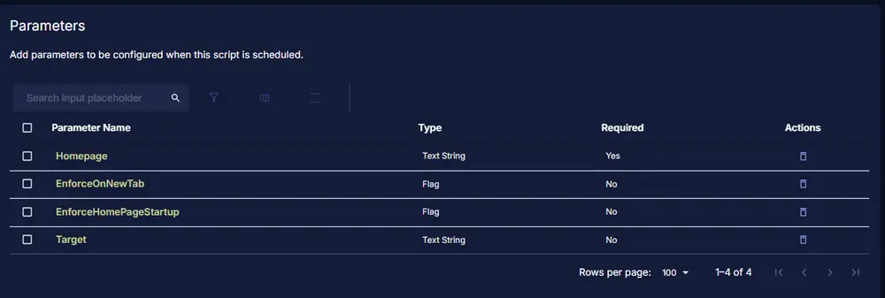

Proceed with the steps below to create a task.

## Task

Navigate to the Script Editor section and start by adding a row. You can do this by clicking the `Add Row` button at the bottom of the script page.

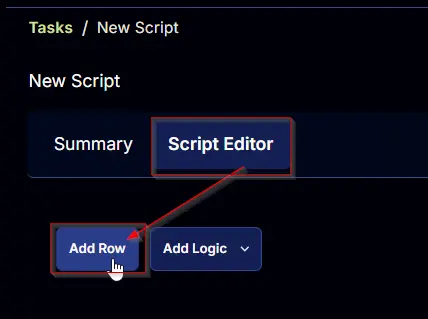

A blank function will appear.

### Row 1 Function: PowerShell Script

Search and select the `PowerShell Script` function.

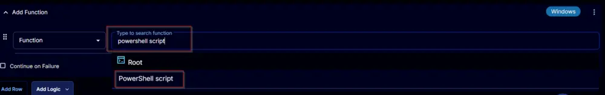

The following function will pop up on the screen:

Copy the below PowerShell commands and paste them in the `PowerShell Script Editor` box:

[PowerShell Script](https://github.com/ProVal-Tech/cw-rmm/blob/main/tasks/set-chromium-homepage/script.ps1)

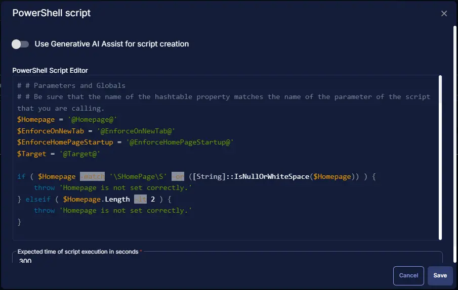

### Row 2 Function: Script Log

Add a new row by clicking the `Add Row` button.

A blank function will appear.

Search and select the `Script Log` function.

The following function will pop up on the screen:

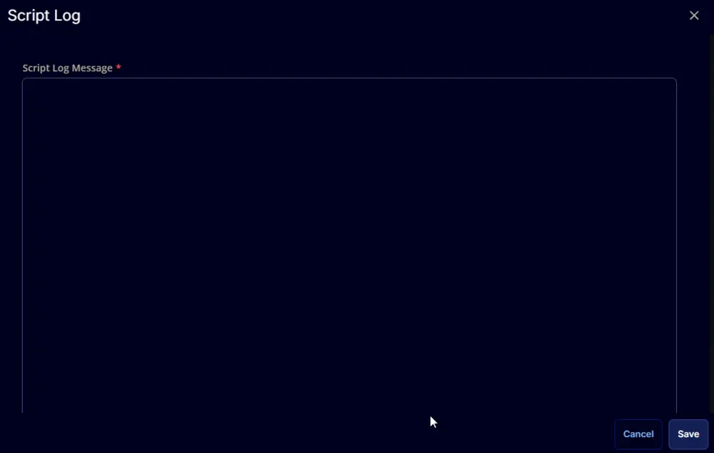

In the script log message, simply type `%output%` and click the `Save` button.

Click the `Save` button at the top-right corner of the screen to save the script.

## Completed Task

The Script Editor should look like this:

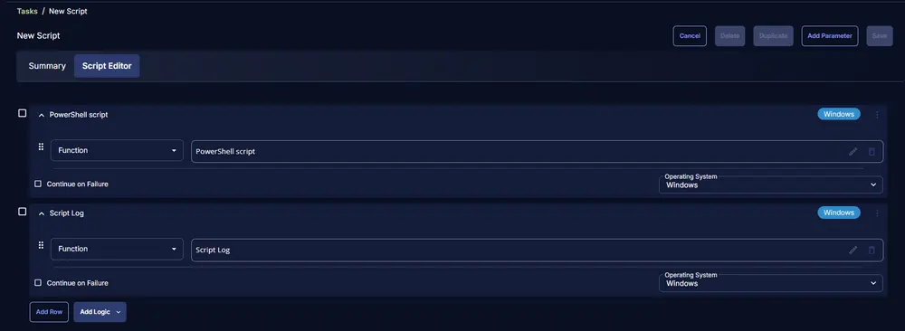

## Output

- Script log

## Changelog

### 2025-04-10

- Initial version of the document

