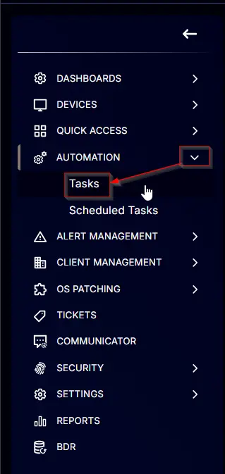
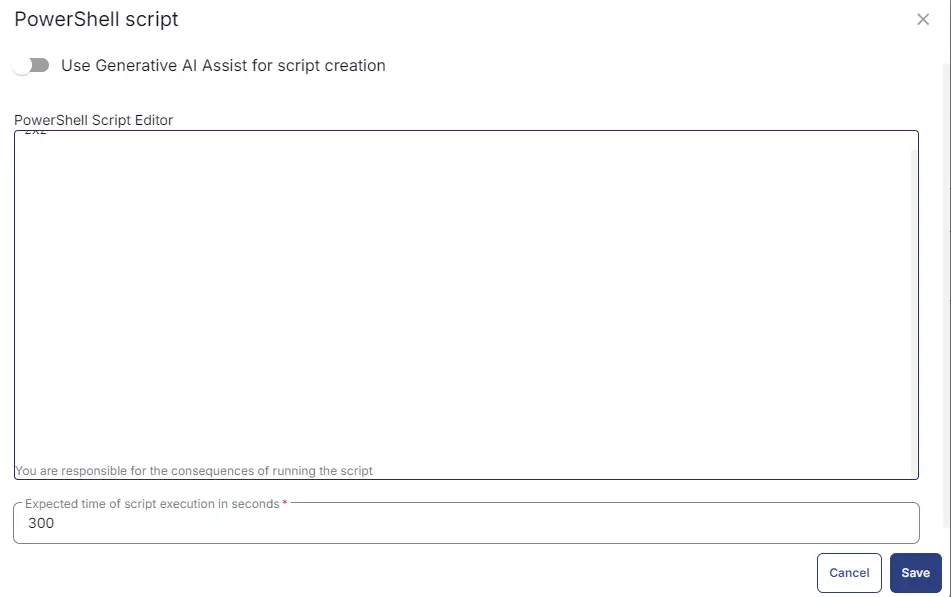

## Summary

This is an RMM implementation of the agnostic script [Set-DisplayScaling](/docs/d53bd821-ed9a-4779-8113-2994eaa7197c) to set custom display scaling on both existing and new users for Windows machines.

## Sample Run


To set the display scale to 100%:  


## Dependencies

[Set-DisplayScaling](/docs/d53bd821-ed9a-4779-8113-2994eaa7197c)

## User Parameters

| Name            | Example | Required | Description                                                                                                                                                                                                                              |
|-----------------|---------|----------|------------------------------------------------------------------------------------------------------------------------------------------------------------------------------------------------------------------------------------------|
| ScalePercentage  | 150     | True     | Enter one of the scaling percentages from the options below: - 100 - to maximize the window zoom to 100% - 125 - to maximize the window zoom to 125% - 150 - to maximize the window zoom to 150% - 175 - to maximize the window zoom to 175% - 200 - to maximize the window zoom to 200% |

## Task Creation

Create a new `Script Editor` style script in the system to implement this task.  
  


**Name:** Set - DisplayScaling  
**Description:** This task sets custom display scaling on existing and new users for Windows machines.  
**Category:** Custom  


## Parameters

Add a new parameter by clicking the `Add Parameter` button present at the top-right corner of the screen.  
  

This screen will appear.  


- Set `ScalePercentage` in the `Parameter Name` field.
- Toggle the Required field.
- Select `Text String` from the `Parameter Type` dropdown menu.
- Click the `Save` button.  


- It will ask for confirmation to proceed. Click the `Confirm` button to create the parameter.  


Parameters will look as shown below:  


## Task

Navigate to the Script Editor section and start by adding a row. You can do this by clicking the `Add Row` button at the bottom of the script page.  


A blank function will appear.  


### Row 1 Function: PowerShell Script

Search and select the `PowerShell Script` function.  


The following function will pop up on the screen:  


Paste in the following PowerShell script and set the expected time of script execution to 300 seconds. Click the `Save` button.

```PowerShell
# # Parameters and Globals
# # Be sure that the name of the hashtable property matches the name of the parameter of the script that you are calling.
if ( '@ScalePercentage@' -notin ('100','125','150','175','200' ) ) {
    throw "ScalePercentage can either be '100','125','150','175','200'."
} else {
    $ScalePercentage = '@ScalePercentage'
}

$Parameters = @{
     Scale = '@ScalePercentage@'
 }

#region Setup - Variables
$ProjectName = 'Set-DisplayScaling'
[Net.ServicePointManager]::SecurityProtocol = [enum]::ToObject([Net.SecurityProtocolType], 3072)
$BaseURL = 'https://file.provaltech.com/repo'
$PS1URL = "$BaseURL/script/$ProjectName.ps1"
$WorkingDirectory = "C:\ProgramData\_automation\script\$ProjectName"
$PS1Path = "$WorkingDirectory\$ProjectName.ps1"
$Workingpath = $WorkingDirectory
$LogPath = "$WorkingDirectory\$ProjectName-log.txt"
$ErrorLogPath = "$WorkingDirectory\$ProjectName-Error.txt"
#endregion
#region Setup - Folder Structure
New-Item -Path $WorkingDirectory -ItemType Directory -ErrorAction SilentlyContinue | Out-Null
$response = Invoke-WebRequest -Uri $PS1URL -UseBasicParsing
if (($response.StatusCode -ne 200) -and (!(Test-Path -Path $PS1Path))) {
    throw "No pre-downloaded script exists and the script '$PS1URL' failed to download. Exiting."
} elseif ($response.StatusCode -eq 200) {
    Remove-Item -Path $PS1Path -ErrorAction SilentlyContinue
    [System.IO.File]::WriteAllLines($PS1Path, $response.Content)
}
if (!(Test-Path -Path $PS1Path)) {
    throw 'An error occurred and the script was unable to be downloaded. Exiting.'
}
#endregion
#region Execution
if ($Parameters) {
    & $PS1Path @Parameters
} else {
    & $PS1Path
}
#endregion
if ( !(Test-Path $LogPath) ) {
    throw 'PowerShell Failure. A Security application seems to have restricted the execution of the PowerShell Script.'
}
if ( Test-Path $ErrorLogPath ) {
    $ErrorContent = ( Get-Content -Path $ErrorLogPath )
    throw $ErrorContent
}
Get-Content -Path $LogPath
```

### Row 2: Function: Script Log

In the script log message, simply type `%output%` so that the script will send the results of the PowerShell script above to the output on the Automation tab for the target device.  


## Completed Task


## Output

- Script Log