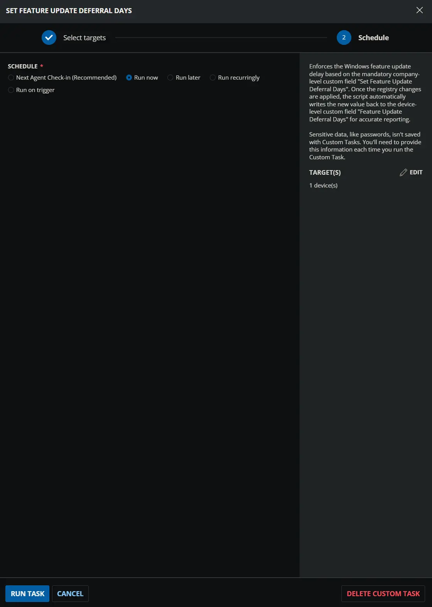
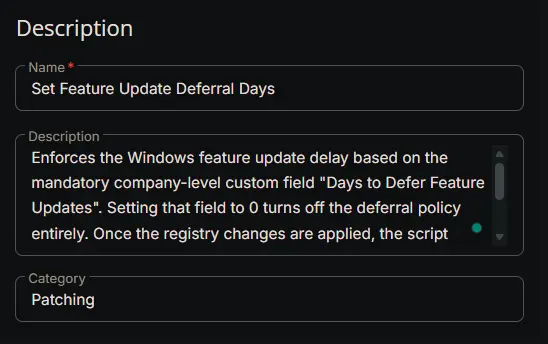
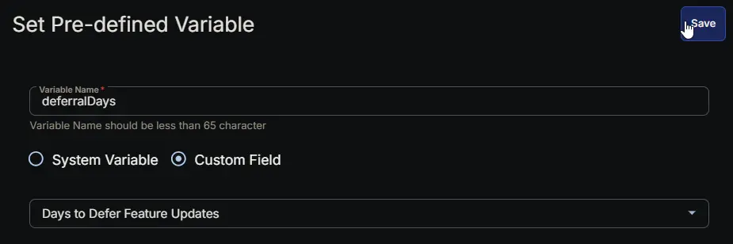
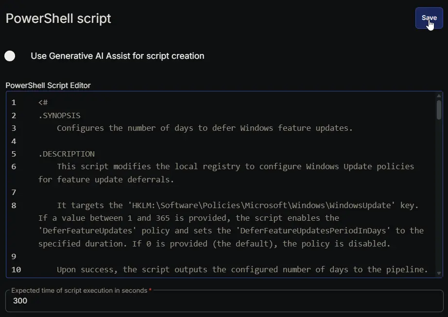
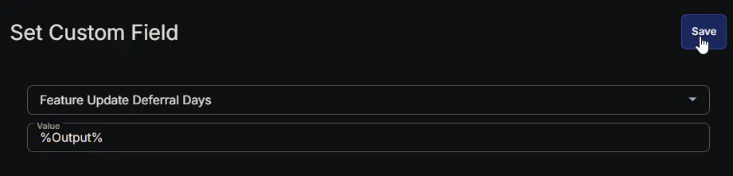
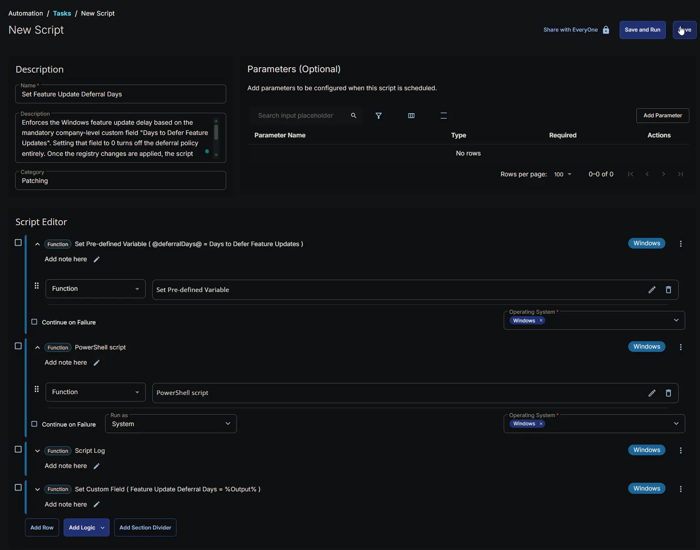
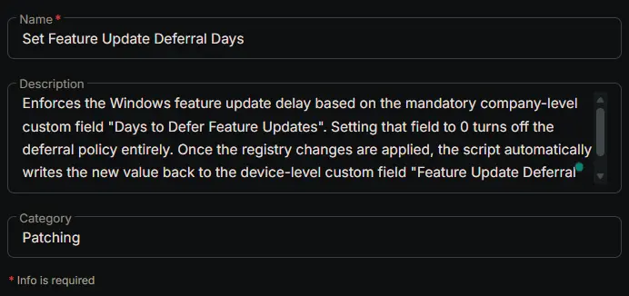
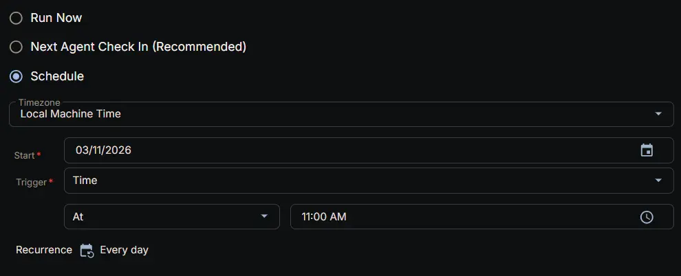
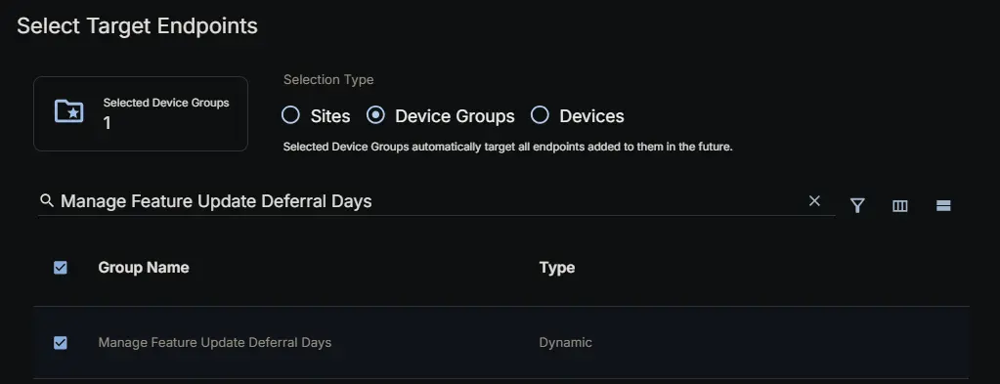
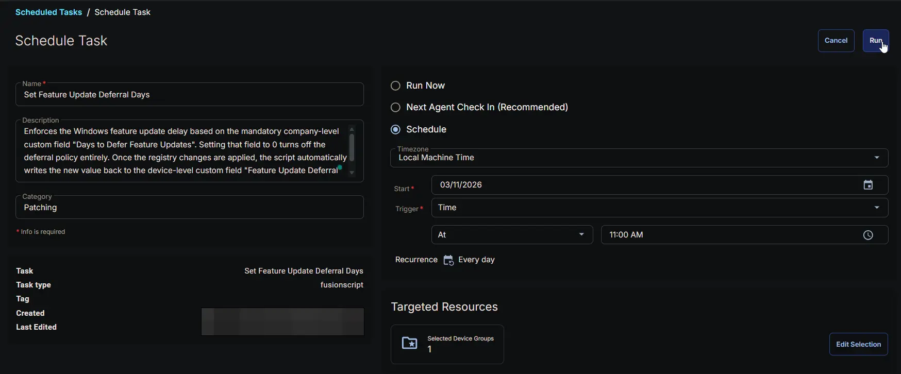

## Summary

Enforces the Windows feature update delay based on the mandatory company-level custom field [Days to Defer Feature Updates](/docs/f09876a6-5d87-446a-8b07-dc3f30f3a285). Setting that field to 0 turns off the deferral policy entirely. Once the registry changes are applied, the script automatically writes the new value back to the device-level custom field [Feature Update Deferral Days](/docs/c3d64c06-6c83-4d50-b0aa-71ae018d4c22) for accurate reporting.

## Sample Run



## Dependencies

- [Custom Field: Feature Update Deferral Days](/docs/c3d64c06-6c83-4d50-b0aa-71ae018d4c22)
- [Custom Field: Days to Defer Feature Updates](/docs/f09876a6-5d87-446a-8b07-dc3f30f3a285)
- [Dynamic Group: Manage Feature Update Deferral Days](/docs/8b8782e5-6747-4cd4-b7c5-00e0040ee4fb)
- [Solution: Manage Feature Update Deferral](/docs/800f96cd-5e64-48dd-bb9a-f17822db38e8)

## Custom Fields

| Name                | Example                                   | Level   | Type | Required | Description                                    |
|---------------------|-------------------------------------------|---------|------|----------|------------------------------------------------|
| [Days to Defer Feature Updates](/docs/f09876a6-5d87-446a-8b07-dc3f30f3a285) | 100 | Company | Text | Yes | The desired number of days (0-365) to postpone Windows feature updates for all Windows 10 and 11 endpoints under this client. |
| [Feature Update Deferral Days](/docs/c3d64c06-6c83-4d50-b0aa-71ae018d4c22) | 100 | Endpoint | Text | Yes | Stores the current feature update deferral setting fetched by the script. |

## Task Setup Path

- **Tasks Path:** `AUTOMATION` ➞ `Tasks`  
- **Task Type:** `Script Editor`  

## Task Creation

### Description

- **Name:** `Set Feature Update Deferral Days`  
- **Description:** `Enforces the Windows feature update delay based on the mandatory company-level custom field "Days to Defer Feature Updates". Setting that field to 0 turns off the deferral policy entirely. Once the registry changes are applied, the script automatically writes the new value back to the device-level custom field "Feature Update Deferral Days" for accurate reporting.`  
- **Category:** `Patching`



### Script Editor

#### Row 1: Set Pre-defined Variable

- **Variable Name:** `deferralDays`  
- **Type:**  `Custom Field`  
- **Custom Field:**  `Days to Defer Feature Updates`  
- **Continue on Failure:** `False`  
- **Operating System:** `Windows`  



#### Row 2: PowerShell script

- **Use Generative AI Assist for script creation:** `False`  
- **Expected time of script execution in seconds:** `300`  
- **Continue on Failure:** `False`  
- **Run as:** `System`  
- **Operating System:** `Windows`  
- **PowerShell Script Editor:**  

```PowerShell
<#
.SYNOPSIS
    Configures the number of days to defer Windows feature updates.

.DESCRIPTION
    This script modifies the local registry to configure Windows Update policies for feature update deferrals.

    It targets the 'HKLM:\Software\Policies\Microsoft\Windows\WindowsUpdate' key. If a value between 1 and 365 is provided, the script enables the 'DeferFeatureUpdates' policy and sets the 'DeferFeatureUpdatesPeriodInDays' to the specified duration. If 0 is provided (the default), the policy is disabled.

    Upon success, the script outputs the configured number of days to the pipeline.

.PARAMETER DaysToDefer
    The number of days (0-365) to postpone Windows feature updates. Setting this value to 0 turns off the deferral policy entirely. The default is 0.

.EXAMPLE
    .\Set-FeatureUpdateDeferral.ps1 -DaysToDefer 30

    # Expected Output:
    30
    # Description: Enables the deferral policy and delays feature updates by 30 days.

.EXAMPLE
    .\Set-FeatureUpdateDeferral.ps1 -DaysToDefer 0

    # Expected Output:
    0
    # Description: Disables the feature update deferral policy.

.OUTPUTS
    System.Int16
    Outputs the number of days the deferral was set to (or 0 if disabled).
#>

[CmdletBinding()]
param (
    [Parameter(Mandatory = $false, HelpMessage = 'The number of days (0-365) to postpone Windows feature updates. Setting this value to 0 turns off the deferral policy entirely. The default is 0.')]
    [ValidateRange(0, 365)]
    [Int16]$DaysToDefer = 0
)

#region globals
$ProgressPreference = 'SilentlyContinue'
$WarningPreference = 'SilentlyContinue'
#endregion

#region variables
$regPath = 'HKLM:\Software\Policies\Microsoft\Windows\WindowsUpdate'
$deferRegName = 'DeferFeatureUpdates'
$deferDaysRegName = 'DeferFeatureUpdatesPeriodInDays'
#endregion

#region cw rmm variable
$cwRmmDaysToDefer = '@deferralDays@'

$parsedValue = 0

if ([string]::IsNullOrWhiteSpace($cwRmmDaysToDefer)) {
    throw 'Client-level custom field ''Feature Update Deferral Days'' is not set or is empty.'
} elseif ($cwRmmDaysToDefer.Trim() -match '[^\d]') {
    throw ('Client-level custom field ''Feature Update Deferral Days'' must be a valid integer between 0 and 365. Current value: {0}' -f $cwRmmDaysToDefer)
} elseif (-not [int16]::TryParse($cwRmmDaysToDefer.Trim(), [ref]$parsedValue) -or $parsedValue -lt 0 -or $parsedValue -gt 365) {
    throw ('Client-level custom field ''Feature Update Deferral Days'' must be a valid integer between 0 and 365. Current value: {0}' -f $cwRmmDaysToDefer)
} else {
    $DaysToDefer = $parsedValue
}
#endregion

#region main
if (-not (Test-Path -Path $regPath)) {
    if ($DaysToDefer -eq 0) {
        Write-Output -InputObject '0'
        return
    }
    try {
        New-Item -Path $regPath -Force -Confirm:$false -ErrorAction Stop | Out-Null
    } catch {
        throw ('Failed to create registry path. Reason: {0}' -f $Error[0].Exception.Message)
    }
}

try {
    if ($DaysToDefer -eq 0) {
        if ((Get-ItemProperty -Path $regPath -Name $deferRegName -ErrorAction SilentlyContinue).$deferRegName) {
            Set-ItemProperty -Path $regPath -Name $deferRegName -Value 0 -Force -Confirm:$false -ErrorAction Stop
        }
        if ((Get-ItemProperty -Path $regPath -Name $deferDaysRegName -ErrorAction SilentlyContinue).$deferDaysRegName) {
            Set-ItemProperty -Path $regPath -Name $deferDaysRegName -Value 0 -Force -Confirm:$false -ErrorAction Stop
        }
        Write-Output -InputObject '0'
    } else {
        if ((Get-ItemProperty -Path $regPath -Name $deferRegName -ErrorAction SilentlyContinue).$deferRegName -ne 1) {
            Set-ItemProperty -Path $regPath -Name $deferRegName -Value 1 -Force -Confirm:$false -ErrorAction Stop
        }
        if ((Get-ItemProperty -Path $regPath -Name $deferDaysRegName -ErrorAction SilentlyContinue).$deferDaysRegName -ne $DaysToDefer) {
            Set-ItemProperty -Path $regPath -Name $deferDaysRegName -Value $DaysToDefer -Force -Confirm:$false -ErrorAction Stop
        }
        Write-Output -InputObject $DaysToDefer
    }
} catch {
    throw ('Failed to set registry keys. Reason: {0}' -f $Error[0].Exception.Message)
}
#endregion
```



#### Row 2: Script Log

- **Script Log Message:** `%Output%`  
- **Continue on Failure:** `False`  
- **Operating System:** `Windows`


#### Row 3: Set Custom Field

- **Custom Field:** `Feature Update Deferral Days`  
- **Value:** `%Output%`  
- **Continue on Failure:** `False`  
- **Operating System:** `Windows`



## Completed Script



## Output

- Script Log
- Custom Field

## Scheduled Task

### Task Details

- **Name:** `Set Feature Update Deferral Days`  
- **Description:** `Enforces the Windows feature update delay based on the mandatory company-level custom field "Days to Defer Feature Updates". Setting that field to 0 turns off the deferral policy entirely. Once the registry changes are applied, the script automatically writes the new value back to the device-level custom field "Feature Update Deferral Days" for accurate reporting.`  
- **Category:** `Patching`



### Schedule

- **Schedule Type:**  `Schedule`  
- **Timezone:** `Local Machine Time`  
- **Start:** `<Current Date>`  
- **Trigger:** `Time` `At` `<Current Time>`  
- **Recurrence:** `Every day`



### Targeted Resource

**Device Group:** `Manage Feature Update Deferral Days`



### Completed Scheduled Task



## Changelog

### 2026-03-11

- Initial version of the document
