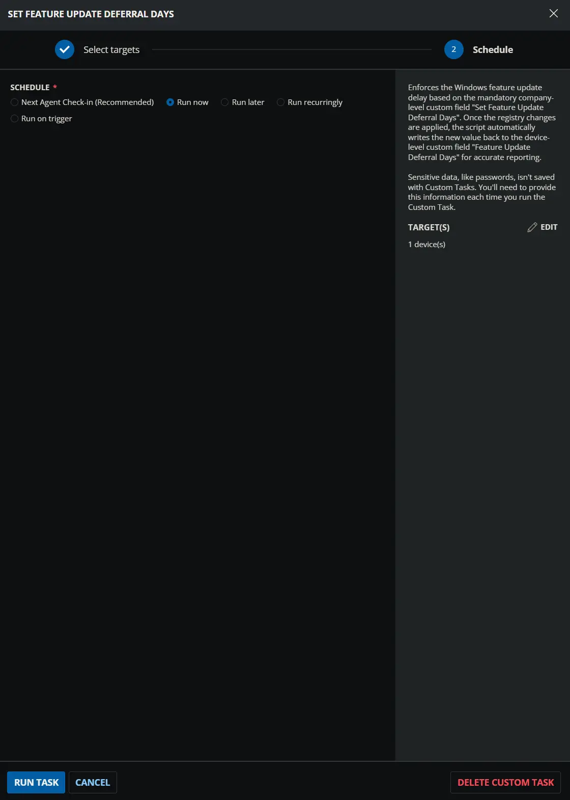
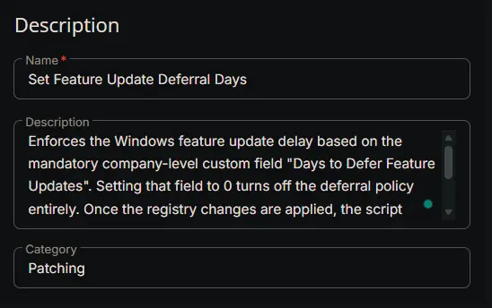
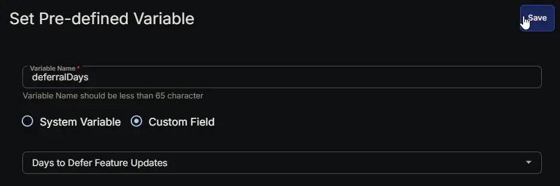
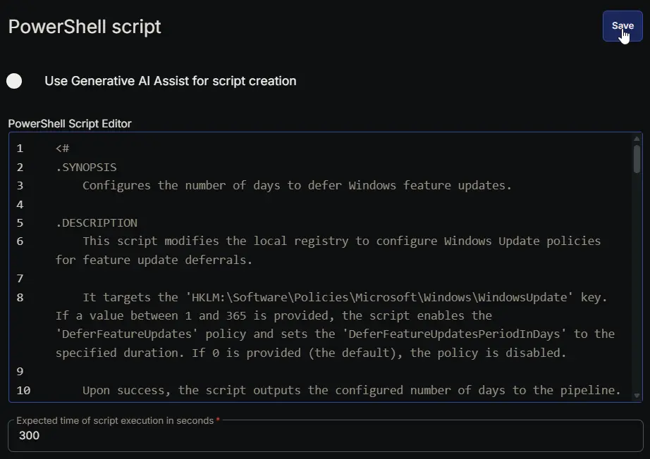
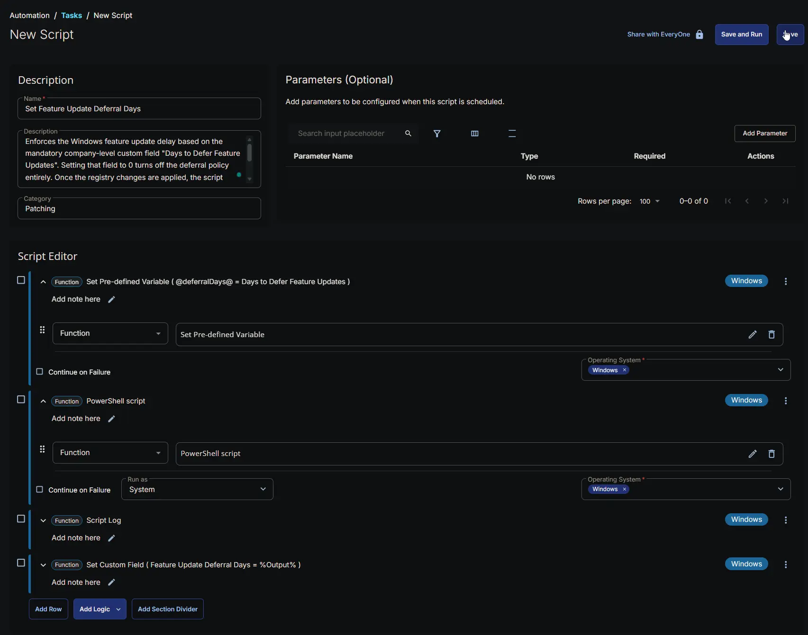
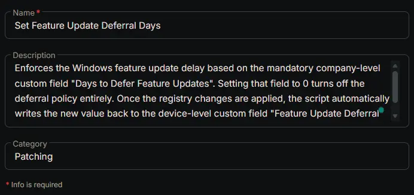
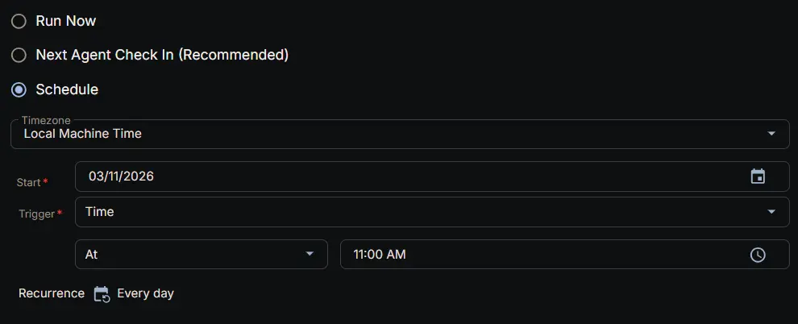
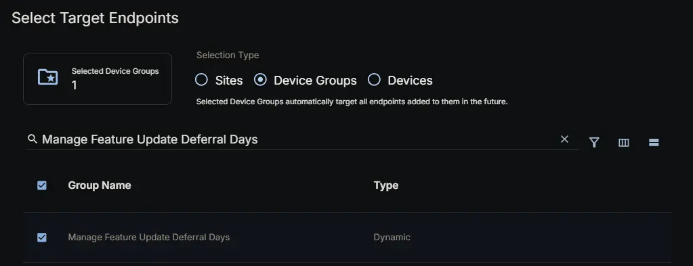
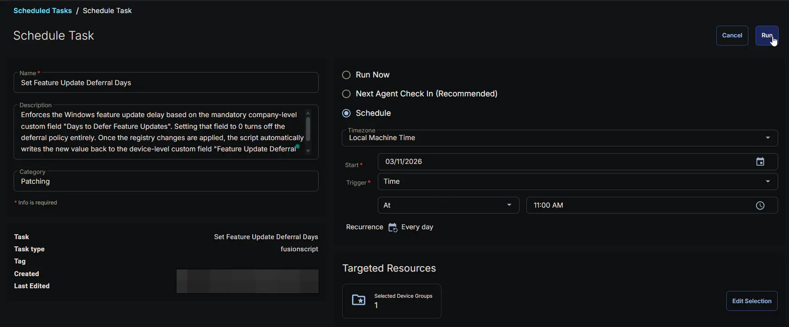

## Summary

Enforces the Windows feature update delay based on the mandatory company-level custom field [Days to Defer Feature Updates](/docs/f09876a6-5d87-446a-8b07-dc3f30f3a285). Setting that field to 0 turns off the deferral policy entirely. Once the registry changes are applied, the script automatically writes the new value back to the device-level custom field [Feature Update Deferral Days](/docs/c3d64c06-6c83-4d50-b0aa-71ae018d4c22) for accurate reporting.

## Sample Run

## Dependencies

- [Custom Field: Feature Update Deferral Days](/docs/c3d64c06-6c83-4d50-b0aa-71ae018d4c22)
- [Custom Field: Days to Defer Feature Updates](/docs/f09876a6-5d87-446a-8b07-dc3f30f3a285)
- [Dynamic Group: Manage Feature Update Deferral Days](/docs/8b8782e5-6747-4cd4-b7c5-00e0040ee4fb)
- [Solution: Manage Feature Update Deferral](/docs/800f96cd-5e64-48dd-bb9a-f17822db38e8)

## Custom Fields

| Name                | Example                                   | Level   | Type | Required | Description                                    |
|---------------------|-------------------------------------------|---------|------|----------|------------------------------------------------|
| [Days to Defer Feature Updates](/docs/f09876a6-5d87-446a-8b07-dc3f30f3a285) | 100 | Company | Text | Yes | The desired number of days (0-365) to postpone Windows feature updates for all Windows 10 and 11 endpoints under this client. |
| [Feature Update Deferral Days](/docs/c3d64c06-6c83-4d50-b0aa-71ae018d4c22) | 100 | Endpoint | Text | Yes | Stores the current feature update deferral setting fetched by the script. |

## Task Setup Path

- **Tasks Path:** `AUTOMATION` ➞ `Tasks`  
- **Task Type:** `Script Editor`  

## Task Creation

### Description

- **Name:** `Set Feature Update Deferral Days`  
- **Description:** `Enforces the Windows feature update delay based on the mandatory company-level custom field "Days to Defer Feature Updates". Setting that field to 0 turns off the deferral policy entirely. Once the registry changes are applied, the script automatically writes the new value back to the device-level custom field "Feature Update Deferral Days" for accurate reporting.`  
- **Category:** `Patching`

### Script Editor

#### Row 1: Set Pre-defined Variable

- **Variable Name:** `deferralDays`  
- **Type:**  `Custom Field`  
- **Custom Field:**  `Days to Defer Feature Updates`  
- **Continue on Failure:** `False`  
- **Operating System:** `Windows`  

#### Row 2: PowerShell script

- **Use Generative AI Assist for script creation:** `False`  
- **Expected time of script execution in seconds:** `300`  
- **Continue on Failure:** `False`  
- **Run as:** `System`  
- **Operating System:** `Windows`  
- **PowerShell Script Editor:**  

[PowerShell Script](https://github.com/ProVal-Tech/cw-rmm/blob/main/tasks/set-feature-update-deferral-days/script.ps1)

#### Row 2: Script Log

- **Script Log Message:** `%Output%`  
- **Continue on Failure:** `False`  
- **Operating System:** `Windows`

#### Row 3: Set Custom Field

- **Custom Field:** `Feature Update Deferral Days`  
- **Value:** `%Output%`  
- **Continue on Failure:** `False`  
- **Operating System:** `Windows`

## Completed Script

## Output

- Script Log
- Custom Field

## Scheduled Task

### Task Details

- **Name:** `Set Feature Update Deferral Days`  
- **Description:** `Enforces the Windows feature update delay based on the mandatory company-level custom field "Days to Defer Feature Updates". Setting that field to 0 turns off the deferral policy entirely. Once the registry changes are applied, the script automatically writes the new value back to the device-level custom field "Feature Update Deferral Days" for accurate reporting.`  
- **Category:** `Patching`

### Schedule

- **Schedule Type:**  `Schedule`  
- **Timezone:** `Local Machine Time`  
- **Start:** `<Current Date>`  
- **Trigger:** `Time` `At` `<Current Time>`  
- **Recurrence:** `Every day`

### Targeted Resource

**Device Group:** `Manage Feature Update Deferral Days`

### Completed Scheduled Task

## Changelog

### 2026-03-11

- Initial version of the document

