---
id: '708255d7-3abc-4e10-b9f5-3f943f435695'
slug: /708255d7-3abc-4e10-b9f5-3f943f435695
title: 'Set Firefox Homepage'
title_meta: 'Set Firefox Homepage'
keywords: ['firefox', 'homepage', 'script', 'rmm', 'configuration']
description: 'This document provides a detailed guide on how to set a homepage in Firefox using ConnectWise RMM. It includes user parameters, task creation steps, sample runs, and the PowerShell script necessary for implementation.'
tags: ['application', 'firefox', 'setup']
draft: false
unlisted: false
last_update:
  date: 2025-11-27
---

## Summary

Applies a homepage to Firefox. CW RMM implementation of [Set-FirefoxHomepage](/docs/09a48350-5bd8-4d4a-8436-d1aa46bcd92e).

## Sample Run

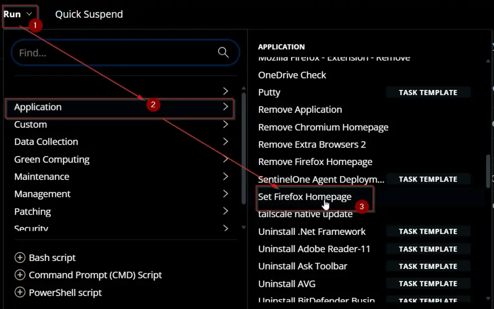  
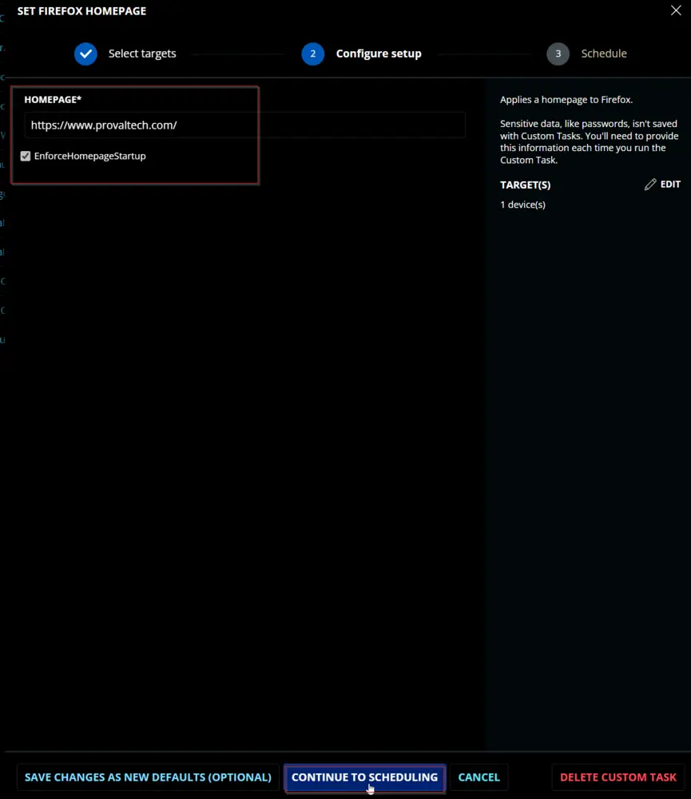  
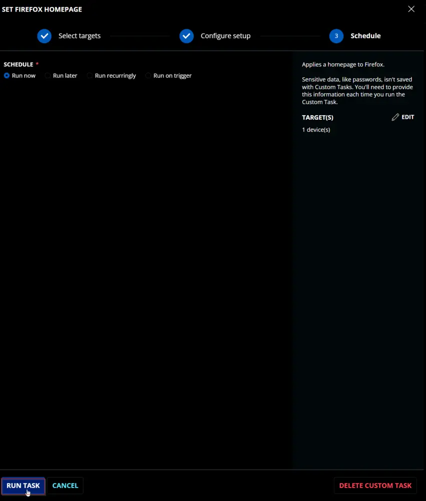  

## Dependencies

[Set-FirefoxHomepage](/docs/09a48350-5bd8-4d4a-8436-d1aa46bcd92e)  

## User Parameters

| Name                        | Example                               | Required | Type         | Description                           |
|-----------------------------|---------------------------------------|----------|--------------|---------------------------------------|
| `Homepage`                  | [https://www.provaltech.com](https://www.provaltech.com) | True     | Text String  | The URL to the desired homepage.      |
| `EnforceHomepageStartup`    | 0/1                                   | False    | Flag         | Sets the browser to display the homepage on startup. |

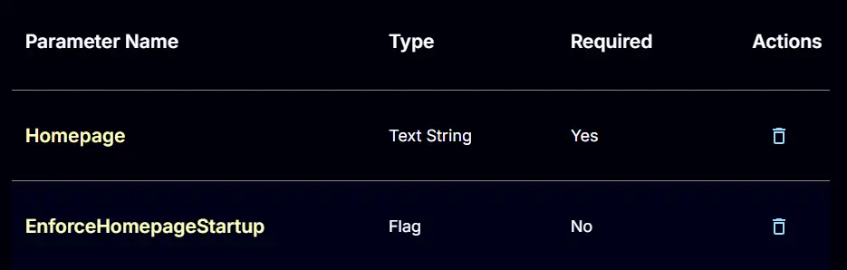  

## Task Creation

Create a new `Script Editor` style script in the system to implement this Task.  
  
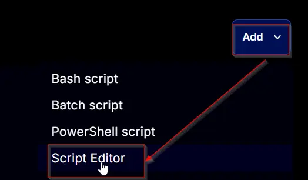  

**Name:** `Set Firefox Homepage`  
**Description:** `Applies a homepage to Firefox.`  
**Category:** `Application`  
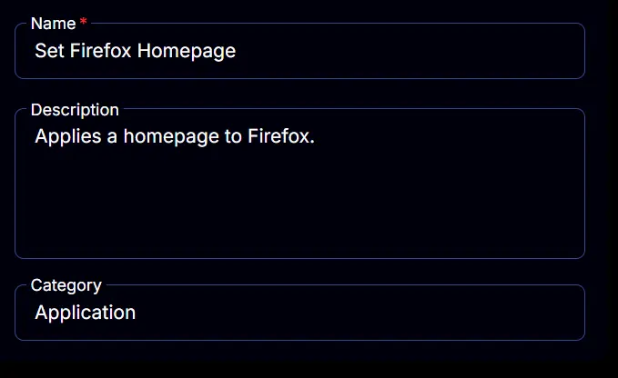  

## Parameters

### Homepage

Add a new parameter by clicking the `Add Parameter` button present at the top-right corner of the screen.  
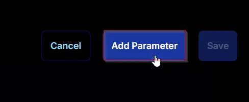  

This screen will appear.  
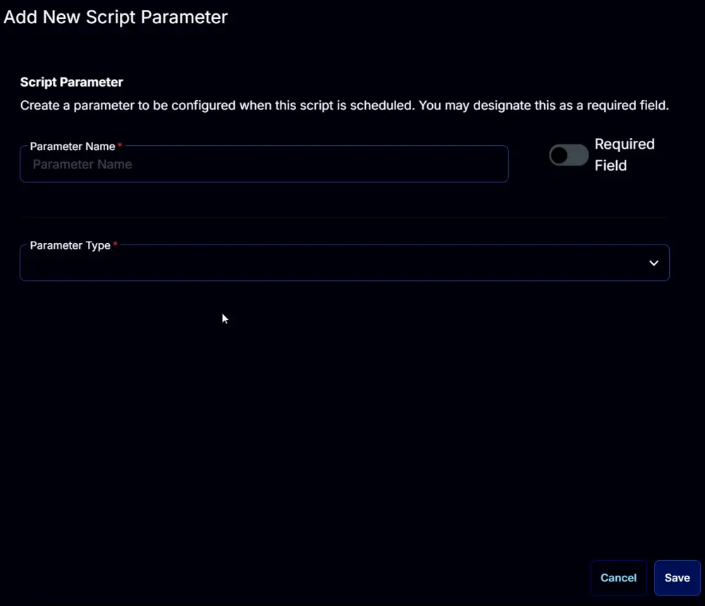  

- Set `Homepage` in the `Parameter Name` field.
- Enable the `Required Field` button.
- Select `Text String` from the `Parameter Type` dropdown menu.
- Click the `Save` button.  

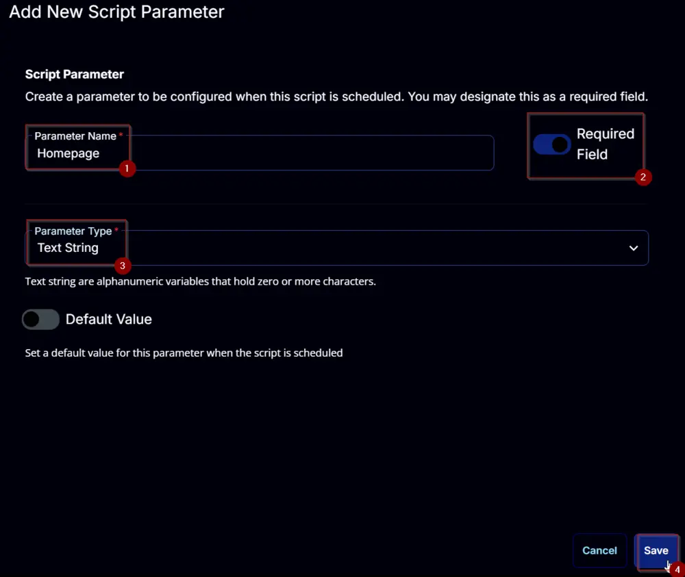  

### EnforceHomepageStartup:
Add a new parameter by clicking the `Add Parameter` button present at the top-right corner of the screen.  
  

This screen will appear.  
  

- Set `EnforceHomepageStartup` in the `Parameter Name` field.
- Select `Flag` from the `Parameter Type` dropdown menu.
- Click the `Save` button.  

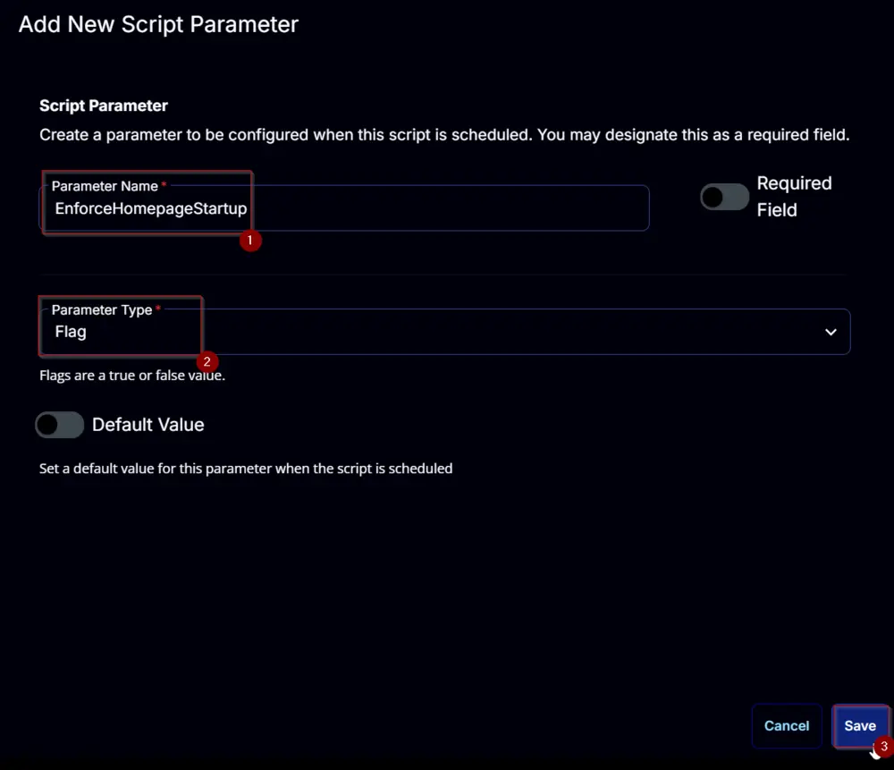  

## Task

Navigate to the Script Editor Section and start by adding a row. You can do this by clicking the `Add Row` button at the bottom of the script page.  
  

A blank function will appear.  
  

### Row 1 Function: PowerShell Script

Search and select the `PowerShell Script` function.  
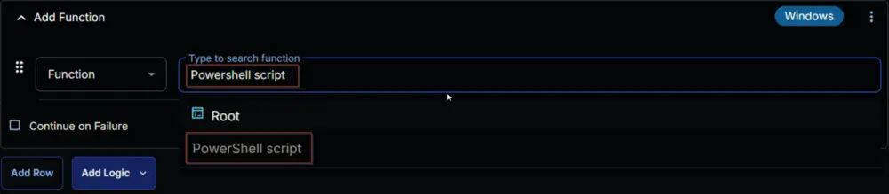  
  

The following function will pop up on the screen:  
  

Paste in the following PowerShell script and set the `Expected time of script execution in seconds` to `300` seconds. Click the `Save` button.  

[PowerShell Script](https://github.com/ProVal-Tech/cw-rmm/blob/main/tasks/set-firefox-homepage/script.ps1)

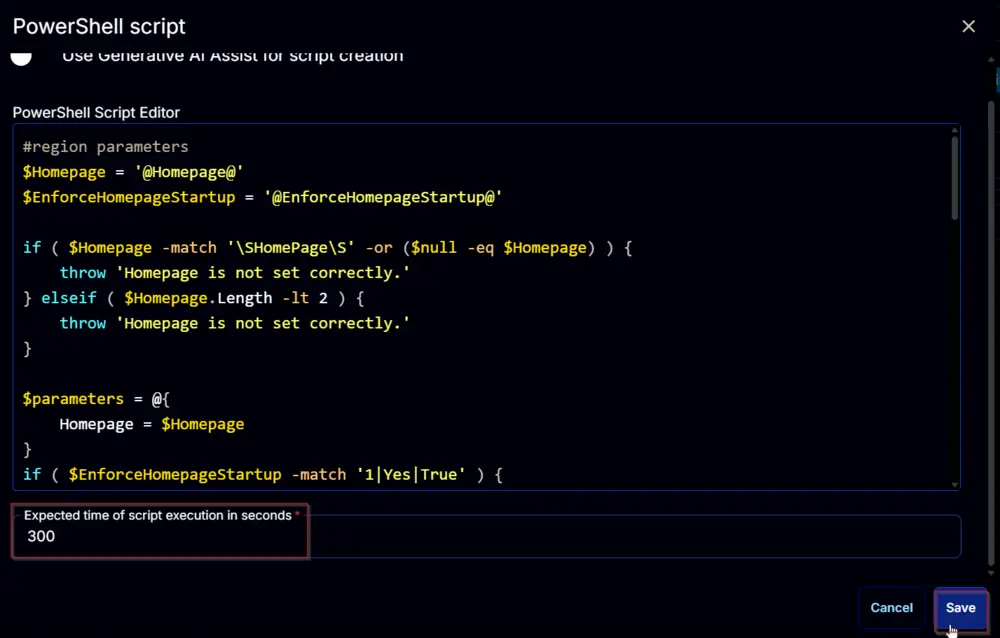  

### Row 2 Function: Script Log

Add a new row by clicking the `Add Row` button.  
  

A blank function will appear.  
  

Search and select the `Script Log` function.  
  

The following function will pop up on the screen:  
  

In the script log message, simply type `%Output%` and click the `Save` button.  
  

Click the `Save` button at the top-right corner of the screen to save the script.  
  

## Completed Script

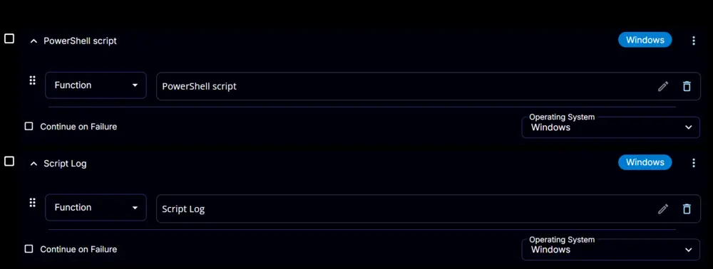  

## Output

- Script Log  
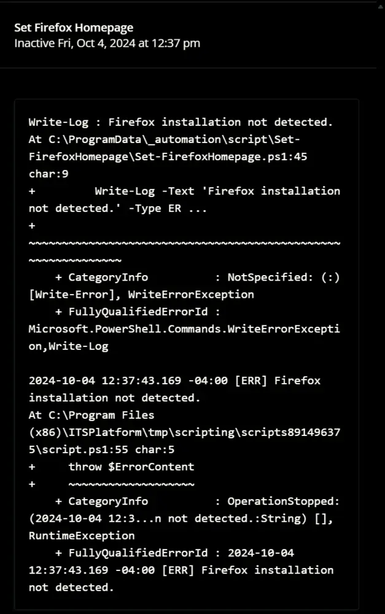

## Changelog

### 2025-04-10

- Initial version of the document

