## Summary

This is an RMM implementation of the agnostic script [Set-LastLoggedOnUser](/docs/d657bd73-5526-4f27-93bb-9dbae3fe2f6e) to manage the last logged-in user's information displayed on the Windows login screen.

## Sample Run

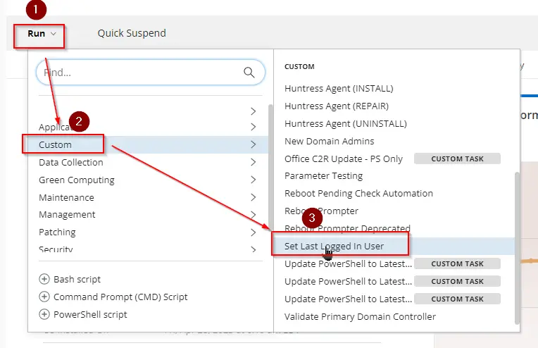

- Select the parameters below to clear the last logged-in user's information from the login screen. The computer must be restarted manually afterward to implement the changes.  
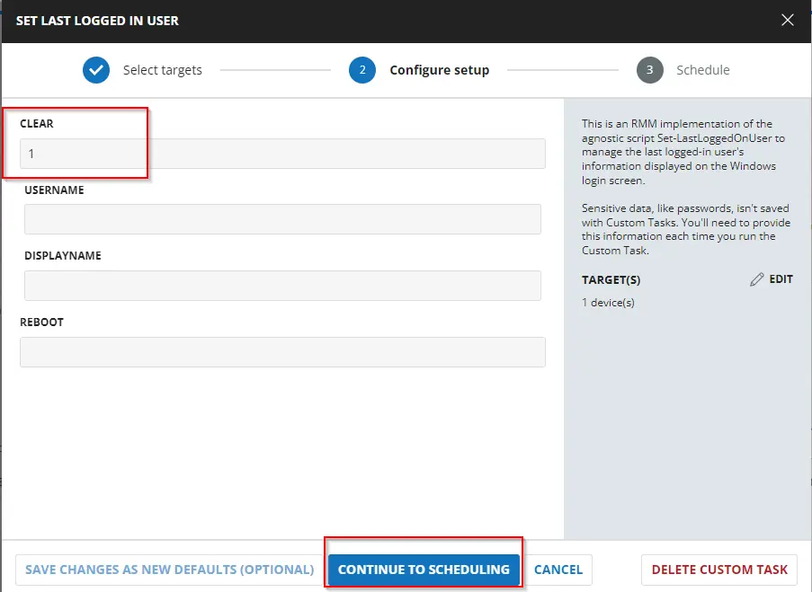  
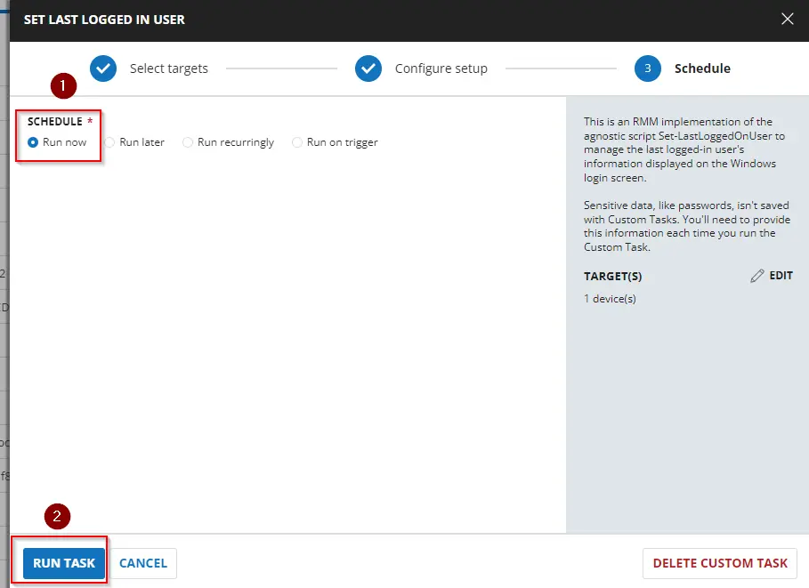

- Similarly, to clear the last logged-in user's information from the login screen and forcefully restart the computer, select the parameters below.  
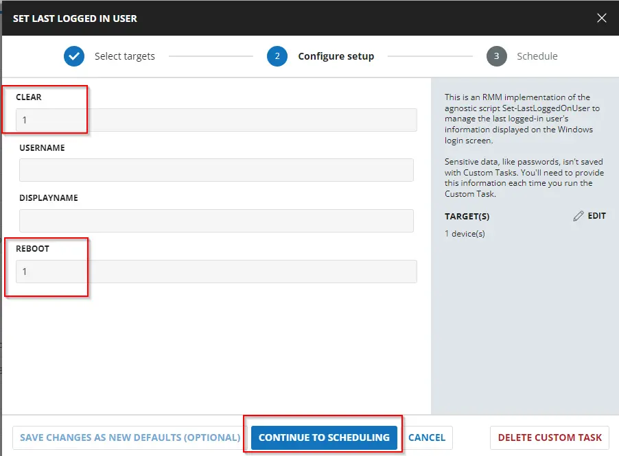

- The parameters below set the specified local user as the last logged-in user. The computer must be restarted manually afterward to implement the changes.  
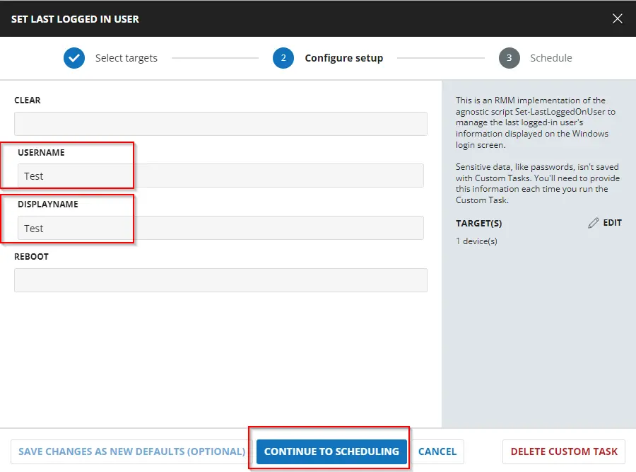

- The parameters below set the specified domain user as the last logged-in user and forcefully restart the computer.  
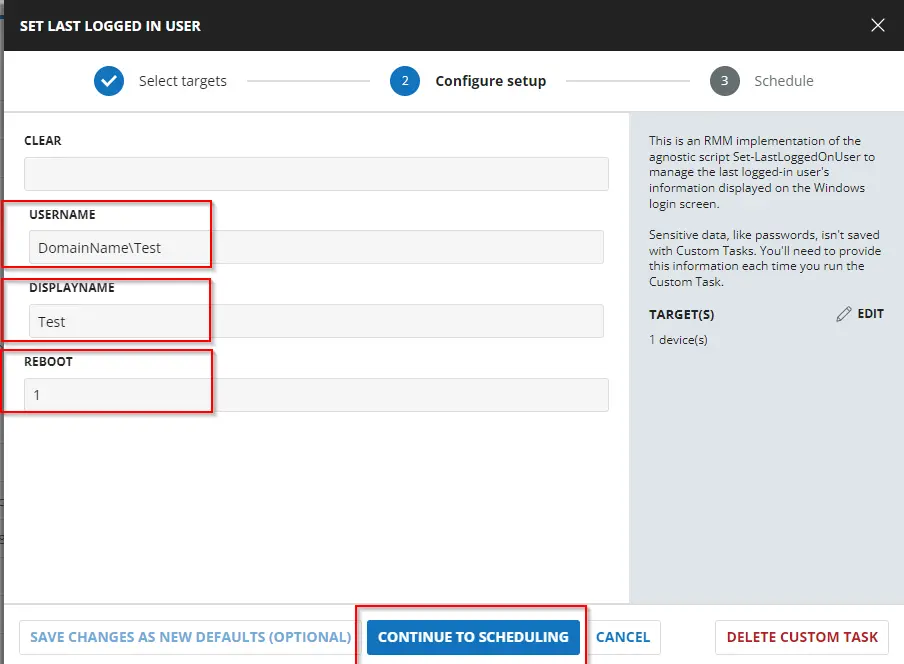

## Dependencies

[Set-LastLoggedOnUser](/docs/d657bd73-5526-4f27-93bb-9dbae3fe2f6e)

## User Parameters

| Name        | Example              | Required | Description                                                                                     |
|-------------|----------------------|----------|-------------------------------------------------------------------------------------------------|
| Clear       | 1                    | True     | Clears the last logged-in user's information from the login screen.                            |
| UserName    | Domain/UserName      | False    | Sets the specified username as the last logged-in user. The username should be in the format 'Domain/User' or 'User'. |
| DisplayName | User Name            | False    | Optionally specifies the display name to set for the last logged-in user. If not provided, it defaults to the username. |
| Reboot      | 1                    | False    | Optionally restarts the computer to apply the changes immediately.                             |

## Task Creation

Create a new `Script Editor` style script in the system to implement this Task.

**Name:** Set Last Logged In User  
**Description:** This script manages the last logged-in user's information displayed on the Windows login screen and can optionally restart the computer to apply changes.  
**Category:** Custom  
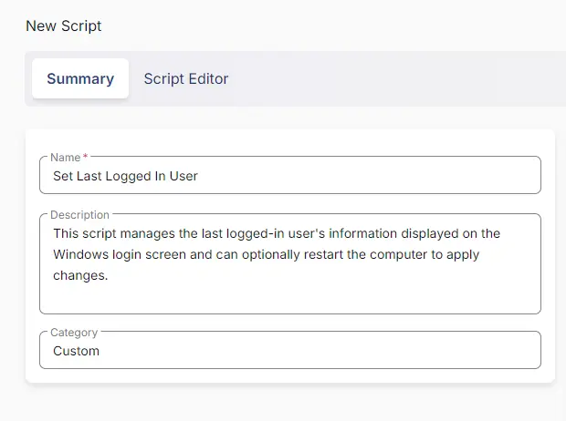

## Parameters

Add a new parameter by clicking the `Add Parameter` button present at the top-right corner of the screen.  

This screen will appear.  

- Set `Clear` in the `Parameter Name` field.
- Select `Number Value` from the `Parameter Type` dropdown menu.
- Click the `Save` button.  
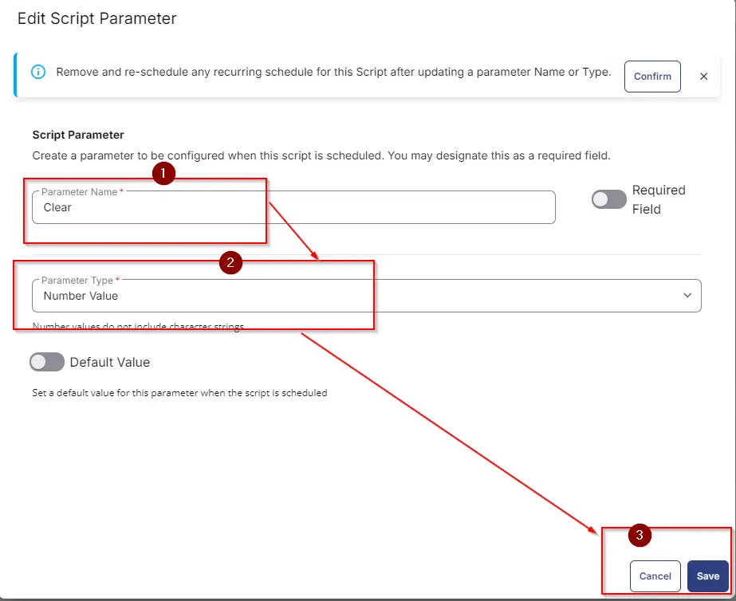

- It will ask for confirmation to proceed. Click the `Confirm` button to create the parameter.  

Add another parameter by clicking the `Add Parameter` button present at the top-right corner of the screen.  
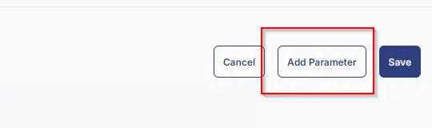

- Set `UserName` in the `Parameter Name` field.
- Select `Text String` from the `Parameter Type` dropdown menu.
- Click the `Save` button.  
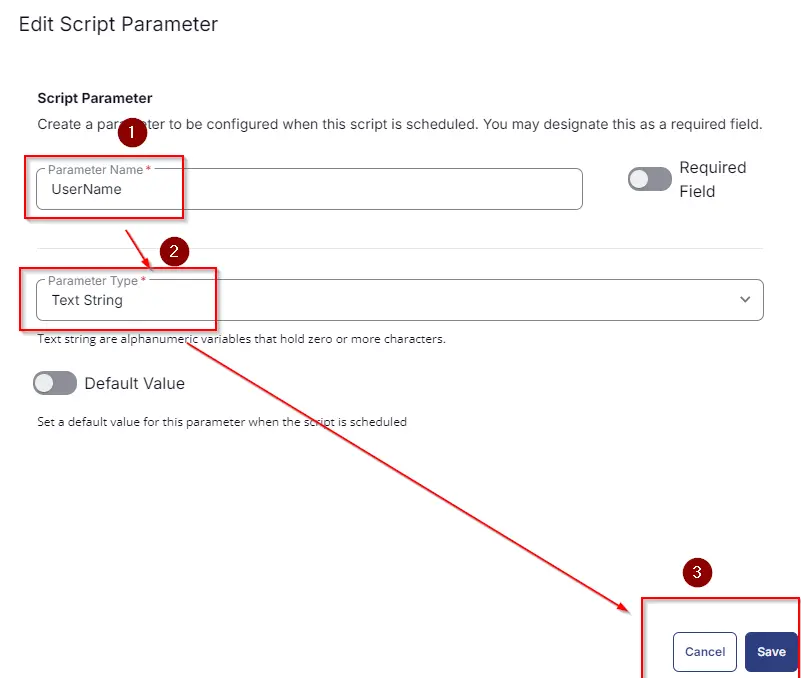

- It will ask for confirmation to proceed. Click the `Confirm` button to create the parameter.

Add another parameter by clicking the `Add Parameter` button present at the top-right corner of the screen.

- Set `DisplayName` in the `Parameter Name` field.
- Select `Text String` from the `Parameter Type` dropdown menu.
- Click the `Save` button.
- It will ask for confirmation to proceed. Click the `Confirm` button to create the parameter.

Add another parameter by clicking the `Add Parameter` button present at the top-right corner of the screen.

- Set `Reboot` in the `Parameter Name` field.
- Select `Number Value` from the `Parameter Type` dropdown menu.
- Click the `Save` button.
- It will ask for confirmation to proceed. Click the `Confirm` button to create the parameter.

All the parameters will look like the following:  
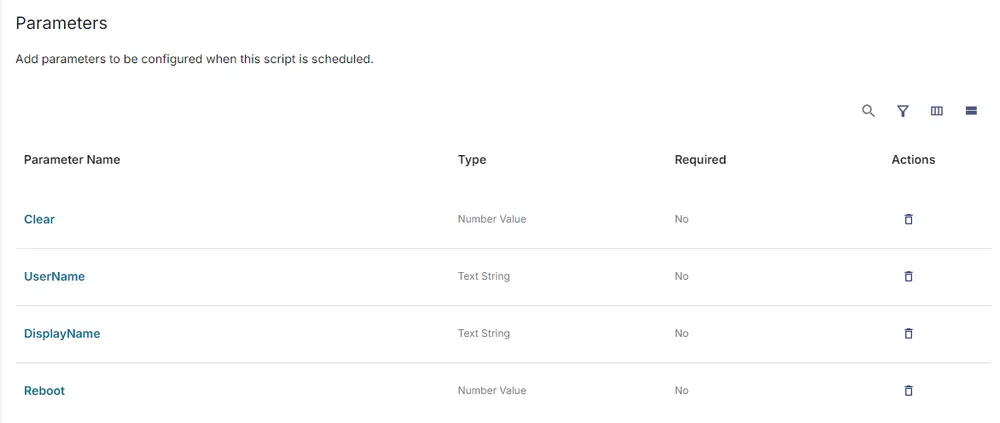

## Task

Navigate to the Script Editor Section and start by adding a row. You can do this by clicking the `Add Row` button at the bottom of the script page.  

A blank function will appear.  

### Row 1 Function: PowerShell Script

Search and select the `PowerShell Script` function.  

The following function will pop up on the screen:  

Paste the following PowerShell script and set the expected time of script execution to `900` seconds. Click the `Save` button.

[PowerShell Script](https://github.com/ProVal-Tech/cw-rmm/blob/main/tasks/set-last-logged-in-user/script.ps1)

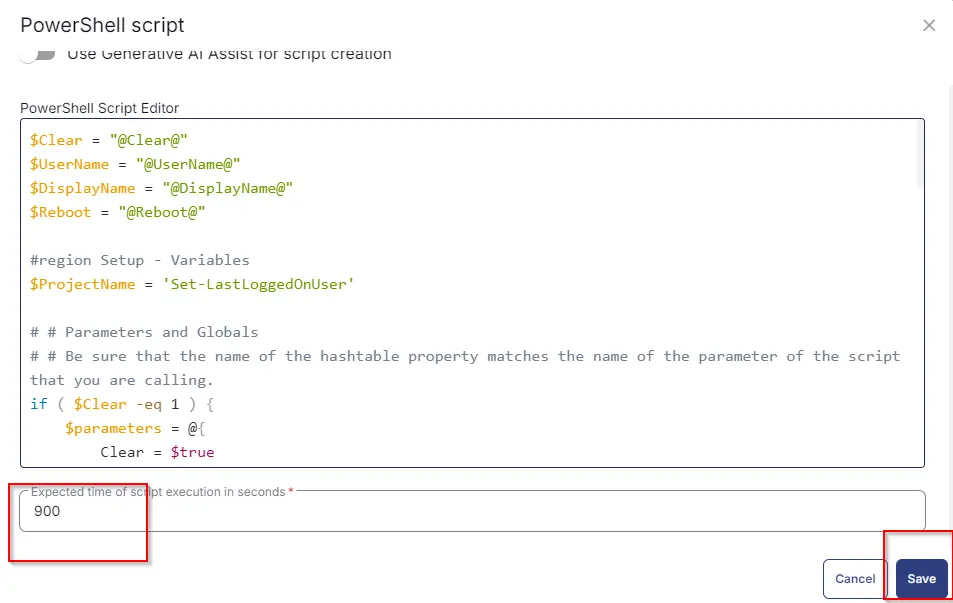

Click the `Save` button at the top-right corner of the screen to save the script.

## Completed Task

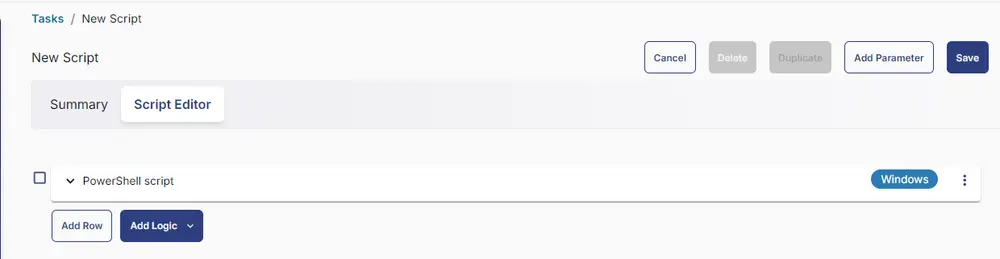

## Output

- Script Log

## Changelog

### 2025-04-10

- Initial version of the document

