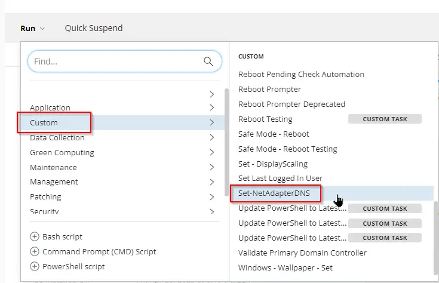
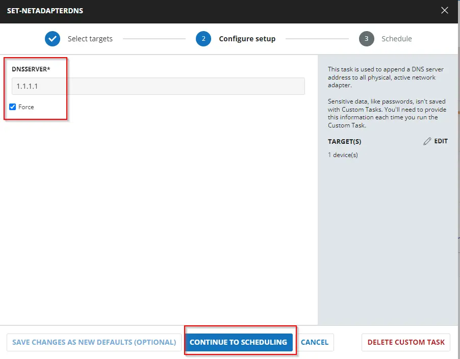
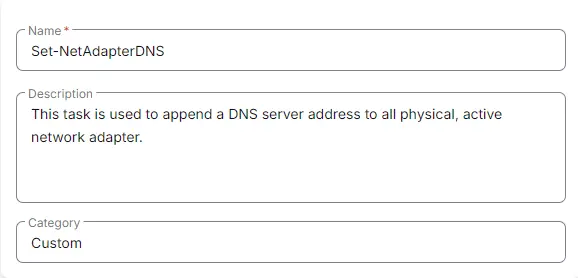
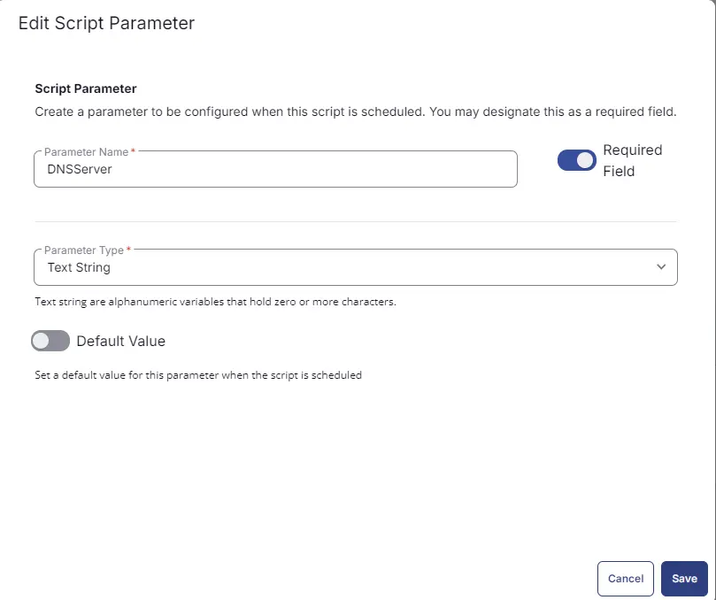
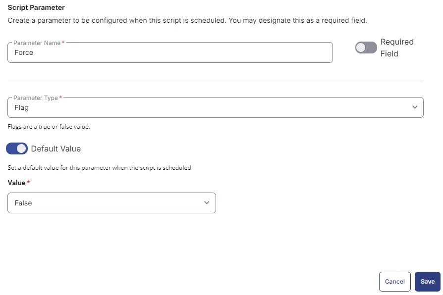
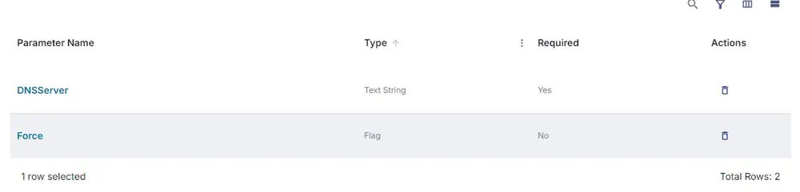
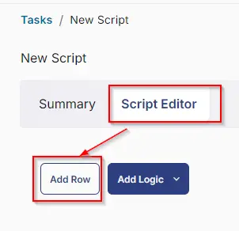

## Summary

This task **appends a DNS server address to all physical, active network adapters.**

## Sample Run



Add the DNS server address and select **Force** if you would like to force DNS address updates to DHCP-enabled adapters.



## Dependencies

[Set-NetAdapterDNS](https://file.provaltech.com/repo/script/Set-NetAdapterDNS.ps1)

## User Parameters

| Name        | Example   | Accepted Values | Required | Default | Type   | Description                                                         |
|-------------|-----------|------------------|----------|---------|--------|---------------------------------------------------------------------|
| `DNSServer` | 1.1.1.1   | IPv4 addresses    | True     |         | String | The DNS server address to append to the network adapter(s)         |
| `Force`     | Unmarked  |                  | False    | $false  | Flag   | Intended to force DNS address updates to DHCP-enabled adapters.     |

## Task Creation

Create a new `Script Editor` style script in the system to implement this task.


**Name:** Set-NetAdapterDNS  
**Description:** This task is used to append a DNS server address to all physical, active network adapters.  
**Category:** Custom  



## Parameters

Add a new parameter by clicking the `Add Parameter` button present at the top-right corner of the screen.


This screen will appear.


- Set `DNSServer` in the `Parameter Name` field.
- Select `String` from the `Parameter Type` dropdown menu.
- Toggle the Required Field.
- Click the `Save` button.



It will ask for confirmation to proceed. Click the `Confirm` button to create the parameter.


Add another parameter by clicking the `Add Parameter` button present at the top-right corner of the screen.


- Set `Force` in the `Parameter Name` field.
- Select `Flag` from the `Parameter Type` dropdown menu.
- Toggle Default Value.
- Set Default Value as `False`.
- Click the `Save` button.
- Click the `Confirm` button to create the parameter.



Parameters will look like as shown below:



## Task

Navigate to the Script Editor section and start by adding a row. You can do this by clicking the `Add Row` button at the bottom of the script page.



A blank function will appear.


### Row 1 Function: PowerShell Script

Search and select the `PowerShell Script` function.


The following function will pop up on the screen:


Paste in the following PowerShell script and set the expected time of script execution to `900` seconds. Click the `Save` button.

```powershell
if ( '@DNSServer@' -match '\b((\d{1,3})\.){3}(\d{1,3})\b') {
    $DNSServer = '@DNSServer@'
} else {
   throw "Enter Valid DNS Server"
}


if ( '@Force@' -match '1|Yes|True|Y') {
    $Force = $true
} else {
    $Force = $false
}


$Parameters = @{
    DNSServer = $DNSServer
    Force = $Force
}


#region Setup - Variables
$ProjectName = 'Set-NetAdapterDNS'
[Net.ServicePointManager]::SecurityProtocol = [enum]::ToObject([Net.SecurityProtocolType], 3072)
$BaseURL = 'https://file.provaltech.com/repo'
$PS1URL = "$BaseURL/script/$ProjectName.ps1"
$WorkingDirectory = "C:\ProgramData\_automation\script\$ProjectName"
$PS1Path = "$WorkingDirectory\$ProjectName.ps1"
$Workingpath = $WorkingDirectory
$LogPath = "$WorkingDirectory\$ProjectName-log.txt"
$ErrorLogPath = "$WorkingDirectory\$ProjectName-Error.txt"
#endregion
#region Setup - Folder Structure
New-Item -Path $WorkingDirectory -ItemType Directory -ErrorAction SilentlyContinue | Out-Null
$response = Invoke-WebRequest -Uri $PS1URL -UseBasicParsing
if (($response.StatusCode -ne 200) -and (!(Test-Path -Path $PS1Path))) {
    throw "No pre-downloaded script exists and the script '$PS1URL' failed to download. Exiting."
} elseif ($response.StatusCode -eq 200) {
    Remove-Item -Path $PS1Path -ErrorAction SilentlyContinue
    [System.IO.File]::WriteAllLines($PS1Path, $response.Content)
}
if (!(Test-Path -Path $PS1Path)) {
    throw 'An error occurred and the script was unable to be downloaded. Exiting.'
}
#endregion
#region Execution
if ($Parameters) {
    & $PS1Path @Parameters
} else {
    & $PS1Path
}
#endregion

if ( !(Test-Path $LogPath) ) {
    throw 'PowerShell Failure. A Security application seems to have restricted the execution of the PowerShell Script.'
}
if ( Test-Path $ErrorLogPath ) {
    $ErrorContent = ( Get-Content -Path $ErrorLogPath )
    throw $ErrorContent
}
Get-Content -Path $LogPath
```

### Row 2: Function: Script Log

In the script log message, simply type `%output%` so that the script will send the results of the PowerShell script above to the output on the Automation tab for the target device.


## Completed Task


## Output

- Script Log
