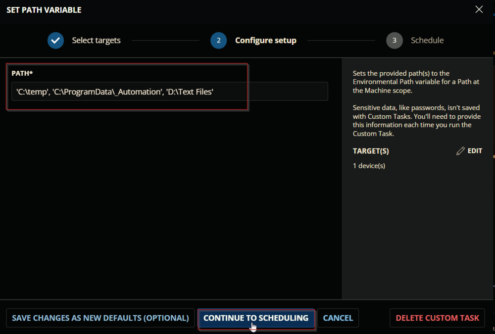
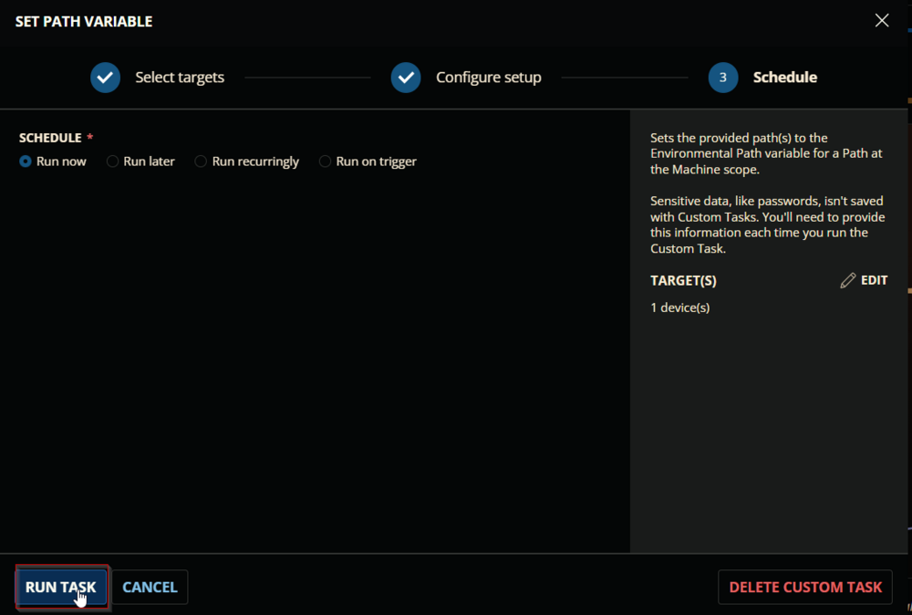
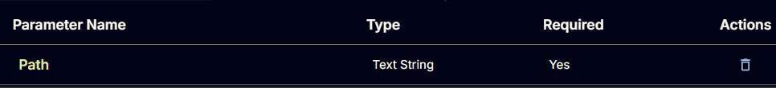
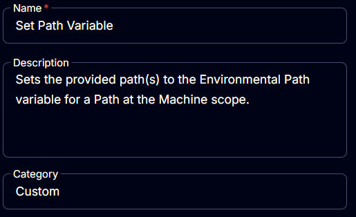
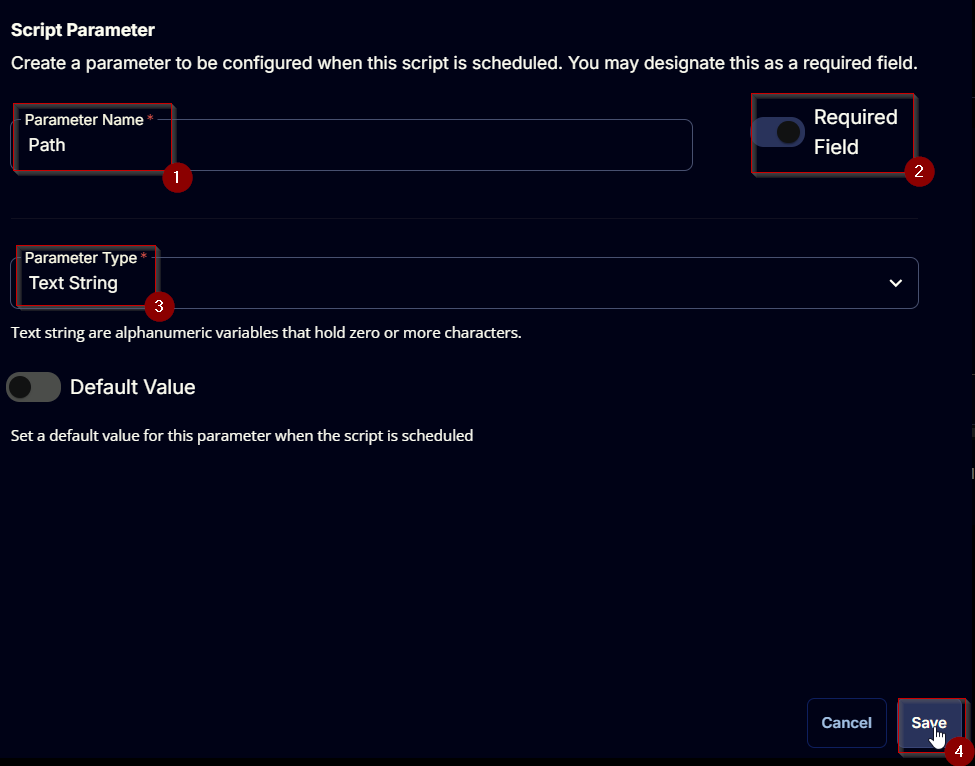
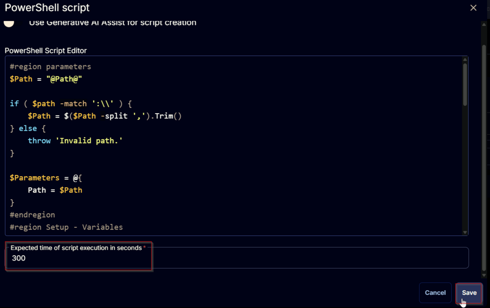

## Summary

Sets the provided path(s) to the Environmental Path variable for a Path at the Machine scope. CW RMM implementation of the agnostic script [Set-PathVariable](/docs/f91caf21-f00c-4459-8b1f-634720a92f4b).

## Sample Run






## Dependencies

[Set-PathVariable](/docs/f91caf21-f00c-4459-8b1f-634720a92f4b)

## User Parameters

| Name | Example | Required | Type | Description |
|------|---------|----------|------|-------------|
| Path | - 'C://Temp'  - 'C://Temp', 'C://Temp//ProgramData', 'D://Text Files' | True | Text String | Comma-separated list of the path(s) to add to the path variable. **Requirement:** <ul><li>Each path should be enclosed in single quotes.</li><li>Path should exist on the end machine.</li></ul> |



## Task Creation

Create a new `Script Editor` style script in the system to implement this Task.


**Name:** `Set Path Variable`  
**Description:** `Sets the provided path(s) to the Environmental Path variable for a Path at the Machine scope.`  
**Category:** `Custom`  



## Parameters

### Path

Add a new parameter by clicking the `Add Parameter` button present at the top-right corner of the screen.


This screen will appear.


- Set `Path` in the `Parameter Name` field.
- Enable the `Required Field` button.
- Select `Text String` from the `Parameter Type` dropdown menu.
- Click the `Save` button.



## Task

Navigate to the Script Editor Section and start by adding a row. You can do this by clicking the `Add Row` button at the bottom of the script page.


A blank function will appear.


### Row 1 Function: PowerShell Script

Search and select the `PowerShell Script` function.


The following function will pop up on the screen:


Paste in the following PowerShell script and set the `Expected time of script execution in seconds` to `300` seconds. Click the `Save` button.

```PowerShell
#region parameters
$Path = "@Path@"
if ( $path -match ':\\' ) {
    $Path = $($Path -split ',').Trim()
} else {
    throw 'Invalid path.'
}
$Parameters = @{
    Path = $Path
}
#endregion
#region Setup - Variables
$ProjectName = 'Set-PathVariable'
[Net.ServicePointManager]::SecurityProtocol = [enum]::ToObject([Net.SecurityProtocolType], 3072)
$BaseURL = 'https://file.provaltech.com/repo'
$PS1URL = "$BaseURL/script/$ProjectName.ps1"
$WorkingDirectory = "C:\ProgramData\_automation\script\$ProjectName"
$PS1Path = "$WorkingDirectory\$ProjectName.ps1"
$WorkingPath = $WorkingDirectory
$LogPath = "$WorkingDirectory\$ProjectName-log.txt"
$ErrorLogPath = "$WorkingDirectory\$ProjectName-Error.txt"
#endregion
#region Setup - Folder Structure
New-Item -Path $WorkingDirectory -ItemType Directory -ErrorAction SilentlyContinue | Out-Null
$response = Invoke-WebRequest -Uri $PS1URL -UseBasicParsing
if (($response.StatusCode -ne 200) -and (!(Test-Path -Path $PS1Path))) {
    throw "No pre-downloaded script exists and the script '$PS1URL' failed to download. Exiting."
} elseif ($response.StatusCode -eq 200) {
    Remove-Item -Path $PS1Path -ErrorAction SilentlyContinue
    [System.IO.File]::WriteAllLines($PS1Path, $response.Content)
}
if (!(Test-Path -Path $PS1Path)) {
    throw 'An error occurred and the script was unable to be downloaded. Exiting.'
}
#endregion
#region Execution
if ($Parameters) {
    & $PS1Path @Parameters
} else {
    & $PS1Path
}
#endregion
#region log verification
if ( !(Test-Path $LogPath) ) {
    throw 'PowerShell Failure. A Security application seems to have restricted the execution of the PowerShell Script.'
}
if ( Test-Path $ErrorLogPath ) {
    $ErrorContent = ( Get-Content -Path $ErrorLogPath )
    throw $ErrorContent
}
Get-Content -Path $LogPath
#endregion
```



### Row 2 Function: Script Log

Add a new row by clicking the `Add Row` button.


A blank function will appear.


Search and select the `Script Log` function.


The following function will pop up on the screen:


In the script log message, simply type `%Output%` and click the `Save` button.


Click the `Save` button at the top-right corner of the screen to save the script.


## Completed Task


## Output

- Script log
