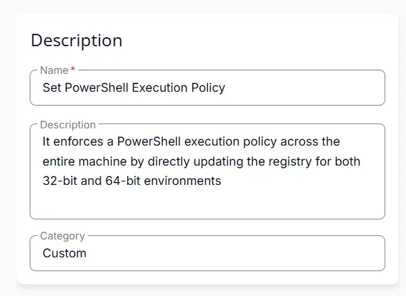
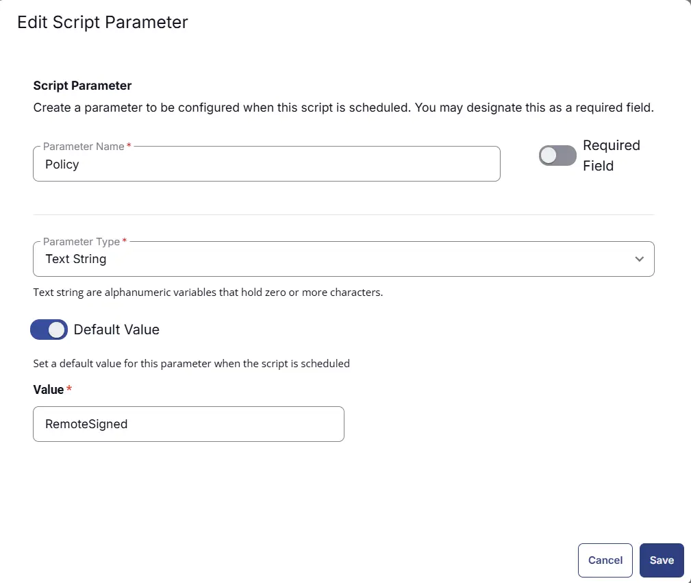
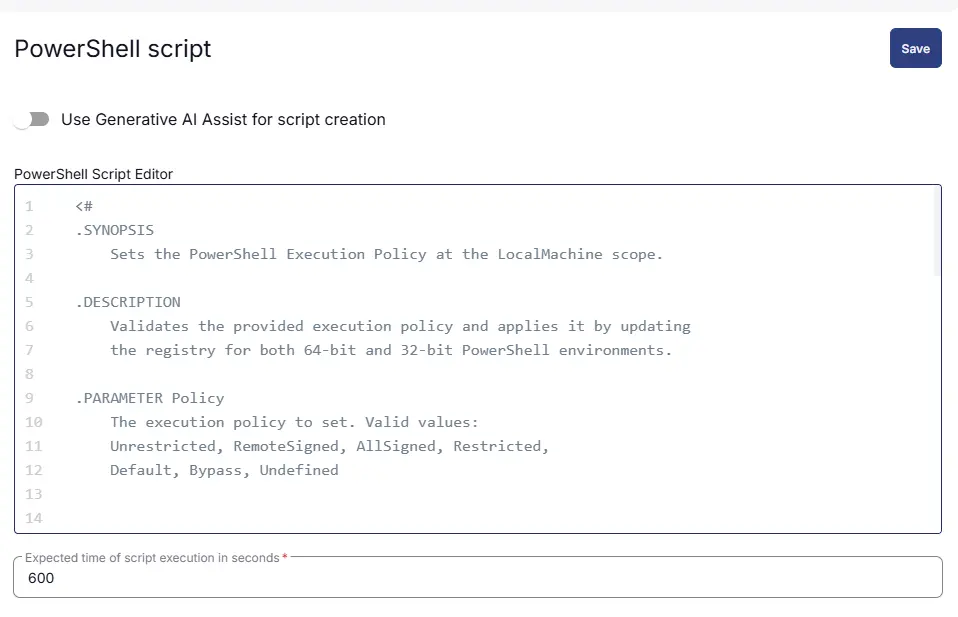
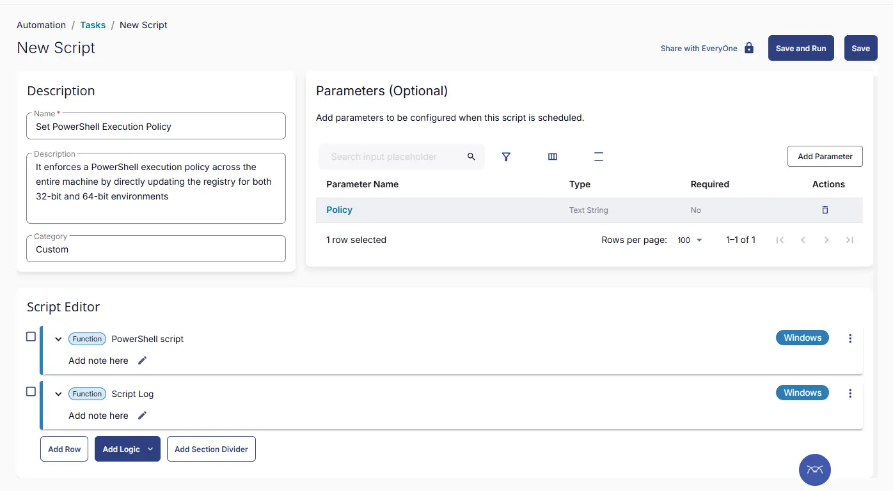

## Summary
This script enforces PowerShell execution policy across the entire machine by directly updating the registry for both 32-bit and 64-bit environments.

## Sample Run


## User Parameters

| Name | Example | Accepted Values | Required | Default | Type | Description |
|------|---------|---------|-----|-----|----|------|
| Policy | `RemoteSigned` | `Unrestricted`, `RemoteSigned`, `AllSigned`, `Restricted`, `Default`, `Bypass`, `Undefined` | False | `RemoteSigned` | Text | Specify PowerShell execution policy to apply on the system. By default, the script applies `RemoteSigned` to the system. Below are descriptions of each accepted value. <br/> - `Unrestricted` : All scripts run, warning for downloaded ones<br/> - `RemoteSigned` : Local scripts run, downloaded scripts must be signed <br/> - `AllSigned` : All scripts must be digitally signed<br/> - `Restricted` : No scripts allowed (default on many systems)<br/> - `Default` : Resets to system default<br/> - `Bypass` : No restrictions, no warnings<br/> - `Undefined` : Removes the policy (falls back to another scope) |

## Task Creation

### Script Details

#### Step 1

Navigate to `Automation` ➞ `Tasks`  


#### Step 2

Create a new `Script Editor` style task by choosing the `Script Editor` option from the `Add` dropdown menu  


The `New Script` page will appear on clicking the `Script Editor` button:  


#### Step 3

Fill in the following details in the `Description` section:  

**Name:** `Set PowerShell Execution Policy`  
**Description:** `It enforces a PowerShell execution policy across the entire machine by directly updating the registry for both 32-bit and 64-bit environments`  
**Category:** `Custom`



### Parameters

Locate the `Add Parameter` button on the right-hand side of the screen and click on it to create a new parameter.  


The `Add New Script Parameter` page will appear on clicking the `Add Parameter` button.  


- Set `Policy` in the `Parameter Name` field.
- Select `Text String` from the `Parameter Type` dropdown menu.
- Set `RemoteSigned` as Default Value 
- Click the `Save` button.



### Script Editor

Click the `Add Row` button in the `Script Editor` section to start creating the script  


A blank function will appear:  


#### Row 1 Function: `PowerShell Script`

Search and select the `PowerShell Script` function.  
 
  

The following function will pop up on the screen:  
  

Paste in the following PowerShell script and set the `Expected time of script execution in seconds` to `600` seconds. Click the `Save` button.

```powershell
<#
.SYNOPSIS
    Sets the PowerShell Execution Policy at the LocalMachine scope.

.DESCRIPTION
    Validates the provided execution policy and applies it by updating
    the registry for both 64-bit and 32-bit PowerShell environments.

.PARAMETER Policy
    The execution policy to set. Valid values:
    Unrestricted, RemoteSigned, AllSigned, Restricted,
    Default, Bypass, Undefined

    
#>

$Policy  = '@Policy@'
if ($Policy -notin ('Unrestricted', 'RemoteSigned', 'AllSigned', 'Restricted', 'Default', 'Bypass', 'Undefined')) {
    throw "Invalid execution policy: '$Policy'. Valid values are: Unrestricted, RemoteSigned, AllSigned, Restricted, Default, Bypass, Undefined."
}


Write-Output "Starting Execution Policy configuration..."


    try {
        Write-Output "Setting PowerShell ExecutionPolicy to '$Policy'..."

        $paths = @(
            "HKLM:\SOFTWARE\Microsoft\PowerShell\1\ShellIds\Microsoft.PowerShell",
            "HKLM:\SOFTWARE\Wow6432Node\Microsoft\PowerShell\1\ShellIds\Microsoft.PowerShell"
        )

        foreach ($path in $paths) {
            if (-not (Test-Path $path)) {
                New-Item -Path $path -Force | Out-Null
            }

            New-ItemProperty -Path $path `
                             -Name "ExecutionPolicy" `
                             -Value $Policy `
                             -PropertyType String `
                             -Force | Out-Null
        }

        Write-Output "Successful"
    }
    catch {
        Write-Error "Unsuccessful: $($_.Exception.Message)"
        return
    }
```



### Row 2 Function: Script Log

Add a new row by clicking the `Add Row` button.  
  

A blank function will appear.  
  

Search and select the `Script Log` function.  
  
 

In the script log message, simply type `%output%` and click the `Save` button.  


## Save Task

Click the `Save` button at the top-right corner of the screen to save the script.  


## Completed Task



## Output
- Script Logs

## Changelog

### 2026-03-24

- Initial version of the document
