## Summary

This task is used to change the service login account for a target service. This is an RMM version of [Set-ServiceLogin](/docs/ec673596-37f8-4da2-b0ed-fdc347a98dfc). Please review the process mentioned in [Set-ServiceLogin](/docs/ec673596-37f8-4da2-b0ed-fdc347a98dfc) on how to use USER or SYSTEM mode in the script.

## Sample Run

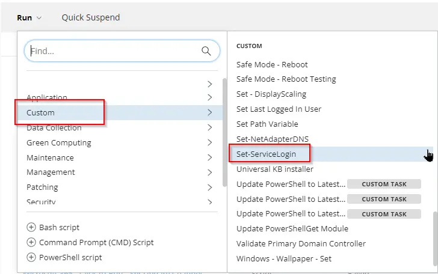

Sets the Print Spooler service to run as 'Local System'.

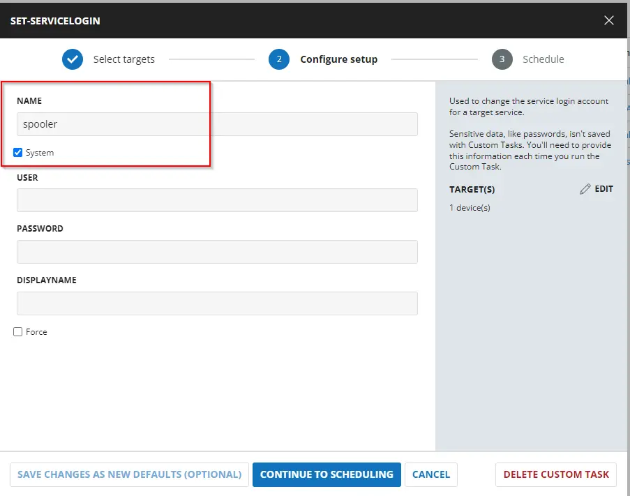

Sets the Print Spooler service to run as 'User1'. Grants 'User1' the Logon as a Service right.

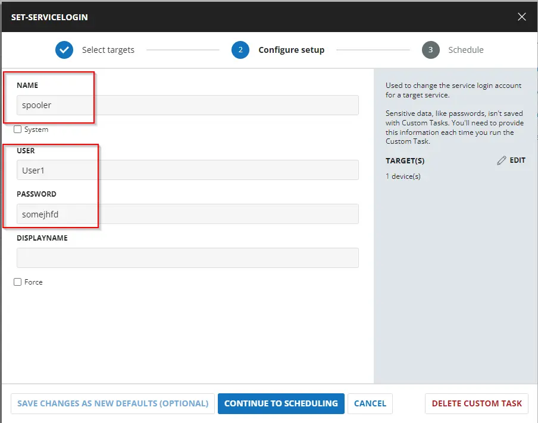

## Dependencies

[Set-ServiceLogin](/docs/ec673596-37f8-4da2-b0ed-fdc347a98dfc)

## User Parameters

| Name          | Example          | Accepted Values | Required | Default | Type   | Description                                           |
|---------------|-------------------|-----------------|----------|---------|--------|-------------------------------------------------------|
| `Name`        | Spooler           |                 | False    |         | String | The service name to alter.                            |
| `DisplayName` | Print Spooler     |                 | False    | $false  | String | The service display name to alter.                    |
| `User`        | User1             |                 | False    |         | String | The username of the account to set the service to run as. |
| `Password`    | p@55w0rD          |                 | False    |         | String | The password of the account to set the service to run as. |
| `System`      | Marked            |                 | False    |         | Flag   | Use this switch to set the service to run as the Local System account. |
| `Force`       | Marked            |                 | False    | $false  | Flag   | Intended to force DNS address updates to DHCP-enabled adapters. |

## Task Creation

Create a new `Script Editor` style script in the system to implement this task.

**Name:** Set-ServiceLogin  
**Description:** Used to change the service login account for a target service.  
**Category:** Custom  

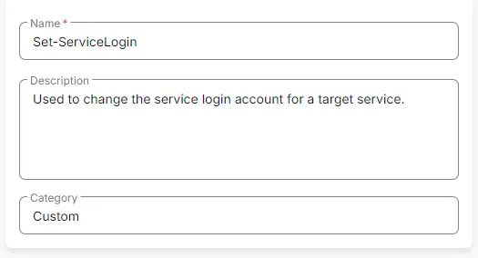

## Parameters

Add a new parameter by clicking the `Add Parameter` button present at the top-right corner of the screen.

This screen will appear.

- Set `Name` in the `Parameter Name` field.
- Select `String` from the `Parameter Type` dropdown menu.
- Toggle Required Field.
- Click the `Save` button.

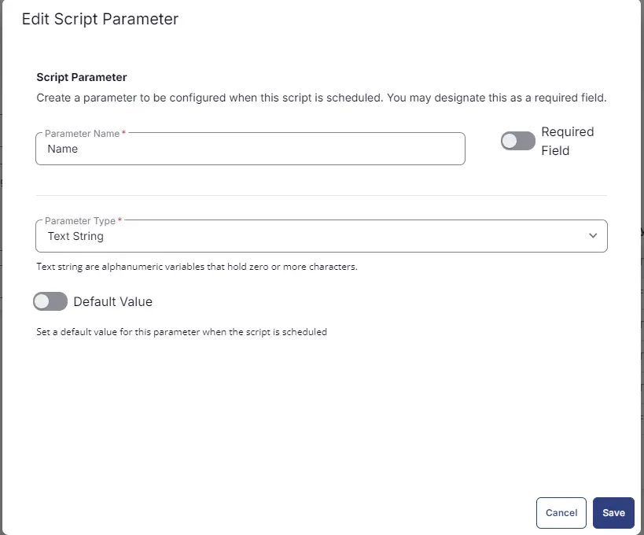

It will ask for confirmation to proceed. Click the `Confirm` button to create the parameter.

Add another parameter by clicking the `Add Parameter` button present at the top-right corner of the screen.

- Set `System` in the `Parameter Name` field.
- Select `Flag` from the `Parameter Type` dropdown menu.
- Toggle Default Value.
- Set Default Value as `False`.
- Click the `Save` button.
- Click the `Confirm` button to create the parameter.

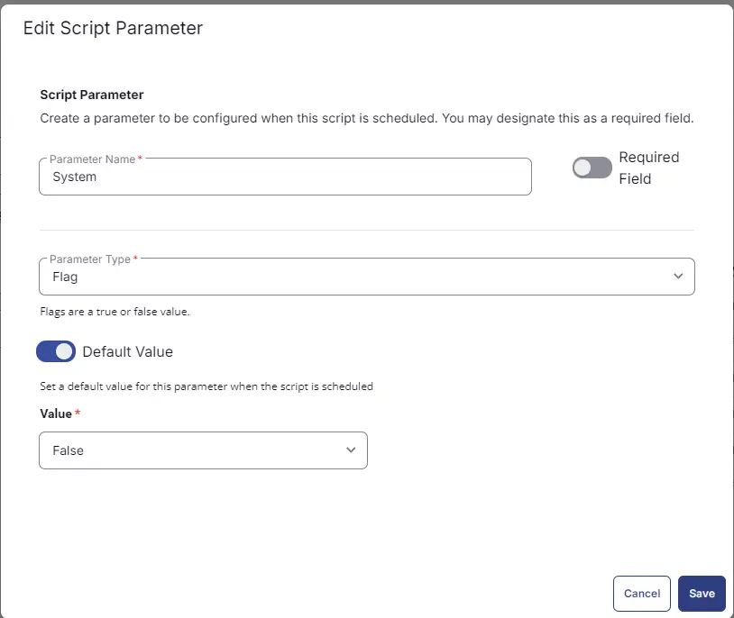

Add another parameter.

- Set `User` in the `Parameter Name` field.
- Select `String` from the `Parameter Type` dropdown menu.
- Toggle Required Field.
- Click the `Save` button.

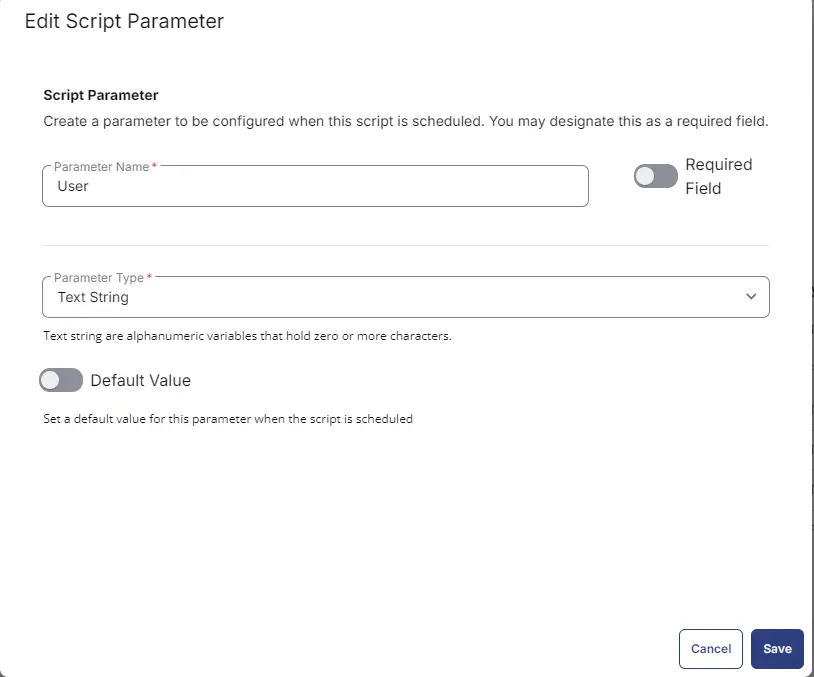

Add another parameter.

- Set `Password` in the `Parameter Name` field.
- Select `String` from the `Parameter Type` dropdown menu.
- Toggle Required Field.
- Click the `Save` button.

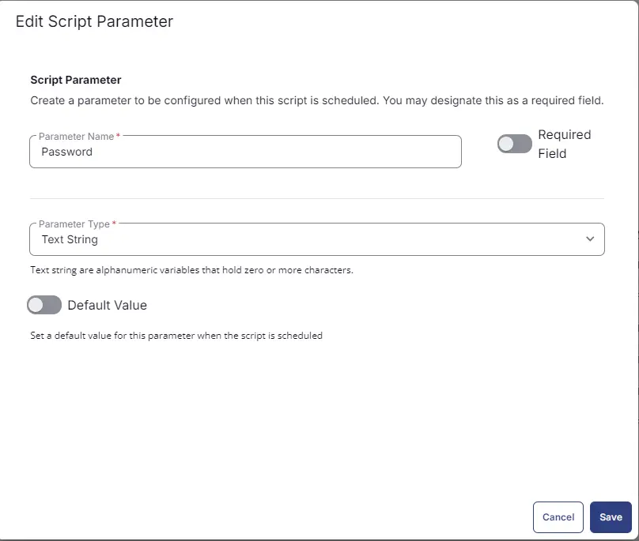

Add another parameter.

- Set `DisplayName` in the `Parameter Name` field.
- Select `String` from the `Parameter Type` dropdown menu.
- Toggle Required Field.
- Click the `Save` button.

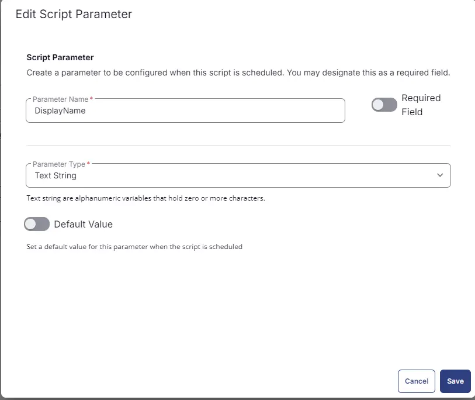

Add another parameter.

- Set `Force` in the `Parameter Name` field.
- Select `Flag` from the `Parameter Type` dropdown menu.
- Toggle Default Value.
- Set Default Value as `False`.
- Click the `Save` button.
- Click the `Confirm` button to create the parameter.

Parameters will look like as shown below:

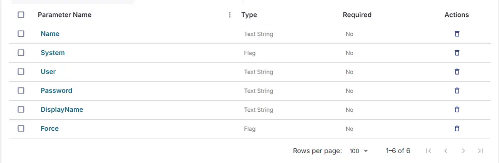

## Task

Navigate to the Script Editor section and start by adding a row. You can do this by clicking the `Add Row` button at the bottom of the script page.

A blank function will appear.

### Row 1 Function: PowerShell Script

Search and select the `PowerShell Script` function.

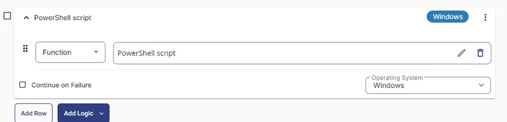

The following function will pop up on the screen:

Paste in the following PowerShell script and set the expected time of script execution to `600` seconds. Click the `Save` button.

[PowerShell Script](https://github.com/ProVal-Tech/cw-rmm/blob/main/tasks/set-servicelogin/script.ps1)

### Row 2: Function: Script Log

In the script log message, simply type `%output%` so that the script will send the results of the PowerShell script above to the output on the Automation tab for the target device.

## Completed Task

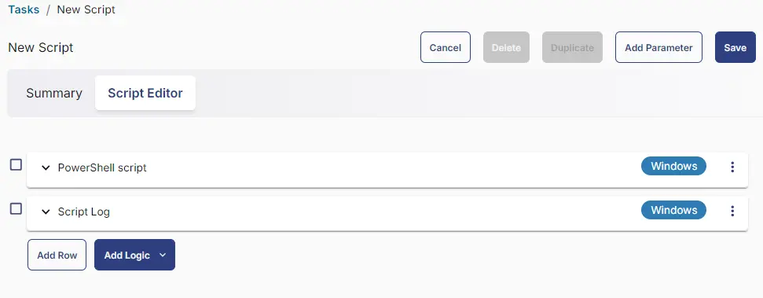

## Output

- Script Log

## Changelog

### 2025-04-10

- Initial version of the document

