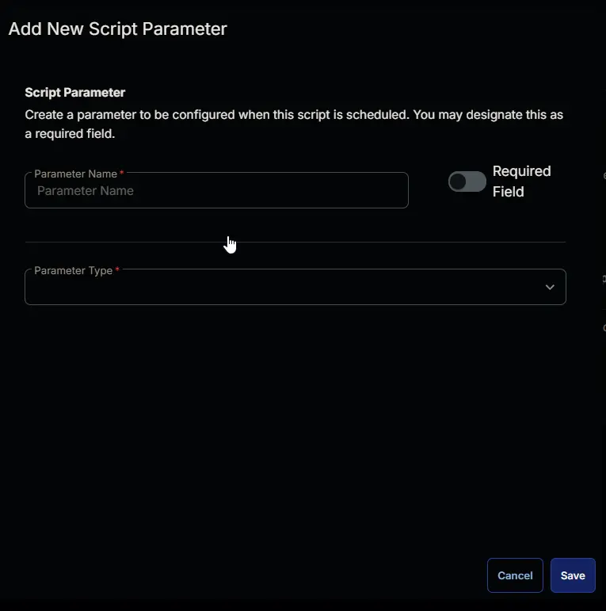
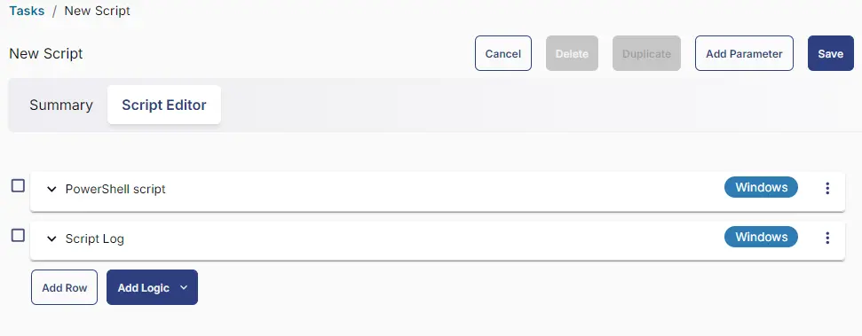

## Summary

This task is used to change the service login account for a target service. This is an RMM version of [Set-ServiceLogin](/docs/ec673596-37f8-4da2-b0ed-fdc347a98dfc). Please review the process mentioned in [Set-ServiceLogin](/docs/ec673596-37f8-4da2-b0ed-fdc347a98dfc) on how to use USER or SYSTEM mode in the script.

## Sample Run


Sets the Print Spooler service to run as 'Local System'.


Sets the Print Spooler service to run as 'User1'. Grants 'User1' the Logon as a Service right.


## Dependencies

[Set-ServiceLogin](/docs/ec673596-37f8-4da2-b0ed-fdc347a98dfc)

## User Parameters

| Name          | Example          | Accepted Values | Required | Default | Type   | Description                                           |
|---------------|-------------------|-----------------|----------|---------|--------|-------------------------------------------------------|
| `Name`        | Spooler           |                 | False    |         | String | The service name to alter.                            |
| `DisplayName` | Print Spooler     |                 | False    | $false  | String | The service display name to alter.                    |
| `User`        | User1             |                 | False    |         | String | The username of the account to set the service to run as. |
| `Password`    | p@55w0rD          |                 | False    |         | String | The password of the account to set the service to run as. |
| `System`      | Marked            |                 | False    |         | Flag   | Use this switch to set the service to run as the Local System account. |
| `Force`       | Marked            |                 | False    | $false  | Flag   | Intended to force DNS address updates to DHCP-enabled adapters. |

## Task Creation

Create a new `Script Editor` style script in the system to implement this task.


**Name:** Set-ServiceLogin  
**Description:** Used to change the service login account for a target service.  
**Category:** Custom  


## Parameters

Add a new parameter by clicking the `Add Parameter` button present at the top-right corner of the screen.


This screen will appear.



- Set `Name` in the `Parameter Name` field.
- Select `String` from the `Parameter Type` dropdown menu.
- Toggle Required Field.
- Click the `Save` button.


It will ask for confirmation to proceed. Click the `Confirm` button to create the parameter.


Add another parameter by clicking the `Add Parameter` button present at the top-right corner of the screen.


- Set `System` in the `Parameter Name` field.
- Select `Flag` from the `Parameter Type` dropdown menu.
- Toggle Default Value.
- Set Default Value as `False`.
- Click the `Save` button.
- Click the `Confirm` button to create the parameter.


Add another parameter.

- Set `User` in the `Parameter Name` field.
- Select `String` from the `Parameter Type` dropdown menu.
- Toggle Required Field.
- Click the `Save` button.


Add another parameter.

- Set `Password` in the `Parameter Name` field.
- Select `String` from the `Parameter Type` dropdown menu.
- Toggle Required Field.
- Click the `Save` button.


Add another parameter.

- Set `DisplayName` in the `Parameter Name` field.
- Select `String` from the `Parameter Type` dropdown menu.
- Toggle Required Field.
- Click the `Save` button.


Add another parameter.

- Set `Force` in the `Parameter Name` field.
- Select `Flag` from the `Parameter Type` dropdown menu.
- Toggle Default Value.
- Set Default Value as `False`.
- Click the `Save` button.
- Click the `Confirm` button to create the parameter.

Parameters will look like as shown below:


## Task

Navigate to the Script Editor section and start by adding a row. You can do this by clicking the `Add Row` button at the bottom of the script page.


A blank function will appear.


### Row 1 Function: PowerShell Script

Search and select the `PowerShell Script` function.


The following function will pop up on the screen:


Paste in the following PowerShell script and set the expected time of script execution to `600` seconds. Click the `Save` button.

```powershell
$Name = '@Name@'
$System = '@System@'
$user = '@User@'
$pass = '@Password@'
$DisplayName = '@DisplayName@'
$Force = '@Force@'
$parameters = @{}
#we are priotizing Name if both Name and DisplayNames are specified
if ( ($Name -Notmatch '\SAddress\S') -and ($Name -match '[A-z]{2,}') ) {
    #For parameterSets Name and NameSystem
    $parameters.Add('Name', $Name)
    if ( $System -match '1|Yes|True' ) {
        #For Parameter Set NameSystem
        $parameters.Add('System', $True)
    } else {
        #For parameterSet Name
        if ( $user -match '/SUser/S' -or ( $null -eq $user )  ) {
            throw 'Either Set the ''System'' parameter or set the ''User'' and ''Pass'''
        } elseif ( $user.Length -lt 2 ) {
            throw 'Either Set the ''System'' parameter or set the ''User'' and ''Pass'''
        } else {
            $parameters.Add('User', $user)
        }
        if ( $pass -match '/Spass/S' -or ( $null -eq $pass )  ) {
            throw 'Either Set the ''System'' parameter or set the ''User'' and ''Pass'''
        } elseif ( $pass.Length -lt 2 ) {
            throw 'Either Set the ''System'' parameter or set the ''User'' and ''Pass'''
        } else {
            $parameters.Add('Pass', $pass)
        }
        $parameters.Add('Force', $true) # Setting it to true without checking since it's mandatory for the parameter set Name
    }
} else {
    #for parameter set DisplayName and DisplayName System
    if ( ($DisplayName -Notmatch '\SAddress\S') -and ($DisplayName -match '[A-z]{2,}') ) {
        $parameters.Add('DisplayName', $DisplayName)
        if ( $System -match '1|Yes|True' ) {
            #For Parameter Set DisplayNameSystem
            $parameters.Add('System', $True)
        } else {
            #For parameterSet DisplayName
            if ( $user -match '/SUser/S' -or ( $null -eq $user )  ) {
                throw 'Either Set the ''System'' parameter or set the ''User'' and ''Pass'''
            } elseif ( $user.Length -lt 2 ) {
                throw 'Either Set the ''System'' parameter or set the ''User'' and ''Pass'''
            } else {
                $parameters.Add('User', $user)
            }
            if ( $pass -match '/Spass/S' -or ( $null -eq $pass )  ) {
                throw 'Either Set the ''System'' parameter or set the ''User'' and ''Pass'''
            } elseif ( $pass.Length -lt 2 ) {
                throw 'Either Set the ''System'' parameter or set the ''User'' and ''Pass'''
            } else {
                $parameters.Add('Pass', $pass)
            }
            if ( $Force -match '1|Yes|True' ) {
                $parameters.Add('Force', $true) # Not Setting it to true without checking since it's not mandatory for the parameter set DisplayName
            }
        }
    } else {
        throw 'Either Set the ''Name'' or the ''DisplayName'' parameter.'
    }
}

#region Setup - Variables
$ProjectName = 'Set-ServiceLogin'
[Net.ServicePointManager]::SecurityProtocol = [enum]::ToObject([Net.SecurityProtocolType], 3072)
$BaseURL = 'https://file.provaltech.com/repo'
$PS1URL = "$BaseURL/script/$ProjectName.ps1"
$WorkingDirectory = "C:\ProgramData\_automation\script\$ProjectName"
$PS1Path = "$WorkingDirectory\$ProjectName.ps1"
$Workingpath = $WorkingDirectory
$LogPath = "$WorkingDirectory\$ProjectName-log.txt"
$ErrorLogPath = "$WorkingDirectory\$ProjectName-Error.txt"
#endregion
#region Setup - Folder Structure
New-Item -Path $WorkingDirectory -ItemType Directory -ErrorAction SilentlyContinue | Out-Null
$response = Invoke-WebRequest -Uri $PS1URL -UseBasicParsing
if (($response.StatusCode -ne 200) -and (!(Test-Path -Path $PS1Path))) {
    throw "No pre-downloaded script exists and the script '$PS1URL' failed to download. Exiting."
} elseif ($response.StatusCode -eq 200) {
    Remove-Item -Path $PS1Path -ErrorAction SilentlyContinue
    [System.IO.File]::WriteAllLines($PS1Path, $response.Content)
}
if (!(Test-Path -Path $PS1Path)) {
    throw 'An error occurred and the script was unable to be downloaded. Exiting.'
}
#endregion
#region Execution
if ($Parameters) {
    & $PS1Path @Parameters
} else {
    & $PS1Path
}
#endregion
if ( !(Test-Path $LogPath) ) {
    throw 'PowerShell Failure. A Security application seems to have restricted the execution of the PowerShell Script.'
}
if ( Test-Path $ErrorLogPath ) {
    $ErrorContent = ( Get-Content -Path $ErrorLogPath )
    throw $ErrorContent
}
Get-Content -Path $LogPath
```

### Row 2: Function: Script Log

In the script log message, simply type `%output%` so that the script will send the results of the PowerShell script above to the output on the Automation tab for the target device.


## Completed Task



## Output

- Script Log