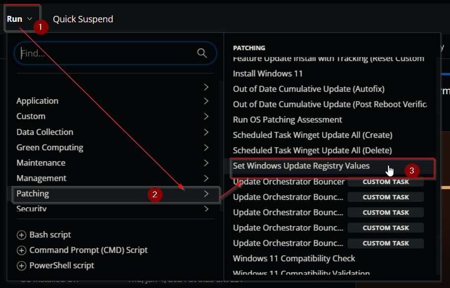
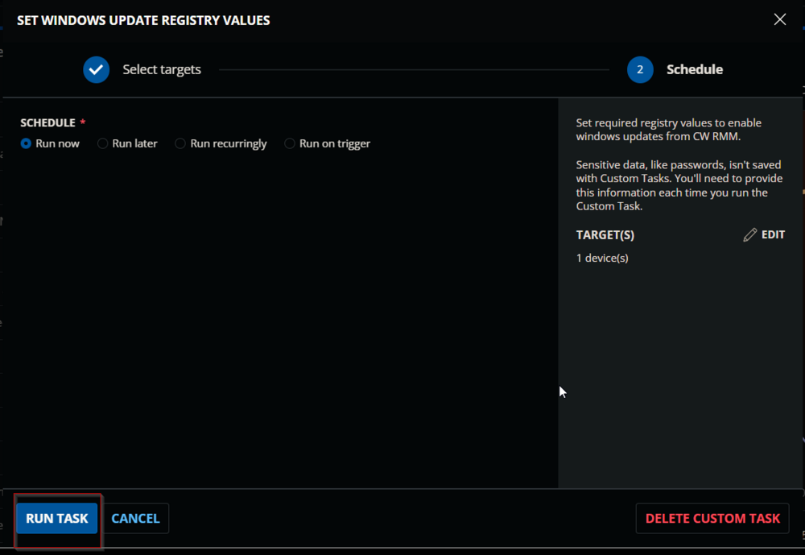
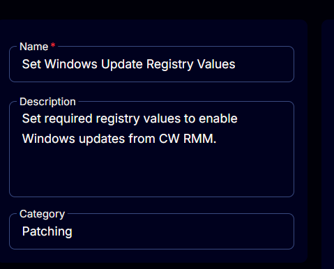
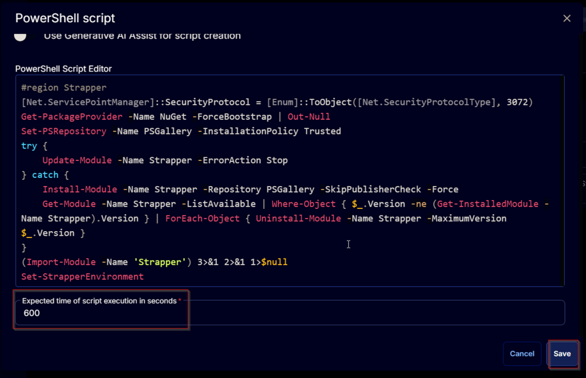
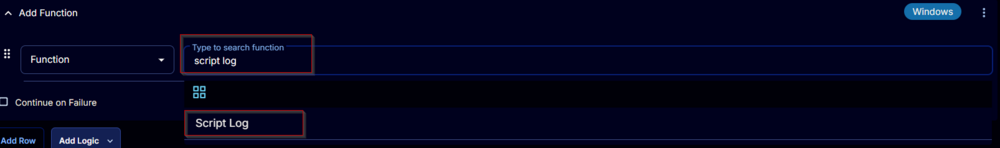
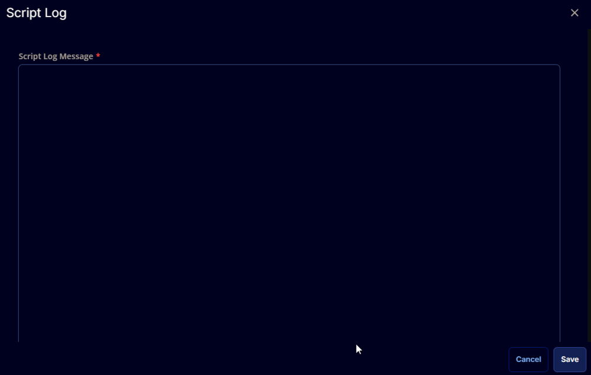

## Summary

The script is designed to remove any additional registry values from the registry path `Computer/HKEY_LOCAL_MACHINE/SOFTWARE/Policies/Microsoft/Windows/WindowsUpdate/AU`. Additionally, it ensures that the values for the keys `NoAutoRebootWithLoggedOnUsers` and `NoAutoUpdate` are set to `1`.  


CW Support recommends setting these registry keys on the local device to ensure that patching and rebooting occur properly from CW RMM.

Furthermore, the script will ensure that patching access is not disabled for the `System` account by making the necessary registry changes.

## Sample Run

 

## Task Creation

Create a new `Script Editor` style script in the system to implement this task.  
  
  

**Name:** Set Windows Update Registry Values  
**Description:** Set required registry values to enable Windows updates from CW RMM.  
**Category:** Patching  


## Task

Navigate to the Script Editor section and start by adding a row. You can do this by clicking the `Add Row` button at the bottom of the script page.  
  

A blank function will appear.  
  

### Row 1 Function: PowerShell Script

Search and select the `PowerShell Script` function.  
   

The following function will pop up on the screen:  
  

Paste in the following PowerShell script and set the expected time of script execution to `600` seconds. Click the `Save` button.

```
#region Strapper
[Net.ServicePointManager]::SecurityProtocol = [Enum]::ToObject([Net.SecurityProtocolType], 3072)
Get-PackageProvider -Name NuGet -ForceBootstrap | Out-Null
Set-PSRepository -Name PSGallery -InstallationPolicy Trusted
try {
    Update-Module -Name Strapper -ErrorAction Stop
} catch {
    Install-Module -Name Strapper -Repository PSGallery -SkipPublisherCheck -Force
    Get-Module -Name Strapper -ListAvailable | Where-Object { $_.Version -ne (Get-InstalledModule -Name Strapper).Version } | ForEach-Object { Uninstall-Module -Name Strapper -MaximumVersion $_.Version }
}
(Import-Module -Name 'Strapper') 3>&1 2>&1 1>$null
Set-StrapperEnvironment
#endregion

$regKey = 'HKLM:/SOFTWARE/Policies/Microsoft/Windows/WindowsUpdate/AU'

# Remove existing registry keys
if ( Test-Path -Path $regKey ) {
    foreach ( $property in ((Get-Item -Path $regKey).Property) ) {
        if ( !(('NoAutoUpdate', 'NoAutoRebootWithLoggedOnUsers') -contains $property) ) {
            try {
                $value = (Get-ItemProperty -Path $regKey).\"${Property}\"
                Write-Output \"Removing the registry key $($property) with the value $value\"
                Remove-ItemProperty -Path $regKey -Name $property -Force -Confirm:$false -ErrorAction Stop
            } catch {
                throw \"Failed to remove registry key: $($property). Reason: $($Error[0].Exception.Message)\"
            }
        }
    }
}

# Set the desired registry values
foreach ( $prop in ('NoAutoUpdate', 'NoAutoRebootWithLoggedOnUsers') ) {
    $value = (Get-ItemProperty -Path $regKey -ErrorAction SilentlyContinue).\"${prop}\"
    if ( !($value -eq 1) ) {
        try {
            if ( !$value ) {
                Write-Output \"$prop does not exist. Creating the registry key.\"
            } else {
                Write-Output \"Current Value for $($prop): $($Value)\"
            }
            Set-RegistryKeyProperty -Path $regKey -Name $prop -Value 1 -Type DWord -Force -ErrorAction Stop
        } catch {
            throw \"Failed to set registry key: $($prop). Reason: $($Error[0].Exception.Message)\"
        }
    }
}

# Ensure that the Windows Update Access is enabled for the system account.
$path = 'Registry::HKEY_USERS/S-1-5-18/Software/Microsoft/Windows/CurrentVersion/Policies/WindowsUpdate'
if ( (Get-ItemProperty -Path $path -ErrorAction SilentlyContinue).DisableWindowsUpdateAccess -ne 0 ) {
    Write-Output 'Enabling Windows Update Access to the System Account.'
    try {
        if ( !(Test-Path $path) ) {
            New-Item -Path $path -Force -Confirm:$false -ErrorAction Stop
        }
        Set-ItemProperty -Path $path -Name DisableWindowsUpdateAccess -Value 0 -Force -ErrorAction Stop
    } catch {
        throw \"Failed to enable Windows Update Access for the system account. Reason: $($Error[0].Exception.Message)\"
    }
}
```

  

### Row 2 Function: Script Log

Add a new row by clicking the `Add Row` button.  
  

A blank function will appear.  
  

Search and select the `Script Log` function.  
  

  

The following function will pop up on the screen:  
  

In the script log message, simply type `%output%` and click the `Save` button.  
  

Click the `Save` button at the top-right corner of the screen to save the script.  
  

## Completed Task


## Output

- Script log


