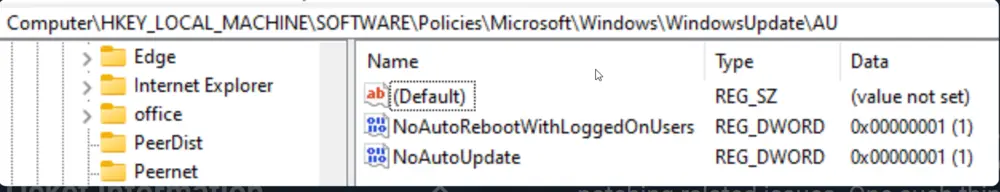
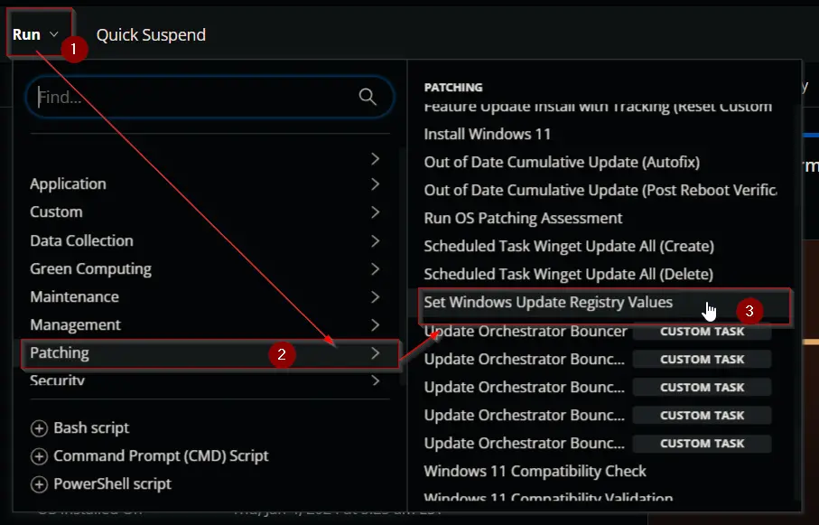
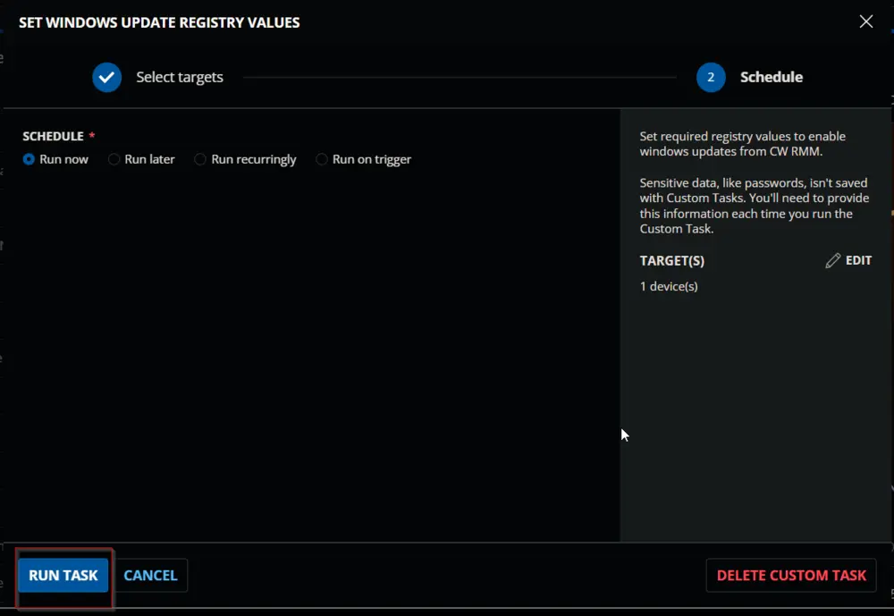
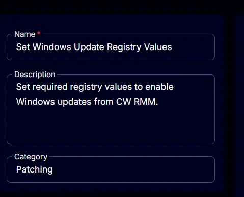
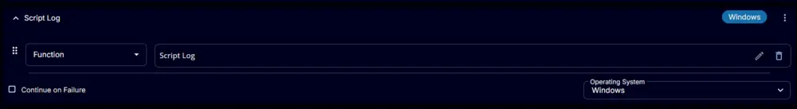
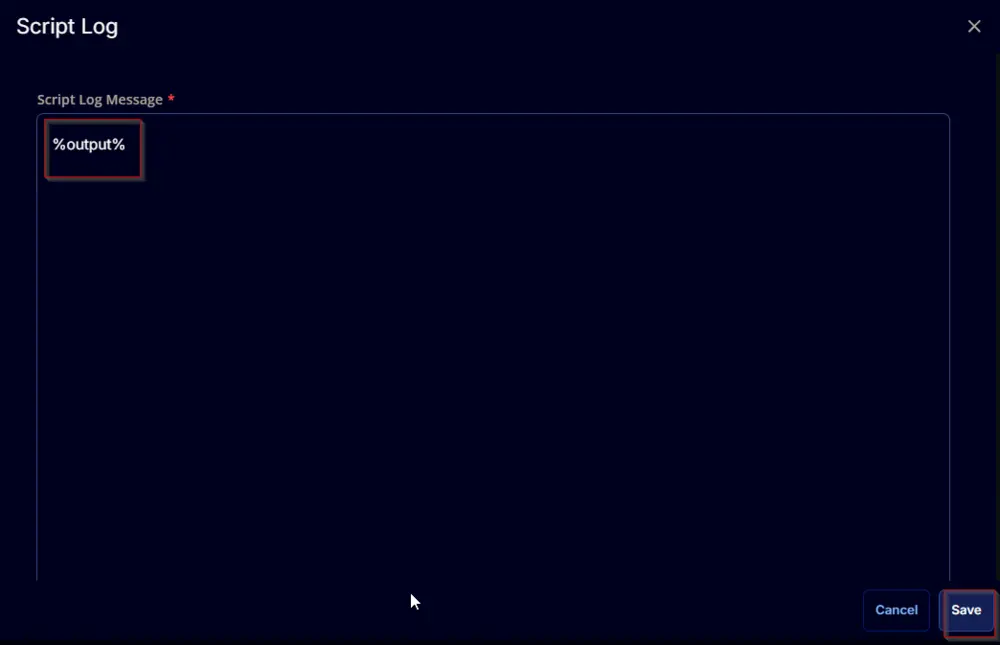

---
id: 'bd00b8d9-5f7f-449a-bf03-90a0ee610d3a'
slug: /bd00b8d9-5f7f-449a-bf03-90a0ee610d3a
title: 'Set Windows Update Registry Values'
title_meta: 'Set Windows Update Registry Values'
keywords: ['registry', 'windows', 'update', 'patching', 'system', 'access']
description: 'This document provides a detailed guide on setting registry values for Windows Update to ensure proper patching and rebooting functionality through ConnectWise RMM. It includes steps for removing unnecessary registry entries and ensuring required values are set correctly.'
tags: ['patching', 'registry', 'security', 'windows']
draft: false
unlisted: false
last_update:
  date: 2025-05-09
---

## Summary

The script is designed to remove any additional registry values from the registry path `Computer/HKEY_LOCAL_MACHINE/SOFTWARE/Policies/Microsoft/Windows/WindowsUpdate/AU`. Additionally, it ensures that the values for the keys `NoAutoRebootWithLoggedOnUsers` and `NoAutoUpdate` are set to `1`.  

CW Support recommends setting these registry keys on the local device to ensure that patching and rebooting occur properly from CW RMM.

Furthermore, the script will ensure that patching access is not disabled for the `System` account by making the necessary registry changes.

## Sample Run

 

## Task Creation

Create a new `Script Editor` style script in the system to implement this task.  
  
  

**Name:** Set Windows Update Registry Values  
**Description:** Set required registry values to enable Windows updates from CW RMM.  
**Category:** Patching  

## Task

Navigate to the Script Editor section and start by adding a row. You can do this by clicking the `Add Row` button at the bottom of the script page.  
  

A blank function will appear.  
  

### Row 1 Function: PowerShell Script

Search and select the `PowerShell Script` function.  
   

The following function will pop up on the screen:  
  

Paste in the following PowerShell script and set the expected time of script execution to `600` seconds. Click the `Save` button.

[PowerShell Script](https://github.com/ProVal-Tech/cw-rmm/blob/main/tasks/set-windows-update-registry-values/script.ps1)

  

### Row 2 Function: Script Log

Add a new row by clicking the `Add Row` button.  
  

A blank function will appear.  
  

Search and select the `Script Log` function.  
  

  

The following function will pop up on the screen:  
  

In the script log message, simply type `%output%` and click the `Save` button.  
  

Click the `Save` button at the top-right corner of the screen to save the script.  
  

## Completed Task

## Output

- Script log

## Changelog

### 2025-04-10

- Initial version of the document

