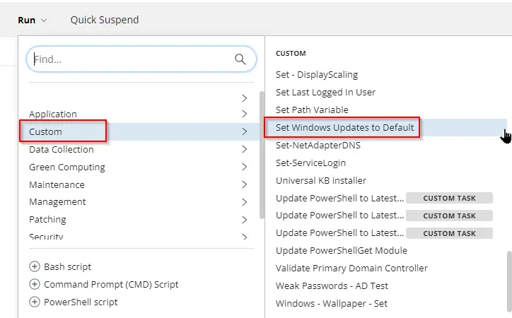
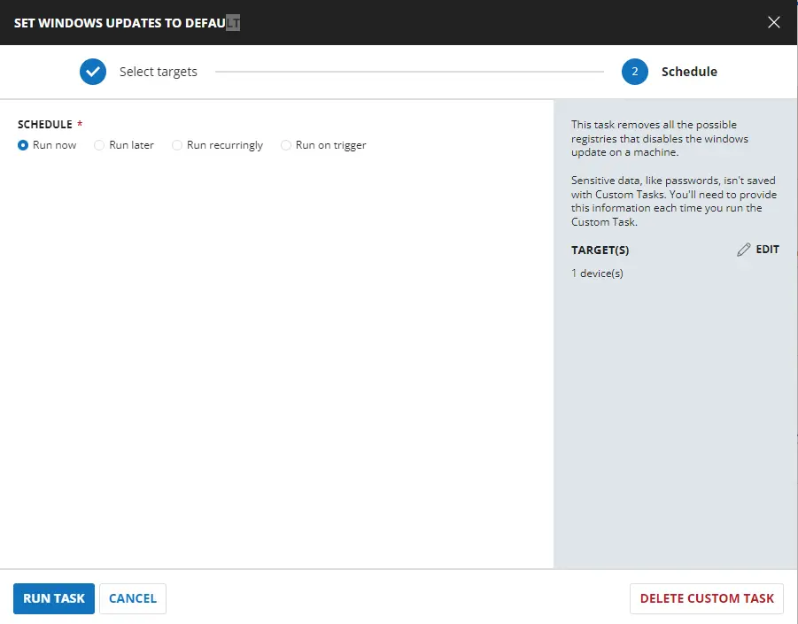
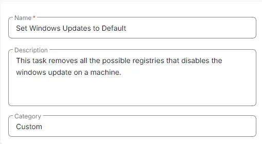
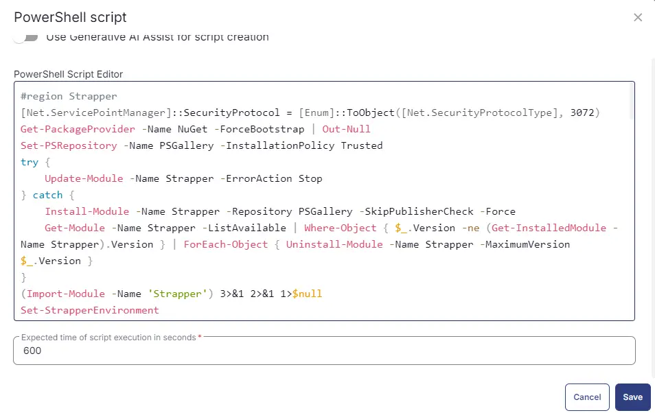
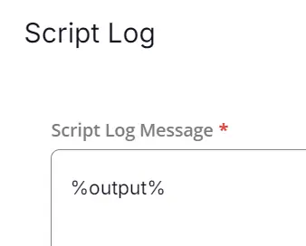

## Summary

This task removes any registry entries that may be preventing Windows updates and restores the default Windows Update settings, fully re-enabling updates for the user.

## Sample Run

  
  

## Task Creation

Create a new `Script Editor` style script in the system to implement this task.

  
  

**Name:** Set Windows Updates to Default  
**Description:** This task removes all the possible registry entries that disable Windows Update on a machine.  
**Category:** Custom  

  

## Task

Navigate to the Script Editor section and start by adding a row. You can do this by clicking the `Add Row` button at the bottom of the script page.  

  

A blank function will appear.  

  

### Row 1 Function: PowerShell Script

Search and select the `PowerShell Script` function.  

  

The following function will pop up on the screen:  

  

Paste in the following PowerShell script and set the expected time of script execution to 600 seconds. Click the `Save` button.

[PowerShell Script](https://github.com/ProVal-Tech/cw-rmm/blob/main/tasks/set-windows-updates-to-default/script.ps1)

### Row 2: Function: Script Log

In the script log message, simply type `%output%` so that the script will send the results of the PowerShell script above to the output on the Automation tab for the target device.

  
  

## Completed Task

  

## Output

- Script Log

## Changelog

### 2025-04-10

- Initial version of the document

