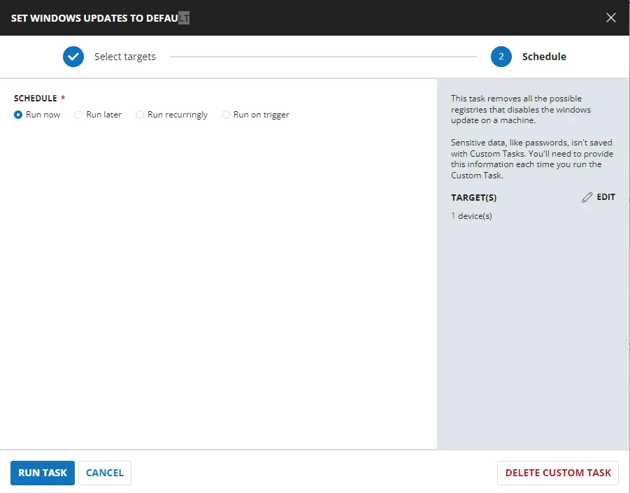
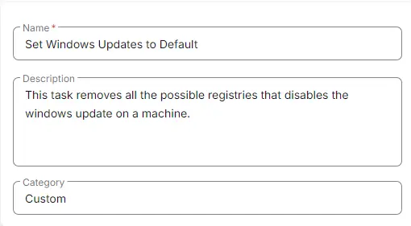

## Summary

This task removes any registry entries that may be preventing Windows updates and restores the default Windows Update settings, fully re-enabling updates for the user.

## Sample Run

  
  

## Task Creation

Create a new `Script Editor` style script in the system to implement this task.

  
  

**Name:** Set Windows Updates to Default  
**Description:** This task removes all the possible registry entries that disable Windows Update on a machine.  
**Category:** Custom  

  

## Task

Navigate to the Script Editor section and start by adding a row. You can do this by clicking the `Add Row` button at the bottom of the script page.  

  

A blank function will appear.  

  

### Row 1 Function: PowerShell Script

Search and select the `PowerShell Script` function.  

  

The following function will pop up on the screen:  

  

Paste in the following PowerShell script and set the expected time of script execution to 600 seconds. Click the `Save` button.

```powershell
#region Strapper
[Net.ServicePointManager]::SecurityProtocol = [Enum]::ToObject([Net.SecurityProtocolType], 3072)
Get-PackageProvider -Name NuGet -ForceBootstrap | Out-Null
Set-PSRepository -Name PSGallery -InstallationPolicy Trusted
try {
    Update-Module -Name Strapper -ErrorAction Stop
} catch {
    Install-Module -Name Strapper -Repository PSGallery -SkipPublisherCheck -Force
    Get-Module -Name Strapper -ListAvailable | Where-Object { $_.Version -ne (Get-InstalledModule -Name Strapper).Version } | ForEach-Object { Uninstall-Module -Name Strapper -MaximumVersion $_.Version }
}
(Import-Module -Name 'Strapper') 3>&1 2>&1 1>$null
Set-StrapperEnvironment
#endregion
$failures = @()
$properties = @(
    'NoAutoUpdate',
    'NoWindowsUpdate',
    'DisableWindowsUpdateAccess',
    'SetDisableUXWUAccess' 
)
#For Computer and System account
$pathArray = @(
    'HKLM:\Software\Policies\Microsoft\Windows\WindowsUpdate',
    'HKLM:\Software\Policies\Microsoft\Windows\WindowsUpdate\AU',
    'HKLM:\Software\Microsoft\Windows\CurrentVersion\Policies\WindowsUpdate',
    'HKLM:\Software\Microsoft\Windows\CurrentVersion\Policies\WindowsUpdate\AU',
    'HKLM:\SYSTEM\Internet Communication Management\Internet Communication',
    'Registry::HKEY_USERS\S-1-5-18\Software\Policies\Microsoft\Windows\WindowsUpdate',
    'Registry::HKEY_USERS\S-1-5-18\Software\Policies\Microsoft\Windows\WindowsUpdate\AU',
    'Registry::HKEY_USERS\S-1-5-18\Software\Microsoft\Windows\CurrentVersion\Policies\WindowsUpdate',
    'Registry::HKEY_USERS\S-1-5-18\Software\Microsoft\Windows\CurrentVersion\Policies\WindowsUpdate\AU'
)
foreach ( $regPath in $pathArray ) {
    foreach ( $property in $properties ) {
        if ( Get-ItemProperty -Path $regPath -Name $property -ErrorAction SilentlyContinue ) {
            try {
                Set-ItemProperty -Path $regPath -Name $property -value 0 -Force -ErrorAction Stop
            } catch {
                $failure = [pscustomobject]@{
                    RegistryPath = $regPath
                    PropertyName = $property
                    FailureMessage = "Failed to Set property: $($Error[0].Exception.Message)"
                }
                $failures += $failure
            }
        }
    }
}
#For User Account
$pathArray = @(
    'Software\Policies\Microsoft\Windows\WindowsUpdate',
    'Software\Policies\Microsoft\Windows\WindowsUpdate\AU',
    'Software\Microsoft\Windows\CurrentVersion\Policies\WindowsUpdate',
    'Software\Microsoft\Windows\CurrentVersion\Policies\WindowsUpdate\AU',
    'Software\Microsoft\Windows\CurrentVersion\Policies\Explorer'
)
foreach ( $regPath in $pathArray ) {
    foreach ( $property in $properties ) {
        if ( Get-UserRegistryKeyProperty -Path $regPath -Name $property -ErrorAction SilentlyContinue ) {
            try {
                Set-UserRegistryKeyProperty -Path $regPath -Name $property -Value 0 -Force -ErrorAction Stop
            } catch {
                $failure = [pscustomobject]@{
                    RegistryPath = $regPath
                    PropertyName = $property
                    FailureMessage = "Failed to set property: $($Error[0].Exception.Message)"
                }
                $failures += $failure
            }
        }
    }
}
if ( $failures ) {
    throw ( $failures | Out-String )
} else {
    return 'Success'
}

```


### Row 2: Function: Script Log

In the script log message, simply type `%output%` so that the script will send the results of the PowerShell script above to the output on the Automation tab for the target device.

  
  

## Completed Task

  

## Output

- Script Log
