## Summary

This script is designed to deliver a one-time, customized message to the partner, featuring your company's branding through an optional image URL. For branding purposes, using a PNG or JPEG image URL is recommended, though not mandatory. Once executed, the script will display the message on the logged-in user's screen within one minute.

## Sample Run

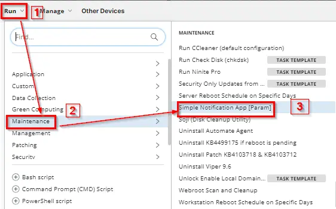

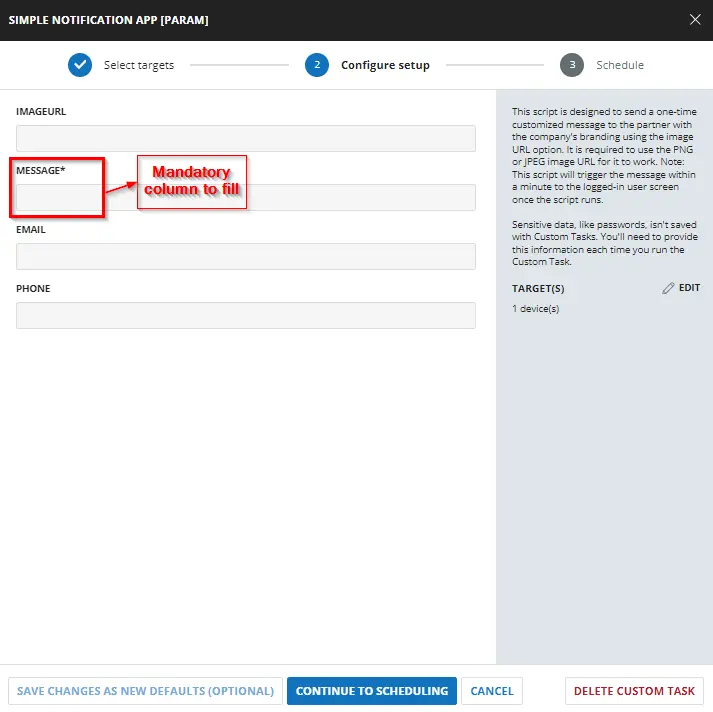

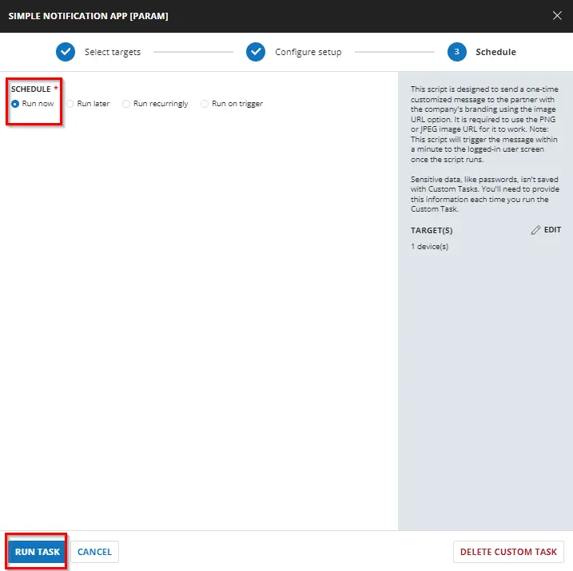

## Requirements

| Name      | Example                                                                                                       | Required | Description                                           |
|-----------|---------------------------------------------------------------------------------------------------------------|----------|-------------------------------------------------------|
| ImageURL  | [http://p.favim.com/orig/2018/08/24/cute-beautiful-couple-avatar-Favim.com-6224738.jpg](http://p.favim.com/orig/2018/08/24/cute-beautiful-couple-avatar-Favim.com-6224738.jpg) | False    | The URL for the image to display instead of the default. |
| Message   | This is a test message                                                                                       | True     | The message is displayed to the end user.            |
| Email     | [someone@testing.com](mailto:someone@testing.com)                                                           | False    | The support e-mail address is displayed to the user. |
| Phone     | 000-000-0000                                                                                                 | False    | The support phone number is displayed to the user.   |

These need to be set in the script editor of the task in the 'set user variables' functions respectively.

## Task Creation

Create a new `Script Editor` style script in the system to implement this task.


**Name:** `Simple Notification App [Param]`

**Description:** This script is designed to send a one-time customized message to the partner with the company's branding using the image URL option.  
`It is required to use the PNG or JPEG image URL for it to work.`  
`Note: This script will trigger the message within a minute to the logged-in user screen once the script runs.`

**Category:** `Maintenance`

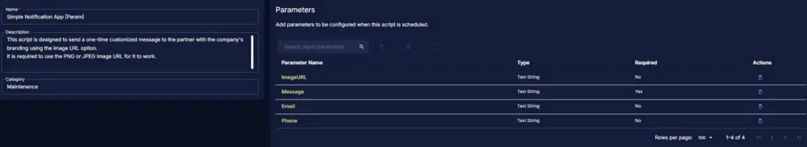

## Task

### Row 1 Function: Set User Variable

Add a new `Add Row` button.


Search and select the `Set User Variable` function.

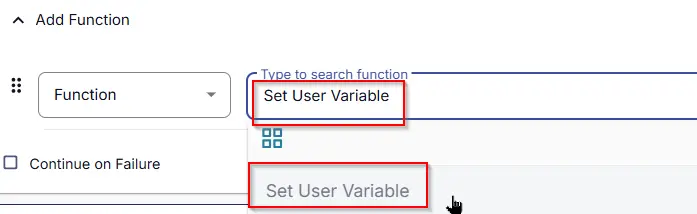

A pop-up box will appear. Set them as follows:

- Set `Variable Name` as `ImageURL`
- Set `Value` as `ENTER YOUR VALUE HERE` (Replace 'Enter value here' with the Image URL provided by the partner. If not provided, leave it as it is.)
- Click the `Save` button.

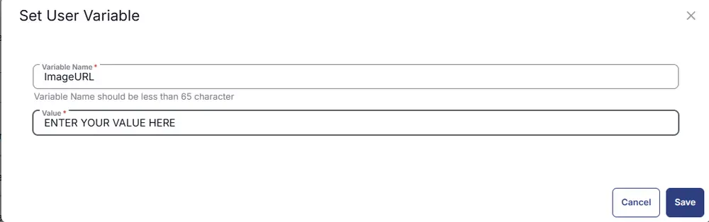

### Row 2 Function: Set User Variable

Add a new `Add Row` button.


Search and select the `Set User Variable` function.


A pop-up box will appear. Set them as follows:

- Set `Variable Name` as `Message`
- Set `Value` as `ENTER YOUR VALUE HERE` (Replace 'Enter value here' with the Notification message provided by the partner. The script will not proceed without the message.)
- Click the `Save` button.

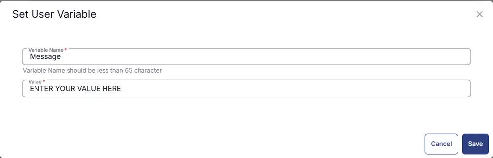

### Row 3 Function: Set User Variable

Add a new `Add Row` button.


Search and select the `Set User Variable` function.


A pop-up box will appear. Set them as follows:

- Set `Variable Name` as `Email`
- Set `Value` as `ENTER YOUR VALUE HERE` (Replace 'Enter value here' with the Email provided by the partner. If not provided, leave it as it is.)
- Click the `Save` button.

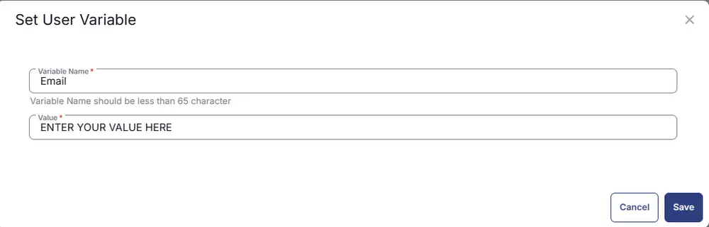

### Row 4 Function: Set User Variable

Add a new `Add Row` button.


Search and select the `Set User Variable` function.


A pop-up box will appear. Set them as follows:

- Set `Variable Name` as `Phone`
- Set `Value` as `ENTER YOUR VALUE HERE` (Replace 'Enter value here' with the Phone Number provided by the partner. If not provided, leave it as it is.)

- Click the `Save` button.

### Row 5 Function: PowerShell Script

Add a new `Add Row` button.


Search and select the `PowerShell Script` function.

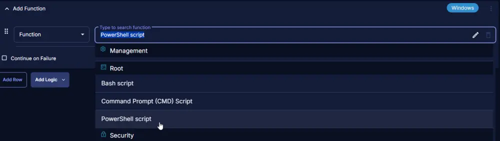

The following function will pop up on the screen:


Paste in the following PowerShell script and set the `Expected time of script execution in seconds` to `600` seconds. Click the `Save` button.

```powershell
if ( '@ImageURL@' -match 'ENTER YOUR VALUE HERE') {
   $Image = ''
} else {
   $Image = '@ImageURL@'
}

if ( '@Message@' -match 'ENTER YOUR VALUE HERE') {
   throw 'Message is required to run the task.'
} else {
   $Message = '@Message@'
}

if ( '@Email@' -match 'ENTER YOUR VALUE HERE') {
   $Email = ''
} elseif ('@Email@' -notmatch '.+@.+\\..+') {
   $Email = ''
} else {
   $Email = '@Email@'
}

if ( '@Phone@' -match 'ENTER YOUR VALUE HERE') {
   $Phone = ''
} elseif ('@Phone@' -notmatch '[0-9]') {
   $Phone = ''
} else {
   $Phone = '@Phone@'
}

[Net.ServicePointManager]::SecurityProtocol = [Net.SecurityProtocolType]::Tls12

$URL = 'https://github.com/ProVal-Tech/SimpleNotification/releases/latest/download/SimpleNotification.exe'
$WorkingDirectory = 'C:\\ProgramData\\_automation\\script\\SimpleNotification'
$EXEPath = Join-Path -Path $WorkingDirectory -ChildPath 'SimpleNotification.exe'
$ConfigFile = Join-Path -Path $WorkingDirectory -ChildPath 'config.toml'

if (-not (Test-Path -Path $WorkingDirectory)) {
    try {
        New-Item -Path $WorkingDirectory -ItemType Directory -Force -ErrorAction Stop | Out-Null
    } catch {
        Write-Error "ERROR: Failed to create $WorkingDirectory. Reason: $($_.Exception.Message)"
        return
    }
}

if (-not ((Get-Acl $WorkingDirectory).Access | Where-Object { $_.IdentityReference -match 'Everyone' -and $_.FileSystemRights -match 'FullControl' })) {
    try {
        $Acl = Get-Acl $WorkingDirectory
        $AccessRule = New-Object System.Security.AccessControl.FileSystemAccessRule('Everyone', 'FullControl', 'ContainerInherit, ObjectInherit', 'None', 'Allow')
        $Acl.AddAccessRule($AccessRule)
        Set-Acl -Path $WorkingDirectory -AclObject $Acl
    } catch {
        Write-Error "ERROR: Failed to set permissions on $WorkingDirectory. Reason: $($_.Exception.Message)"
        return
    }
}

$ConfigDirectory = [System.IO.Path]::GetDirectoryName($ConfigFile)
if (-not (Test-Path -Path $ConfigDirectory)) {
    New-Item -ItemType Directory -Path $ConfigDirectory -Force | Out-Null
}

try {
    Invoke-WebRequest -Uri $URL -OutFile $EXEPath -UseBasicParsing
    if (-not (Test-Path -Path $EXEPath)) {
        Write-Error "ERROR: Failed to download SimpleNotification.exe. Exiting."
        return
    }
} catch {
    Write-Error "ERROR: Failed to download file. Reason: $($_.Exception.Message)"
    return
}

$content = @"
message = '$Message'
image_url = '$Image'
email = '$Email'
phone = '$Phone'
"@

$Utf8NoBomEncoding = New-Object System.Text.UTF8Encoding $False
try {
    [System.IO.File]::WriteAllLines($ConfigFile, $content, $Utf8NoBomEncoding)
} catch {
    Write-Error "ERROR: Failed to write config file. Reason: $($_.Exception.Message)"
    return
}

$TaskName = 'Simple Notification'
$Description = 'Running Simple Notification app to send the prompt'
$Parameter = "-c `"$ConfigFile`""

# Unregister existing task if it exists
if (Get-ScheduledTask -TaskName $TaskName -ErrorAction SilentlyContinue) {
    Unregister-ScheduledTask -TaskName $TaskName -Confirm:$false
}

$Action = New-ScheduledTaskAction -Execute $EXEPath -Argument $Parameter

# Create task trigger (run once 1 minute from now)
$TriggerTime = (Get-Date).AddMinutes(1)
$Trigger = New-ScheduledTaskTrigger -Once -At $TriggerTime

$Settings = New-ScheduledTaskSettingsSet
$Principal = New-ScheduledTaskPrincipal -GroupId ((New-Object System.Security.Principal.SecurityIdentifier('S-1-5-32-545')).Translate([System.Security.Principal.NTAccount]).Value)

try {
    Register-ScheduledTask -Action $Action -Trigger $Trigger -TaskName $TaskName -Description $Description -Settings $Settings -Principal $Principal
    Write-Output "Task created successfully."
} catch {
    Write-Error "ERROR: Failed to create scheduled task. Reason: $($_.Exception.Message)"
}
```

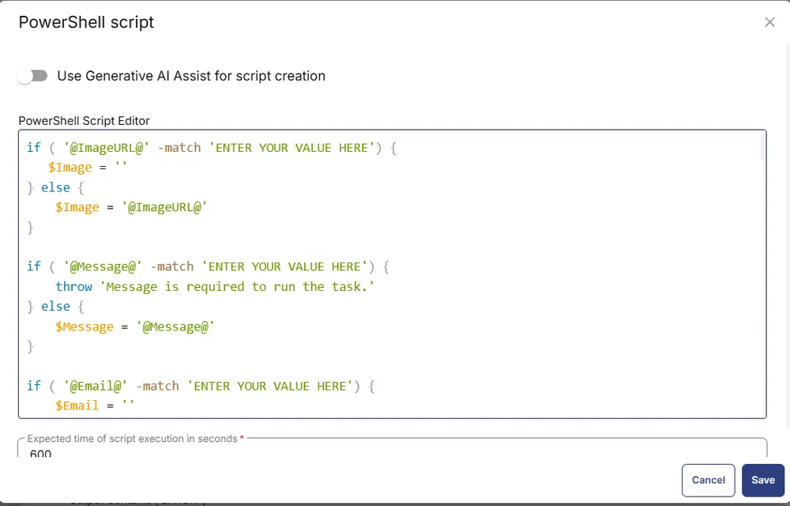

### Row 6 Logic: If/Then

Add a new `If/Then/Else` logic from the Add Logic dropdown menu.

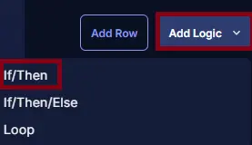

#### ROW 6a Condition: Output Contains

Type `ERROR:` in the Value box.

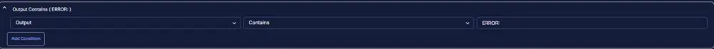

#### Row 6b Function: Script Exit

Add a new row by clicking the `Add Row` button.


A blank function will appear.


Search and select the `Script Exit` function.


The following function will pop up on the screen:


In the script exit message, simply type:

```
Failed to set the custom notification. Refer to the logs:
%Output%
```

and click the `Save` button.

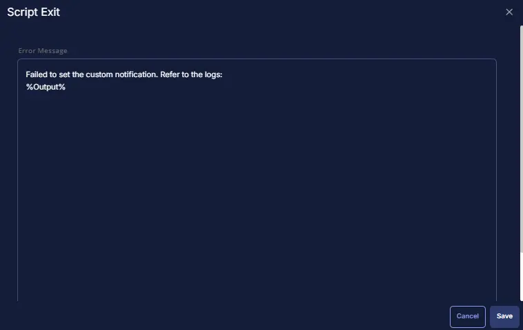

### Row 7 Function: Script Log

Add a new row by clicking the `Add Row` button.


A blank function will appear.


Search and select the `Script Log` function.


The following function will pop up on the screen:


In the script log message, type:

```
Successfully set the custom notification. Refer to the logs:
%Output%
```

and click the `Save` button.

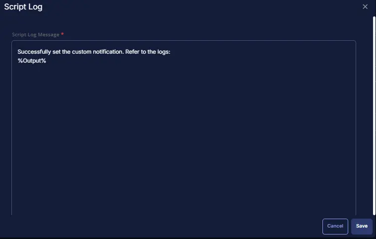

### Row 8 Function: Script Exit

Add a new row by clicking the `Add Row` button.


A blank function will appear.

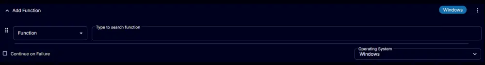

Search and select the `Script Exit` function.

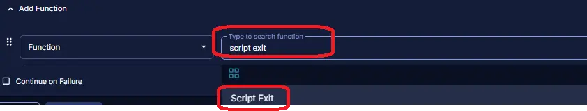

The following function will pop up on the screen:

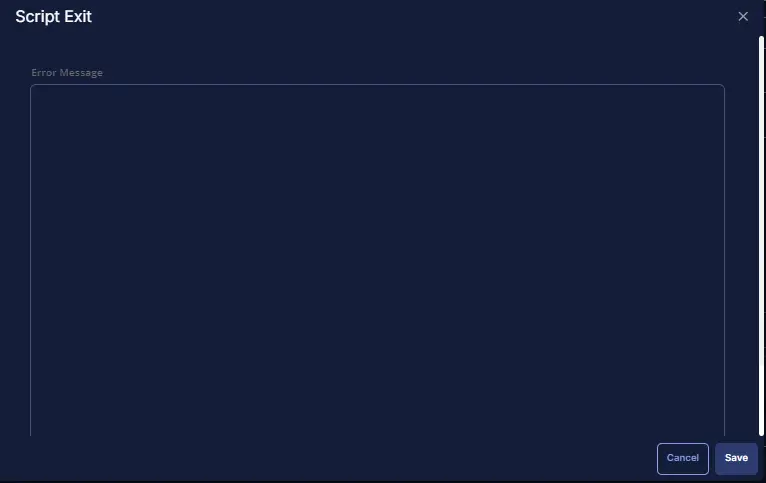

In the script exit message, leave it blank and click the `Save` button.

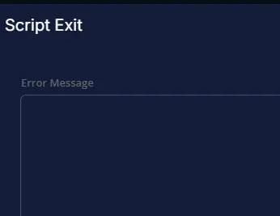

## Completed Task

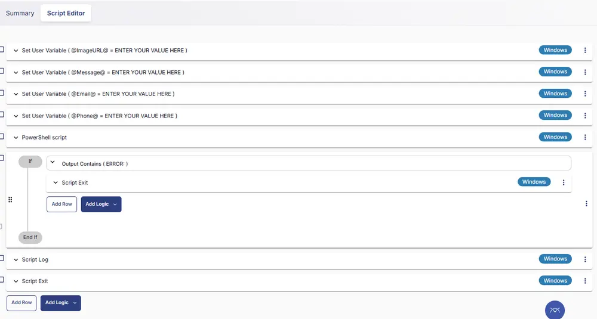

## Implementation

It is designed to run as an on-demand task because this pops up the notification as soon as the script triggers and only once.

- Go to `Automation` > `Tasks`.
- Search for the `DUO Auth Proxy - Install/Update Latest Version` Task.
- Select the concerned task.
- Click on the `Schedule` button to schedule the task/script.

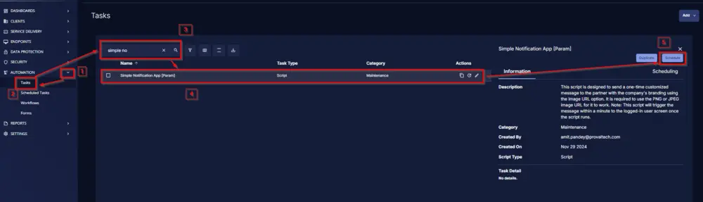

This screen will appear.

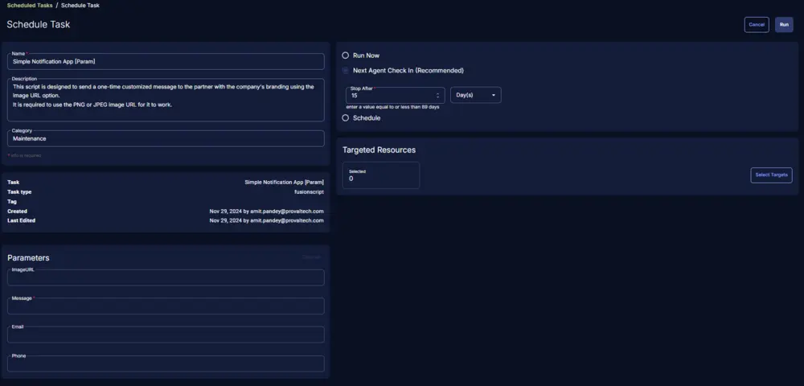

Select the `Schedule` button and click the calendar-looking button present in front of the `Recurrence` option.

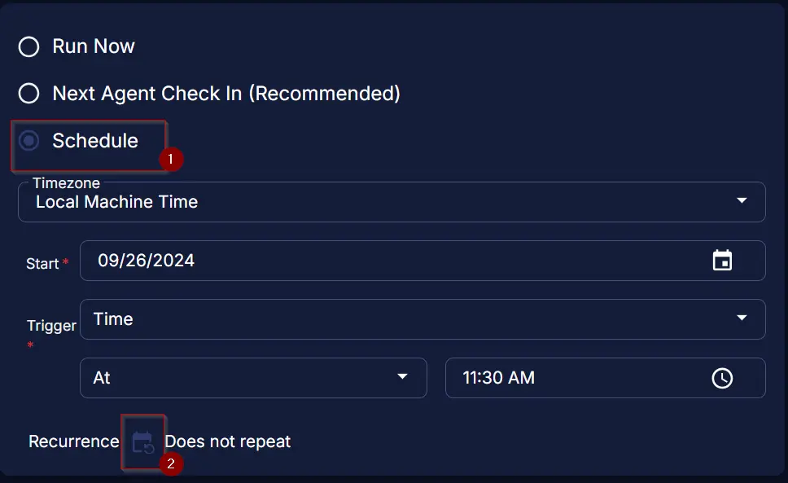

Select the `Month(s)` for the `Repeat`, `1` for `Dates`, and click the `OK` button to save the schedule.


Click the `Select Targets` button to select the concerned target.


Search and select the appropriate target, such as sites, groups, or devices where you would like to send the notification at the same time.

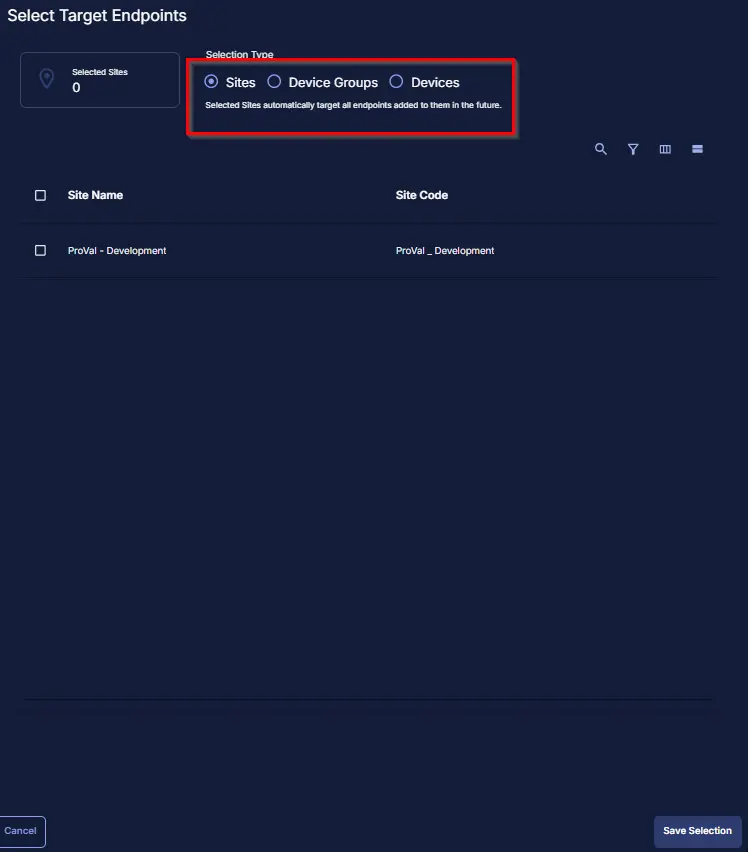

Click the `Run` button to initiate the schedule.

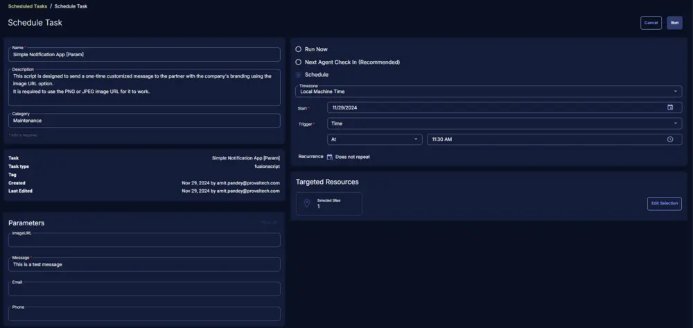

## Output

- Script log