---
id: '165a2ce7-105e-41f5-a4b1-48f362515b31'
slug: /165a2ce7-105e-41f5-a4b1-48f362515b31
title: 'Simple Notification App [Param]'
title_meta: 'Simple Notification App [Param]'
keywords: ['notification', 'branding', 'message', 'custom', 'image', 'script', 'automation']
description: 'This document outlines the implementation of a Simple Notification App that delivers a one-time customized message to users, featuring company branding through an optional image URL. The script is designed for easy setup and execution, ensuring that notifications are displayed promptly on the user’s screen.'
tags: ['email', 'setup', 'software', 'windows']
draft: false
unlisted: false
last_update:
  date: 2026-03-10
---

## Summary

This script is designed to deliver a one-time, customized message to the partner, featuring your company's branding through an optional image URL. For branding purposes, using a PNG or JPEG image URL is recommended, though not mandatory. Once executed, the script will display the message on the logged-in user's screen within one minute.

## Sample Run

### Example 1

Using custom value for each parameter.  

- **Message:** `Hello there, it''s time to leave for the day. Good night!`  
- **ImageUrl:** `https://contentrepo.net/repo/share/logo.png`  
- **Email:** `ram.kishor@provaltech.com`  
- **Phone:** `1234567891`

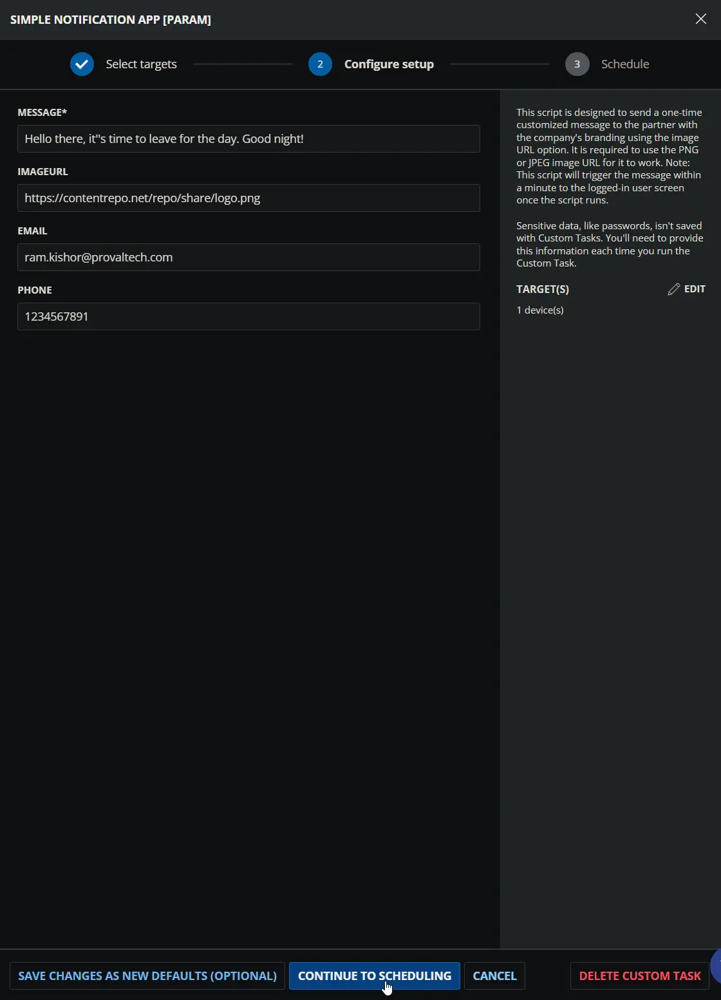

**Notification:**


### Example 2

Using default values for non-mandatory parameters.

- **Message:** `Hello there, it''s time to leave for the day. Good night!`  
- **ImageUrl:** ' '
- **Email:** ' '
- **Phone:** ' '

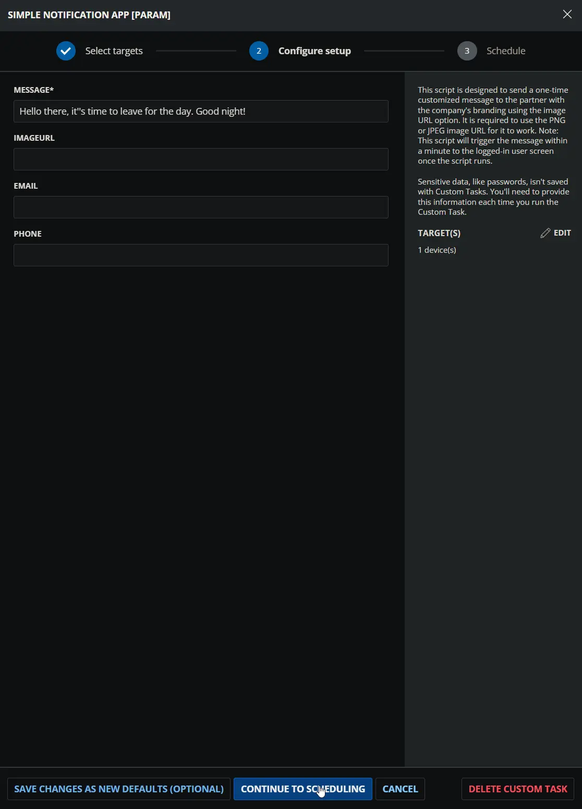

**Notification:**

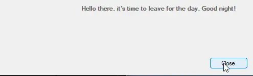

### Example 3

Using custom value for each parameter.

- **Message:** `It''s not just a secret mission—it''s a fashion emergency! Bond and I are armed with suspicious sunglasses, maximum sparkle, and a missile that might be a hairdryer. If we don''t save the world, we''ll at least confuse the villains with our fabulousness and questionable accessories!`  
- **ImageUrl:** `https://labtech.provaltech.com/labtech/transfer/images/alogo.jpg`
- **Email:** `ram.kishor@provaltech.com`
- **Phone:** `1234567890`

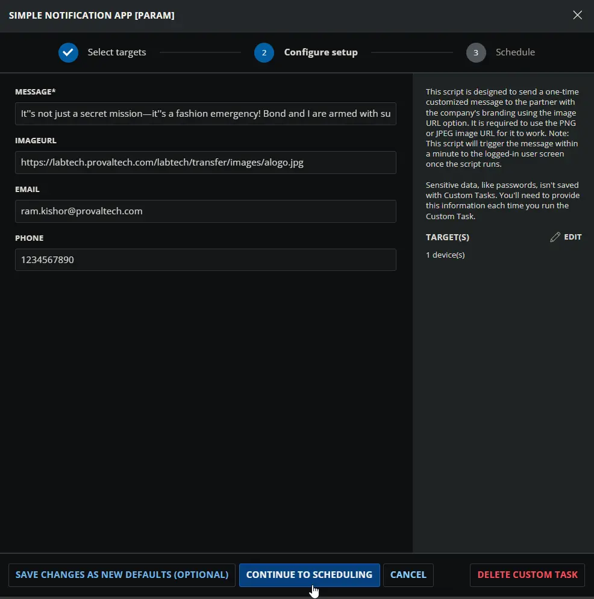

**Notification:**


## Dependencies

[SimpleNotification](/docs/df3d2cab-2568-4b41-b447-7b21ef64220b)

## User Parameters

| Name      | Example                                                                                                       | Required | Description                                           |
|-----------|---------------------------------------------------------------------------------------------------------------|----------|-------------------------------------------------------|
| Message   | This is a test message                                                                                       | True     | The message is displayed to the end user. (Maximum 888 characters).<br/>Replace single quotes with two single quotes.<br/>**Incorrect:** `it's`<br/>**Correct:** `it''s`  |
| ImageURL  | [http://p.favim.com/orig/2018/08/24/cute-beautiful-couple-avatar-Favim.com-6224738.jpg](http://p.favim.com/orig/2018/08/24/cute-beautiful-couple-avatar-Favim.com-6224738.jpg) | False    | The URL for the image to display instead of the default. |
| Email     | [someone@testing.com](mailto:someone@testing.com)                                                           | False    | The support e-mail address is displayed to the user. |
| Phone     | 000-000-0000                                                                                                 | False    | The support phone number is displayed to the user.   |

## Task Setup Path

- **Tasks Path:** `AUTOMATION` ➞ `Tasks`  
- **Task Type:** `Script Editor`  

## Task Creation

### Description

- **Name:** `Simple Notification App [Param]`  
- **Description:**

    ```PlainText
    This script is designed to send a one-time customized message to the partner with the company's branding using the image URL option.
    It is required to use the PNG or JPEG image URL for it to work.

    Note: This script will trigger the message within a minute to the logged-in user screen once the script runs.
    ```

- **Category:** `Maintenance`

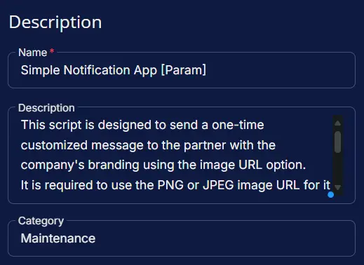

### Parameters

| Parameter Name | Required Field | Parameter Type | Default Value |
| -------------- | -------------- | -------------- | ------------- |
| Message | Enabled | Text String | Disabled |
| ImageUrl | Disabled | Text String | Disabled |
| Email | Disabled | Text String | Disabled |
| Phone | Disabled | Text String | Disabled |

**Message:**  
    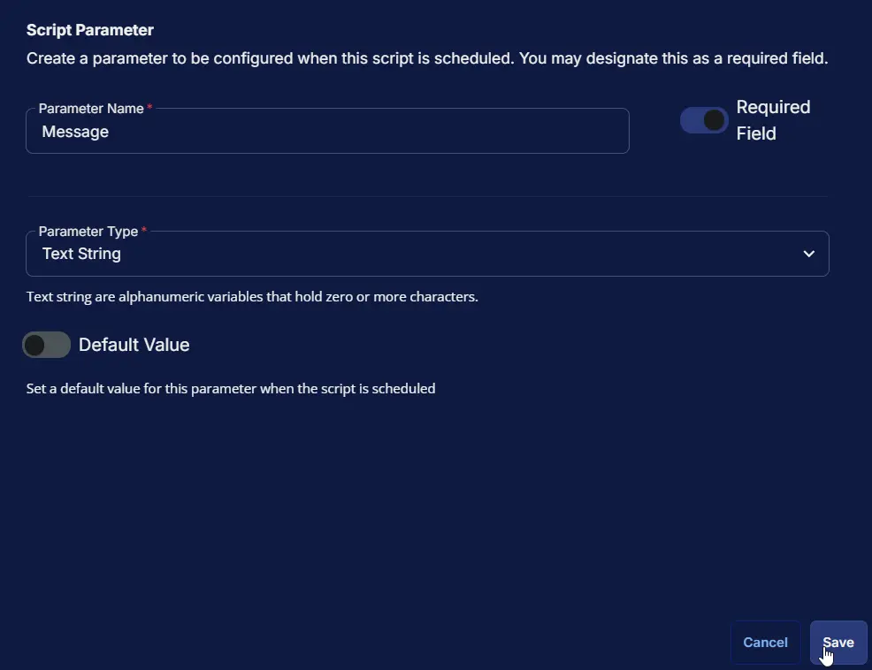

**ImageUrl:**  
    

**Email:**  
    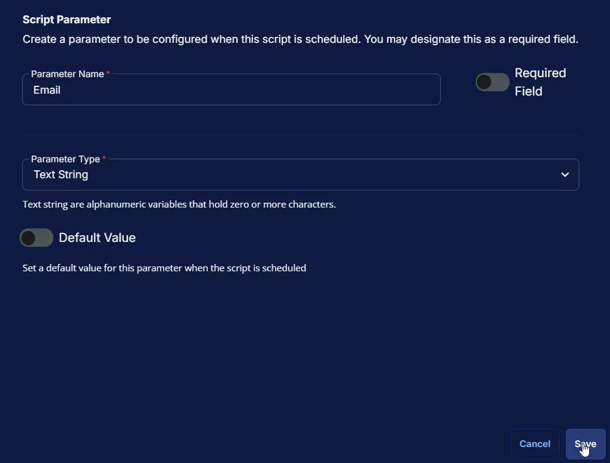

**Phone:**  
    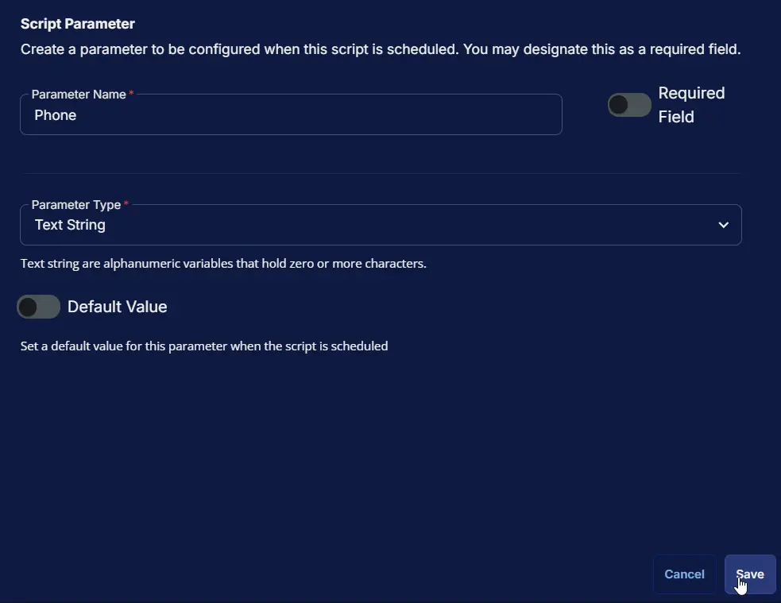

#### Parameters Section

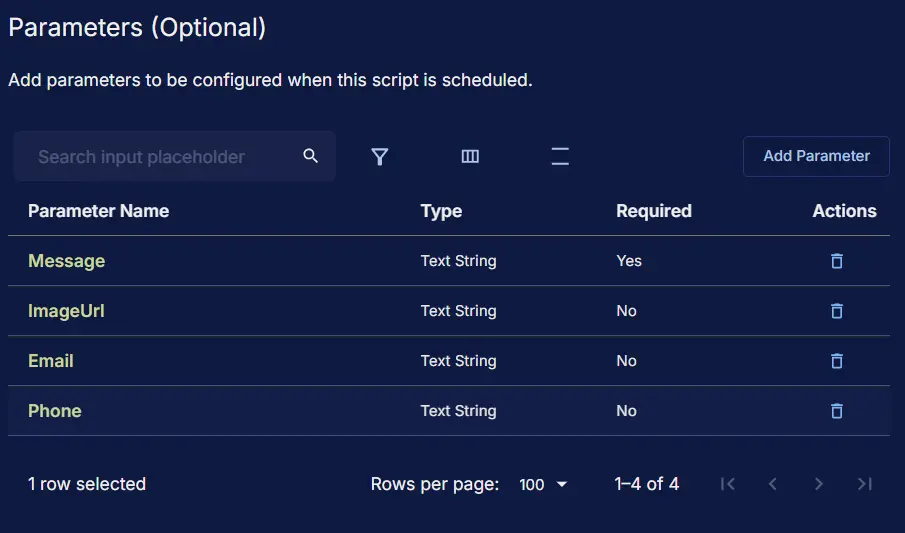

### Script Editor

#### Step 1: Row ➞ PowerShell script

- **Use Generative AI Assist for script creation:** `False`  
- **Expected time of script execution in seconds:** `300`
- **Continue on Failure:** `False`  
- **Run as:** `System`  
- **Operating System:** `Windows`  
- **PowerShell Script Editor:**  

[PowerShell Script](https://github.com/ProVal-Tech/cw-rmm/blob/main/tasks/simple-notification-app/script.ps1)


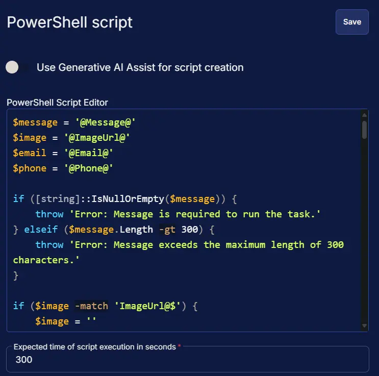

#### Step 2: Row ➞ Script Log

- **Script Log Message:** `%Output%`  
- **Operating System:** `Windows`

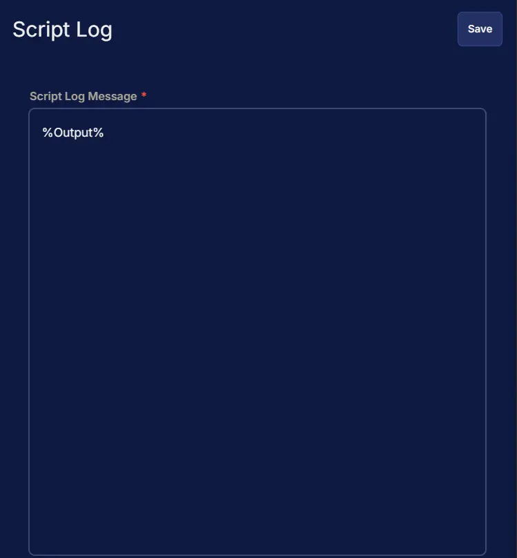

## Completed Task

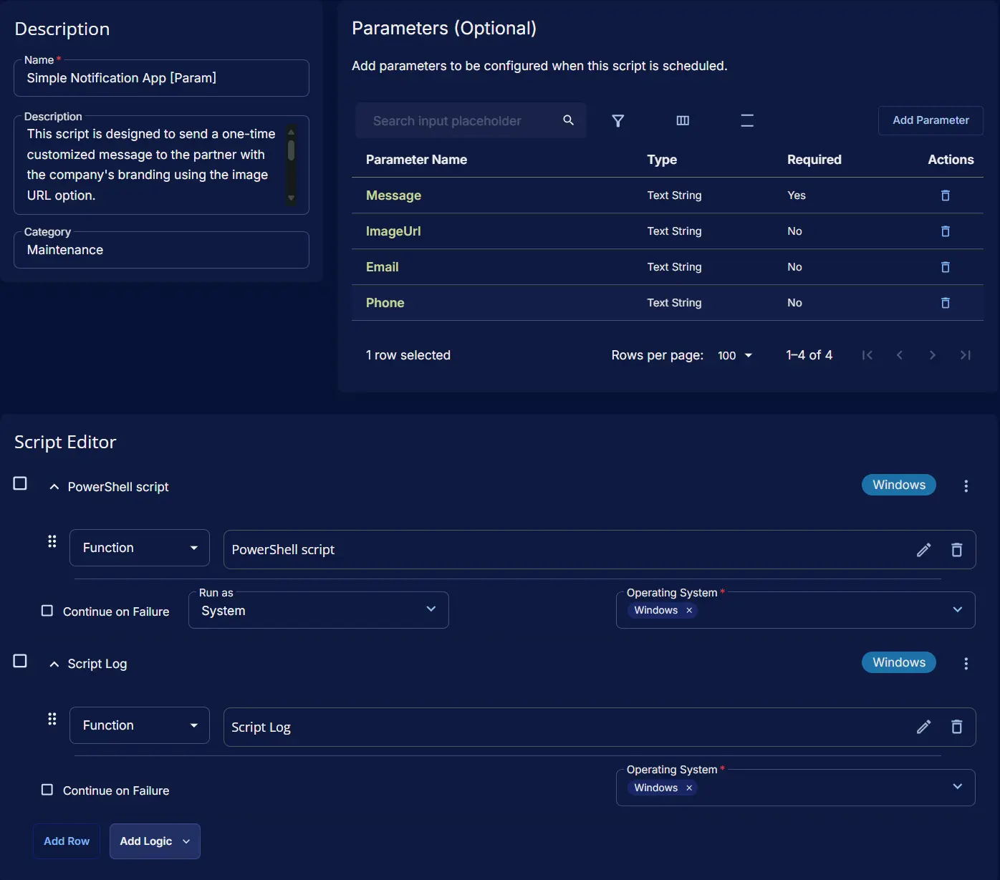

## Output

- Script Log
- Popup Message on User's desktop

## Changelog

### 2026-03-10

- Implemented dynamic UI resizing for the notification prompt based on the length of the incoming message.
- Added three responsive layout tiers: Small (less than equal 300 characters), Medium (between 301-500 characters), and Large (greater than 500 characters).
- Established a maximum character limit of 888 characters for the Large layout; exceeding text will not be displayed.

### 2025-08-29

- Updated the task to use parameter instead of variable.

### 2025-04-10

- Initial version of the document

