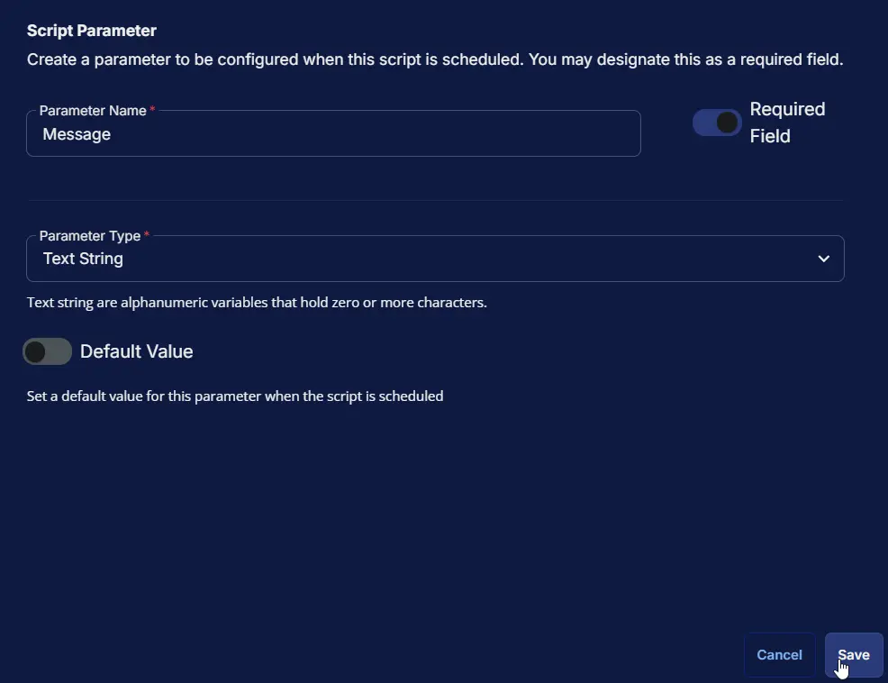

## Summary

This script is designed to deliver a one-time, customized message to the partner, featuring your company's branding through an optional image URL. For branding purposes, using a PNG or JPEG image URL is recommended, though not mandatory. Once executed, the script will display the message on the logged-in user's screen within one minute.

## Sample Run

### Example 1

Using custom value for each parameter.  

**Message:** `Hello there, it''s time to leave for the day. Good night!`  
**ImageUrl:** `https://contentrepo.net/repo/share/logo.png`  
**Email:** `ram.kishor@provaltech.com`  
**Phone:** `1234567891`


**Notification:**


### Example 2

Using default values for non-mandatory parameters.

**Message:** `Hello there, it''s time to leave for the day. Good night!`  
**ImageUrl:** ``  
**Email:** ``  
**Phone:** ``


**Notification:**


## User Parameters

| Name      | Example                                                                                                       | Required | Description                                           |
|-----------|---------------------------------------------------------------------------------------------------------------|----------|-------------------------------------------------------|
| Message   | This is a test message                                                                                       | True     | The message is displayed to the end user. (Maximum 300 characters).<br/>Replace single quotes with two single quotes.<br/>**Incorrect:** `it's`<br/>**Correct:** `it''s`  |
| ImageURL  | [http://p.favim.com/orig/2018/08/24/cute-beautiful-couple-avatar-Favim.com-6224738.jpg](http://p.favim.com/orig/2018/08/24/cute-beautiful-couple-avatar-Favim.com-6224738.jpg) | False    | The URL for the image to display instead of the default. |
| Email     | [someone@testing.com](mailto:someone@testing.com)                                                           | False    | The support e-mail address is displayed to the user. |
| Phone     | 000-000-0000                                                                                                 | False    | The support phone number is displayed to the user.   |

## Task Setup Path

- **Tasks Path:** `AUTOMATION` ➞ `Tasks`  
- **Task Type:** `Script Editor`  

## Task Creation

### Description

- **Name:** `Simple Notification App [Param]`  
- **Description:**

    ```PlainText
    This script is designed to send a one-time customized message to the partner with the company's branding using the image URL option.
    It is required to use the PNG or JPEG image URL for it to work.

    Note: This script will trigger the message within a minute to the logged-in user screen once the script runs.
    ```

- **Category:** `Maintenance`


### Parameters

| Parameter Name | Required Field | Parameter Type | Default Value |
| -------------- | -------------- | -------------- | ------------- |
| Message | Enabled | Text String | Disabled |
| ImageUrl | Disabled | Text String | Disabled |
| Email | Disabled | Text String | Disabled |
| Phone | Disabled | Text String | Disabled |

**Message:**  
    

**ImageUrl:**  
    

**Email:**  
    

**Phone:**  
    

#### Parameters Section


### Script Editor

#### Step 1: Row ➞ PowerShell script

- **Use Generative AI Assist for script creation:** `False`  
- **Expected time of script execution in seconds:** `300`
- **Continue on Failure:** `False`  
- **Run as:** `System`  
- **Operating System:** `Windows`  
- **PowerShell Script Editor:**  

```PowerShell
$message = '@Message@'
$image = '@ImageUrl@'
$email = '@Email@'
$phone = '@Phone@'

if ([string]::IsNullOrEmpty($message)) {
    throw 'Error: Message is required to run the task.'
} elseif ($message.Length -gt 300) {
    throw 'Error: Message exceeds the maximum length of 300 characters.'
}

if ($image -match 'ImageUrl@$') {
    $image = ''
}

if ($email -match 'Email@$') {
    $email = ''
}

if ($phone -match 'Phone@$') {
    $phone = ''
}

$ProgressPreference = 'SilentlyContinue'

$loggedInUser = (Get-CimInstance -ClassName Win32_ComputerSystem).UserName
if (!$loggedInUser) {
    return '[Warn] No user is currently logged in.'
}

$SupportedTLSversions = [enum]::GetValues('Net.SecurityProtocolType')
if ( ($SupportedTLSversions -contains 'Tls13') -and ($SupportedTLSversions -contains 'Tls12') ) {
    [System.Net.ServicePointManager]::SecurityProtocol = [System.Net.ServicePointManager]::SecurityProtocol::Tls13 -bor [System.Net.SecurityProtocolType]::Tls12
} elseif ( $SupportedTLSversions -contains 'Tls12' ) {
    [System.Net.ServicePointManager]::SecurityProtocol = [System.Net.SecurityProtocolType]::Tls12
} else {
    Write-Information '[Warn] TLS 1.2 and/or TLS 1.3 are not supported on this system. This download may fail!' -InformationAction Continue
    if ($PSVersionTable.PSVersion.Major -lt 3) {
        Write-Information '[Warn] PowerShell 2 / .NET 2.0 doesn''t support TLS 1.2.' -InformationAction Continue
    }
}

$URL = 'https://github.com/ProVal-Tech/SimpleNotification/releases/latest/download/SimpleNotification.exe'
$WorkingDirectory = 'C:\ProgramData\_automation\script\SimpleNotification'
$EXEPath = Join-Path -Path $WorkingDirectory -ChildPath 'SimpleNotification.exe'
$ConfigFile = Join-Path -Path $WorkingDirectory -ChildPath 'config.toml'

if (-not (Test-Path -Path $WorkingDirectory)) {
    try {
        New-Item -Path $WorkingDirectory -ItemType Directory -Force -ErrorAction Stop | Out-Null
    } catch {
        throw "ERROR: Failed to create $WorkingDirectory. Reason: $($_.Exception.Message)"
    }
}

if (-not ((Get-Acl -Path $WorkingDirectory).Access | Where-Object { $_.IdentityReference -match 'Everyone' -and $_.FileSystemRights -match 'FullControl' })) {
    try {
        $Acl = Get-Acl $WorkingDirectory
        $AccessRule = New-Object System.Security.AccessControl.FileSystemAccessRule('Everyone', 'FullControl', 'ContainerInherit, ObjectInherit', 'None', 'Allow')
        $Acl.AddAccessRule($AccessRule)
        Set-Acl -Path $WorkingDirectory -AclObject $Acl
    } catch {
        throw "ERROR: Failed to set permissions on $WorkingDirectory. Reason: $($_.Exception.Message)"
    }
}

$ConfigDirectory = [System.IO.Path]::GetDirectoryName($ConfigFile)
if (-not (Test-Path -Path $ConfigDirectory)) {
    New-Item -ItemType Directory -Path $ConfigDirectory -Force | Out-Null
}

try {
    Invoke-WebRequest -Uri $URL -OutFile $EXEPath -UseBasicParsing
    if (-not (Test-Path -Path $EXEPath)) {
        throw 'ERROR: Failed to download SimpleNotification.exe. Exiting.'
    }
} catch {
    throw "ERROR: Failed to download file. Reason: $($_.Exception.Message)"
}

$content = @"
message = "$message"
image_url = "$image"
email = "$email"
phone = "$phone"
"@

$Utf8NoBomEncoding = New-Object System.Text.UTF8Encoding $False
try {
    [System.IO.File]::WriteAllLines($ConfigFile, $content, $Utf8NoBomEncoding)
} catch {
    throw "ERROR: Failed to write config file. Reason: $($_.Exception.Message)"
}

$TaskName = 'Simple Notification'
$Description = 'Running Simple Notification app to send the prompt'
$Parameter = "-c `"$ConfigFile`""

# Unregister existing task if it exists
if (Get-ScheduledTask -TaskName $TaskName -ErrorAction SilentlyContinue) {
    Unregister-ScheduledTask -TaskName $TaskName -Confirm:$false
}

$Action = New-ScheduledTaskAction -Execute $EXEPath -Argument $Parameter

# Create task trigger (run once 20 seconds from now)
$TriggerTime = (Get-Date).AddSeconds(20)
$Trigger = New-ScheduledTaskTrigger -Once -At $TriggerTime

$Settings = New-ScheduledTaskSettingsSet
$Principal = New-ScheduledTaskPrincipal -GroupId ((New-Object System.Security.Principal.SecurityIdentifier('S-1-5-32-545')).Translate([System.Security.Principal.NTAccount]).Value)

try {
    Register-ScheduledTask -Action $Action -Trigger $Trigger -TaskName $TaskName -Description $Description -Settings $Settings -Principal $Principal | Out-Null
    Write-Output 'Task created successfully.'
} catch {
    throw "ERROR: Failed to create scheduled task. Reason: $($_.Exception.Message)"
}

```


#### Step 2: Row ➞ Script Log

- **Script Log Message:** `%Output%`  
- **Operating System:** `Windows`


## Completed Task


## Output

- Script Log
- Popup Message on User's desktop
