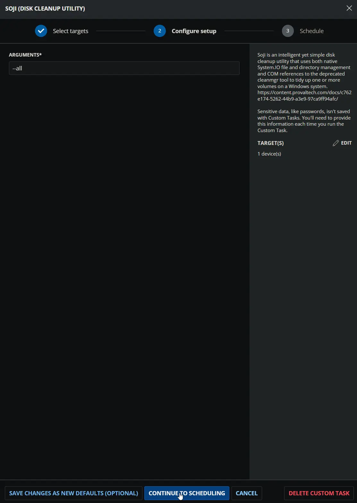
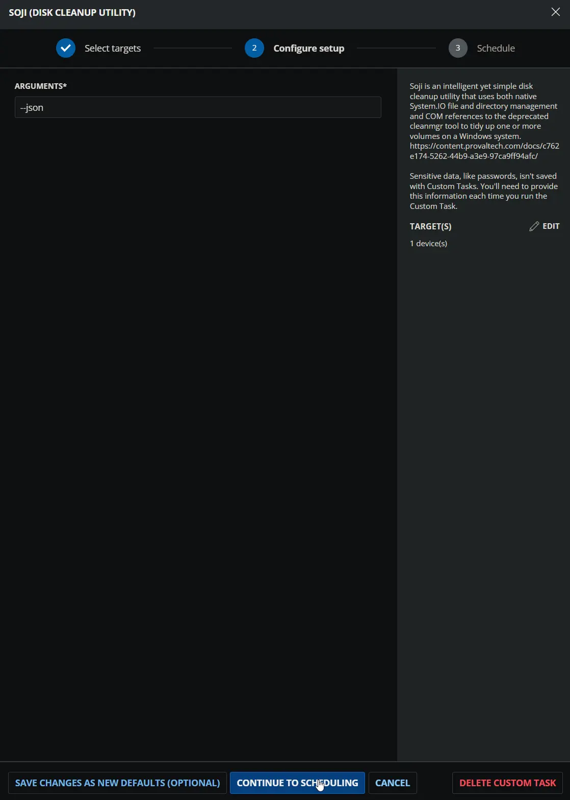
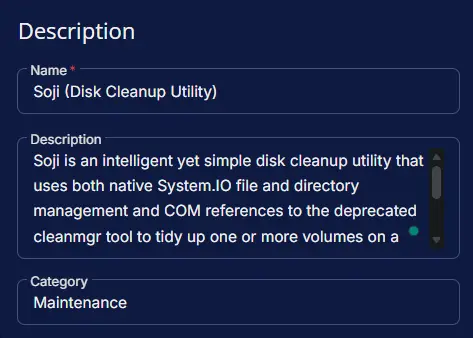
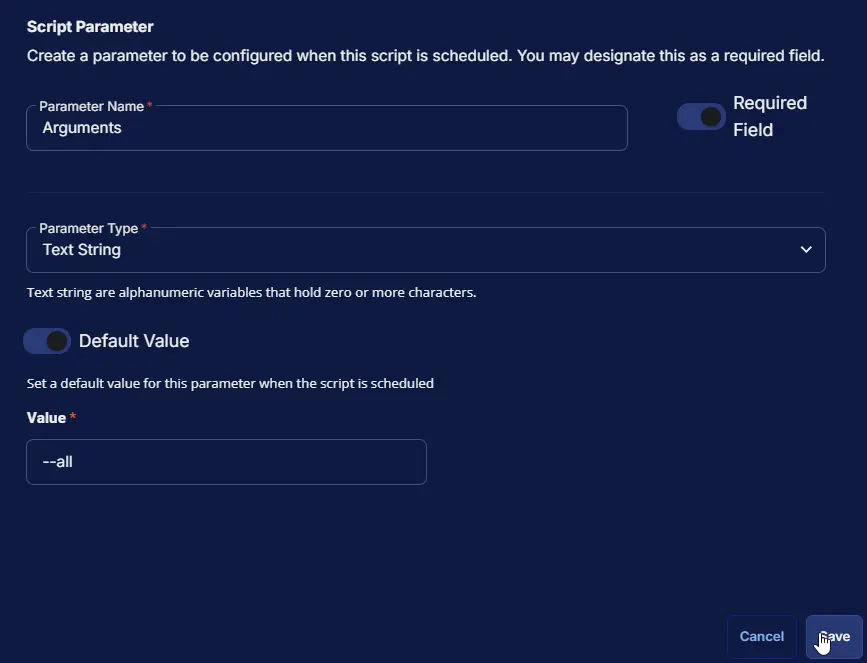
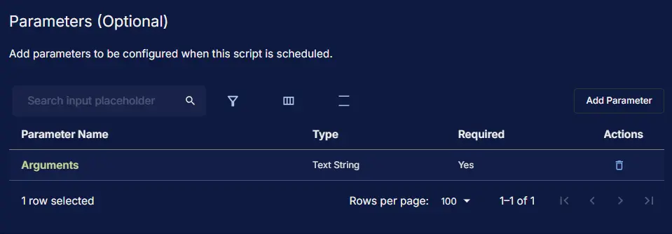
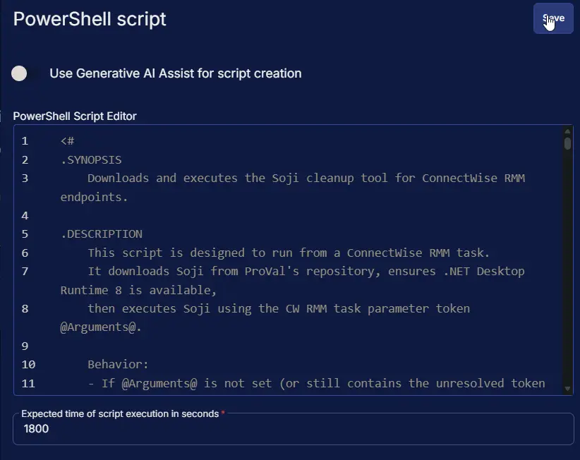
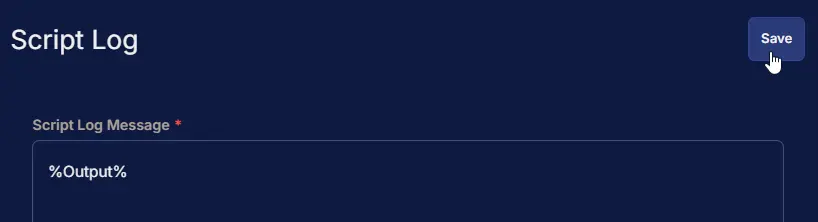
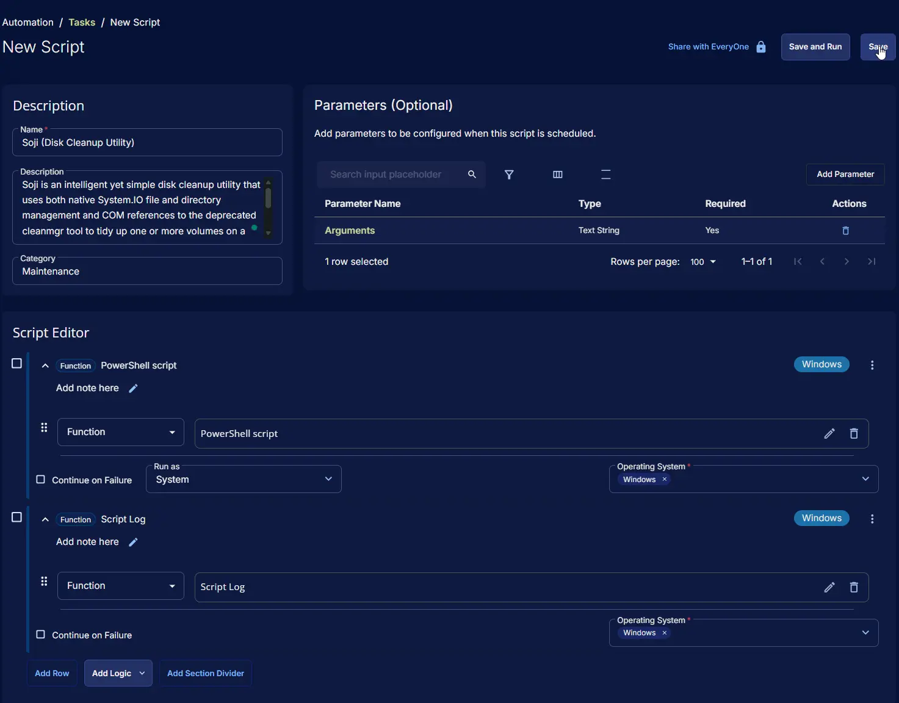

## Summary

Soji is a smart yet straightforward disk cleanup utility designed to enhance system cleanliness on Windows. It utilizes both native System.IO file and directory management along with COM references to the deprecated cleanmgr tool.

This document provides a guide on creating the Soji disk cleanup Task in CW RMM. The task is versatile and can serve as an Autofix/Automation Task alongside `Monitors` or `Intelligent Alerts`. When employed as an Autofix, the task executes the tool with the `--All` argument.

Please reference [Soji](/docs/c762e174-5262-44b9-a3e9-97ca9ff94afc) for argument usage.

## Sample Run

*Clean all fixed drives with all available cleaners:*



*Clean the C and F drives:*


*Clean all fixed drives and read back the file JSON report in PowerShell:*



## Dependencies

- [Soji](/docs/c762e174-5262-44b9-a3e9-97ca9ff94afc)

### User Parameters

| Name       | Example  | Required | Default | Description                                                                 |
|------------|----------|----------|---------|--------------------------------------------------------------------|
| Arguments  | `--all`   | Yes     | `--all` | Please reference [Soji](/docs/c762e174-5262-44b9-a3e9-97ca9ff94afc) for argument usage. |

**Note:** Arguments are case sensitive.

## Task Setup Path

**Tasks Path:** `AUTOMATION` ➞ `Tasks`  
**Task Type:** `Script Editor`

## Task Creation

### Description

- **Name:** `Soji (Disk Cleanup Utility)`  
- **Description:**

```PlainText
Soji is an intelligent yet simple disk cleanup utility that uses both native System.IO file and directory management and COM references to the deprecated cleanmgr tool to tidy up one or more volumes on a Windows system.

https://content.provaltech.com/docs/c762e174-5262-44b9-a3e9-97ca9ff94afc/
```

- **Category:** `Maintenance`



### Parameters

| Parameter Name | Required Field | Parameter Type | Default Value | Value |
| -------------- | -------------- | -------------- | ------------- | ----- |
| Arguments | Enabled | Text String | Enabled | `--all` |

**Arguments:**  
    



### Script Editor

#### Step 1: Row -> PowerShell script

- **Use Generative AI Assist for script creation:** `False`  
- **Expected time of script execution in seconds:** `1800`  
- **Operating System:** `Windows`  
- **Continue on Failure:** `False`  
- **Run as:** `System`  
- **PowerShell Script Editor:**

```PowerShell
<#
.SYNOPSIS
    Downloads and executes the Soji cleanup tool for ConnectWise RMM endpoints.

.DESCRIPTION
    This script is designed to run from a ConnectWise RMM task.
    It downloads Soji from ProVal's repository, ensures .NET Desktop Runtime 8 is available,
    then executes Soji using the CW RMM task parameter token @Arguments@.

    Behavior:
    - If @Arguments@ is not set (or still contains the unresolved token text), the script runs
      Soji with no command-line options, which triggers Soji default cleaning behavior.
    - If @Arguments@ is set, the script appends that value directly and runs Soji with the
      provided options.

    High-level workflow:
    1. Create and validate the working directory under ProgramData.
    2. Set TLS 1.2/1.3 for secure outbound downloads.
    3. Install .NET Desktop Runtime 8 if it is missing.
    4. Download Soji.exe from ProVal content repository.
    5. Build execution command from @Arguments@.
    6. Execute Soji and return the logs directory path.

.PARAMETER Arguments
    ConnectWise RMM task parameter token: @Arguments@

    Pass a Soji argument string exactly as it should be executed.
    If left blank in the CW RMM task, Soji runs with no arguments.

    Supported Soji options include:
    - --drives, -d                 Example: C,D
    - --days, -y                   Example: 10.1
    - --json, -j
    - --csv, -c
    - --systempaths, -p            Example: "Temp|\\.txt$","system32\\Temp"
    - --userpaths, -u              Example: "AppData\\Local\\Adobe|\\.log$","AppData\\Local\\Microsoft"
    - --purge-downloads
    - --clean-winsxs
    - --run-cleanmgr
    - --empty-recyclebin
    - --winsxs-seconds             Default: 300
    - --all
    - --debug

.EXAMPLE
    CW RMM task parameter:
        @Arguments@ = --all

    Resulting execution:
        Soji.exe --all

.EXAMPLE
    CW RMM task parameter:
        @Arguments@ = --drives C,F

    Resulting execution:
        Soji.exe --drives C,F

.EXAMPLE
    CW RMM task parameter:
        @Arguments@ = --json

    Resulting execution:
        Soji.exe --json

    JSON reports are generated in SojiLogs under the working directory.

.EXAMPLE
    CW RMM task parameter:
        @Arguments@ = --csv -p "MyFolder\MySubfolder|^Arigatou.*\.txt$" -u "AppData\MyAppPath\Logs|\.log$" --days 21.5 --all

    Resulting execution:
        Soji.exe --csv -p "MyFolder\MySubfolder|^Arigatou.*\.txt$" -u "AppData\MyAppPath\Logs|\.log$" --days 21.5 --all

.OUTPUTS
    System.String

    Returns:
        Logs Directory: '<workingDirectory>\Sojilogs'

    Soji log output is written under SojiLogs in the current working directory. When --csv and/or
    --json are passed, report files are also generated in SojiLogs.

    Common Soji output files:
    - .\SojiLogs\soji.log
    - .\SojiLogs\soji-files.csv
    - .\SojiLogs\soji-directories.csv
    - .\SojiLogs\soji-volumecaches.csv
    - .\SojiLogs\soji-summary.csv
    - .\SojiLogs\soji-files.json
    - .\SojiLogs\soji-directories.json
    - .\SojiLogs\soji-volumecaches.json
    - .\SojiLogs\soji-summary.json

.NOTES
    - Designed for ConnectWise RMM task execution.
    - Requires administrative privileges for cleanup operations.
    - Downloads Soji from ProVal repository:
      https://content.provaltech.com/docs/c762e174-5262-44b9-a3e9-97ca9ff94afc/
    - Soji defaults apply when no arguments are provided.
#>

#region globals
$ProgressPreference = 'SilentlyContinue'
$WarningPreference = 'SilentlyContinue'
$InformationPreference = 'Continue'
$ConfirmPreference = 'None'
#endRegion

#region Variables
$appName = 'Soji'
$workingDirectory = '{0}\_Automation\app\{1}' -f $env:ProgramData, $appName
$appPath = '{0}\{1}.exe' -f $workingDirectory, $appName
$logsDirectory = '{0}\{1}logs' -f $workingDirectory, $appName
$baseUrl = 'https://contentrepo.net/repo'
$downloadUrl = '{0}/app/{1}.exe' -f $baseUrl, $appName
#endRegion

#region Functions
function Install-DotNet8DesktopRunTime {
    <#
    .SYNOPSIS
        Installs the latest available .NET Desktop Runtime 8 version if it is not already installed.

    .DESCRIPTION
        Checks the local endpoint for installed Microsoft Windows Desktop Runtime versions by calling
        Get-InstalledDotNetDesktopRuntime. If major version 8 is already installed, the script exits
        without changes.

        If not installed, the script:
        - Creates a working directory under ProgramData.
        - Ensures required ACL permissions on that directory.
        - Enforces TLS 1.2/1.3 for outbound web requests.
        - Detects OS architecture and maps it to the appropriate RID.
        - Retrieves the latest .NET 8 Windows Desktop Runtime installer URL from Microsoft's
        official release metadata feed.
        - Downloads and silently installs the runtime.
        - Verifies installation and cleans up the installer binary.

        This script is intended for automated execution in RMM/automation workflows.

    .EXAMPLE
        .\Install-dotNet8DesktopRuntime.ps1

        Runs the full detection-and-install workflow. If .NET Desktop Runtime 8 is already installed,
        the script returns a no-action message.

    .OUTPUTS
        System.String

        Returns:
        - '.NET Desktop Runtime 8 is already installed. No action is required.' when no install is needed.

        Writes informational progress messages during install path execution and throws terminating
        errors when download, install, or verification fails.

    .NOTES
        - Requires Windows with PowerShell 5.1+.
        - Requires administrative privileges for install and ProgramData operations.
        - Uses BITS for download and Start-Process for silent installer execution.
        - Release metadata source: https://builds.dotnet.microsoft.com/dotnet/release-metadata/8.0/releases.json
    #>

    [CmdletBinding()]
    [OutputType([string])]
    param ()

    begin {
        #region globals
        $ProgressPreference = 'SilentlyContinue'
        $WarningPreference = 'SilentlyContinue'
        $InformationPreference = 'Continue'
        #endRegion

        #region variables
        $appName = 'dotNet8DesktopRuntime'
        $workingDirectory = '{0}\_Automation\Script\{1}' -f $env:ProgramData, $appName
        $appPath = '{0}\{1}.exe' -f $workingDirectory, $appName
        $url = 'https://builds.dotnet.microsoft.com/dotnet/release-metadata/8.0/releases.json'
        $installerArguments = @(
            '/install',
            '/quiet',
            '/norestart'
        )
        #endRegion

        #region function
        function Get-InstalledDotNetDesktopRuntime {
            <#
            .SYNOPSIS
                Gets installed .NET Windows Desktop Runtime versions from the local endpoint.

            .DESCRIPTION
                Resolves the path to `dotnet.exe` and executes `dotnet --list-runtimes`, then parses
                the output and returns only Windows Desktop Runtime entries (Microsoft.WindowsDesktop.App).

                The function returns one object per detected runtime version with friendly name,
                major version, full version, and installed path.

            .PARAMETER None
                This function does not accept parameters.

            .OUTPUTS
                System.Object[]

                Each object contains:
                - Name          : Friendly display name (for example, Microsoft Windows Desktop Runtime - 8.0.25)
                - MajorVersion  : Major version number as Int32
                - Version       : Full semantic version string
                - InstalledPath : Runtime install path reported by dotnet

            .EXAMPLE
                $installedRuntimes = Get-InstalledDotNetDesktopRuntime

                Returns all installed Windows Desktop Runtime versions.

            .EXAMPLE
                Get-InstalledDotNetDesktopRuntime | Where-Object { $_.MajorVersion -eq 8 }

                Returns only .NET 8 Windows Desktop Runtime entries.

            .NOTES
                Used by this script to verify whether .NET Desktop Runtime 8 is already present
                before installation and to confirm installation success afterward.
            #>
            [CmdletBinding()]
            [OutputType([System.Object[]])]
            param()

            #region dotnet path
            $dotnetCommand = Get-Command 'dotnet' -ErrorAction SilentlyContinue
            if ($dotnetCommand) {
                $dotNetExePath = $dotnetCommand.Source
            } else {
                $dotNetExePath = '{0}\dotnet\dotnet.exe' -f $env:ProgramFiles
            }
            #endRegion

            #region variables
            $listRuntimesCommand = '{0}{1}{0} --list-runtimes' -f [char]34, $dotNetExePath
            $installed = @()
            #endRegion

            #region retrieve installed .net info
            $runtimes = cmd.exe /c $listRuntimesCommand
            #endRegion

            #region create installed versions object
            foreach ($line in $runtimes) {
                if ($line -match '^((?<Name>.+?)\s+)?(?<Version>\d+\.\d+\.\d+)\s\[(?<Path>[^\]]+)\]$') {
                    $name = $matches['Name']
                    $version = $matches['Version']
                    $path = $matches['Path']

                    if ($path -notmatch 'Microsoft.WindowsDesktop.App') {
                        continue
                    }
                    $name = 'Microsoft Windows Desktop Runtime - {0}' -f $version

                    $obj = [PSCustomObject]@{
                        Name          = $name
                        MajorVersion  = ([Version]$version).Major
                        Version       = $version
                        InstalledPath = $path
                    }
                    $installed += $obj
                }
            }
            #endRegion
            return $installed
        }
        #endRegion
    } process {
        #region check if .net desktop runtime 8 is installed
        $installedRuntimes = Get-InstalledDotNetDesktopRuntime
        $runtime8Installed = $installedRuntimes | Where-Object { $_.MajorVersion -eq 8 }
        if ($runtime8Installed) {
            return '.NET Desktop Runtime 8 is already installed. No action is required.'
        } else {
            Write-Information -MessageData '.NET Desktop Runtime 8 is not installed. Proceeding with installation.'
        }

        #region working directory
        if (-not (Test-Path -Path $workingDirectory)) {
            try {
                New-Item -Path $workingDirectory -ItemType Directory -Force -ErrorAction Stop | Out-Null
            } catch {
                throw ('Failed to Create working directory {0}. Reason: {1}' -f $workingDirectory, $Error[0].Exception.Message)
            }
        }
        #endRegion

        #region get os architecture
        try {
            $osArchitecture = (Get-CimInstance -ClassName 'Win32_OperatingSystem' -ErrorAction Stop).OSArchitecture
        } catch {
            Write-Information -MessageData 'Failed to determine OS architecture. Defaulting to win-x64.'
            $osArchitecture = '64-bit'
        }
        $rid = if ($osArchitecture -eq '64-bit') {
            'win-x64'
        } elseif ($osArchitecture -eq '32-bit') {
            'win-x86'
        } else {
            'win-arm64'
        }
        #endRegion

        #region fetch latest download url for .net desktop runtime 8
        try {
            $downloadUrl = (Invoke-RestMethod -Uri $url -UseBasicParsing -ErrorAction Stop).releases |
                Sort-Object -Property 'release-date' -Descending |
                Select-Object -First 1 |
                Select-Object -ExpandProperty 'windowsdesktop' |
                Select-Object -ExpandProperty 'files' |
                Where-Object { $_.rid -eq $rid -and $_.url -match '\.exe$' } |
                Select-Object -ExpandProperty 'url'
        } catch {
            throw ('Failed to retrieve .NET release information from {0}. Reason: {1}' -f $url, $Error[0].Exception.Message)
        }
        if (-not $downloadUrl) {
            throw ('Failed to find a suitable .NET Desktop Runtime 8 download for RID {0} from {1}' -f $rid, $url)
        } else {
            Write-Information -MessageData ('Latest .NET Desktop Runtime 8 installer URL: {0}' -f $downloadUrl)
        }
        #endRegion

        #region download installer
        try {
            Write-Information -MessageData ('Downloading .NET Desktop Runtime 8 installer from {0}' -f $downloadUrl)
            Start-BitsTransfer -Source $downloadUrl -Destination $appPath -ErrorAction Stop
        } catch {
            throw ('Failed to download .NET Desktop Runtime 8 installer from {0}. Reason: {1}' -f $downloadUrl, $Error[0].Exception.Message)
        }
        Unblock-File -Path $appPath -ErrorAction SilentlyContinue
        #endRegion

        #region install .net desktop runtime 8
        try {
            $installCommand = '{0} {1}' -f $appPath, ($installerArguments -join ' ')
            Write-Information -MessageData ('Executing installer command: {0}' -f $installCommand)
            Start-Process -FilePath $appPath -ArgumentList $installerArguments -Wait -NoNewWindow
        } catch {
            throw ('Failed to execute .NET Desktop Runtime 8 installer. Reason: {0}' -f $Error[0].Exception.Message)
        }
        #endRegion

        #region verify installation
        $installedRuntimes = Get-InstalledDotNetDesktopRuntime
        $runtime8Installed = $installedRuntimes | Where-Object { $_.MajorVersion -eq 8 }
        if ($runtime8Installed) {
            Write-Information -MessageData '.NET Desktop Runtime 8 installation verified successfully.'
        } else {
            throw 'Error: .NET Desktop Runtime 8 installation failed or could not be verified.'
        }
        #endRegion
    } end {
        #region cleanup installer
        Remove-Item -Path $appPath -Force -ErrorAction SilentlyContinue
        #endRegion
    }
}
#endRegion

#region working directory
if (-not (Test-Path -Path $workingDirectory)) {
    try {
        New-Item -Path $workingDirectory -ItemType Directory -Force -ErrorAction Stop | Out-Null
    } catch {
        throw ('Failed to Create working directory {0}. Reason: {1}' -f $workingDirectory, $Error[0].Exception.Message)
    }
}
#endRegion

#region set tls policy
$supportedTLSversions = [enum]::GetValues('Net.SecurityProtocolType')
if (($supportedTLSversions -contains 'Tls13') -and ($supportedTLSversions -contains 'Tls12')) {
    [System.Net.ServicePointManager]::SecurityProtocol = [System.Net.ServicePointManager]::Tls13 -bor [System.Net.SecurityProtocolType]::Tls12
} elseif ($supportedTLSversions -contains 'Tls12') {
    [System.Net.ServicePointManager]::SecurityProtocol = [System.Net.SecurityProtocolType]::Tls12
} else {
    Write-Information -MessageData 'TLS 1.2 and/or TLS 1.3 are not supported on this system. This download may fail!'
    if ($PSVersionTable.PSVersion.Major -lt 3) {
        Write-Information -MessageData 'PowerShell 2 / .NET 2.0 doesn''t support TLS 1.2.'
    }
}
#endRegion

#region .Net Desktop RunTime 8
try {
    Install-DotNet8DesktopRunTime -ErrorAction Stop
} catch {
    throw ('Error during .NET Desktop Runtime 8 installation: {0}' -f $_)
}
#endRegion

#region Parameters
$arguments = '@Arguments@'
$commandToExecute = if ([string]::IsNullOrEmpty($arguments) -or $arguments -match 'Arguments') {
    $appPath
} else {
    '{0} {1}' -f $appPath, $arguments
}
#endRegion

#region execute
Set-Location -Path $workingDirectory
Write-Information -MessageData ('Executing command: {0}' -f $commandToExecute)
cmd.exe /c $commandToExecute
#endRegion

#region logging
return ('Logs Directory: ''{0}''' -f $logsDirectory)
#endRegion
```



#### Step 2: Row -> Script Log

- **Script Log Message:** `%Output%`  
- **Operating System:** `Windows`
- **Continue on Failure**: `False`



## Completed Script



## Output

- Script Log

## Changelog

### 2026-03-23

- Updated .Net8 Desktop Runtime installation logic to install the latest available version.
- Structural changes in task
- Document modifications.

### 2025-04-10

- Initial version of the document
