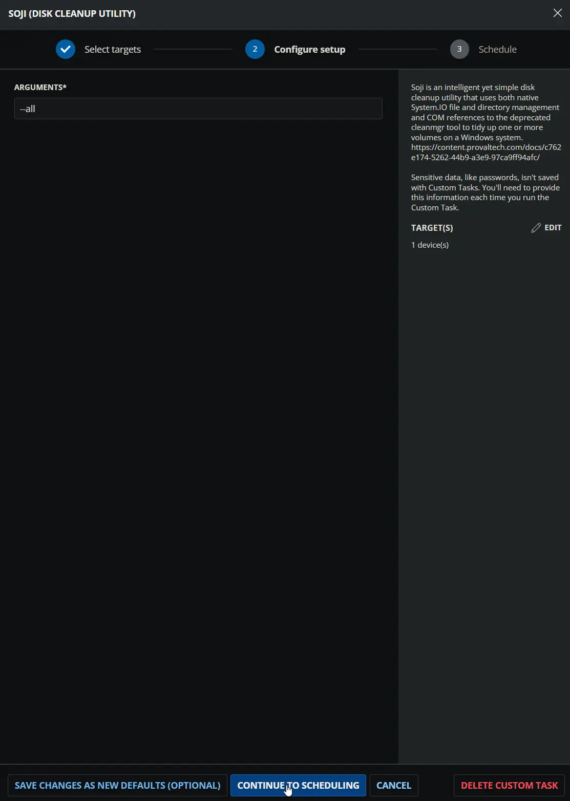
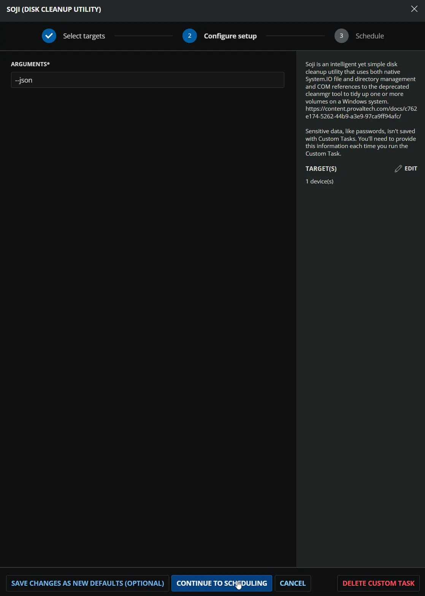
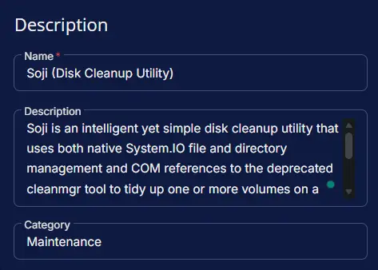
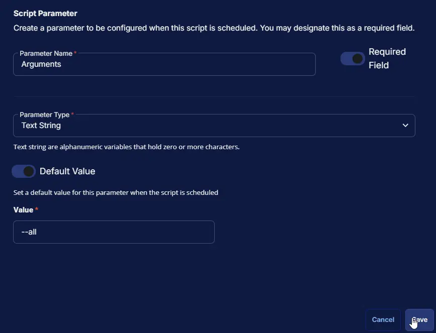
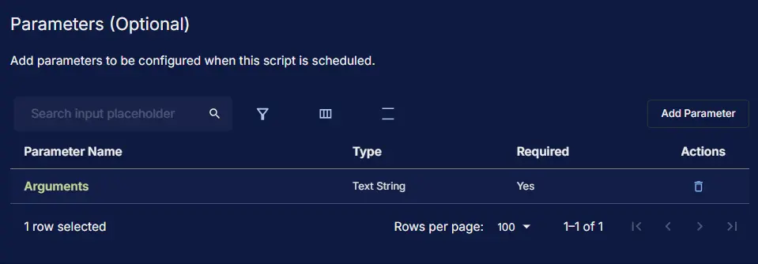
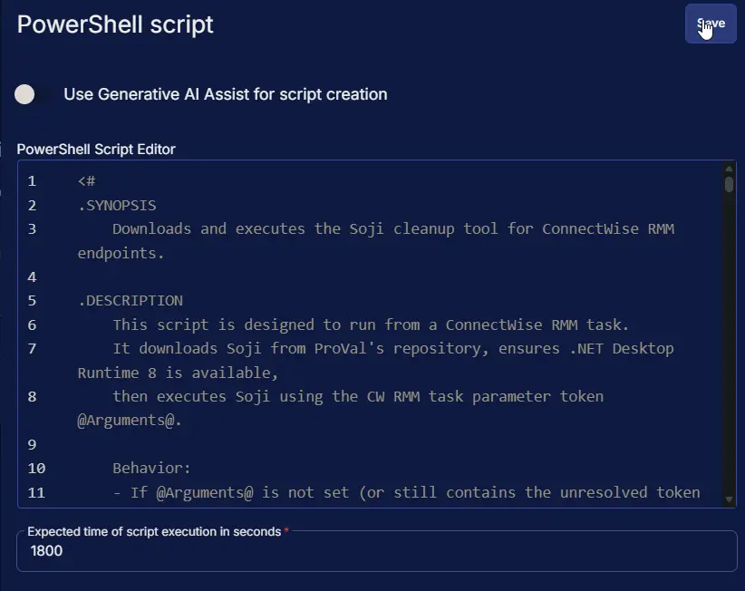
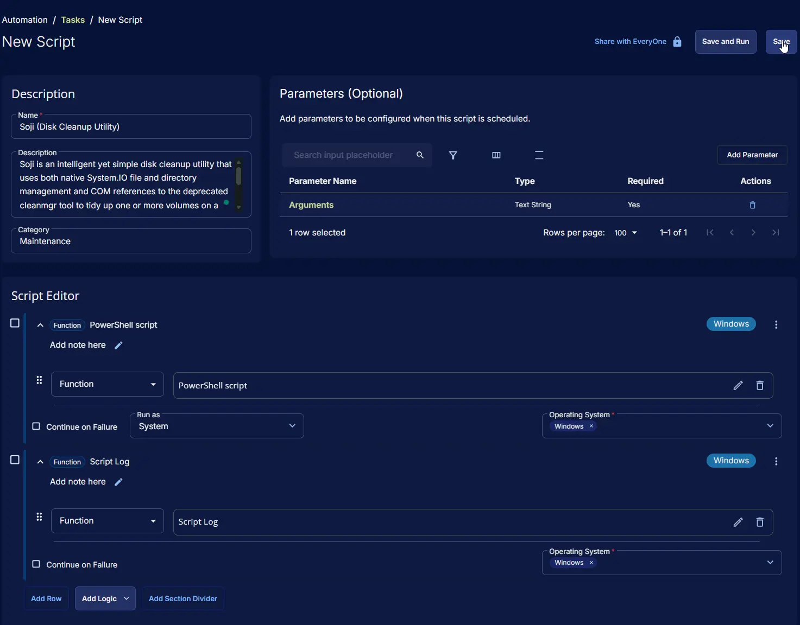

---
id: 'a1d8f066-b016-4654-b855-891518d1f1da'
slug: /a1d8f066-b016-4654-b855-891518d1f1da
title: 'Soji (Disk Cleanup Utility)'
title_meta: 'Soji (Disk Cleanup Utility)'
keywords: ['disk', 'cleanup', 'utility', 'windows', 'rmm']
description: 'This document provides a comprehensive guide on creating the Soji disk cleanup Task in ConnectWise RMM. Soji is a smart disk cleanup utility designed to enhance system cleanliness on Windows, utilizing native System.IO file and directory management along with COM references to the deprecated cleanmgr tool.'
tags: ['cleanup', 'software', 'windows']
draft: false
unlisted: false
last_update:
  date: 2026-03-23
---

## Summary

Soji is a smart yet straightforward disk cleanup utility designed to enhance system cleanliness on Windows. It utilizes both native System.IO file and directory management along with COM references to the deprecated cleanmgr tool.

This document provides a guide on creating the Soji disk cleanup Task in CW RMM. The task is versatile and can serve as an Autofix/Automation Task alongside `Monitors` or `Intelligent Alerts`. When employed as an Autofix, the task executes the tool with the `--All` argument.

Please reference [Soji](/docs/c762e174-5262-44b9-a3e9-97ca9ff94afc) for argument usage.

## Sample Run

*Clean all fixed drives with all available cleaners:*



*Clean the C and F drives:*


*Clean all fixed drives and read back the file JSON report in PowerShell:*



## Dependencies

- [Soji](/docs/c762e174-5262-44b9-a3e9-97ca9ff94afc)

### User Parameters

| Name       | Example  | Required | Default | Description                                                                 |
|------------|----------|----------|---------|--------------------------------------------------------------------|
| Arguments  | `--all`   | Yes     | `--all` | Please reference [Soji](/docs/c762e174-5262-44b9-a3e9-97ca9ff94afc) for argument usage. |

**Note:** Arguments are case sensitive.

## Task Setup Path

**Tasks Path:** `AUTOMATION` ➞ `Tasks`  
**Task Type:** `Script Editor`

## Task Creation

### Description

- **Name:** `Soji (Disk Cleanup Utility)`  
- **Description:**

```PlainText
Soji is an intelligent yet simple disk cleanup utility that uses both native System.IO file and directory management and COM references to the deprecated cleanmgr tool to tidy up one or more volumes on a Windows system.

https://content.provaltech.com/docs/c762e174-5262-44b9-a3e9-97ca9ff94afc/
```

- **Category:** `Maintenance`



### Parameters

| Parameter Name | Required Field | Parameter Type | Default Value | Value |
| -------------- | -------------- | -------------- | ------------- | ----- |
| Arguments | Enabled | Text String | Enabled | `--all` |

**Arguments:**  
    



### Script Editor

#### Step 1: Row -> PowerShell script

- **Use Generative AI Assist for script creation:** `False`  
- **Expected time of script execution in seconds:** `1800`  
- **Operating System:** `Windows`  
- **Continue on Failure:** `False`  
- **Run as:** `System`  
- **PowerShell Script Editor:**

[PowerShell Script](https://github.com/ProVal-Tech/cw-rmm/blob/main/tasks/soji-disk-cleanup-utility/script.ps1)




#### Step 2: Row -> Script Log

- **Script Log Message:** `%Output%`  
- **Operating System:** `Windows`
- **Continue on Failure**: `False`


## Completed Script



## Output

- Script Log

## Changelog

### 2026-03-23

- Updated .Net8 Desktop Runtime installation logic to install the latest available version.
- Structural changes in task
- Document modifications.

### 2025-04-10

- Initial version of the document

