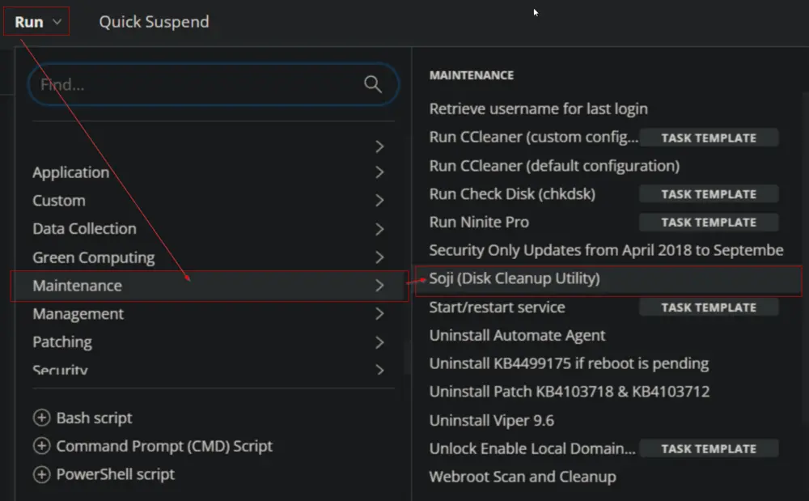
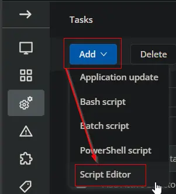
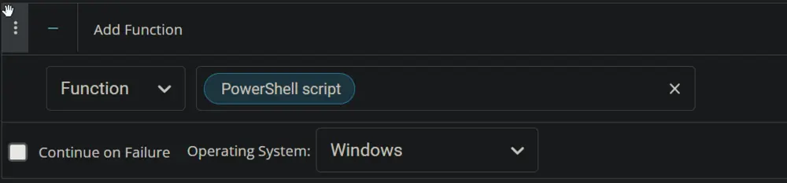
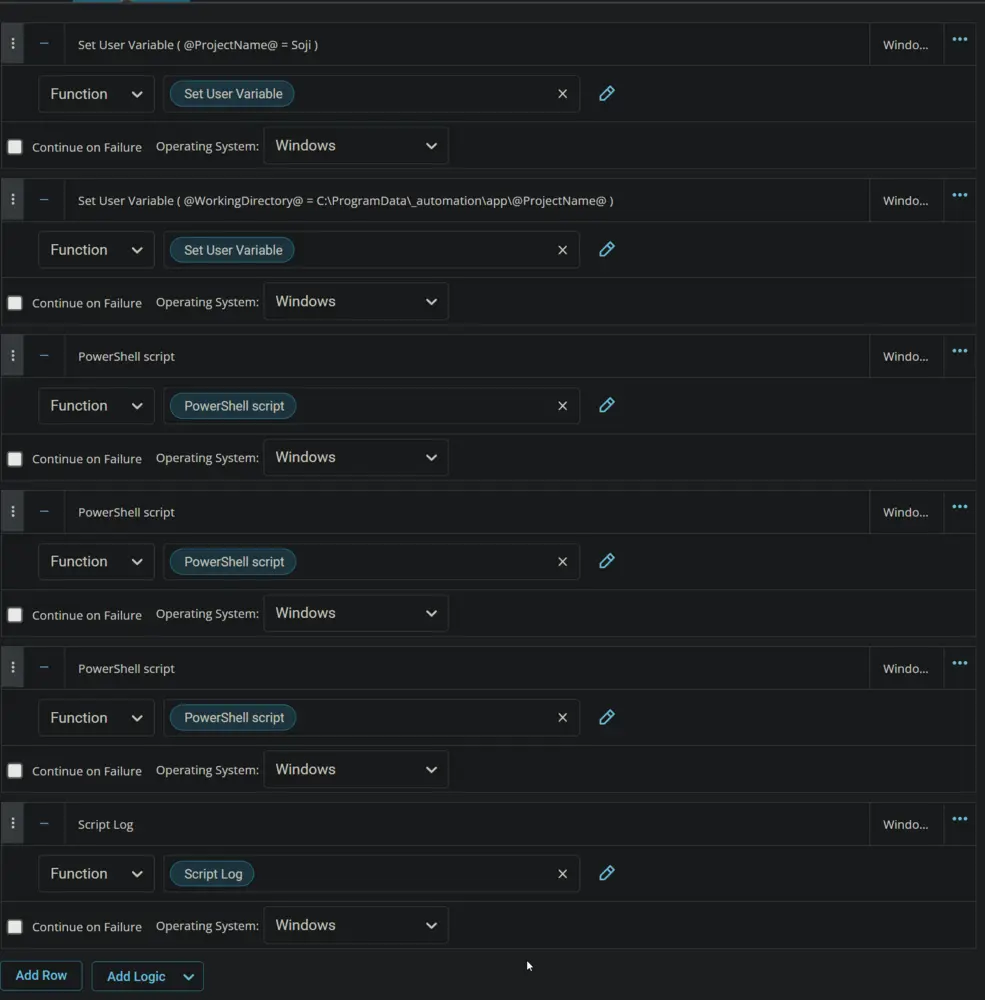

## Summary

Soji is a smart yet straightforward disk cleanup utility designed to enhance system cleanliness on Windows. It utilizes both native System.IO file and directory management along with COM references to the deprecated cleanmgr tool.

This document provides a guide on creating the Soji disk cleanup Task in CW RMM. The task is versatile and can serve as an Autofix/Automation Task alongside `Monitors` or `Intelligent Alerts`. When employed as an Autofix, the task executes the tool with the `--All` argument.

Please reference [Soji](/docs/c762e174-5262-44b9-a3e9-97ca9ff94afc) for argument usage.

## Sample Run




## Dependencies

- [Soji](/docs/c762e174-5262-44b9-a3e9-97ca9ff94afc)

## Variables

| Name               | Description                             |
|--------------------|-----------------------------------------|
| ProjectName        | Soji                                    |
| WorkingDirectory    | C:/ProgramData/_automation/app/Soji    |

### User Parameters

| Name       | Example  | Required | Description                                                                 |
|------------|----------|----------|-----------------------------------------------------------------------------|
| Arguments  | --all    | False    | Please reference [Soji](/docs/c762e174-5262-44b9-a3e9-97ca9ff94afc) for argument usage. |

**Note:** Arguments are case sensitive.

## Create Script

Create a new `Script Editor` style script in the system to implement this Task.




**Name:** `Soji (Disk Cleanup Utility)`

**Description:** `Soji is an intelligent yet simple disk cleanup utility that uses both native System.IO file and directory management and COM references to the deprecated cleanmgr tool to tidy up one or more volumes on a Windows system.`

**Category:** `Maintenance`


Click the `Add Parameter` button.


The `Add New Script Parameter` box will appear.


In the box, fill in the following details and select `Save` to create the `Arguments` parameter.

**Parameter Name:** `Arguments`

**Required Field:** `True`

**Parameter Type:** `Text String`

**Default Value:** `True`

**Value:** `--All`


### Script

Start by adding a row. You can do this by clicking the `Add Row` button at the bottom of the script page.


#### Row 1 Function: Set User variable

Select `Set User Variable` function.

  


Type `ProjectName` in the `Variable Name` field and `Soji` in the `Value` field. Click the `Save` button to create the variable.

  


#### Row 2 Function: Set User variable

Insert a new row by clicking the `Add Row` button.


Select `Set User Variable` function.

  


Type `WorkingDirectory` in the `Variable Name` field and `C:\ProgramData\_automation\app\@ProjectName@` in the `Value` field. Click the `Save` button to create the variable.
Type `WorkingDirectory` in the `Variable Name` field and `C:\ProgramData\_automation\app\@ProjectName@` in the `Value` field. Click the `Save` button to create the variable.

  


#### Row 3 Function: PowerShell Script

Insert a new row by clicking the `Add Row` button.


Select `PowerShell Script` function.

  
 

Paste in the following PowerShell script, set the expected time of script execution to `300` seconds, and click the `Save` button.

```Powershell
$WorkingDirectory = '@WorkingDirectory@\@ProjectName@'

Remove-Item -Path $WorkingDirectory -Recurse -Force -Confirm:$false -ErrorAction SilentlyContinue

if ( !(Test-Path $WorkingDirectory) ) {
    try {
        New-Item -Path $WorkingDirectory -ItemType Directory -Force -Erroraction Stop | Out-Null
    } catch {
        throw "Failed to Create $WorkingDirectory. Reason: $($Error[0].Exception.Message)"
    }
}

if (-not ( ( ( Get-Acl $WorkingDirectory ).Access | Where-Object { $_.IdentityReference -Match 'Everyone' } ).FileSystemRights -Match 'FullControl' ) ) {
    $Acl = Get-ACL $WorkingDirectory 
    $AccessRule = New-Object System.Security.AccessControl.FileSystemAccessRule('Everyone', 'FullControl', 'ContainerInherit, ObjectInherit', 'none', 'Allow')
    $Acl.AddAccessRule($AccessRule)
    Set-Acl  $WorkingDirectory $Acl
}
```

  


#### Row 4 Function: PowerShell Script

Insert a new row by clicking the `Add Row` button.


Select `PowerShell Script` function.

  
  


Paste in the following PowerShell script, set the expected time of script execution to `600` seconds, and click the `Save` button.

```PowerShell
$ProgressPreference = 'SilentlyContinue'
$appName = 'dotNet8DesktopRuntime'
$workingDirectory = 'C:\ProgramData\_automation\app\Prompter'
$dotnet8path = 'C:\ProgramData\_automation\app\Prompter\dotNet8DesktopRuntime.exe'

Function Install-Check {
    try {
        $dotNetVersions = (. "$env:ProgramFiles\dotnet\dotnet.exe" --list-runtimes) -join ' '
    } catch {}
    
    if (!($dotNetVersions -match 'WindowsDesktop\.App 8')) {
        return $true
    } else {
        return $false
    }
}

$dotnet8url = if ([Environment]::Is64BitOperatingSystem) {
    'https://download.visualstudio.microsoft.com/download/pr/27bcdd70-ce64-4049-ba24-2b14f9267729/d4a435e55182ce5424a7204c2cf2b3ea/windowsdesktop-runtime-8.0.11-win-x64.exe'
} else {
    'https://download.visualstudio.microsoft.com/download/pr/6e1f5faf-ee7d-4db0-9111-9e270a458342/4cdcd1af2d6914134308630f048fbdfc/windowsdesktop-runtime-8.0.11-win-x86.exe'
}

if (!(Test-Path -Path $workingDirectory)) {
    New-Item -ItemType Directory -Path $workingDirectory -Force -ErrorAction SilentlyContinue | Out-Null
}

if (Install-Check) {
    [Net.ServicePointManager]::SecurityProtocol = [Enum]::ToObject([Net.SecurityProtocolType], 3072)
    Start-BitsTransfer -Source $dotnet8url -Destination $dotnet8path
    cmd.exe /c $dotnet8path /install /quiet /norestart
    Start-Sleep -Seconds 5
    
    if (Install-Check) {
        throw 'Error: .Net Desktop Runtime 8.0 installation failed.'
    } else {
        return 'Success: .Net Desktop Runtime 8.0 installed'
    }
} else {
    return 'Success: .Net Desktop Runtime 8.0 is already installed.'
}
```

  


#### Row 5 Function: PowerShell Script

Insert a new row by clicking the `Add Row` button.


Select `PowerShell Script` function.

  
  


Paste in the following PowerShell script, set the expected time of script execution to `1800` seconds, and click the `Save` button.

```powershell
#region Setup - Variables
$ProjectName = '@ProjectName@'
$BaseURL = 'https://file.provaltech.com/repo'
$EXEURL = "$BaseURL/app/$ProjectName.exe"
$WorkingDirectory = '@WorkingDirectory@'
$EXEPath = "$WorkingDirectory\$ProjectName.exe"
#endregion

#region Download - soji
if (! (Test-Path $ExePath)) {
  [Net.ServicePointManager]::SecurityProtocol = [enum]::ToObject([Net.SecurityProtocolType], 3072)
  Invoke-WebRequest -Uri $EXEURL -UseBasicParsing -OutFile $EXEPath
  if (!(Test-Path -Path $EXEPath)) {
      Throw "No pre-downloaded app exists and the application '$EXEURL' failed to download. Exiting."
  }
}
#endregion
cmd.exe /c $EXEPath @Arguments@
```

  


#### Row 6 Function: Script Log

Insert a new row by clicking the `Add Row` button.


Select `Script Log` function.

  


Paste this line in the `Script Log Message` box and click the `Save` button.  
`%output%`

  


Click the `Save` button to save the Task.


## Completed Script



## Output


