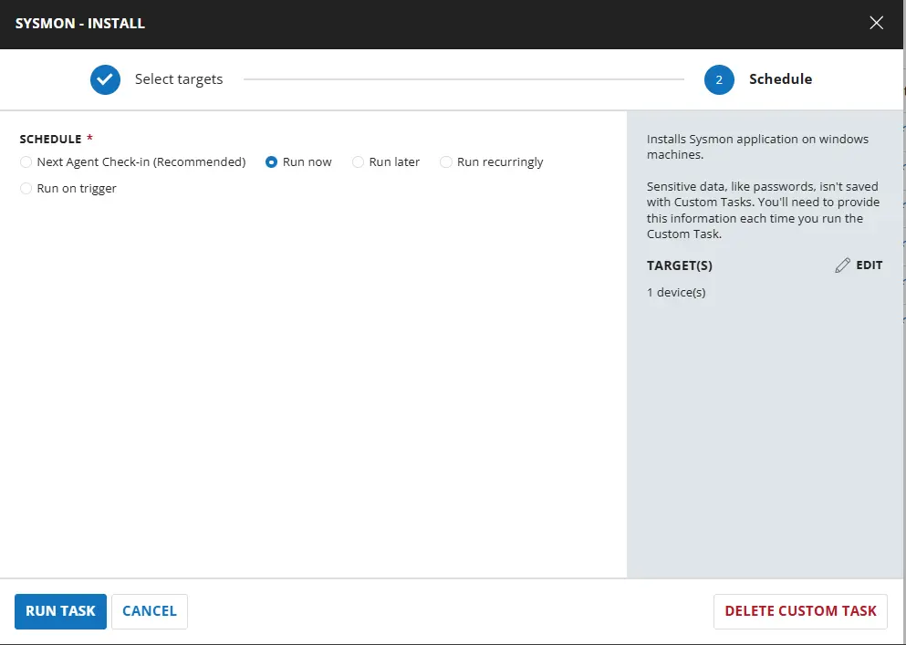
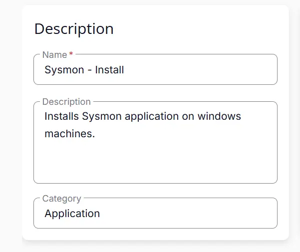
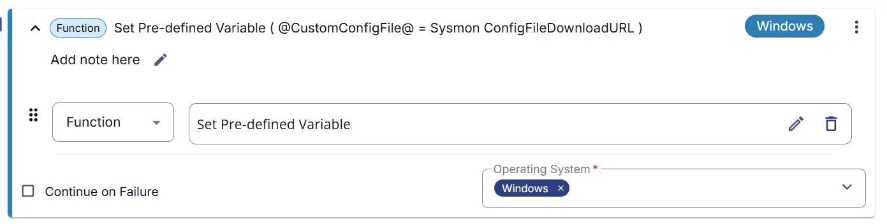
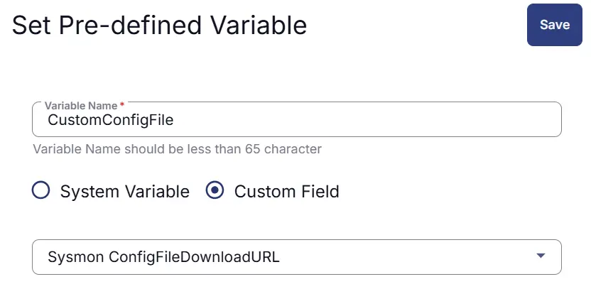
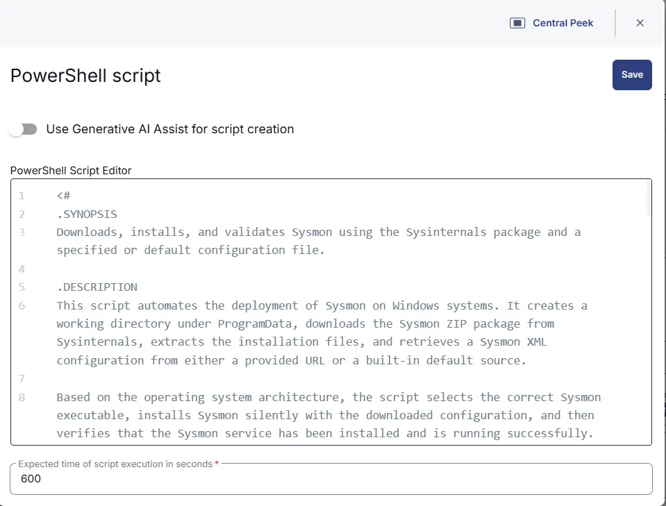
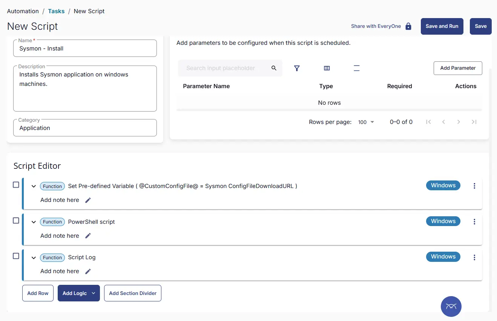
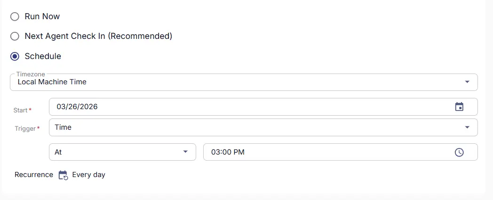
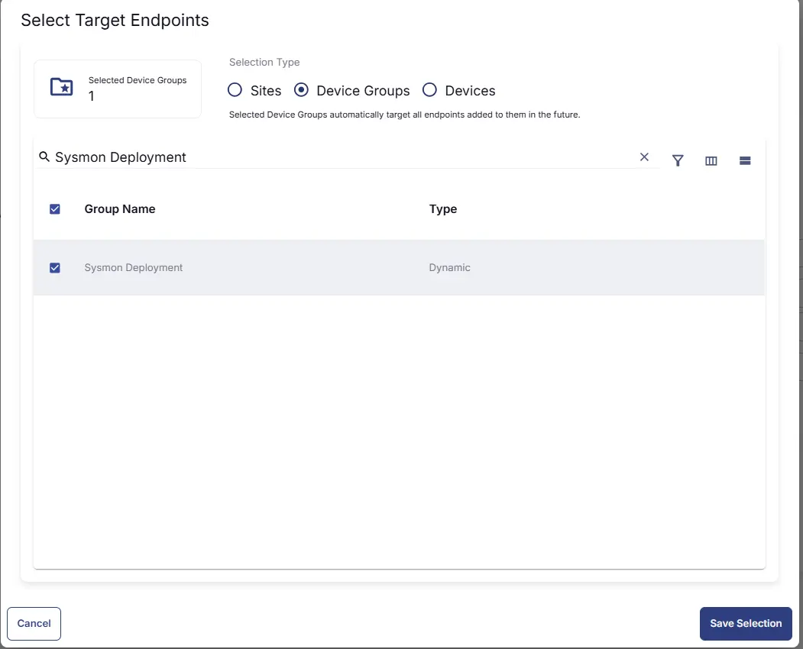
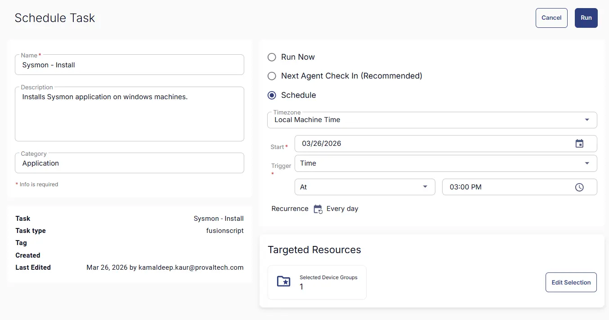

## Summary
Installs Sysmon application on Windows machines and generates a ticket if the service is found to be stopped.

## Sample Run


## Dependencies

- [Solution - Sysmon Solution ](/docs/2db51f41-1313-46c4-81f1-8c67ed578b73) 


## Task Creation

### Script Details

#### Step 1

Navigate to `Automation` ➞ `Tasks`  


#### Step 2

Create a new `Script Editor` style task by choosing the `Script Editor` option from the `Add` dropdown menu  


The `New Script` page will appear on clicking the `Script Editor` button:  


#### Step 3

Fill in the following details in the `Description` section:  

- **Name:** `Sysmon - Install`  
- **Description:** `Installs Sysmon application on windows machines.`  
- **Category:** `Application`




### Script Editor

Click the `Add Row` button in the `Script Editor` section to start creating the script  


A blank function will appear:  


### Row 1: Function: Set Pre-defined Variable





This sets the variable `CustomConfigFile` with the value of a custom field `Sysmon ConfigFile DownloadURL`


#### Row 2 Function: `PowerShell Script`

Search and select the `PowerShell Script` function.  
 
  

The following function will pop up on the screen:  
  

Paste in the following PowerShell script and set the `Expected time of script execution in seconds` to `600` seconds. Click the `Save` button.

```powershell
<#
.SYNOPSIS
Downloads, installs, and validates Sysmon using the Sysinternals package and a specified or default configuration file.

.DESCRIPTION
This script automates the deployment of Sysmon on Windows systems. It creates a working directory under ProgramData, downloads the Sysmon ZIP package from Sysinternals, extracts the installation files, and retrieves a Sysmon XML configuration from either a provided URL or a built-in default source.

Based on the operating system architecture, the script selects the correct Sysmon executable, installs Sysmon silently with the downloaded configuration, and then verifies that the Sysmon service has been installed and is running successfully.

This script is intended to simplify Sysmon deployment and ensure that a configured and operational instance is installed with minimal manual intervention.
#>

# set the progress preference to silently continue to avoid progress bars during download and extraction

$ProgressPreference = 'SilentlyContinue'

$Customconfigfile = '@CustomConfigFile@'
if ($Customconfigfile -and ($Customconfigfile).Length -gt 2) {
    write-output "Using the Configuration File from Client Custom Field"
    $ConfigFileDownloadURL = $Customconfigfile
}
else {
    write-output "No Defined URL for the Sysmon configuration file provided. Setting the default configuration file.'https://raw.githubusercontent.com/SwiftOnSecurity/sysmon-config/master/sysmonconfig-export.xml'"
    $ConfigFileDownloadURL = 'https://raw.githubusercontent.com/SwiftOnSecurity/sysmon-config/master/sysmonconfig-export.xml'
}


# Define variables for paths and URLs
$ProjectName = 'Sysmon'
$workingDirectory = '{0}\_Automation\Script\{1}' -f $env:ProgramData, $ProjectName
$zipDestination = '{0}\{1}.zip' -f $workingDirectory, $ProjectName
$unzipPath = '{0}\{1}' -f $workingDirectory, $ProjectName
$ConfigFile = '{0}\ConfigFile.xml' -f $workingDirectory
$DownloadURL = 'https://download.sysinternals.com/files/Sysmon.zip'

# Create a WebClient instance and download the Sysmon zip file
$webClient = [System.Net.WebClient]::new()
New-Item -Path $workingDirectory -ItemType directory -Force
[Net.ServicePointManager]::SecurityProtocol = [Net.SecurityProtocolType]::Tls12
$WebClient.DownloadFile($DownloadURL, $ZipDestination)

# Verify the downloaded files
if (Test-Path -Path $ZipDestination) {
    write-output "Sysmon zip file downloaded successfully to $ZipDestination"
} else {
    write-output "Failed to download Sysmon zip file."
}

Expand-Archive -LiteralPath $ZipDestination -DestinationPath $UnzipPath -Force


# Download the Sysmon configuration file
$WebClient.DownloadFile($ConfigFileDownloadURL, $ConfigFile)

# Verify the Config file
if (Test-Path -Path $ConfigFile) {
    write-output "Sysmon configuration file downloaded successfully to $ConfigFile"
} else {
    write-output "Failed to download Sysmon configuration file."
}

# Install Sysmon with the downloaded configuration file

if (((Get-CimInstance Win32_OperatingSystem).OSArchitecture) -match '64'){
    $SysmonExePath = '{0}\Sysmon64.exe' -f $UnzipPath
} else {
    $SysmonExePath = '{0}\Sysmon.exe' -f $UnzipPath
}

$arguments = "-accepteula", "-i", $ConfigFile

start-process -filepath $SysmonExePath -argumentlist $arguments -wait -windowstyle hidden

# Verify Sysmon installation
if (((Get-CimInstance Win32_OperatingSystem).OSArchitecture) -match '64') {
    $servicename = 'Sysmon64'   # Default service name for 64-bit Sysmon
} else {
    $servicename = 'Sysmon' # Default service name for 32-bit Sysmon
}

$sysmonService = Get-Service -Name $servicename -ErrorAction SilentlyContinue

if ($sysmonService -and $sysmonService.Status -eq 'Running') {
    write-output "Sysmon installed and running successfully."
} else {
    write-output "Sysmon installation failed or the service is not running."
}
```



### Row 3 Function: Script Log

Add a new row by clicking the `Add Row` button.  
  

A blank function will appear.  
  

Search and select the `Script Log` function.  
  
 

In the script log message, simply type `%output%` and click the `Save` button.  


## Save Task

Click the `Save` button at the top-right corner of the screen to save the script.  


## Completed Task



## Output

- Script Logs

## Schedule Task

### Task Details

- **Name:** `Sysmon - Install`  
- **Description:** `Installs Sysmon application on windows machines.`  
- **Category:** `Application`


### Schedule

- **Schedule Type:**  `Schedule`  
- **Timezone:** `Local Machine Time`  
- **Start:** `<Current Date>`  
- **Trigger:** `Time` `At` `<Current Time>`  
- **Recurrence:** `Every Day`



#### Targeted Resource

**Device Group:** [Sysmon Deployment](/docs/424ddb1a-2a1b-47fb-b3cd-89ff4cf8b7a1)




### Completed Scheduled Task




## Changelog

### 2026-03-26

- Initial version of the document