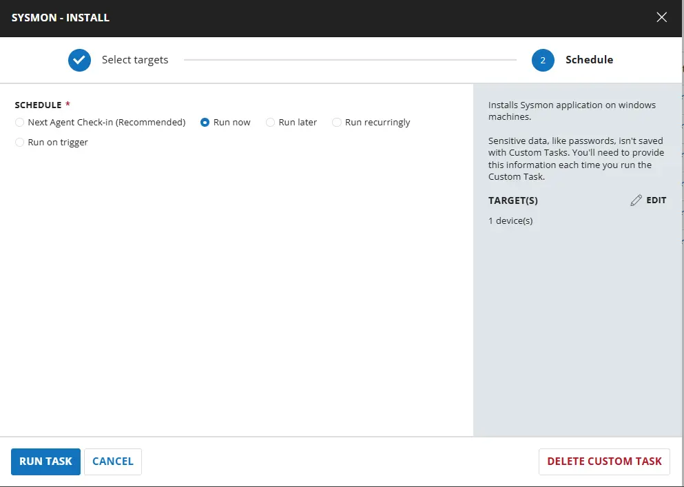
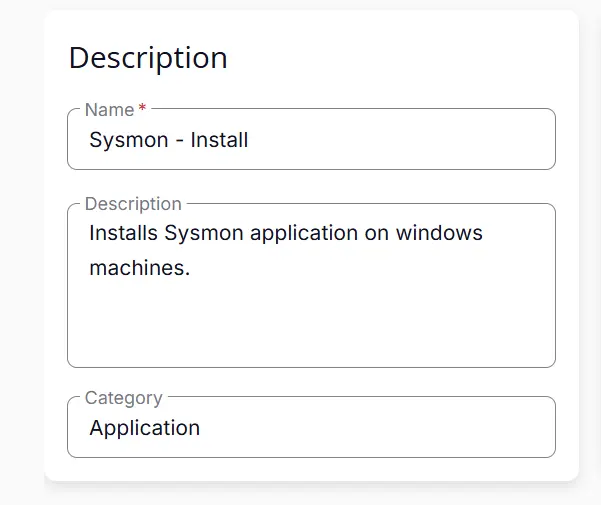
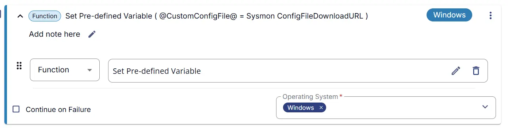
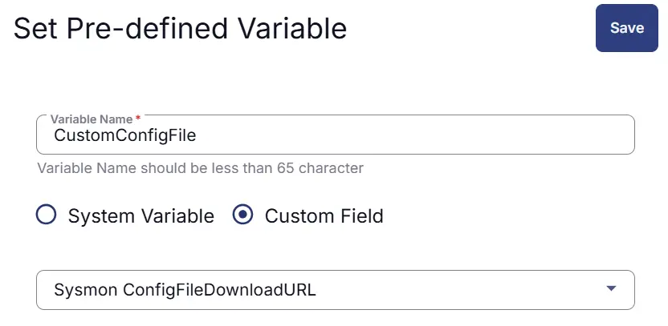
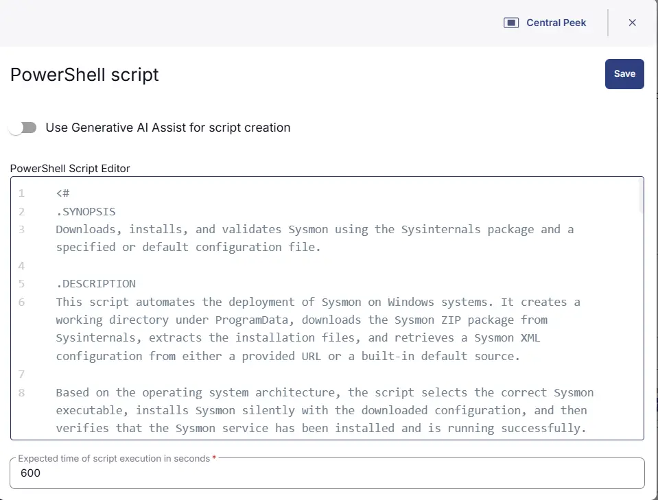
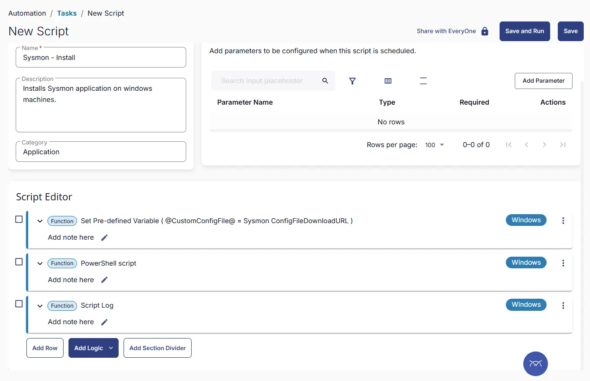
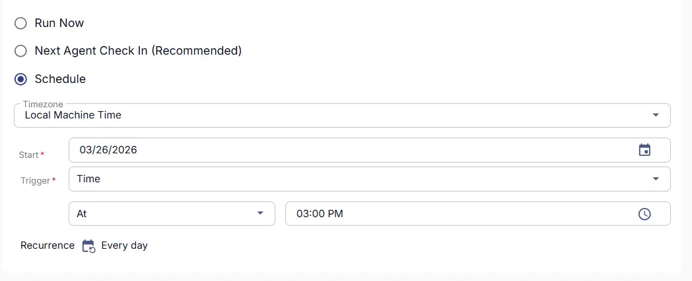
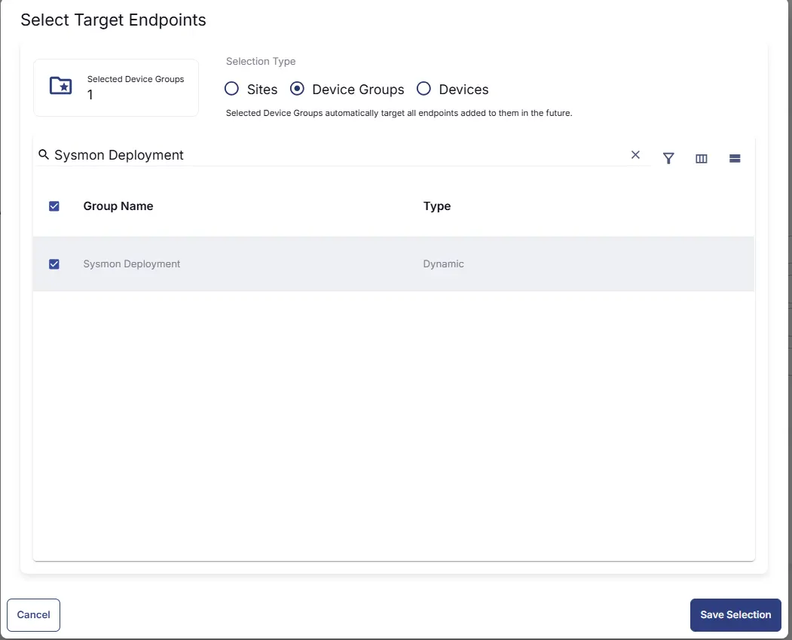
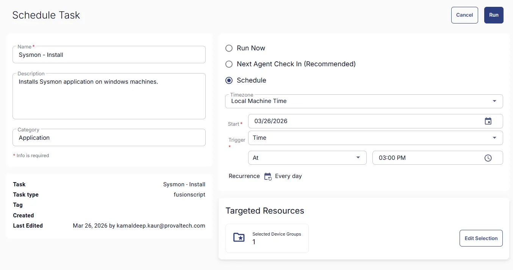

---
id: '05fe8d4e-6e82-4bb1-a0eb-48c46627132d'
slug: /05fe8d4e-6e82-4bb1-a0eb-48c46627132d
title: 'Sysmon - Install'
title_meta: 'Sysmon - Install'
keywords:  ['sysmon', 'windows','configuration', 'installation', 'endpoint']
description: 'Installs Sysmon application on windows machines.'
tags: ['installation','windows']
draft: false
unlisted: false
last_update:
  date: 2026-03-26
---

## Summary
Installs Sysmon application on Windows machines.

## Sample Run

## Dependencies

- [Solution - Sysmon Solution ](/docs/2db51f41-1313-46c4-81f1-8c67ed578b73) 

## Task Creation

### Script Details

#### Step 1

Navigate to `Automation` ➞ `Tasks`  

#### Step 2

Create a new `Script Editor` style task by choosing the `Script Editor` option from the `Add` dropdown menu  

The `New Script` page will appear on clicking the `Script Editor` button:  

#### Step 3

Fill in the following details in the `Description` section:  

- **Name:** `Sysmon - Install`  
- **Description:** `Installs Sysmon application on windows machines.`  
- **Category:** `Application`

### Script Editor

Click the `Add Row` button in the `Script Editor` section to start creating the script  

A blank function will appear:  

### Row 1: Function: Set Pre-defined Variable

This sets the variable `CustomConfigFile` with the value of a custom field `Sysmon ConfigFile DownloadURL`

#### Row 2 Function: `PowerShell Script`

Search and select the `PowerShell Script` function.  
 
  

The following function will pop up on the screen:  
  

Paste in the following PowerShell script and set the `Expected time of script execution in seconds` to `600` seconds. Click the `Save` button.

[PowerShell Script](https://github.com/ProVal-Tech/cw-rmm/blob/main/tasks/sysmon-install/script.ps1)

### Row 3 Function: Script Log

Add a new row by clicking the `Add Row` button.  
  

A blank function will appear.  
  

Search and select the `Script Log` function.  
  
 

In the script log message, simply type `%output%` and click the `Save` button.  

## Save Task

Click the `Save` button at the top-right corner of the screen to save the script.  

## Completed Task

## Output

- Script Logs

## Schedule Task

### Task Details

- **Name:** `Sysmon - Install`  
- **Description:** `Installs Sysmon application on windows machines.`  
- **Category:** `Application`

### Schedule

- **Schedule Type:**  `Schedule`  
- **Timezone:** `Local Machine Time`  
- **Start:** `<Current Date>`  
- **Trigger:** `Time` `At` `<Current Time>`  
- **Recurrence:** `Every Day`

#### Targeted Resource

**Device Group:** [Sysmon Deployment](/docs/424ddb1a-2a1b-47fb-b3cd-89ff4cf8b7a1)

### Completed Scheduled Task

## Changelog

### 2026-03-26

- Initial version of the document
